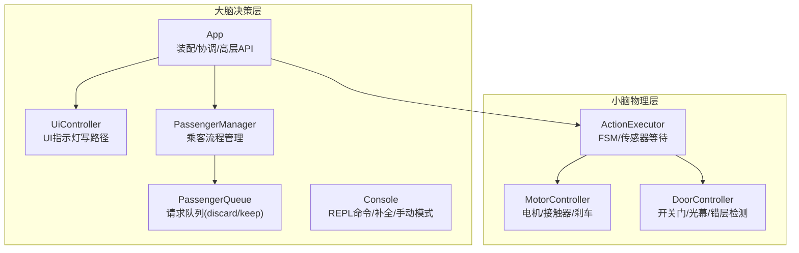
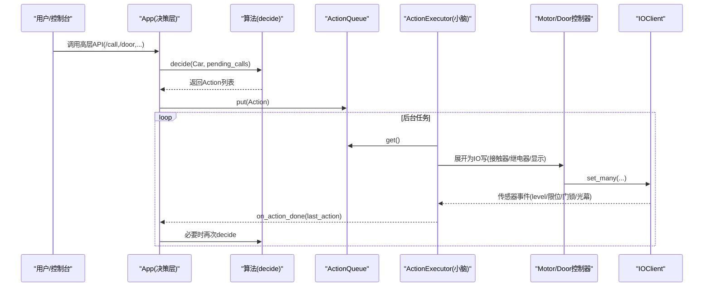
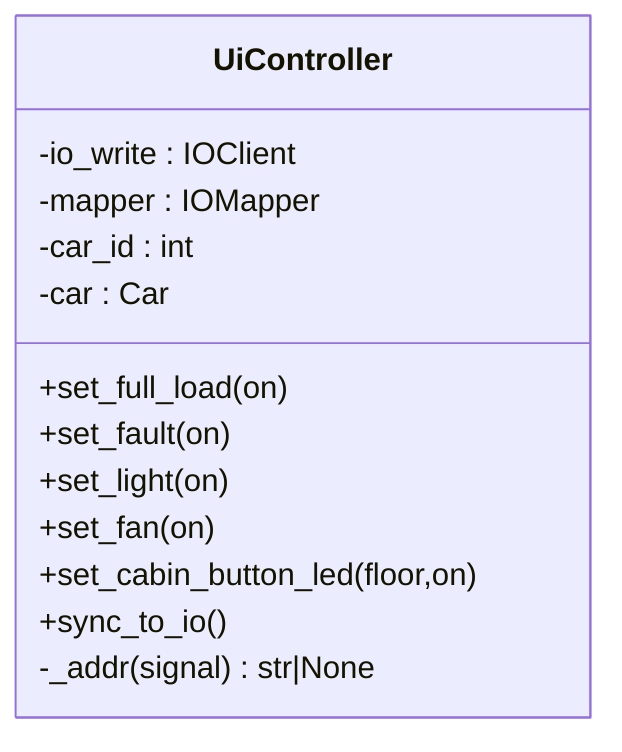
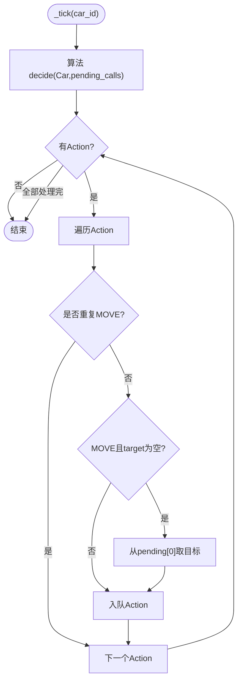
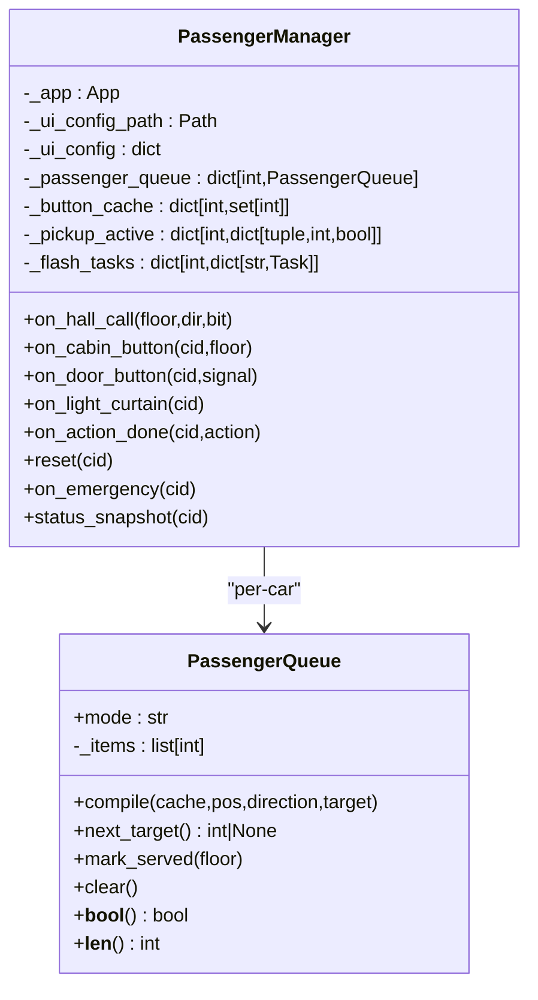
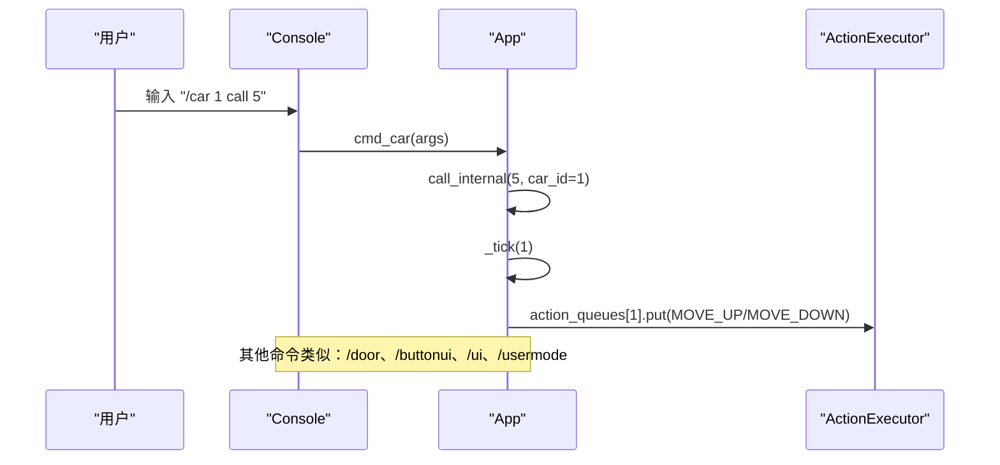
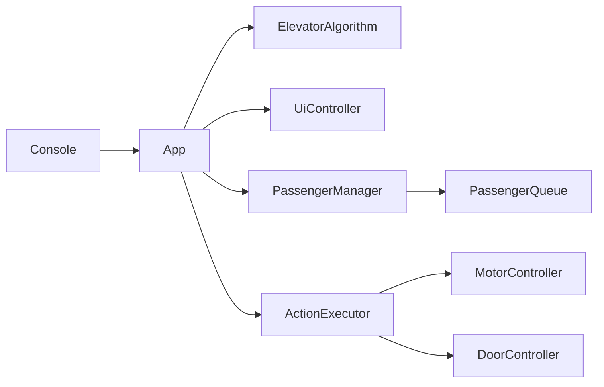

# 大脑模块

<cite>
**本文引用的文件**   
- [core/app.py](file://core/app.py)
- [core/ui.py](file://core/ui.py)
- [core/console.py](file://core/console.py)
- [core/passenger.py](file://core/passenger.py)
- [core/executor.py](file://core/executor.py)
- [core/controllers.py](file://core/controllers.py)
</cite>

## 目录
1. [简介](#简介)
2. [项目结构（决策层）](#项目结构决策层)
3. [核心组件总览](#核心组件总览)
4. [架构概览](#架构概览)
5. [详细组件分析](#详细组件分析)
6. [依赖关系分析](#依赖关系分析)
7. [性能与并发特性](#性能与并发特性)
8. [故障排查指南](#故障排查指南)
9. [结论](#结论)

## 简介
本章节聚焦“大脑”（决策层）的三个子模块：用户交互、算法调度员、REPL 控制台。按照工程约定，大脑不直接监听 IO，也不接触底层硬件事件；所有高层 API 通过 app.py 暴露，由小脑（执行器/控制器）负责将动作展开为 IO 序列并等待传感器确认。乘客流程管理（PassengerManager + PassengerQueue）作为可选插件集成在大脑中，遵循三步工作流：collect → compile → consume，且独立于小脑的 pending_calls。

## 项目结构（决策层）
决策层由以下关键文件组成：
- 装配与协调中枢：app.py
- 用户交互（UI 指示灯控制）：ui.py
- 乘客流程管理（大脑可选插件）：passenger.py
- REPL 控制台（命令解析与补全）：console.py
- 与小脑的边界（动作到 IO 的展开）：executor.py、controllers.py（仅用于理解接口契约）

图表来源
- [core/app.py:41-169](file://core/app.py#L41-L169)
- [core/ui.py:32-132](file://core/ui.py#L32-L132)
- [core/passenger.py:39-110](file://core/passenger.py#L39-L110)
- [core/console.py:77-117](file://core/console.py#L77-L117)
- [core/executor.py:27-131](file://core/executor.py#L27-L131)
- [core/controllers.py:28-119](file://core/controllers.py#L28-L119)

章节来源
- [core/app.py:41-169](file://core/app.py#L41-L169)
- [core/ui.py:32-132](file://core/ui.py#L32-L132)
- [core/passenger.py:39-110](file://core/passenger.py#L39-L110)
- [core/console.py:77-117](file://core/console.py#L77-L117)

## 核心组件总览
- 用户交互（UiController）：提供 set_xxx(bool) 统一写入路径，内部一次 set_many 更新 IO，逻辑状态与 Car.ui 同步，不自动绑定事件。
- 算法调度员（App._tick + algorithm.decide）：每 tick 调用算法 decide(Car, pending_calls)，生成 Action 入队；MOVE 完成时清理 pending 并按 origin 触发外召开门等编排。
- REPL 控制台（Console）：提供 /car、/door、/buttonui、/ui、/usermode 等命令，支持 Tab 补全、批量操作、手动模式与调试监视。

章节来源
- [core/ui.py:32-132](file://core/ui.py#L32-L132)
- [core/app.py:354-373](file://core/app.py#L354-L373)
- [core/console.py:77-117](file://core/console.py#L77-L117)

## 架构概览
大脑通过 App 装配多轿厢，共享 IOClient/IOMapper/DisplayEncoder/Algorithm，并为每部电梯维护独立的 ActionQueue 与 per-car IO 写通道。IO 事件由小脑 executor 处理，完成后回调 app 的 on_action_done，再由 app 驱动算法重新决策或进行门/乘客流程编排。

图表来源
- [core/app.py:354-373](file://core/app.py#L354-L373)
- [core/app.py:380-452](file://core/app.py#L380-L452)
- [core/executor.py:134-150](file://core/executor.py#L134-L150)
- [core/controllers.py:28-119](file://core/controllers.py#L28-L119)

## 详细组件分析

### 用户交互（UiController）
职责与约束
- 封装所有 UI 类 IO 写操作（满载/故障/照明/风扇/轿内按钮 LED）。
- 上层只通过 set_xxx(bool) 修改 UI；读走 car.ui.xxx。
- 不自动绑定事件（例如轿内按钮按下不会自动亮灯），由上层逻辑决定。
- 单一 IO 写路径：每个方法一次 set_many，后续由 IOClient tick 合并 flush。

关键设计点
- 地址解析失败时打印警告并跳过，避免配置缺失导致崩溃。
- sync_to_io 用于重置或重载后一次性全量同步 Car.ui 到 IO。

图表来源
- [core/ui.py:32-132](file://core/ui.py#L32-L132)

章节来源
- [core/ui.py:32-132](file://core/ui.py#L32-L132)

### 算法调度员（App 中的 _tick 与状态编排）
职责与约束
- 每 tick 调用算法 decide(Car, pending_calls)，生成 Action 入队。
- MOVE 完成时清理 pending_calls，按 origin 决定是否外召开门。
- INITIALIZE 完成时根据目标楼层启动方向运行。
- 门动作完成不推 MOVE（安全约束），等待上层（如乘客流程）关门后再恢复调度。

关键设计点
- 去重：若 executor 已在执行 MOVE，则跳过重复 MOVE，待完成再取 pending[0]。
- target_floor 优先：当算法未指定目标时，从 pending[0] 取 FIFO。
- 外召到站开门：origin='hall' 时在到站后自动 OPEN_DOOR。

图表来源
- [core/app.py:354-373](file://core/app.py#L354-L373)
- [core/app.py:380-452](file://core/app.py#L380-L452)

章节来源
- [core/app.py:354-373](file://core/app.py#L354-L373)
- [core/app.py:380-452](file://core/app.py#L380-L452)

### 乘客流程管理（PassengerManager + PassengerQueue）
定位
- 大脑可选插件，不注册任何 IO 监听器，仅通过 App API 交互。
- 独立于小脑 pending_calls，采用三步工作流：collect → compile → consume。
- 两种模式：discard（顺向接受/已过站丢弃）、keep（全部保留，到达当前目标后继续处理）。

核心数据结构
- PassengerQueue：维护 _items 路线，支持 compile(next_target/mark_served/clear)。
- PassengerManager：管理 per-car 的 button_cache、pickup_active、flash_tasks、cron 任务（关门/熄灯）。

图表来源
- [core/passenger.py:39-110](file://core/passenger.py#L39-L110)
- [core/passenger.py:112-187](file://core/passenger.py#L112-L187)

章节来源
- [core/passenger.py:39-110](file://core/passenger.py#L39-L110)
- [core/passenger.py:112-187](file://core/passenger.py#L112-L187)

### REPL 控制台（Console）
职责与约束
- 提供以 / 开头的命令集，支持 Tab 补全、历史浏览、批量操作。
- 内置手动模式（暂停 executor，raw 控制电机/刹车），以及多种 debug 监视项。
- 通过 App 的高层 API 驱动系统行为（/car、/door、/buttonui、/ui、/usermode 等）。

关键能力
- 参数解析：支持 all、范围、逗号列表（车号/楼层）。
- 补全策略：多级补全（命令→子命令→参数→楼层/车号）。
- 手动模式：暂停 executor，直接下发 motor.start/stop/brake，退出时恢复自动。

图表来源
- [core/console.py:77-117](file://core/console.py#L77-L117)
- [core/console.py:661-726](file://core/console.py#L661-L726)
- [core/app.py:481-495](file://core/app.py#L481-L495)
- [core/app.py:354-373](file://core/app.py#L354-L373)

章节来源
- [core/console.py:77-117](file://core/console.py#L77-L117)
- [core/console.py:661-726](file://core/console.py#L661-L726)
- [core/app.py:481-495](file://core/app.py#L481-L495)
- [core/app.py:354-373](file://core/app.py#L354-L373)

## 依赖关系分析
- 耦合与内聚
  - App 聚合多轿厢资源（Car/Executor/ActionQueue/UI/Display），并通过回调与乘客流程解耦。
  - UiController 仅依赖 IOClient/IOMapper/Car，职责单一，内聚度高。
  - PassengerManager 仅依赖 App API，不触碰 IO，保持纯流程管理。
  - Console 仅依赖 App 高层 API，屏蔽底层细节。
- 外部依赖与集成点
  - IOClient/IOMapper/DisplayEncoder 由 App 装配并共享。
  - Algorithm 通过 get_algorithm(name) 注入，App 在 _tick 中调用 decide。
  - Executor/Controllers 属于小脑，但大脑通过 Action 与回调与之协作。

图表来源
- [core/app.py:41-169](file://core/app.py#L41-L169)
- [core/ui.py:32-132](file://core/ui.py#L32-L132)
- [core/passenger.py:112-187](file://core/passenger.py#L112-L187)
- [core/executor.py:27-131](file://core/executor.py#L27-L131)
- [core/controllers.py:28-119](file://core/controllers.py#L28-L119)

章节来源
- [core/app.py:41-169](file://core/app.py#L41-L169)
- [core/ui.py:32-132](file://core/ui.py#L32-L132)
- [core/passenger.py:112-187](file://core/passenger.py#L112-L187)
- [core/executor.py:27-131](file://core/executor.py#L27-L131)
- [core/controllers.py:28-119](file://core/controllers.py#L28-L119)

## 性能与并发特性
- 多轿厢写通道隔离：每部电梯使用独立 IOClient 写通道，避免 tick 合并时一次 POST 过多地址导致的 S7 read-modify-write 顺序问题。
- 事件驱动无轮询：保持模式（站点吸附）通过 level_up/down 边沿触发反冲，无需 sleep 轮询。
- 唯一例外：到站刹车前 100ms sleep 是为满足 PLC 物理时序的必要延迟，不可删除。
- 异步任务与协程：Console 的 prompt_toolkit 循环、后台 door 跟踪任务、cron 定时任务均基于 asyncio，避免阻塞主循环。

章节来源
- [core/app.py:87-111](file://core/app.py#L87-L111)
- [core/executor.py:516-555](file://core/executor.py#L516-L555)
- [core/executor.py:428-452](file://core/executor.py#L428-L452)
- [core/console.py:547-572](file://core/console.py#L547-L572)

## 故障排查指南
- 外召/内召无效
  - 检查 usermode 是否启用（ready 信号置 1）。
  - 确认 passenger 插件已加载（import 成功），否则 usermode 会拒绝启用。
- 门动作卡住
  - 查看 door_status 监视项输出；若超时，cron 兜底会释放互斥锁。
  - 检查 floor_door_lock 与 door_open/close_done 信号是否存在。
- 站点吸附异常
  - 确认 station_seek 开关与 level_up/down 信号配置正确。
  - 观察 _level_seek_check 日志，确认 (↑1↓1) 判定与反冲逻辑。
- 手动模式无法退出
  - 确保退出时调用 manual_auto 或 /car N auto，恢复 executor 自动模式。

章节来源
- [core/app.py:768-805](file://core/app.py#L768-L805)
- [core/app.py:1008-1147](file://core/app.py#L1008-L1147)
- [core/executor.py:516-555](file://core/executor.py#L516-L555)
- [core/console.py:733-800](file://core/console.py#L733-L800)

## 结论
决策层的三个子模块职责清晰、边界明确：
- 用户交互（UiController）提供统一的 UI 写路径，保证逻辑状态与 IO 一致。
- 算法调度员（App._tick + algorithm.decide）负责动作编排与安全约束，确保 MOVE/INITIALIZE/门动作的正确衔接。
- REPL 控制台（Console）提供强大的交互式运维能力，包括批量操作、手动模式与调试监视。
乘客流程管理（PassengerManager + PassengerQueue）作为可选插件，遵循 collect → compile → consume 三步工作流，独立于小脑 pending_calls，实现灵活的外召/内召/关门/熄灯策略。整体架构严格分层，通过事件回调与队列通信，避免跨层直连，具备良好的可维护性与扩展性。