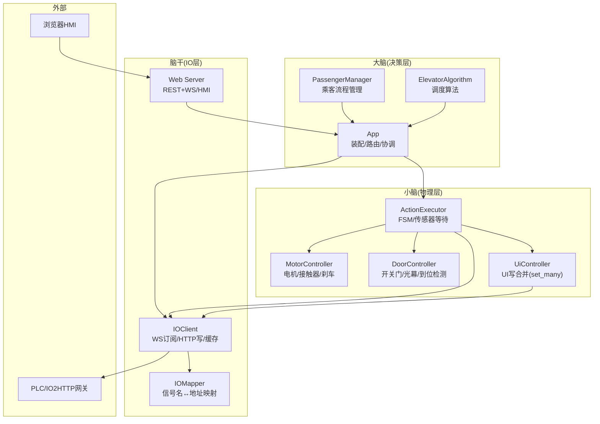
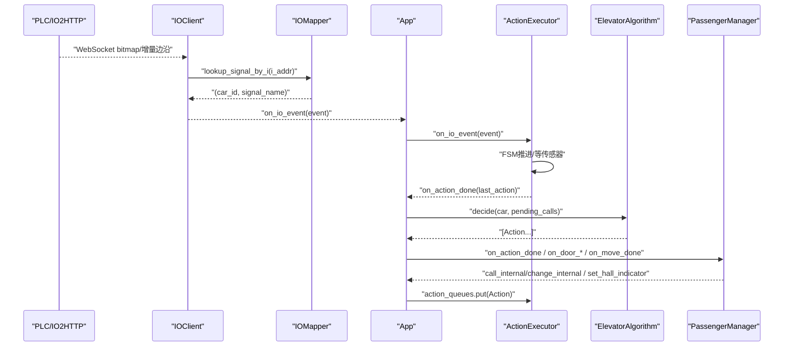
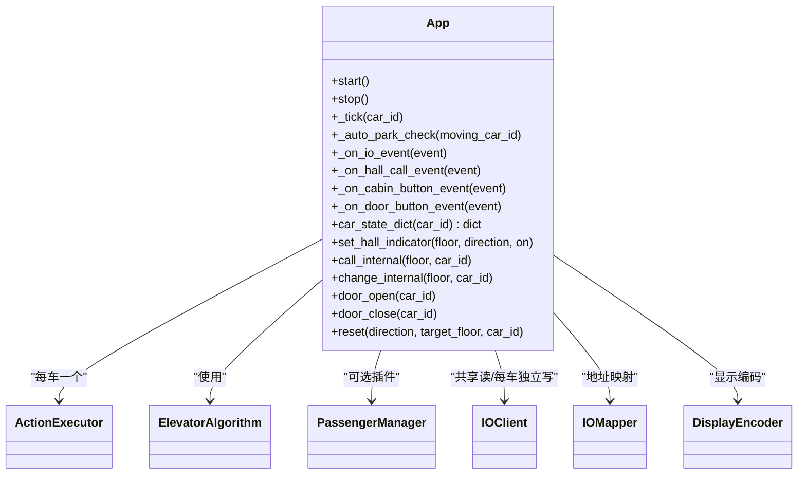
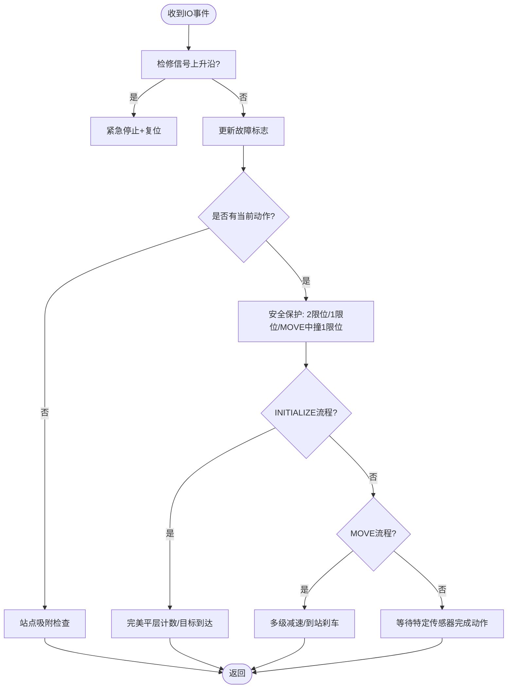
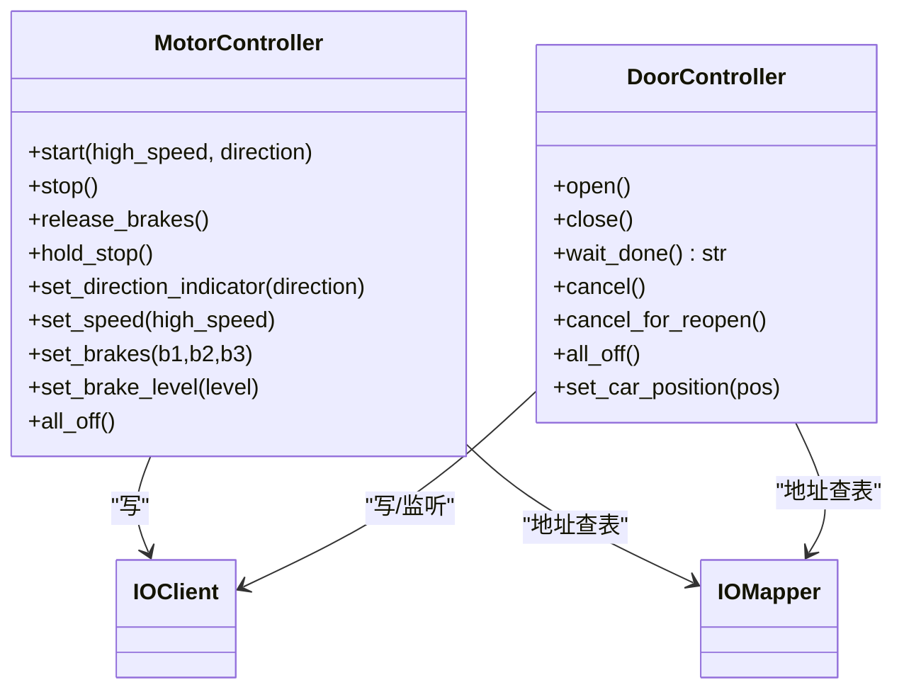
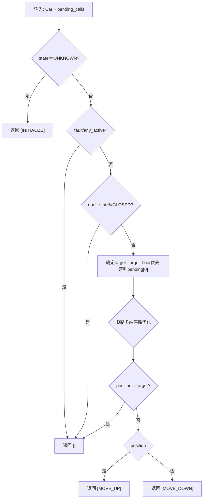
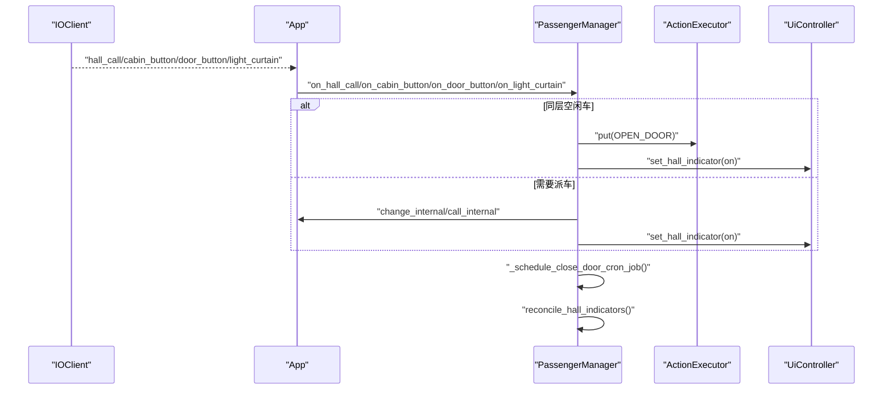
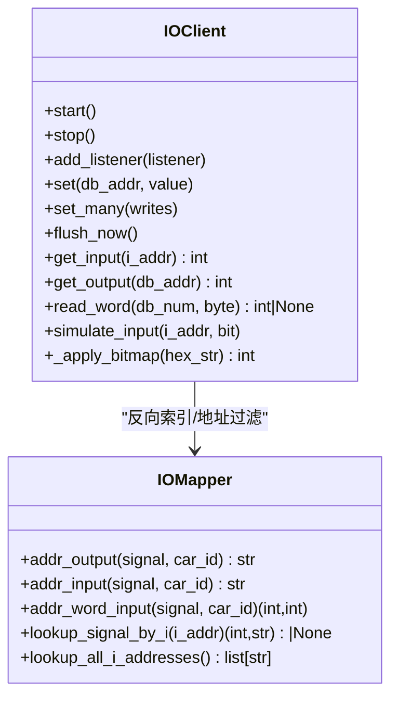
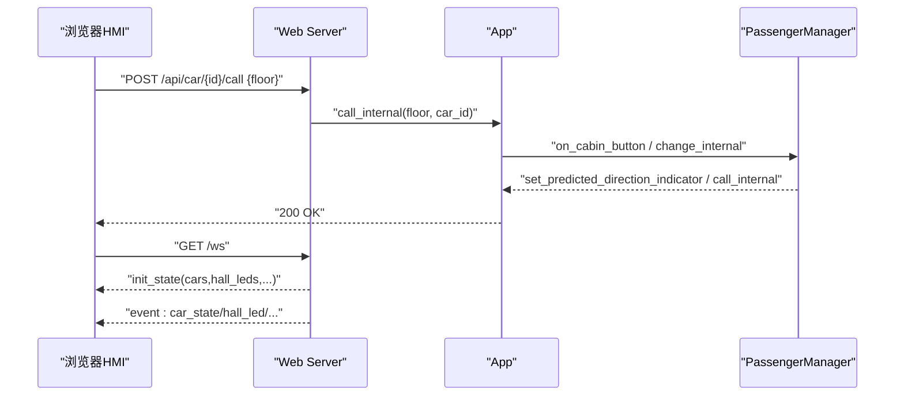
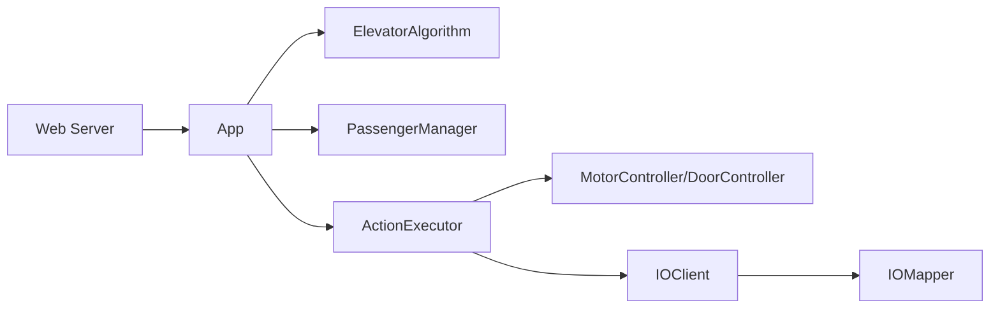

# 乘客管理系统

<cite>
**本文引用的文件**   
- [core/app.py](file://core/app.py)
- [core/executor.py](file://core/executor.py)
- [core/controllers.py](file://core/controllers.py)
- [core/algorithm.py](file://core/algorithm.py)
- [core/passenger.py](file://core/passenger.py)
- [core/io_client.py](file://core/io_client.py)
- [core/io_mapper.py](file://core/io_mapper.py)
- [core/player.py](file://core/player.py)
- [core/actions.py](file://core/actions.py)
- [config/config.yaml](file://config/config.yaml)
- [web/server.py](file://web/server.py)
- [requirements.txt](file://requirements.txt)
</cite>

## 目录
1. [简介](#简介)
2. [项目结构](#项目结构)
3. [核心组件](#核心组件)
4. [架构总览](#架构总览)
5. [详细组件分析](#详细组件分析)
6. [依赖关系分析](#依赖关系分析)
7. [性能与实时性](#性能与实时性)
8. [故障排查指南](#故障排查指南)
9. [结论](#结论)
10. [附录](#附录)

## 简介
本系统为“电梯 = 玩家”的游戏化编程范式实现，采用三层架构：大脑（决策层）、小脑（物理层）、脑干（IO 层）。大脑通过高层 API 与 App 交互，不直接监听 IO；小脑负责运动状态机、UI 同步与硬件控制；脑干提供 WebSocket/HTTP 接入与地址映射。系统支持多轿厢并行运行、外呼/内召/门按钮/光幕等事件驱动流程，并内置重量三态机、站点吸附、自动回 L1 待命等策略。

## 项目结构
- 配置层：主配置、IO 映射、显示配置、UI 配置、IO Profile 选择
- 核心层：App 装配与主循环、算法决策、动作队列、执行器 FSM、控制器、IO 客户端与映射、玩家实体、乘客管理器
- Web 层：REST + WebSocket 服务，HMI 前端静态资源
- 工具与文档：命令说明、教程、PLC IO 约定、比赛文档等

图表来源
- [core/app.py:62-263](file://core/app.py#L62-L263)
- [core/executor.py:29-149](file://core/executor.py#L29-L149)
- [core/controllers.py:28-177](file://core/controllers.py#L28-L177)
- [core/io_client.py:35-126](file://core/io_client.py#L35-L126)
- [core/io_mapper.py:19-124](file://core/io_mapper.py#L19-L124)
- [web/server.py:263-320](file://web/server.py#L263-L320)

章节来源
- [config/config.yaml:1-107](file://config/config.yaml#L1-L107)
- [core/app.py:62-263](file://core/app.py#L62-L263)

## 核心组件
- App：装配多轿厢、共享 IOClient/IOMapper/DisplayEncoder/Algorithm，按 car_id 路由 IO 事件，暴露高层 API 给 console/web
- ActionExecutor：硬件层 FSM，将 Action 展开为 IO 序列，等待传感器确认，维护 Car 现实状态
- MotorController/DoorController：封装电机/门继电器控制，处理方向、速度、刹车、开门/关门、光幕等
- ElevatorAlgorithm：纯函数式决策，输入 Car + pending_calls，输出 Action 列表
- PassengerManager：大脑侧乘客流程管理，独立队列、外呼灯一致性、关门 cron、人类存在检测
- IOClient：异步 IO2HTTP 客户端，WS 订阅 bitmap/增量边沿，HTTP 批量写，输入/输出缓存
- IOMapper：逻辑信号名与 I/DB 地址的双向映射
- Player(Car)：游戏实体状态（位置、方向、门、故障、UI 指示、重量）
- Actions：高层动作抽象（INITIALIZE/MOVE/OPEN/CLOSE 等）
- Web Server：REST + WebSocket 服务，HMI 展示与控制入口

章节来源
- [core/app.py:62-263](file://core/app.py#L62-L263)
- [core/executor.py:29-149](file://core/executor.py#L29-L149)
- [core/controllers.py:28-177](file://core/controllers.py#L28-L177)
- [core/algorithm.py:19-128](file://core/algorithm.py#L19-L128)
- [core/passenger.py:124-203](file://core/passenger.py#L124-L203)
- [core/io_client.py:35-126](file://core/io_client.py#L35-L126)
- [core/io_mapper.py:19-124](file://core/io_mapper.py#L19-L124)
- [core/player.py:70-136](file://core/player.py#L70-L136)
- [core/actions.py:15-78](file://core/actions.py#L15-L78)
- [web/server.py:263-320](file://web/server.py#L263-L320)

## 架构总览
系统以 App 为中心，装配每部电梯的 Car/Executor/UI，并通过独立的 per-car IOClient 写入避免拥堵。IO 事件经 IOMapper 解析后路由到对应 Executor；Executor 完成动作后回调 App，App 再调用算法决策并推进乘客流程。

图表来源
- [core/io_client.py:367-410](file://core/io_client.py#L367-L410)
- [core/io_mapper.py:110-116](file://core/io_mapper.py#L110-L116)
- [core/app.py:476-518](file://core/app.py#L476-L518)
- [core/executor.py:227-332](file://core/executor.py#L227-L332)
- [core/algorithm.py:51-113](file://core/algorithm.py#L51-L113)
- [core/passenger.py:726-758](file://core/passenger.py#L726-L758)

## 详细组件分析

### 组件一：App（装配与协调）
- 职责：加载配置、装配多轿厢、共享 IOClient/IOMapper/DisplayEncoder/Algorithm，按 car_id 路由 IO 事件，暴露高层 API（call/reset/status 等），协调算法与乘客流程
- 关键设计：
  - 每车独立 io_write 实例，避免 tick flush 时一次 POST 过多地址导致 S7 read-modify-write 顺序问题
  - 共享 input/output cache，使“只写”实例也能看到最新 IO 状态
  - 启动 WS 订阅、cron、虚拟 PLC（模拟模式）、看门狗、Web 服务
  - 外呼灯 observer 列表与边沿检测，防止重复派车
  - 自动回 L1 待命策略（当一部车离开 L1 且无空闲车在 L1 时）

图表来源
- [core/app.py:62-263](file://core/app.py#L62-L263)
- [core/app.py:311-369](file://core/app.py#L311-L369)
- [core/app.py:624-695](file://core/app.py#L624-L695)

章节来源
- [core/app.py:62-263](file://core/app.py#L62-L263)
- [core/app.py:311-369](file://core/app.py#L311-L369)
- [core/app.py:476-518](file://core/app.py#L476-L518)
- [core/app.py:624-695](file://core/app.py#L624-L695)

### 组件二：ActionExecutor（硬件层 FSM）
- 职责：从 ActionQueue 取 Action，展开为具体 IO 操作，监听传感器确认，维护 Car 现实状态，完成后回调 App
- 关键设计：
  - INITIALIZE 两段式：基站段低速、客运段复用标准减速
  - MOVE 完美平层判定：level_up & level_down 同时为 1 才算到达一层
  - 站点吸附：到站后持续监测平层，偏离即反冲修正，超时或漂整层则重新初始化
  - 紧急停止：清所有接触器/电机/制动，置 fault，取消门动作，清空长寿命状态
  - 统一刹车流程 _arrive_and_brake：全刹→方向归零→100ms 固位→激活站点吸附→完成动作

图表来源
- [core/executor.py:227-332](file://core/executor.py#L227-L332)
- [core/executor.py:391-426](file://core/executor.py#L391-L426)
- [core/executor.py:528-556](file://core/executor.py#L528-L556)
- [core/executor.py:574-607](file://core/executor.py#L574-L607)
- [core/executor.py:733-800](file://core/executor.py#L733-L800)

章节来源
- [core/executor.py:29-149](file://core/executor.py#L29-L149)
- [core/executor.py:227-332](file://core/executor.py#L227-L332)
- [core/executor.py:391-426](file://core/executor.py#L391-L426)
- [core/executor.py:528-556](file://core/executor.py#L528-L556)
- [core/executor.py:574-607](file://core/executor.py#L574-L607)
- [core/executor.py:733-800](file://core/executor.py#L733-L800)

### 组件三：控制器（电机/门）
- MotorController：封装电机/接触器/刹车控制，支持高速/低速切换、慢速叠加刹车、方向指示灯
- DoorController：自管 IO 监听，open/close/wait_done/cancel，处理光幕触发、楼层门锁不一致错误

图表来源
- [core/controllers.py:28-177](file://core/controllers.py#L28-L177)
- [core/controllers.py:179-355](file://core/controllers.py#L179-L355)

章节来源
- [core/controllers.py:28-177](file://core/controllers.py#L28-L177)
- [core/controllers.py:179-355](file://core/controllers.py#L179-L355)

### 组件四：算法（决策层）
- SimpleInternalCall：首版算法，响应内召，到目标层不开门（门由独立子系统管理）
- 行为：未初始化→INITIALIZE；有任务→根据当前位置与目标决定 MOVE_UP/DOWN；已到达→空

图表来源
- [core/algorithm.py:32-113](file://core/algorithm.py#L32-L113)

章节来源
- [core/algorithm.py:19-128](file://core/algorithm.py#L19-L128)

### 组件五：乘客管理器（大脑）
- 职责：外呼/内召/门按钮/光幕事件处理，关门 cron，人类存在检测，外呼灯一致性校验，孤儿 pickup 回收
- 关键设计：
  - 独立 PassengerQueue（discard/keep 两种模式），三步工作流：collect → compile → consume
  - 外呼就近抢客窗口：若附近有车正朝此方向驶来且 ≤2 层，保留在 pending 让 grab 捡
  - 同层空闲车直接开门；不在同层尝试 change_internal 顺路改道，失败则放入 pending
  - 关门保护：外召按钮/开门按钮仍按住则不关门；司机模式可强制关门
  - 人类存在：有人/不确定→亮灯开风扇；无人→熄灯关风扇

图表来源
- [core/passenger.py:356-548](file://core/passenger.py#L356-L548)
- [core/passenger.py:549-636](file://core/passenger.py#L549-L636)
- [core/passenger.py:695-723](file://core/passenger.py#L695-L723)
- [core/passenger.py:726-758](file://core/passenger.py#L726-L758)
- [core/passenger.py:204-276](file://core/passenger.py#L204-L276)

章节来源
- [core/passenger.py:124-203](file://core/passenger.py#L124-L203)
- [core/passenger.py:356-548](file://core/passenger.py#L356-L548)
- [core/passenger.py:549-636](file://core/passenger.py#L549-L636)
- [core/passenger.py:695-723](file://core/passenger.py#L695-L723)
- [core/passenger.py:726-758](file://core/passenger.py#L726-L758)
- [core/passenger.py:204-276](file://core/passenger.py#L204-L276)

### 组件六：IO 客户端与映射
- IOClient：WS 订阅 bitmap/增量边沿，HTTP 批量写，输入/输出缓存，已知 I 地址过滤减少 dispatch 开销
- IOMapper：逻辑信号名 ↔ I/DB 地址双向映射，支持 Word 输入（载重）

图表来源
- [core/io_client.py:35-126](file://core/io_client.py#L35-L126)
- [core/io_client.py:270-345](file://core/io_client.py#L270-L345)
- [core/io_client.py:367-410](file://core/io_client.py#L367-L410)
- [core/io_mapper.py:19-124](file://core/io_mapper.py#L19-L124)

章节来源
- [core/io_client.py:35-126](file://core/io_client.py#L35-L126)
- [core/io_client.py:270-345](file://core/io_client.py#L270-L345)
- [core/io_client.py:367-410](file://core/io_client.py#L367-L410)
- [core/io_mapper.py:19-124](file://core/io_mapper.py#L19-L124)

### 组件七：Web 服务（HMI）
- REST：/api/state、/api/car/{id}/call、/api/car/{id}/door/{open|close}、/api/hall_call、/api/usermode、/api/reset/{id}
- WebSocket：/ws 推送 car_state/hall_led/io_event
- 静态页面：example_web/*

图表来源
- [web/server.py:75-128](file://web/server.py#L75-L128)
- [web/server.py:191-231](file://web/server.py#L191-L231)
- [web/server.py:263-320](file://web/server.py#L263-L320)

章节来源
- [web/server.py:75-128](file://web/server.py#L75-L128)
- [web/server.py:191-231](file://web/server.py#L191-L231)
- [web/server.py:263-320](file://web/server.py#L263-L320)

## 依赖关系分析
- 耦合与内聚：
  - App 高内聚装配，低耦合对外暴露 API；Executor 仅依赖控制器与 IO 层
  - 算法完全无 IO 依赖，便于测试与热切换
  - 乘客管理器不注册 IO 监听器，仅通过 App API 交互
- 外部依赖：
  - aiohttp、websockets、prompt-toolkit、PyYAML、pytest、pytest-asyncio

图表来源
- [core/app.py:62-263](file://core/app.py#L62-L263)
- [core/executor.py:29-149](file://core/executor.py#L29-L149)
- [core/controllers.py:28-177](file://core/controllers.py#L28-L177)
- [core/io_client.py:35-126](file://core/io_client.py#L35-L126)
- [core/io_mapper.py:19-124](file://core/io_mapper.py#L19-L124)
- [web/server.py:263-320](file://web/server.py#L263-L320)

章节来源
- [requirements.txt:1-6](file://requirements.txt#L1-L6)
- [core/app.py:62-263](file://core/app.py#L62-L263)
- [core/executor.py:29-149](file://core/executor.py#L29-L149)

## 性能与实时性
- IO 写合并：IOClient 每 tick 批量 flush，降低 HTTP 请求数；per-car 独立 write_buffer 避免多车竞争
- 事件过滤：已知 I 地址集合减少 bitmap 全量扫描与 dispatch 开销
- 站点吸附：事件驱动无轮询，漂移修正快速恢复
- 重量轮询：按需轮询（关门时/status 命令时），避免后台持续跑
- 注意：brake-before-stop 100ms sleep 违反“零 sleep”哲学，但实机实测需要，不可删除除非有 PLC 反馈替代方案

章节来源
- [core/io_client.py:179-206](file://core/io_client.py#L179-L206)
- [core/io_client.py:261-268](file://core/io_client.py#L261-L268)
- [core/executor.py:574-607](file://core/executor.py#L574-L607)
- [core/app.py:351-355](file://core/app.py#L351-L355)

## 故障排查指南
- 常见问题定位：
  - 外呼灯不一致：查看 reconcile_hall_indicators 与 _pickup_active/_pending_hall_calls 日志
  - 关门卡死：DoorWatchdog 超时后强制完成；检查 door_complete_timeout 与 door_watchdog_timeout
  - 站点吸附异常：检查 seek_drift_timeout_s 与 _level_seek_skip_next 防抖
  - 重量超限：查看 weight_state 变化与 on_weight_overweight/on_weight_normalized 回调
- 调试建议：
  - 启用 exec_log_enabled 打印执行器日志
  - 开启 ai_need_2_enabled 打印事件级日志
  - 使用 simulate=True 跳过真实网络，配合 simulate_input 注入事件

章节来源
- [core/passenger.py:204-276](file://core/passenger.py#L204-L276)
- [core/app.py:256-263](file://core/app.py#L256-L263)
- [core/executor.py:733-800](file://core/executor.py#L733-L800)
- [core/executor.py:202-210](file://core/executor.py#L202-L210)
- [core/passenger.py:172-190](file://core/passenger.py#L172-L190)

## 结论
本系统以清晰的分层与事件驱动架构实现了多轿厢电梯控制，兼顾安全性（急停/限位/光幕）、稳定性（站点吸附/关门保护）与可扩展性（算法热插拔/乘客流程插件）。通过 per-car 独立写通道与已知 I 地址过滤，有效提升了实时性与吞吐。未来可完善 passenger_flow 模块（自动关门/熄灯 cron、human_presence 迁移）以提升自动化水平。

## 附录
- 配置要点：
  - io_profile：competition/local_train/local_with_weight
  - elevator.car_ids：运行轿厢列表
  - elevator.station_seek：站点吸附开关
  - elevator.slow_brake：低速阶段叠加刹车档位
  - elevator.door_complete_timeout / door_watchdog_timeout：门动作超时与看门狗
  - elevator.competition_init_timeout：比赛模式初始化超时
  - elevator.per_car_weight：每车最大载重与临界阈值
- 硬件契约：
  - 刹车假设“通电刹死/失电释放”，若现场接法相反需反转 set_brakes 映射

章节来源
- [config/config.yaml:1-107](file://config/config.yaml#L1-L107)
- [core/controllers.py:7-16](file://core/controllers.py#L7-L16)