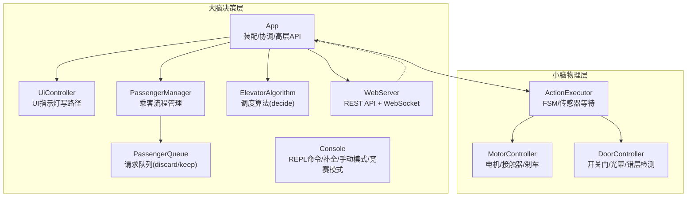
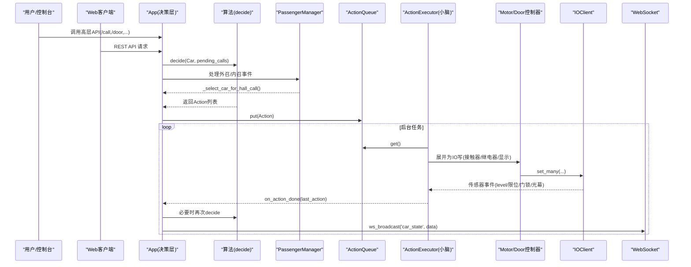
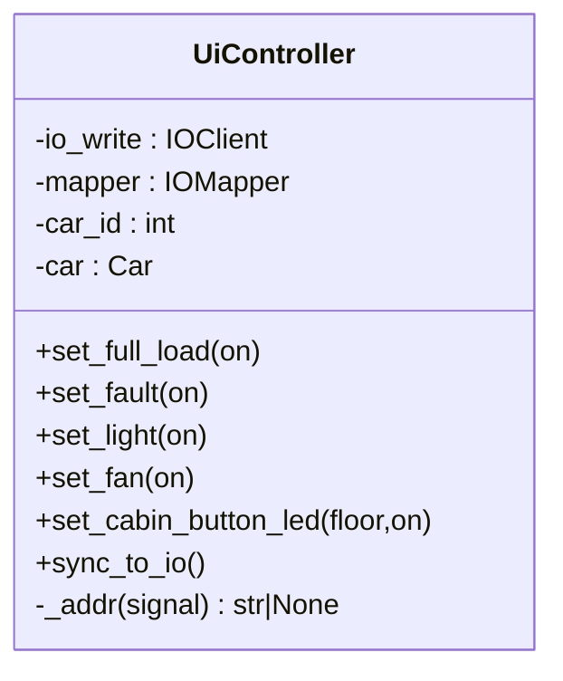
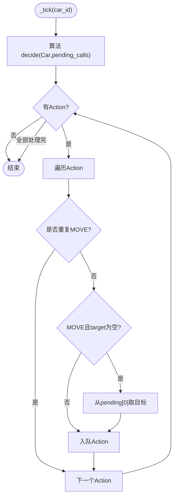
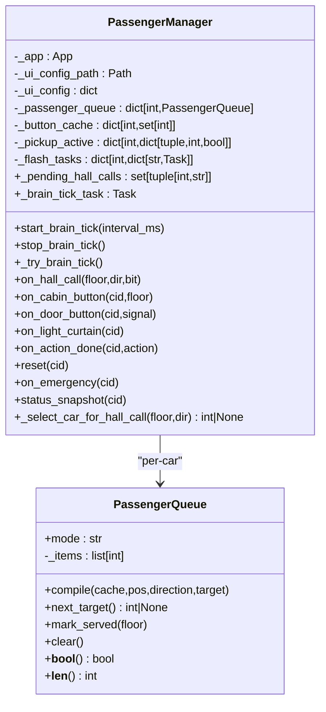
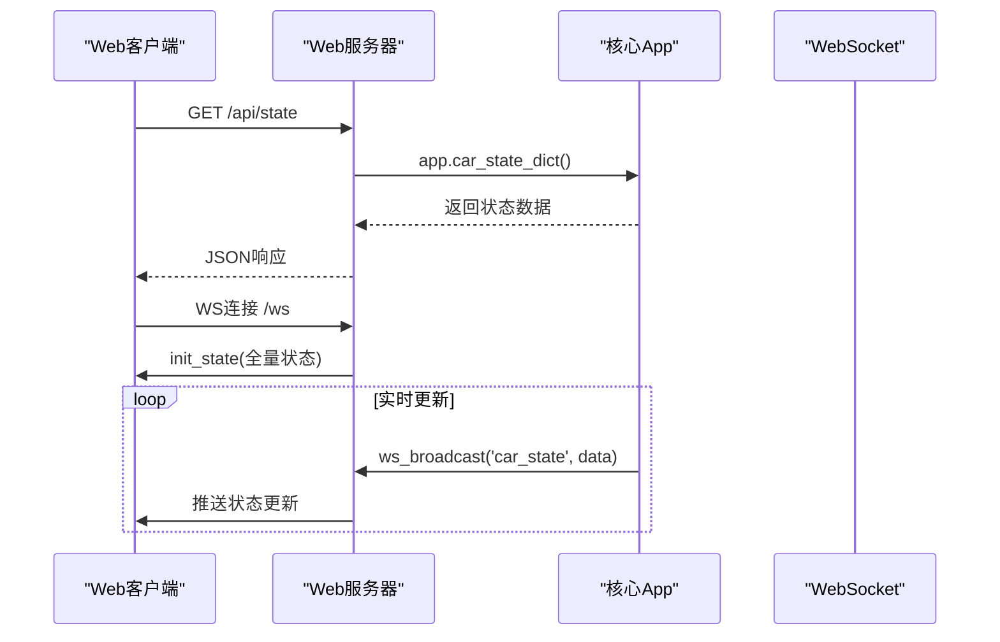
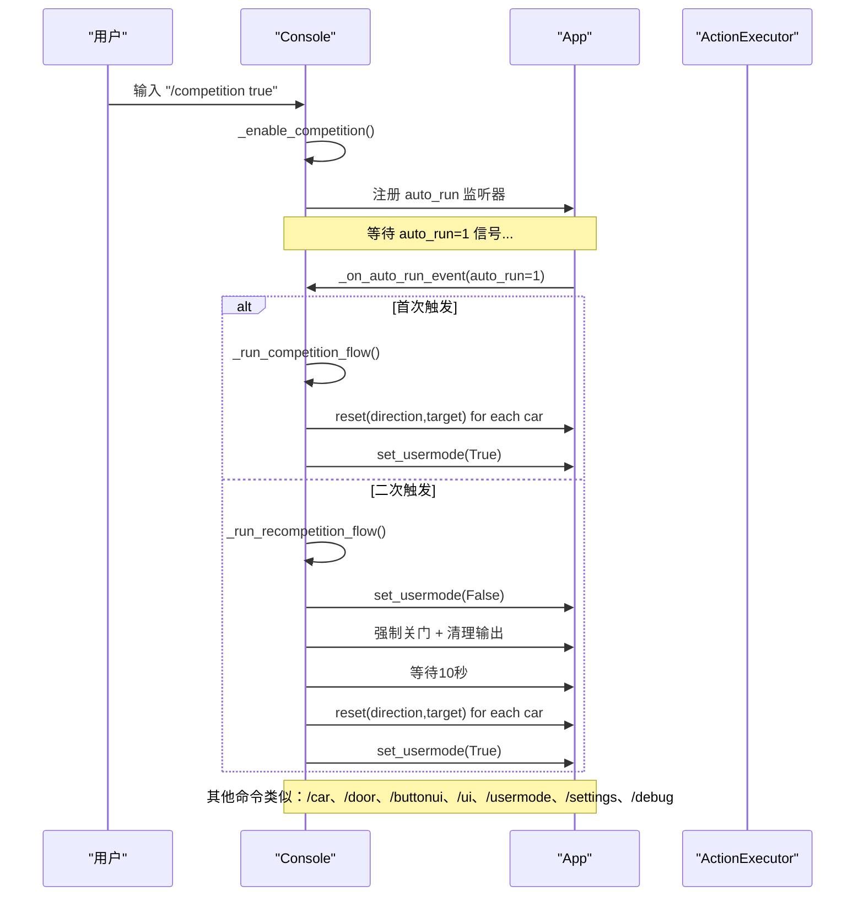
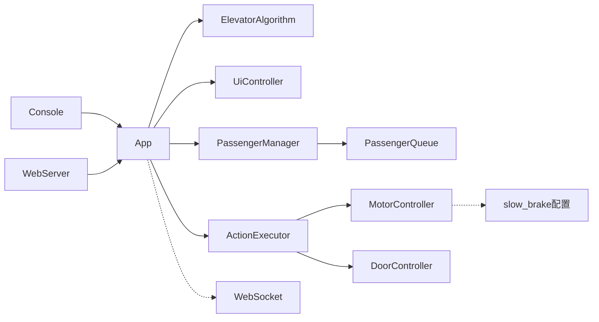

# 大脑模块

<cite>
**本文引用的文件**   
- [core/app.py](file://core/app.py)
- [core/console.py](file://core/console.py)
- [core/passenger.py](file://core/passenger.py)
- [core/player.py](file://core/player.py)
- [core/executor.py](file://core/executor.py)
- [core/controllers.py](file://core/controllers.py)
- [core/algorithm.py](file://core/algorithm.py)
- [web/server.py](file://web/server.py)
</cite>

## 更新摘要
**变更内容**   
- 实现了重大架构重构，派梯逻辑从 app._dispatch_hall_call 迁移到 passenger._select_car_for_hall_call
- 新增大脑 tick 系统实现周期性调度监控，解决纯事件驱动的"计划赶不上变化"问题
- 增强了调度算法的三优先级系统（顺向经过 > 空闲最近 > 目标楼层），提高响应效率
- 集成了 Web WebSocket 支持实时状态广播，提供完整的 HMI 后端服务
- 实现了增强的 auto_run 信号处理系统，支持双模式操作和六步恢复流程
- 新增了完整的WebSocket实时监控系统，包括事件驱动架构、连接管理、多种事件类型支持
- **增强了自动停车乒乓防止逻辑**，避免同一辆车被反复发送到主楼层
- **更新了HP计时器逻辑**，在熄灭灯光前检查新的内部呼叫

## 目录
1. [简介](#简介)
2. [项目结构（决策层）](#项目结构决策层)
3. [核心组件总览](#核心组件总览)
4. [架构概览](#架构概览)
5. [详细组件分析](#详细组件分析)
6. [依赖关系分析](#依赖关系分析)
7. [性能与并发特性](#性能与并发特性)
8. [故障排查指南](#故障排查指南)
9. [结论](#结论)

## 简介
本章节聚焦"大脑"（决策层）的三个子模块：用户交互、算法调度员、REPL 控制台。按照工程约定，大脑不直接监听 IO，也不接触底层硬件事件；所有高层 API 通过 app.py 暴露，由小脑（执行器/控制器）负责将动作展开为 IO 序列并等待传感器确认。乘客流程管理（PassengerManager + PassengerQueue）作为可选插件集成在大脑中，遵循三步工作流：collect → compile → consume，且独立于小脑的 pending_calls。

**更新** 实现了重大架构重构，将派梯逻辑从 app._dispatch_hall_call 完全迁移到 passenger._select_car_for_hall_call，新增了大脑 tick 系统实现周期性调度监控，增强了调度算法的三优先级系统，并集成了 Web WebSocket 支持实时状态广播。

## 项目结构（决策层）
决策层由以下关键文件组成：
- 装配与协调中枢：app.py
- 用户交互（UI 指示灯控制）：ui.py
- 乘客流程管理（大脑可选插件）：passenger.py
- REPL 控制台（命令解析与补全）：console.py
- 与小脑的边界（动作到 IO 的展开）：executor.py、controllers.py（仅用于理解接口契约）
- 调度算法：algorithm.py
- Web 服务：server.py

**图表来源**
- [core/app.py:41-169](file://core/app.py#L41-L169)
- [core/ui.py:32-132](file://core/ui.py#L32-L132)
- [core/passenger.py:39-110](file://core/passenger.py#L39-L110)
- [core/console.py:77-117](file://core/console.py#L77-L117)
- [core/algorithm.py:19-30](file://core/algorithm.py#L19-L30)
- [web/server.py:263-308](file://web/server.py#L263-L308)

## 核心组件总览
- 用户交互（UiController）：提供 set_xxx(bool) 统一写入路径，内部一次 set_many 更新 IO，逻辑状态与 Car.ui 同步，不自动绑定事件。
- 算法调度员（App._tick + algorithm.decide）：每 tick 调用算法 decide(Car, pending_calls)，生成 Action 入队；MOVE 完成时清理 pending 并按 origin 触发外召开门等编排。
- REPL 控制台（Console）：提供 /car、/door、/buttonui、/ui、/usermode、/settings、/debug、/competition 等命令，支持 Tab 补全、批量操作、手动模式、竞赛模式和调试监视。
- **Web 服务**：提供 REST API 和 WebSocket 实时通信，支持前端 HMI 界面。

**更新** 实现了重大架构重构，派梯逻辑完全迁移到 passenger 模块，新增了大脑 tick 系统和 Web WebSocket 支持。

## 架构概览
大脑通过 App 装配多轿厢，共享 IOClient/IOMapper/DisplayEncoder/Algorithm，并为每部电梯维护独立的 ActionQueue 与 per-car IO 写通道。IO 事件由小脑 executor 处理，完成后回调 app 的 on_action_done，再由 app 驱动算法重新决策或进行门/乘客流程编排。

**图表来源**
- [core/app.py:354-373](file://core/app.py#L354-373)
- [core/app.py:380-452](file://core/app.py#L380-L452)
- [core/passenger.py:1238-1310](file://core/passenger.py#L1238-L1310)
- [web/server.py:244-257](file://web/server.py#L244-L257)

## 详细组件分析

### 用户交互（UiController）
职责与约束
- 封装所有 UI 类 IO 写操作（满载/故障/照明/风扇/轿内按钮 LED）。
- 上层只通过 set_xxx(bool) 修改 UI；读走 car.ui.xxx。
- 不自动绑定事件（例如轿内按钮按下不会自动亮灯），由上层逻辑决定。
- 单一 IO 写路径：每个方法一次 set_many，后续由 IOClient tick 合并 flush。

关键设计点
- 地址解析失败时打印警告并跳过，避免配置缺失导致崩溃。
- sync_to_io 用于重置或重载后一次性全量同步 Car.ui 到 IO。

**图表来源**
- [core/ui.py:32-132](file://core/ui.py#L32-L132)

### 算法调度员（App 中的 _tick 与状态编排）
职责与约束
- 每 tick 调用算法 decide(Car, pending_calls)，生成 Action 入队。
- MOVE 完成时清理 pending_calls，按 origin 决定是否外召开门。
- INITIALIZE 完成时根据目标楼层启动方向运行。
- 门动作完成不推 MOVE（安全约束），等待上层（如乘客流程）关门后再恢复调度。

关键设计点
- 去重：若 executor 已在执行 MOVE，则跳过重复 MOVE，待完成再取 pending[0]。
- target_floor 优先：当算法未指定目标时，从 pending[0] 取 FIFO。
- 外召到站开门：origin='hall' 时在到站后自动 OPEN_DOOR。
- **en-route调度**：在车辆移动过程中动态调整调度策略，提高响应效率。
- **智能方向推断**：基于历史派车方向和请求位置智能推断行驶方向。

**更新** 实现了增强的门状态验证机制：
- 在_dispatch_hall_call中，CLOSING状态的车必须door_close_done=1才允许派车
- 在call_internal中增加发车前门状态二次校验，防止状态间隙导致的安全问题
- 优化派车逻辑，确保关门动作完全完成后才启动移动

**图表来源**
- [core/app.py:354-373](file://core/app.py#L354-L373)
- [core/app.py:380-452](file://core/app.py#L380-L452)

### 乘客流程管理（PassengerManager + PassengerQueue）
定位
- 大脑可选插件，不注册任何 IO 监听器，仅通过 App API 交互。
- 独立于小脑 pending_calls，采用三步工作流：collect → compile → consume。
- 两种模式：discard（顺向接受/已过站丢弃）、keep（全部保留，到达当前目标后继续处理）。

**更新** 实现了重大架构重构，派梯逻辑完全从 app._dispatch_hall_call 迁移到 passenger._select_car_for_hall_call，提供了更强大的多车调度能力。

**更新** 实现了增强的外召按钮响应系统，包括边缘检测防止重复派车、长按保持功能、快速路径优化等。

**更新** 人类存在检测升级为三态系统：
- **-1**：确定无人（超时后自动设置）
- **0**：可能有人（开门/按钮触发）
- **1**：确定有人（轿内按钮/光幕触发）

**更新** 多车调度算法增强：
- **三优先级系统**：顺向经过(0) > 空闲最近(1) > 目标楼层(2)
- **en-route调度**：在车辆移动过程中动态调整调度策略
- **扫荡模式**：当无明确方向时，根据外呼分布智能选择行驶方向
- **智能方向推断**：基于历史派车方向和请求位置推断最佳方向

**更新** 修复了孤儿指示灯清理问题：
- 在_on_door_opened中实现完整的孤儿指示灯扫描和清理逻辑
- 检查所有外召指示灯状态，清除无关联的残留灯
- 结合pickup_active和_pending_hall_calls状态进行精确判断

**更新** 新增大脑心跳系统：
- start_brain_tick() 启动周期性扫描，每500ms检查一次
- 解决纯事件驱动的"计划赶不上变化"问题
- 自动消化待派外呼集合，提高响应速度

**更新** 实现了增强的自动停车乒乓防止逻辑：
- 在_auto_park_check中增加了防乒乓机制，避免同一辆车被反复发送到主楼层
- 通过检查pending_call_origin标记，识别auto_park派车的车辆并跳过
- 确保只有非auto_park来源的车辆离开主楼层时才触发其他车辆的自动回位

**更新** 更新了HP计时器逻辑：
- 在_start_human_presence_timer中增加了到期复查机制
- 在熄灭灯光前检查是否有新的内部呼叫到来
- 如果期间有新内呼，取消熄灯操作，保持灯光开启状态
- 提高了系统的响应性和用户体验

核心数据结构
- PassengerQueue：维护 _items 路线，支持 compile(next_target/mark_served/clear)。
- PassengerManager：管理 per-car 的 button_cache、pickup_active、flash_tasks、cron 任务（关门/熄灯）。

增强功能特性
- **边缘检测防重复**：在 App._on_hall_call_event 中实现边沿检测，只在 0→1（按下）和 1→0（松开）时转发，避免 PLC 持续上报导致重复派车。
- **长按保持功能**：支持外召按钮长按保持开门，松手后才启动关门 cron。
- **快速路径优化**：当已有车辆在该层且门开着/正在关时，直接亮灯 + 取消关门 + 必要时重开，无需重新派车。
- **智能派车过滤**：派车前检查 pickup_active 状态，避免同一 (floor, direction) 被重复服务。
- **三态人类存在检测**：精确跟踪轿厢内人员状态，智能控制灯光和风扇。
- **孤儿指示灯清理**：每次开门时扫描所有外召指示灯，清理无关联的残留灯。
- **三优先级派车算法**：_select_car_for_hall_call 实现顺向经过 > 空闲最近 > 目标楼层的优先级系统。
- **大脑心跳系统**：周期性扫描待派外呼，自动分配给空闲车辆。
- **自动停车乒乓防止**：避免同一辆车被反复发送到主楼层，提高系统稳定性。
- **智能HP计时器**：在熄灯前检查新内呼，提供更好的用户体验。

**图表来源**
- [core/passenger.py:39-110](file://core/passenger.py#L39-L110)
- [core/passenger.py:112-187](file://core/passenger.py#L112-L187)
- [core/passenger.py:1314-1393](file://core/passenger.py#L1314-L1393)
- [core/passenger.py:1238-1310](file://core/passenger.py#L1238-L1310)

### Web 服务集成
职责与约束
- 提供 REST API 和 WebSocket 实时通信。
- 所有业务逻辑委托给 core.App，只做 HTTP 路由 + JSON 序列化。
- 支持前端 HMI 界面的实时状态展示和控制。

关键功能
- **REST API**：/api/state、/api/car/{id}/call、/api/hall_call、/control 等接口。
- **WebSocket**：/ws 端点，实时推送 car_state、hall_led、io_event 等事件。
- **状态广播**：ws_broadcast() 函数向所有连接的客户端推送状态更新。
- **外召灯观察者**：注册 hall_led observer，外召灯变化时主动推送。

**更新** 实现了完整的WebSocket实时监控系统：
- **事件驱动架构**：基于 aiohttp 的 WebSocket 协议，支持双向通信
- **连接管理**：维护全局 _ws_clients 集合，自动处理客户端连接/断开
- **多种事件类型支持**：car_state、hall_led、cabin_led、system_event 等事件
- **初始化状态推送**：客户端连接时立即推送完整系统状态
- **错误处理**：自动清理断开的客户端连接，防止内存泄漏

**图表来源**
- [web/server.py:244-257](file://web/server.py#L244-L257)
- [web/server.py:263-308](file://web/server.py#L263-L308)

### REPL 控制台（Console）
职责与约束
- 提供以 / 开头的命令集，支持 Tab 补全、历史浏览、批量操作。
- 内置手动模式（暂停 executor，raw 控制电机/刹车），以及多种 debug 监视项。
- 通过 App 的高层 API 驱动系统行为（/car、/door、/buttonui、/ui、/usermode 等）。

**更新** 实现了增强的竞赛模式(/competition)系统，支持双模式操作：

#### 双模式竞赛系统
- **首次启动模式**：监听 auto_run 输入信号，检测到 1 时自动初始化所有轿厢，完成后启用 usermode
- **重新初始化模式**：二次 auto_run 信号触发时执行完整的六步恢复流程

#### 六步恢复流程
1. **关闭用户模式**：立即停止接客服务
2. **强制关门**：直接写 door_close_relay=1，door_open_relay=0
3. **清理所有输出**：让继电器全部归零，IO2HTTP 会下达
4. **等待 IO 通信**：等待 10s 让 IO2HTTP 把所有命令下达完
5. **重新初始化**：对所有轿厢执行 reset(direction, target_floor)
6. **恢复用户模式**：等待就绪后启用 usermode，支持 partial 模式

**更新** 修复了批量手动模式操作的标志清理 bug。在退出手动模式时，现在会正确清理所有受影响轿厢的 manual_mode 标志，防止调度逻辑损坏并确保批量手动操作后的系统状态一致性。

关键能力
- 参数解析：支持 all、范围、逗号列表（车号/楼层）。
- 补全策略：多级补全（命令→子命令→参数→楼层/车号）。
- 手动模式：暂停 executor，直接下发 motor.start/stop/brake，退出时恢复自动。
- **竞赛模式**：支持 auto_run 信号监听和自动初始化流程，包含双模式处理和六步恢复机制。
- **人类存在监视**：使用 `/debug show human_presence` 监控 -1/0/1 三态变化。
- **UI 事件监听**：使用上升沿检测避免刷屏，支持按钮类信号和状态类信号的差异化处理。
- **运行时配置**：支持 slow_brake 参数的实时调整和持久化保存。
- **批量操作状态一致性**：确保批量手动操作退出后，所有轿厢的 manual_mode 标志都被正确清理。

**图表来源**
- [core/console.py:77-117](file://core/console.py#L77-L117)
- [core/console.py:661-726](file://core/console.py#L661-L726)
- [core/console.py:755-976](file://core/console.py#L755-L976)
- [core/console.py:1770-1969](file://core/console.py#L1770-L1969)
- [core/console.py:1845-2044](file://core/console.py#L1845-L2044)
- [core/app.py:481-495](file://core/app.py#L481-495)
- [core/app.py:354-373](file://core/app.py#L354-L373)

## 依赖关系分析
- 耦合与内聚
  - App 聚合多轿厢资源（Car/Executor/ActionQueue/UI/Display），并通过回调与乘客流程解耦。
  - UiController 仅依赖 IOClient/IOMapper/Car，职责单一，内聚度高。
  - PassengerManager 仅依赖 App API，不触碰 IO，保持纯流程管理。
  - Console 仅依赖 App 高层 API，屏蔽底层细节。
  - Web 服务依赖 App 实例，通过依赖注入获取 elevator_app。
- 外部依赖与集成点
  - IOClient/IOMapper/DisplayEncoder 由 App 装配并共享。
  - Algorithm 通过 get_algorithm(name) 注入，App 在 _tick 中调用 decide。
  - Executor/Controllers 属于小脑，但大脑通过 Action 与回调与之协作。
  - **slow_brake 配置**：App 在初始化时从 config 读取 slow_brake 值并应用到所有 executors 的 motor.slow_brake_level。
  - **WebSocket 集成**：App 在 action 完成时调用 ws_broadcast 推送状态更新。

**图表来源**
- [core/app.py:41-169](file://core/app.py#L41-L169)
- [core/ui.py:32-132](file://core/ui.py#L32-L132)
- [core/passenger.py:112-187](file://core/passenger.py#L112-L187)
- [core/executor.py:27-131](file://core/executor.py#L27-L131)
- [core/controllers.py:28-119](file://core/controllers.py#L28-L119)
- [web/server.py:263-308](file://web/server.py#L263-L308)

## 性能与并发特性
- 多轿厢写通道隔离：每部电梯使用独立 IOClient 写通道，避免 tick 合并时一次 POST 过多地址导致的 S7 read-modify-write 顺序问题。
- 事件驱动无轮询：保持模式（站点吸附）通过 level_up/down 边沿触发反冲，无需 sleep 轮询。
- 唯一例外：到站刹车前 100ms sleep 是为满足 PLC 物理时序的必要延迟，不可删除。
- 异步任务与协程：Console 的 prompt_toolkit 循环、后台 door 跟踪任务、cron 定时任务均基于 asyncio，避免阻塞主循环。
- **边沿检测优化**：外召按钮使用边沿检测避免重复处理，减少不必要的派车计算。
- **批量操作优化**：手动模式下的批量操作使用统一的标志管理机制，确保状态一致性。
- **竞赛模式优化**：auto_run 信号监听使用一次性触发机制，防止重复初始化。二次触发时使用六步恢复流程确保系统状态一致性。
- **人类存在检测优化**：三态系统减少不必要的 UI 刷新，提高响应速度。
- **门状态验证优化**：CLOSING状态下的智能调度减少了不必要的等待时间，提高了系统响应性。
- **大脑心跳优化**：周期性扫描避免事件遗漏，提高系统鲁棒性。
- **WebSocket 广播优化**：批量状态更新减少网络开销，提高前端渲染效率。
- **自动停车乒乓防止优化**：通过origin标记避免重复派车，提高系统稳定性。
- **HP计时器优化**：智能复查机制避免误熄灯，提升用户体验。

## 故障排查指南
- 外召/内召无效
  - 检查 usermode 是否启用（ready 信号置 1）。
  - 确认 passenger 插件已加载（import 成功），否则 usermode 会拒绝启用。
  - 使用 `/debug show ui_listener` 查看 UI 事件是否正常触发。
- 门动作卡住
  - 查看 door_status 监视项输出；若超时，cron 兜底会释放互斥锁。
  - 检查 floor_door_lock 与 door_open/close_done 信号是否存在。
- 站点吸附异常
  - 确认 station_seek 开关与 level_up/down 信号配置正确。
  - 观察 _level_seek_check 日志，确认 (↑1↓1) 判定与反冲逻辑。
- 手动模式无法退出
  - 确保退出时调用 manual_auto 或 /car N auto，恢复 executor 自动模式。
  - **批量手动模式退出问题**：检查 console.py 中的 _run_manual 方法是否正确清理所有轿厢的 manual_mode 标志。
- **外召重复派车问题**
  - 检查 App._hall_call_last_state 边沿检测是否正常工作。
  - 使用 `/debug show ui_listener` 验证按钮信号变化是否正确识别。
- **慢刹车效果不佳**
  - 使用 `/settings slow_brake` 查看当前设置值。
  - 调整到合适的档位（0-7），注意配置会自动保存到 config.yaml。
- **批量操作后调度异常**
  - 确认批量手动操作退出后，所有轿厢的 manual_mode 标志已被正确清理。
  - 检查 App.manual_mode 字典的状态一致性。
- **竞赛模式无法启动**
  - 检查 io_config 是否配置了 auto_run 信号。
  - 确认使用了正确的 io_profile（competition.yaml）。
  - 使用 `/competition` 查看当前状态。
- **人类存在检测异常**
  - 使用 `/debug show human_presence` 监控三态变化。
  - 检查轿内按钮和光幕信号是否正确触发。
  - 确认 human_presence_off_delay 配置合理。
- **孤儿指示灯问题**
  - 检查_on_door_opened中的孤儿指示灯清理逻辑是否正常工作。
  - 使用 `/debug show ui_light_listener` 监控外召指示灯状态变化。
  - 确认pickup_active和_pending_hall_calls状态同步正常。
- **CLOSING状态派车失败**
  - 检查door_close_done信号是否正确配置和读取。
  - 查看_dispatch_hall_call中的门状态验证逻辑。
  - 确认call_internal中的发车前门状态二次校验。
- **竞赛模式二次初始化失败**
  - 检查六步恢复流程的执行日志，确认每个步骤都正常完成。
  - 验证强制关门指令是否正确下发到 PLC。
  - 确认 IO2HTTP 通信是否正常，10秒等待时间是否足够。
  - 检查 competition_init_timeout 配置是否合理。
- **派车算法异常**
  - 检查 passenger._select_car_for_hall_call 的三优先级逻辑。
  - 使用 `/debug show passenger_status` 查看派车候选车辆状态。
  - 确认 `_pending_hall_calls` 集合状态正常。
- **大脑心跳失效**
  - 检查 `start_brain_tick()` 是否正确调用。
  - 查看 `_brain_tick_task` 是否正常运行。
  - 确认 `_try_brain_tick()` 逻辑是否正常执行。
- **WebSocket 连接问题**
  - 检查 web server 是否正常启动。
  - 确认 `/ws` 端点可访问。
  - 查看 `_ws_clients` 集合中的客户端数量。
  - 检查 `ws_broadcast()` 是否正常推送消息。
- **自动停车乒乓问题**
  - 检查 `_auto_park_check` 中的防乒乓逻辑是否正常工作。
  - 确认 `pending_call_origin` 标记是否正确设置和检查。
  - 查看 auto_park 相关的日志输出。
- **HP计时器异常**
  - 检查 `_start_human_presence_timer` 中的到期复查逻辑。
  - 确认 `pending_calls.get(car_id)` 检查是否正常工作。
  - 查看 HP 计时器相关的日志输出。

## 结论
决策层的三个子模块职责清晰、边界明确：
- 用户交互（UiController）提供统一的 UI 写路径，保证逻辑状态与 IO 一致。
- 算法调度员（App._tick + algorithm.decide）负责动作编排与安全约束，确保 MOVE/INITIALIZE/门动作的正确衔接。
- REPL 控制台（Console）提供强大的交互式运维能力，包括批量操作、手动模式、调试监视、竞赛模式和运行时配置。
- **Web 服务**提供完整的 REST API 和 WebSocket 实时通信，支持前端 HMI 界面。

乘客流程管理（PassengerManager + PassengerQueue）作为可选插件，遵循 collect → compile → consume 三步工作流，独立于小脑 pending_calls，实现灵活的外召/内召/关门/熄灯策略。**最新重大架构重构包括派梯逻辑完全迁移到 passenger 模块、新增大脑心跳系统、增强三优先级调度算法、集成 Web WebSocket 支持，显著提升了系统的可靠性、安全性和用户体验**。此外，**批量手动模式操作的标志清理机制得到了完善，确保了系统状态的一致性和可靠性**。整体架构严格分层，通过事件回调与队列通信，避免跨层直连，具备良好的可维护性与扩展性。

**最新更新** 增强了自动停车乒乓防止逻辑，避免了同一辆车被反复发送到主楼层的问题，同时更新了HP计时器逻辑，在熄灭灯光前检查新的内部呼叫，进一步提升了系统的稳定性和用户体验。