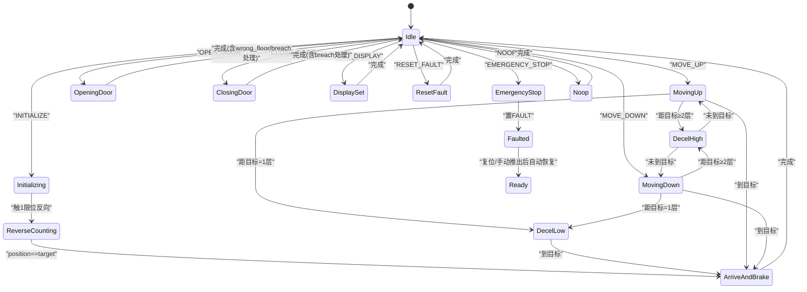
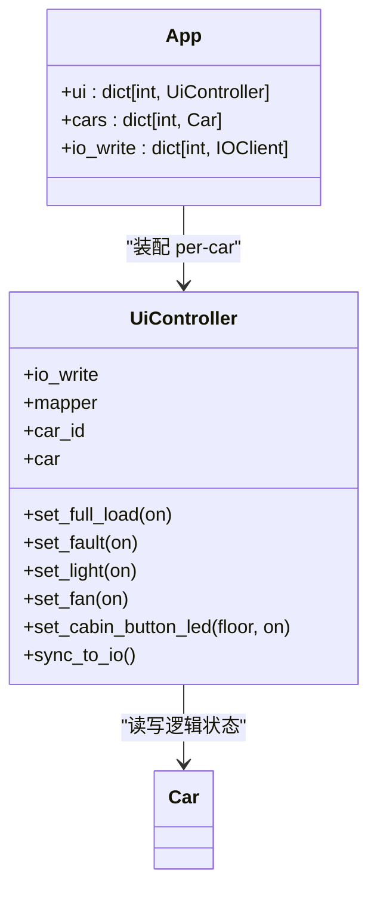
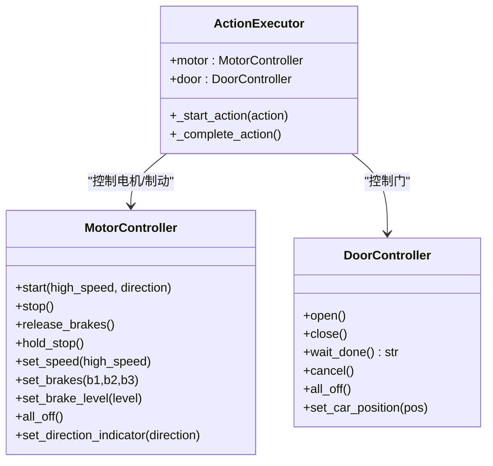

# 小脑模块

<cite>
**本文引用的文件**   
- [core/executor.py](file://core/executor.py)
- [core/ui.py](file://core/ui.py)
- [core/controllers.py](file://core/controllers.py)
- [core/app.py](file://core/app.py)
- [config/io_config.yaml](file://config/io_config.yaml)
</cite>

## executor 运动 FSM
- 角色与职责
  - 硬件层动作执行器，负责把“动作”展开为 IO 序列并等待传感器确认，维护 Car 的现实状态（位置、门态、方向、故障），完成后回调上层触发算法继续决策。
  - 通过 ActionQueue 消费动作，按事件驱动推进状态机；不直接暴露 IO 地址给上层。
- 关键状态与信号
  - 当前动作 current_action、等待的传感器 waiting_sensor、多级减速 decel_state。
  - 站点吸附标志 _level_seek_active、反冲中 _level_correct_in_progress、Auto-seek 标志 _auto_seek_active。
  - INITIALIZE 反向计数相关：_init_reverse_mode、_init_perfect_leveling_active、_init_base_segment_done、_init_target_floor、_init_base_floor。
- 主循环与事件入口
  - run_loop 阻塞取动作 → 启动动作 → 若需等传感器则交由 on_io_event 推进。
  - on_io_event 统一入口：更新输入缓存、刷新故障标志、安全保护（2 限位）、INITIALIZE 流程、平层边沿检测、保持模式反冲、等待特定传感器完成动作。
- 典型动作流
  - MOVE_UP/MOVE_DOWN：释放刹车→点亮方向→高速启动→每经一层触发 _on_level_reached→距目标≥2 层高速、剩 1 层低速→到站走 _arrive_and_brake。
  - INITIALIZE：朝 init_direction 全速运行→触 1 限位立即反向→逐层完美平层（↑1↓1）计数→到达目标后统一刹车并保持。
  - OPEN_DOOR/CLOSE_DOOR：委托 DoorController 管理开/关门及光幕/错层锁等事件，返回结果后更新门态并完成动作。
  - SET_DISPLAY/RESET_FAULT/EMERGENCY_STOP/NOOP/LIGHT_ON/OFF：即时完成或清场。
- 到站与保持
  - _arrive_and_brake 统一刹车流程：hold_stop→方向归零→100ms 固位→可选激活站点吸附→完成动作回调。
  - 站点吸附：在空闲且处于平层区时自动激活，偏离即低速度反冲至 (↑1↓1) 恢复。
- Auto-seek
  - start_auto_seek_down：低速下跑寻找最近一个 (↑1↓1)，找到即停并激活 hold；撞 bottom_limit_1 回退入队 INITIALIZE down 1。
- 安全与异常
  - 2 限位触发立即急停，清所有输出、置 FAULT、取消门动作、清理保持/Auto-seek/Future。
  - 紧急停止后防止残留完成：设置 _emergency_stop_flag 阻断后续 door.cancel 后的完成路径。
- 调试与日志
  - exec_log_enabled 控制后台任务日志输出；多处 _log 打印便于定位时序问题。

图表来源
- [core/executor.py:134-897](file://core/executor.py#L134-L897)

章节来源
- [core/executor.py:134-897](file://core/executor.py#L134-L897)

## executor 设计哲学清单
- 使用 cache 而非 _last_* 字段进行多信号同步判定，避免异步派发导致的状态不一致。
- INITIALIZE 两段式：基站段全程低速，客运段复用标准减速曲线，确保“慢起步换刹得住”。
- NOOP 不退出保持模式，避免频繁退出 hold 导致吸附无法稳定激活。
- EMERGENCY_STOP 同步清场所有长寿命状态（保持、反冲 Future、Auto-seek 等）。
- _arrive_and_brake 统一刹车流程，消除三处重复代码。
- LIGHT_OFF/LIGHT_ON 保留 handler 但不 dispatch，为未来 passenger_flow 预留。
- 工程哲学例外：brake-before-stop 的 100ms sleep 不可删除或改为 cron，除非有 PLC 反馈替代方案。

章节来源
- [core/executor.py:134-897](file://core/executor.py#L134-L897)

## UI 模块
- 角色与职责
  - 封装所有 UI 类 IO 写操作（满载/故障/照明/风扇/开门指示/轿内按钮 LED），将 Car.ui 逻辑状态同步到物理 IO。
  - 遵循“UI 是电梯实体属性”的游戏化范式：读 car.ui.xxx，写 app.ui[cid].set_xxx()。
- 设计原则
  - 不自动绑定事件：cabin_button_X 按下不自动亮 LED，上层自行决定。
  - 单一 IO 写路径：每个 set_xxx 内部一次 set_many，由 IOClient tick 自动合并不同控制器调用。
  - 批量同步：sync_to_io 一次性写入所有 UI 状态，用于 reset/reload 后一致性恢复。
- 接口概览
  - set_full_load/on, set_fault/on, set_light/on, set_fan/on
  - set_cabin_button_led(floor, on)
  - sync_to_io()
- 与 App 集成
  - App 装配 per-car UiController，传入 per-car io_write 实例，避免多车共享写通道拥堵。
  - 用户模式下，app 根据 IO 事件更新 human_presence、调度 PM 等，但 UI 写仍走 UiController。

图表来源
- [core/ui.py:32-132](file://core/ui.py#L32-L132)
- [core/app.py:136-145](file://core/app.py#L136-L145)

章节来源
- [core/ui.py:32-132](file://core/ui.py#L32-L132)
- [core/app.py:136-145](file://core/app.py#L136-L145)

## 硬件控制（controllers）
- MotorController
  - 封装电机/接触器/制动器的组合写操作：start/stop/release_brakes/hold_stop/set_speed/set_brakes/set_brake_level/all_off/set_direction_indicator。
  - 通过 mapper.addr_output 解析信号地址，使用 io_write.set_many 原子写入，避免多信号竞态。
  - 支持 per-car io_write 实例，降低 S7 read-modify-write 顺序导致的接触器建立时间抖动。
- DoorController
  - 自管开/关门生命周期：open/close 设置继电器，wait_done 等待完成事件。
  - 监听光幕 light_curtain 与楼层门锁 floor_door_lock_X，实现 breach 反转开门、wrong_floor 错误处理。
  - cancel 强制完成（用于急停场景），all_off 清除所有门继电器。
- 与 executor 的关系
  - executor 仅调用高层方法（如 motor.start、door.open），不触碰信号名和地址。
  - 门动作结果通过 wait_done 返回值影响后续状态（如 breach→OPEN_DOOR 完成语义）。

图表来源
- [core/controllers.py:28-119](file://core/controllers.py#L28-L119)
- [core/controllers.py:121-259](file://core/controllers.py#L121-L259)
- [core/executor.py:27-131](file://core/executor.py#L27-L131)

章节来源
- [core/controllers.py:28-119](file://core/controllers.py#L28-L119)
- [core/controllers.py:121-259](file://core/controllers.py#L121-L259)
- [core/executor.py:27-131](file://core/executor.py#L27-L131)

## PLC 硬件契约（赛前必验）
- 刹车接法假设
  - 电磁刹车型：通电刹死、失电释放。
  - 代码约定：set_brakes(0,0,0)=释放；set_brakes(1,1,1)=全刹（7档 max）。
  - 若现场接线相反，仅需反转 set_brakes 中的 0/1 映射一处即可适配。
- 关键信号与地址
  - 输入：各车 level_up/level_down、top_limit_1/2、bottom_limit_1/2、light_curtain、floor_door_lock_X、door_open_done、door_close_done 等。
  - 输出：up/down_contactor、high/low_speed_contactor、motor_start、brake_1/2/3、door_open/close_relay、指示灯与数码管段码等。
  - 地址定义见 io_config.yaml 的 input/output 分区，per_car 下按车号划分。
- 验证建议
  - 上电前核对 brake 极性，必要时修改 controllers.py 中 set_brakes 映射。
  - 校验 level_up/level_down 同时为 1 的“完美平层”区间是否稳定。
  - 确认 2 限位信号触发后能可靠进入急停并锁定。

章节来源
- [config/io_config.yaml:1-502](file://config/io_config.yaml#L1-L502)
- [core/controllers.py:1-16](file://core/controllers.py#L1-L16)