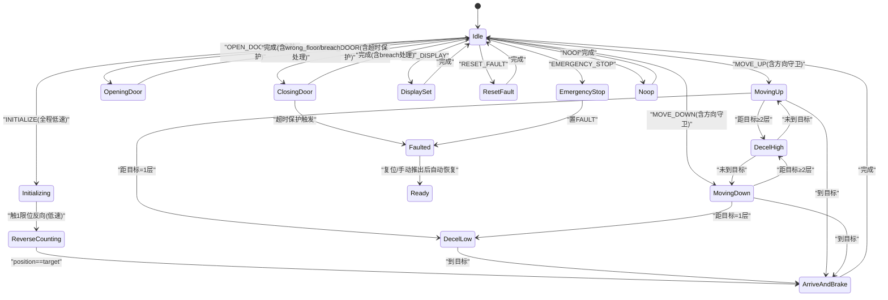
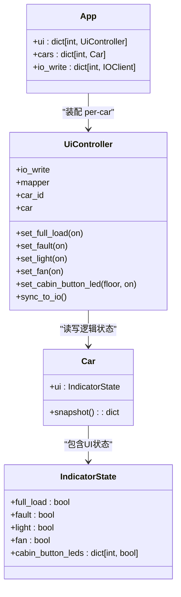
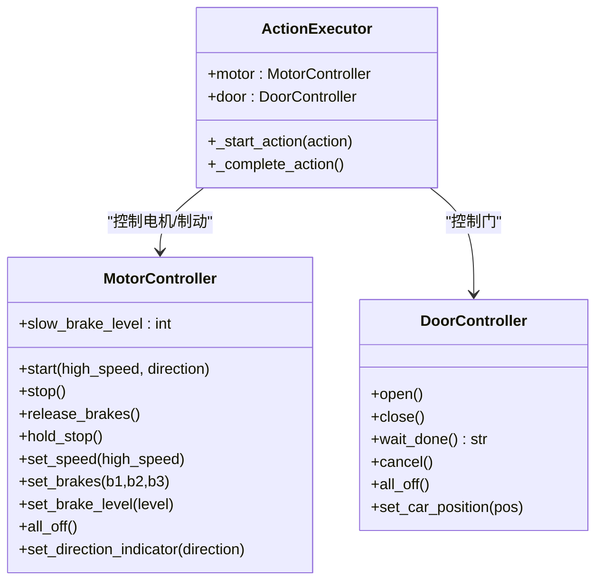
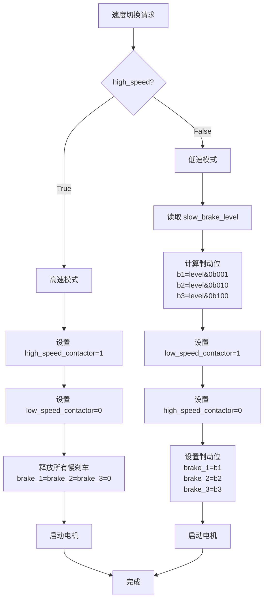
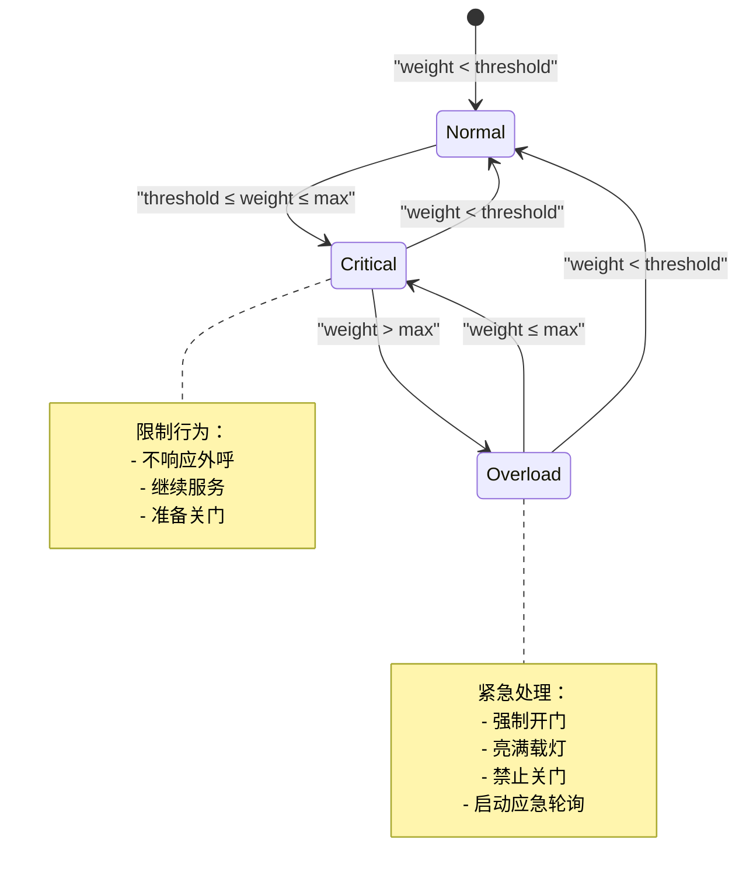
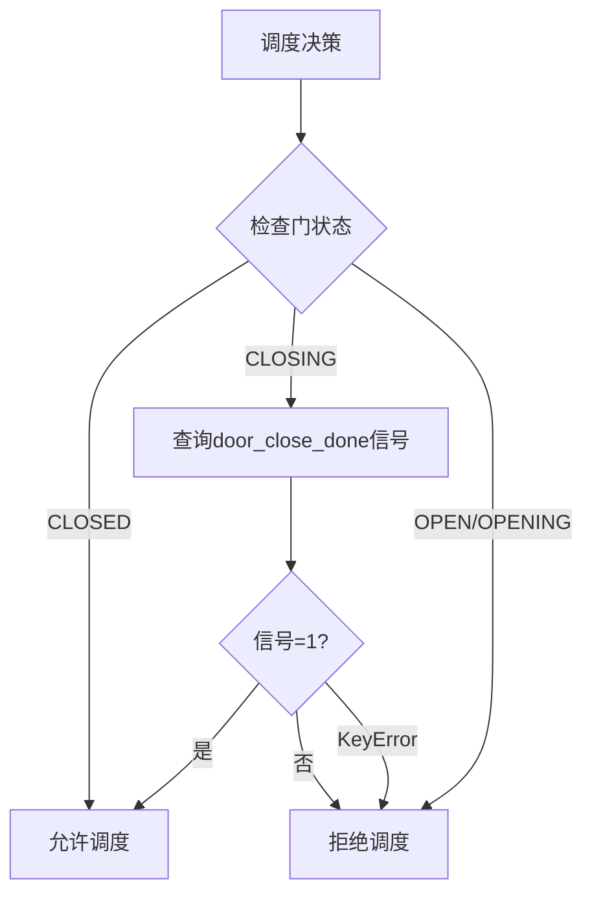
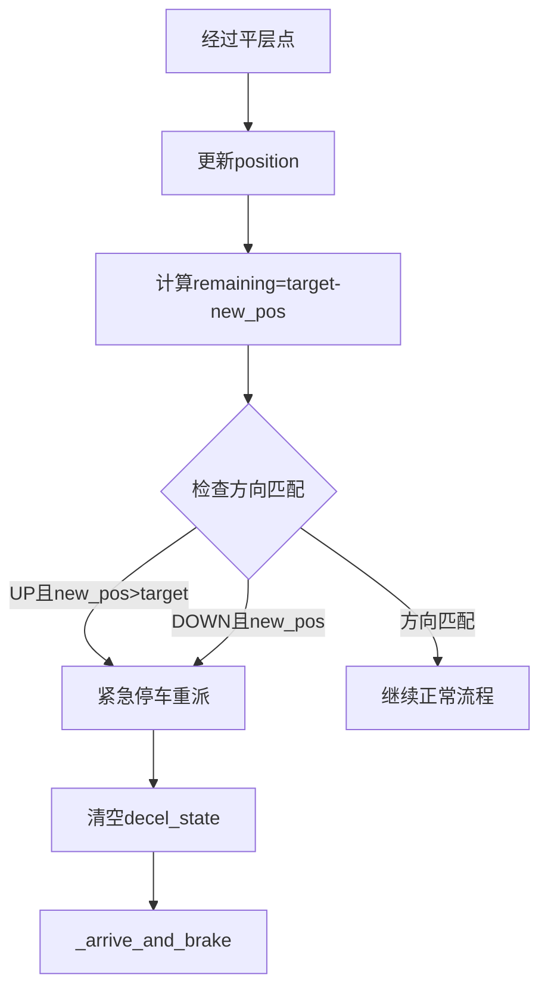
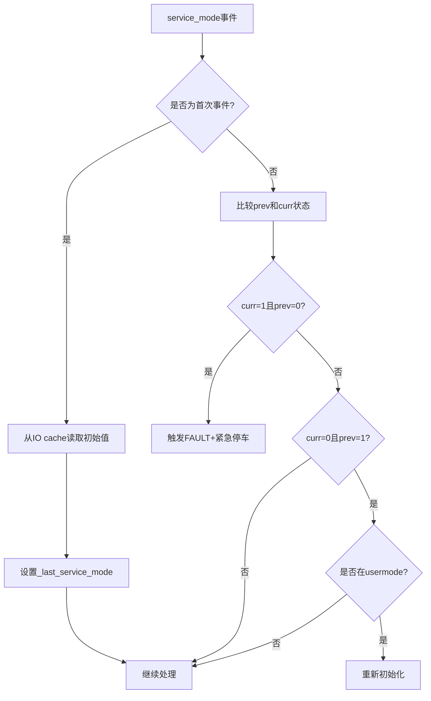

# 小脑模块

<cite>
**本文引用的文件**   
- [core/executor.py](file://core/executor.py)
- [core/controllers.py](file://core/controllers.py)
- [core/app.py](file://core/app.py)
- [config/io_config.yaml](file://config/io_config.yaml)
- [core/player.py](file://core/player.py)
- [config/config.yaml](file://config/config.yaml)
- [core/console.py](file://core/console.py)
- [core/weight_manager.py](file://core/weight_manager.py)
- [config/ui_config.yaml](file://config/ui_config.yaml)
</cite>

## 更新摘要
**变更内容**   
- 增强初始化过程安全机制：INITIALIZE全程低速运行，防止高速碰撞限位导致扣分
- 强化服务模式安全检查：service_mode信号边沿检测，防止PLC上电误触发紧急停止
- 完善错误楼层处理：OPEN_DOOR时增加floor_door_lock验证，错误楼层自动重新初始化
- 新增目标方向守卫：MOVE过程中检测target与当前方向不匹配，立即停车重派
- 重量管理性能优化：从后台持续轮询重构为按需轮询（关门时/status命令时）
- 增强门操作冗余防护：OPEN/CLOSE动作前检查PLC反馈信号，避免重复操作永久阻塞
- CLOSING超时保护：关门超时主动查询IO状态，防止PLC信号丢失导致永久阻塞

## executor 运动 FSM
- 角色与职责
  - 硬件层动作执行器，负责把"动作"展开为 IO 序列并等待传感器确认，维护 Car 的现实状态（位置、门态、方向、故障），完成后回调上层触发算法继续决策。
  - 通过 ActionQueue 消费动作，按事件驱动推进状态机；不直接暴露 IO 地址给上层。
- 关键状态与信号
  - 当前动作 current_action、等待的传感器 waiting_sensor、多级减速 decel_state。
  - 站点吸附标志 _level_seek_active、反冲中 _level_correct_in_progress、Auto-seek 标志 _auto_seek_active。
  - INITIALIZE 反向计数相关：_init_reverse_mode、_init_perfect_leveling_active、_init_base_segment_done、_init_target_floor、_init_base_floor。
- 主循环与事件入口
  - run_loop 阻塞取动作 → 启动动作 → 若需等传感器则交由 on_io_event 推进。
  - on_io_event 统一入口：更新输入缓存、刷新故障标志、安全保护（2 限位）、INITIALIZE 流程、平层边沿检测、保持模式反冲、等待特定传感器完成动作。
- 典型动作流
  - MOVE_UP/MOVE_DOWN：释放刹车→点亮方向→高速启动→每经一层触发 _on_level_reached→距目标≥2 层高速、剩 1 层低速→到站走 _arrive_and_brake。**已增强目标方向守卫防止卡住状态**。
  - INITIALIZE：**已增强安全机制**朝 init_direction 全速运行→触 1 限位立即反向→逐层完美平层（↑1↓1）计数→到达目标后统一刹车并保持。**全程低速运行确保"慢起步换刹得住"**。
  - OPEN_DOOR/CLOSE_DOOR：委托 DoorController 管理开/关门及光幕/错层锁等事件，返回结果后更新门态并完成动作。**已增强冗余防护、超时保护和错误楼层安全检查**。
  - SET_DISPLAY/RESET_FAULT/EMERGENCY_STOP/NOOP/LIGHT_ON/OFF：即时完成或清场。
- 到站与保持
  - _arrive_and_brake 统一刹车流程：hold_stop→方向归零→100ms 固位→可选激活站点吸附→完成动作回调。
  - 站点吸附：在空闲且处于平层区时自动激活，偏离即低速度反冲至 (↑1↓1) 恢复。
- Auto-seek
  - start_auto_seek_down：低速下跑寻找最近一个 (↑1↓1)，找到即停并激活 hold；撞 bottom_limit_1 回退入队 INITIALIZE down 1。
- 安全与异常
  - 2 限位触发立即急停，清所有输出、置 FAULT、取消门动作、清理保持/Auto-seek/Future。
  - 紧急停止后防止残留完成：设置 _emergency_stop_flag 阻断后续 door.cancel 后的完成路径。
  - **目标方向守卫**：MOVE过程中检测target与当前方向不匹配时立即停车，防止计数器崩溃。
  - **服务模式下拉保护**：service_mode上升沿触发FAULT+紧急停车，下降沿在usermode下自动重新初始化。
- 调试与日志
  - exec_log_enabled 控制后台任务日志输出；多处 _log 打印便于定位时序问题。



**图表来源**
- [core/executor.py:134-897](file://core/executor.py#L134-L897)

章节来源
- [core/executor.py:134-897](file://core/executor.py#L134-L897)

## executor 设计哲学清单
- 使用 cache 而非 _last_* 字段进行多信号同步判定，避免异步派发导致的状态不一致。
- INITIALIZE 两段式：基站段全程低速，客运段复用标准减速曲线，确保"慢起步换刹得住"。
- NOOP 不退出保持模式，避免频繁退出 hold 导致吸附无法稳定激活。
- EMERGENCY_STOP 同步清场所有长寿命状态（保持、反冲 Future、Auto-seek 等）。
- _arrive_and_brake 统一刹车流程，消除三处重复代码。
- LIGHT_OFF/LIGHT_ON 保留 handler 但不 dispatch，为未来 passenger_flow 预留。
- **冗余门操作防护**：在执行物理门操作前检查PLC反馈信号，避免重复动作导致的永久阻塞。
- **CLOSING超时保护**：关门动作超过配置时间未收到完成信号时主动查IO状态，防止永久阻塞。
- **目标方向守卫**：MOVE过程中检测target与当前方向不匹配，立即停车防止计数器崩溃。
- **服务模式保护**：service_mode信号边沿检测，防止PLC上电误触发紧急停止。
- **工程哲学例外**：brake-before-stop 的 100ms sleep 不可删除或改为 cron，除非有 PLC 反馈替代方案。

章节来源
- [core/executor.py:134-897](file://core/executor.py#L134-L897)

## UI 模块
- 角色与职责
  - 封装所有 UI 类 IO 写操作（满载/故障/照明/风扇/开门指示/轿内按钮 LED），将 Car.ui 逻辑状态同步到物理 IO。
  - 遵循"UI 是电梯实体属性"的游戏化范式：读 car.ui.xxx，写 app.ui[cid].set_xxx()。
  - **架构约束**：UI 模块属于 Cerebellum（物理层），Brain 层仅决定何时亮灯/灭灯，不直接操作物理 IO 输出。
- 设计原则
  - **严格的读写分离**：上层只通过 set_xxx(bool) 修改 UI，严禁直接赋值 car.ui.fault = True（那只会改逻辑状态不同步 IO）。
  - 不自动绑定事件：cabin_button_X 按下不自动亮 LED，上层自行决定。
  - 单一 IO 写路径：每个 set_xxx 内部一次 set_many，由 IOClient tick 自动合并不同控制器调用。
  - 批量同步：sync_to_io 一次性写入所有 UI 状态，用于 reset/reload 后一致性恢复。
- 接口概览
  - set_full_load/on, set_fault/on, set_light/on, set_fan/on
  - set_cabin_button_led(floor, on)
  - sync_to_io()
- 与 App 集成
  - App 装配 per-car UiController，传入 per-car io_write 实例，避免多车共享写通道拥堵。
  - 用户模式下，app 根据 IO 事件更新 human_presence、调度 PM 等，但 UI 写仍走 UiController。



**更新** 明确了UI模块的架构约束：UI模块属于Cerebellum（物理层），Brain层只决定何时亮灯/灭灯，不直接操作物理IO输出。通过Car.ui属性修改，由UI模块自动同步到物理设备。

图表来源
- [core/ui.py:32-132](file://core/ui.py#L32-L132)
- [core/app.py:136-145](file://core/app.py#L136-L145)
- [core/player.py:53-85](file://core/player.py#L53-85)

章节来源
- [core/ui.py:32-132](file://core/ui.py#L32-L132)
- [core/app.py:136-145](file://core/app.py#L136-L145)
- [core/player.py:53-85](file://core/player.py#L53-85)

## 硬件控制（controllers）
- MotorController
  - 封装电机/接触器/制动器的组合写操作：start/stop/release_brakes/hold_stop/set_speed/set_brakes/set_brake_level/all_off/set_direction_indicator。
  - 通过 mapper.addr_output 解析信号地址，使用 io_write.set_many 原子写入，避免多信号竞态。
  - 支持 per-car io_write 实例，降低 S7 read-modify-write 顺序导致的接触器建立时间抖动。
  - **慢刹车系统**：新增 slow_brake_level 属性(0-7范围)，在低速运行时自动叠加部分制动以降低逼近动量。
- DoorController
  - 自管开/关门生命周期：open/close 设置继电器，wait_done 等待完成事件。
  - 监听光幕 light_curtain 与楼层门锁 floor_door_lock_X，实现 breach 反转开门、wrong_floor 错误处理。
  - cancel 强制完成（用于急停场景），all_off 清除所有门继电器。
- 与 executor 的关系
  - executor 仅调用高层方法（如 motor.start、door.open），不触碰信号名和地址。
  - 门动作结果通过 wait_done 返回值影响后续状态（如 breach→OPEN_DOOR 完成语义）。



**更新** 新增了慢刹车系统功能：MotorController现在支持slow_brake_level属性(0-7范围)，在set_speed方法中实现了高低速切换逻辑，低速时自动叠加部分制动，高速时自动释放制动。

图表来源
- [core/controllers.py:28-119](file://core/controllers.py#L28-119)
- [core/controllers.py:121-259](file://core/controllers.py#L121-L259)
- [core/executor.py:27-131](file://core/executor.py#L27-L131)

章节来源
- [core/controllers.py:28-119](file://core/controllers.py#L28-119)
- [core/controllers.py:121-259](file://core/controllers.py#L121-L259)
- [core/executor.py:27-131](file://core/executor.py#L27-L131)

## 慢刹车系统实现
- 核心概念
  - 慢刹车系统在低速运行阶段自动叠加部分制动，降低电梯接近目标楼层时的动量，提高停车精度和平稳性。
  - slow_brake_level 取值范围 0-7，对应二进制位控制三个制动器(brake_1/2/3)的组合。
  - 系统只在低速模式下生效，切换到高速模式时自动释放所有慢刹车。
- 实现机制
  - **属性定义**：MotorController.slow_brake_level 存储当前慢刹车级别(0-7)。
  - **速度切换逻辑**：set_speed(high_speed=False)时，根据slow_brake_level的二进制位自动设置对应的制动器状态。
  - **位映射关系**：slow_brake_level & 0b001 → brake_1, slow_brake_level & 0b010 → brake_2, slow_brake_level & 0b100 → brake_3。
  - **自动管理**：切到低速时叠加刹车，切到高速时自动释放刹车，无需手动干预。
- 配置与管理
  - **配置文件**：config.yaml中elevator.slow_brake设置默认值(默认2)。
  - **运行时调整**：通过/console命令/settings slow_brake <N>实时修改，支持0-7范围验证。
  - **持久化存储**：修改后自动保存到config.yaml并同步内存配置。
  - **批量应用**：修改会应用到所有轿厢，确保系统一致性。
- 应用场景
  - **初始化过程**：INITIALIZE反向计数阶段全程低速，配合慢刹车确保"慢起步换刹得住"。
  - **正常减速**：距目标1层时切换到低速，自动叠加慢刹车减少过冲。
  - **站点吸附**：保持模式微调时使用低速+慢刹车，提高定位精度。
  - **Auto-seek**：自动寻站时低速运行，利用慢刹车提高安全性。



**图表来源**
- [core/controllers.py:91-122](file://core/controllers.py#L91-122)

**章节来源**
- [core/controllers.py:37-39](file://core/controllers.py#L37-39)
- [core/controllers.py:91-122](file://core/controllers.py#L91-122)
- [config/config.yaml:29-32](file://config/config.yaml#L29-32)
- [core/console.py:1581-1598](file://core/console.py#L1581-L1598)
- [core/app.py:152-155](file://core/app.py#L152-L155)
- [core/app.py:747-749](file://core/app.py#L747-749)

## 重量检测三态机管理系统
- 核心概念
  - 重量检测三态机管理系统实现了对电梯载重的实时监控和安全保护，分为三个状态：状态0(正常)、状态1(临界)、状态2(超载)。
  - 系统采用分层架构：executor负责底层IO读取和ADC转换（脑干层），weight_manager负责状态变化时的副作用处理（小脑层），passenger/algorithm只读状态做决策（大脑层）。
- 状态定义
  - **状态0(正常)**：weight_kg < weight_threshold_kg，电梯正常运行，响应所有外呼。
  - **状态1(临界)**：weight_threshold_kg ≤ weight_kg ≤ max_weight，电梯不响应外呼但可继续服务。
  - **状态2(超载)**：weight_kg > max_weight，立即开门、亮满载灯、禁止关门。
- 实现机制
  - **ADC转换**：executor._poll_weight_once() 从PLC读取原始值，按公式 `weight_kg = round(raw * adc_full_scale_kg / 27648)` 转换为实际重量。
  - **状态计算**：根据配置的max_weight和threshold计算阈值，实时更新car.weight_state。
  - **事件回调**：状态变化时触发on_weight_overweight(进入超载)和on_weight_normalized(恢复正常)回调。
  - **按需轮询**：**已重构为按需轮询**，仅在关门时(status命令时)触发，不再后台持续轮询以提高性能。
- 安全保护机制
  - **关门拦截**：on_close_door_starting钩子在关门前检查重量，超载时跳过关门并触发紧急开门。
  - **自动开门**：检测到超载时调用door.cancel_for_reopen()强制打开已关闭的门。
  - **满载指示**：超载时自动点亮full_load指示灯，恢复正常后熄灭。
  - **降级恢复**：当重量从超载降回临界或正常时，若门仍开着则自动重新关门。
- 配置管理
  - **每车配置**：per_car_weight配置每部电梯的最大载重、临界百分比和ADC满量程。
  - **阈值计算**：weight_threshold_kg = max_weight * threshold，默认threshold=0.95(95%)。
  - **应急轮询**：超载状态下启动应急轮询(默认200ms)快速检测恢复。
- 调试监控
  - **事件监视**：console提供weight_event监视器，实时打印重量变化和状态转换。
  - **状态查询**：/car status命令显示当前重量、状态和配置参数。
  - **快照输出**：Car.snapshot()包含weight_kg、weight_state、max_weight等重量相关信息。



**图表来源**
- [core/weight_manager.py:21-103](file://core/weight_manager.py#L21-L103)
- [core/executor.py:1161-1204](file://core/executor.py#L1161-1204)
- [core/player.py:87-92](file://core/player.py#L87-92)

**章节来源**
- [core/weight_manager.py:1-103](file://core/weight_manager.py#L1-L103)
- [core/executor.py:1133-1204](file://core/executor.py#L1133-1204)
- [core/app.py:207-222](file://core/app.py#L207-222)
- [core/player.py:87-92](file://core/player.py#L87-92)
- [config/config.yaml:62-74](file://config/config.yaml#L62-74)
- [core/console.py:2629-2657](file://core/console.py#L2629-L2657)

## 冗余门操作保护机制
- 核心概念
  - 冗余门操作保护机制防止当重复的OPEN_DOOR/CLOSE_DOOR动作并发入队时导致的永久阻塞场景。
  - 在执行物理门操作前检查PLC反馈信号（door_open_done/door_close_done），如果门已经处于目标状态则跳过物理操作。
  - 解决MOVE完成时外召回调与乘客队列回调可能同时入队两个相同动作的竞态条件。
- 实现机制
  - **冗余开门防护**：在执行OPEN_DOOR前检查door_open_done信号，如果已为1则直接标记OPEN状态，不调用物理开门操作。
  - **冗余关门防护**：在执行CLOSE_DOOR前检查door_close_done信号，如果已为1则直接标记CLOSED状态，不调用物理关门操作。
  - **异常处理**：使用try-except捕获KeyError异常，支持向后兼容没有门完成信号的旧配置。
  - **静默完成**：冗余操作直接设置状态并清理current_action/waiting_sensor，不调用_complete_action避免回调链重复触发。
- 问题场景
  - **并发入队**：MOVE完成时外召回调(_handle_algorithm_state_change)与乘客队列回调(_on_move_done)可能同时入队两个OPEN_DOOR。
  - **永久阻塞**：第一次开门完成后继电器仍为1，第二次door.open()不会产生上升沿，VPLC的door_open_done延时任务不会触发，wait_done()将永久阻塞。
  - **状态混乱**：如果调用_complete_action会导致PM._on_door_opened误设pickup_active/重复调度close cron，导致外呼LED状态混乱。
- 保护策略
  - **预检机制**：在执行物理操作前检查PLC反馈信号，避免不必要的重复操作。
  - **静默处理**：对于冗余操作，直接设置状态并清理内部标志，不触发上层回调。
  - **异常兼容**：处理KeyError异常，确保在没有门完成信号配置的情况下仍能正常工作。

```mermaid
flowchart TD
A[收到OPEN_DOOR动作] --> B{检查door_open_done信号}
B --> |已为1| C[冗余开门保护]
B --> |为0| D[执行物理开门]
C --> E[设置door_state=OPEN]
E --> F[清理current_action/waiting_sensor]
F --> G[静默完成，不调用回调]
D --> H[调用door.open()]
H --> I[等待door_open_done信号]
I --> J[完成物理开门]
J --> K[调用_complete_action触发回调]
```

**图表来源**
- [core/executor.py:665-716](file://core/executor.py#L665-716)

**章节来源**
- [core/executor.py:665-716](file://core/executor.py#L665-716)
- [core/executor.py:717-751](file://core/executor.py#L717-751)

## CLOSING超时保护机制
- 核心概念
  - CLOSING超时保护机制防止因PLC边沿检测漏掉导致door_close_done信号永久不触发而造成的永久阻塞。
  - 当关门动作发起后超过配置时间（默认10秒）未收到door_close_done信号时，主动查询IO状态进行判断。
  - 超时保护可通过配置项closing_timeout_seconds启用或禁用（设为0表示禁用）。
- 实现机制
  - **超时检测**：使用asyncio.wait_for包装door.wait_done()，设置超时时间为closing_timeout_seconds。
  - **IO状态查询**：超时后主动读取door_close_done输入信号，判断门的实际物理状态。
  - **智能处理**：若IO显示门已关好（door_close_done=1），视为正常完成；若仍为0则触发故障保护。
  - **故障保护**：亮故障指示灯、设置车门故障标志、保持CLOSING状态、停止调度直到人工干预。
- 配置管理
  - **配置文件**：config/ui_config.yaml中passenger.closing_timeout_seconds设置超时时间（默认10秒）。
  - **运行时注入**：App在创建Executor时从配置读取并传递给构造函数。
  - **灵活控制**：支持设为0禁用保护，适用于测试环境或特殊场景。
- 异常处理
  - **KeyError兼容**：处理门完成信号地址不存在的情况，确保向后兼容。
  - **静默恢复**：若超时后查询发现门已关好，静默完成动作而不触发故障。
  - **资源清理**：及时清理door.wait_done的内部event，避免内存泄漏。

```mermaid
flowchart TD
A[CLOSE_DOOR动作开始] --> B[设置door_state=CLOSING]
B --> C[调用door.close()]
C --> D{是否启用超时保护?}
D --> |否| E[等待door.wait_done()]
D --> |是| F[asyncio.wait_for(timeout)]
F --> G{是否超时?}
G --> |否| E
G --> |是| H[查询door_close_done IO状态]
H --> I{IO状态=1?}
I --> |是| J[正常完成:设置CLOSED状态]
I --> |否| K[故障保护:亮故障灯+停止调度]
E --> L[完成动作处理]
J --> L
K --> M[等待人工干预]
```

**图表来源**
- [core/executor.py:742-771](file://core/executor.py#L742-771)

**章节来源**
- [core/executor.py:742-771](file://core/executor.py#L742-771)
- [config/ui_config.yaml:16-19](file://config/ui_config.yaml#L16-19)
- [core/app.py:170-171](file://core/app.py#L170-171)

## 增强的门状态验证逻辑
- 核心概念
  - 增强门状态验证逻辑允许CLOSING状态的电梯在PLC确认关门完成时可被调度，提高系统响应性和可靠性。
  - 在调度决策过程中增加对CLOSING状态的智能判断，结合PLC实际反馈信号进行综合评估。
- 实现机制
  - **状态过滤增强**：在算法调度前的门状态检查中，对CLOSING状态进行特殊处理。
  - **PLC信号验证**：尝试读取door_close_done信号，若为1则认为关门已完成，允许调度。
  - **异常兼容**：处理KeyError异常，确保在没有门完成信号配置的情况下仍能正常工作。
  - **保守策略**：若无法获取PLC信号或信号为0，则拒绝调度，确保安全优先。
- 调度流程
  - CLOSED状态：直接通过，允许调度。
  - CLOSING状态：检查door_close_done信号，若为1则通过，否则拒绝。
  - OPEN/OPENING状态：拒绝调度，避免乘客还在上下时车跑掉。
- 安全考虑
  - **双重验证**：既检查逻辑状态也验证PLC实际反馈，避免状态不一致。
  - **容错处理**：信号缺失时采用保守策略，宁可拒绝也不冒险。
  - **性能优化**：仅在必要时查询IO，避免频繁访问造成性能开销。



**图表来源**
- [core/app.py:437-450](file://core/app.py#L437-450)

**章节来源**
- [core/app.py:437-450](file://core/app.py#L437-450)

## 目标方向守卫机制
- 核心概念
  - 目标方向守卫机制防止MOVE过程中出现target与当前运行方向不匹配的异常情况，避免计数器崩溃和永久卡住状态。
  - 通常在grab-hall-call后被其他车偷走target，导致target留在反方向，decelspeed逻辑可能产生危险的高速运行。
- 实现机制
  - **实时检测**：在_on_level_reached中每次经过平层点时检查target与当前方向的匹配性。
  - **立即停车**：发现方向不匹配时立即在当前层停车，触发PM/algorithm重新派车。
  - **日志记录**：详细记录异常情况，便于调试和问题追踪。
- 安全考虑
  - **预防性保护**：在距离计算之前进行检查，避免错误的dist计算导致高速运行。
  - **状态恢复**：停车后清空decel_state，确保下次调度能正确重新决策。
  - **兼容性**：不影响正常的MOVE流程，仅在异常情况下介入。



**图表来源**
- [core/executor.py:576-587](file://core/executor.py#L576-587)

**章节来源**
- [core/executor.py:576-587](file://core/executor.py#L576-587)

## 服务模式安全检查
- 核心概念
  - 服务模式安全检查防止PLC上电时service_mode=1被误判为上升沿触发紧急停止，同时在检修模式下提供安全的重新初始化流程。
- 实现机制
  - **Lazy Seed**：首次service_mode事件时从IO cache读真实初始值，防止PLC启动时service_mode=1被误判为0→1上升沿。
  - **上升沿保护**：service_mode=0→1时触发FAULT+紧急停车，清空action_queue。
  - **下降沿恢复**：service_mode=1→0且在usermode下，自动重新初始化到配置的基站和目标楼层。
- 安全考虑
  - **防误触发**：通过_last_service_mode变量跟踪上次状态，避免PLC上电瞬间的误判。
  - **状态同步**：及时同步cache让后续判断能看到service_mode位的最新状态。
  - **用户友好**：在usermode下自动恢复，减少人工干预。



**图表来源**
- [core/executor.py:213-254](file://core/executor.py#L213-254)

**章节来源**
- [core/executor.py:213-254](file://core/executor.py#L213-254)

## 错误楼层处理机制
- 核心概念
  - 错误楼层处理机制在OPEN_DOOR时检测floor_door_lock与实际楼层是否匹配，不匹配时触发错误处理流程。
- 实现机制
  - **实时验证**：DoorController监听floor_door_lock_X信号，当锁释放时检查是否与当前轿厢位置匹配。
  - **错误处理**：检测到错误楼层时设置result='wrong_floor'，executor收到后触发完整错误处理流程。
  - **自动恢复**：错误处理后自动关门、设置门已关状态、清空action_queue、重新初始化。
- 安全考虑
  - **故障指示**：亮故障指示灯提醒操作人员。
  - **状态清理**：清空所有pending动作，防止stale MOVE在FAULT后重启电机。
  - **安全回归**：重新初始化确保电梯回到已知安全状态。

```mermaid
flowchart TD
A[OPEN_DOOR开始] --> B[设置door_state=OPENING]
B --> C[调用door.open()]
C --> D[等待door_open_done]
D --> E{检查结果}
E --> |wrong_floor| F[触发错误处理]
E --> |done| G[正常完成]
F --> H[紧急停车+亮故障灯]
H --> I[主动关门]
I --> J[设置door_state=CLOSED]
J --> K[清空action_queue]
K --> L[重新初始化]
```

**图表来源**
- [core/executor.py:820-853](file://core/executor.py#L820-853)

**章节来源**
- [core/executor.py:820-853](file://core/executor.py#L820-853)

## PLC 硬件契约（赛前必验）
- 刹车接法假设
  - 电磁刹车型：通电刹死、失电释放。
  - 代码约定：set_brakes(0,0,0)=释放；set_brakes(1,1,1)=全刹（7档 max）。
  - 若现场接线相反，仅需反转 set_brakes 中的 0/1 映射一处即可适配。
- 关键信号与地址
  - 输入：各车 level_up/level_down、top_limit_1/2、bottom_limit_1/2、light_curtain、floor_door_lock_X、door_open_done、door_close_done 等。
  - 输出：up/down_contactor、high/low_speed_contactor、motor_start、brake_1/2/3、door_open/close_relay、指示灯与数码管段码等。
  - 地址定义见 io_config.yaml 的 input/output 分区，per_car 下按车号划分。
- 验证建议
  - 上电前核对 brake 极性，必要时修改 controllers.py 中 set_brakes 映射。
  - 校验 level_up/level_down 同时为 1 的"完美平层"区间是否稳定。
  - 确认 2 限位信号触发后能可靠进入急停并锁定。
  - **慢刹车测试**：验证不同slow_brake_level值(0-7)对应的制动器组合是否正确，确保低速模式下的制动效果符合预期。
  - **重量检测测试**：验证ADC转换精度、三态机状态切换逻辑、超载保护功能的正确性。
  - **冗余门操作测试**：验证重复OPEN_DOOR/CLOSE_DOOR动作的保护机制，确保不会导致永久阻塞。
  - **CLOSING超时保护测试**：验证关门超时保护机制的有效性，确保PLC信号丢失时能正确触发故障保护。
  - **门状态验证测试**：验证CLOSING状态电梯的调度逻辑，确保PLC确认关门完成时可被正常调度。
  - **目标方向守卫测试**：验证MOVE过程中target方向不匹配时的停车保护机制。
  - **服务模式保护测试**：验证service_mode信号边沿检测的正确性，防止PLC上电误触发。
  - **错误楼层处理测试**：验证floor_door_lock不匹配时的错误处理流程。

**更新** 新增了目标方向守卫、服务模式保护、错误楼层处理的硬件验证建议，确保这些新安全机制的正确性。

章节来源
- [config/io_config.yaml:1-502](file://config/io_config.yaml#L1-L502)
- [core/controllers.py:1-16](file://core/controllers.py#L1-L16)