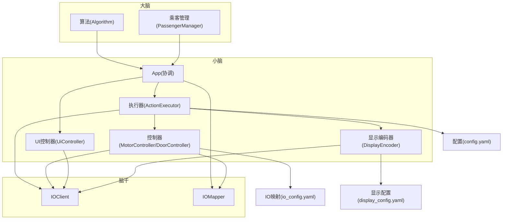
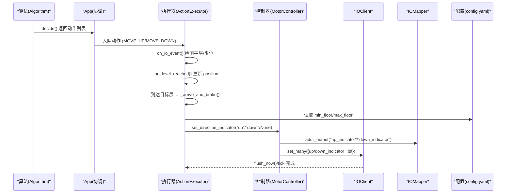
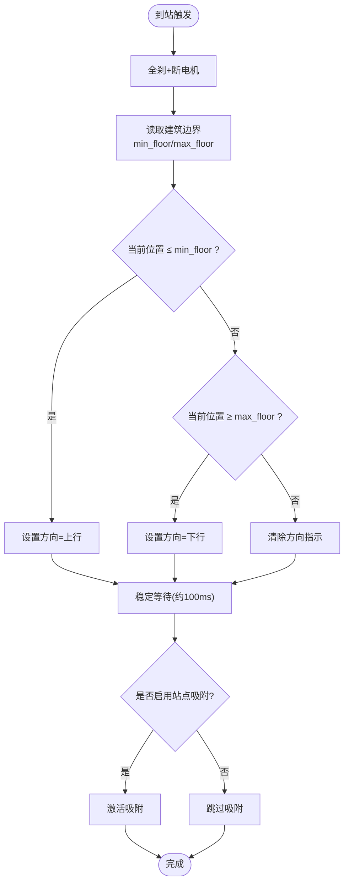
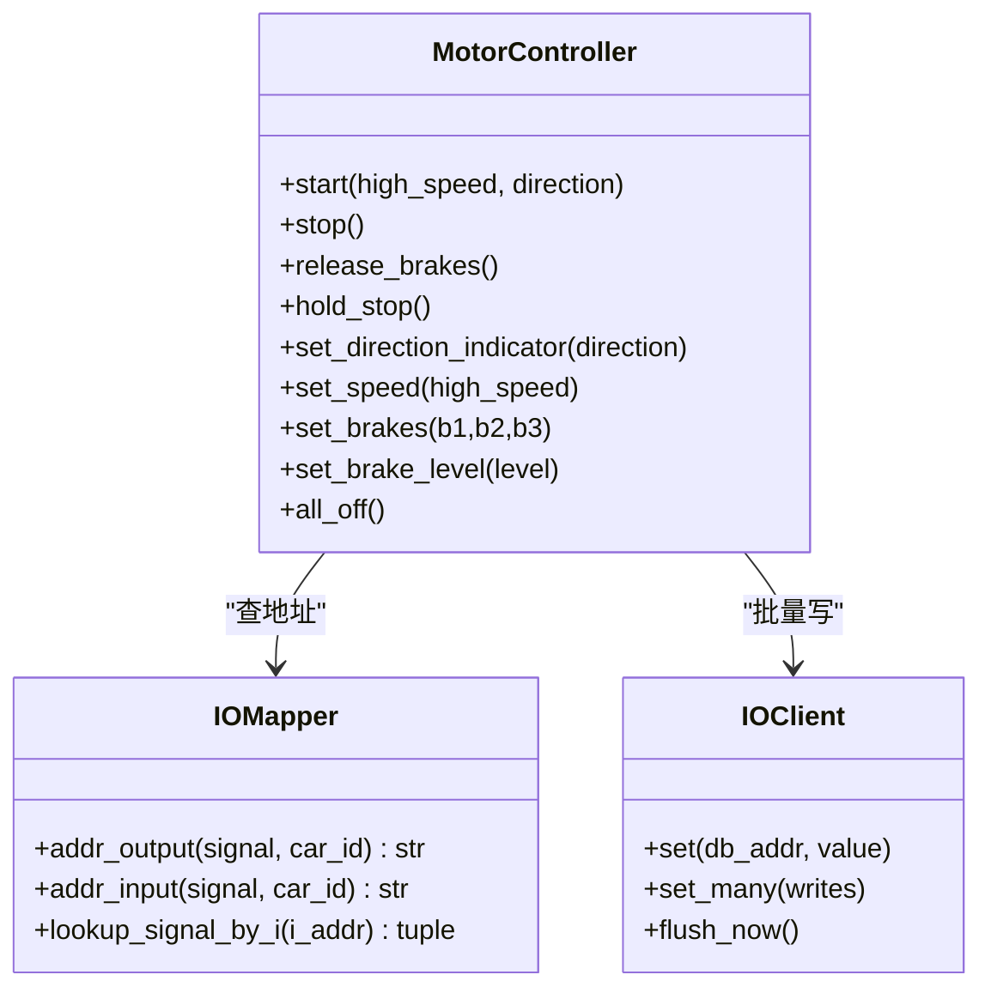
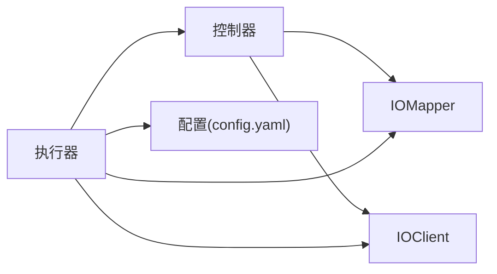

# 极端楼层方向指示

<cite>
**本文引用的文件**   
- [core/app.py](file://core/app.py)
- [core/executor.py](file://core/executor.py)
- [core/controllers.py](file://core/controllers.py)
- [core/player.py](file://core/player.py)
- [core/actions.py](file://core/actions.py)
- [core/io_client.py](file://core/io_client.py)
- [core/display.py](file://core/display.py)
- [core/ui.py](file://core/ui.py)
- [core/io_mapper.py](file://core/io_mapper.py)
- [config/config.yaml](file://config/config.yaml)
- [config/display_config.yaml](file://config/display_config.yaml)
- [config/io_config.yaml](file://config/io_config.yaml)
</cite>

## 目录
1. [简介](#简介)
2. [项目结构](#项目结构)
3. [核心组件](#核心组件)
4. [架构总览](#架构总览)
5. [详细组件分析](#详细组件分析)
6. [依赖关系分析](#依赖关系分析)
7. [性能与稳定性考量](#性能与稳定性考量)
8. [故障排查指南](#故障排查指南)
9. [结论](#结论)

## 简介
本文件聚焦“极端楼层方向指示”的实现与工作机制：在电梯到达最底层或最高层时，通过控制轿厢方向指示灯（上行/下行）来引导乘客进梯。该功能由执行器在到站刹车流程中统一处理，结合配置中的建筑边界信息，确保在最底层显示“上行”、在最顶层显示“下行”，从而提升用户体验并符合比赛评分标准中对“灯/风扇必须亮”的要求。

## 项目结构
围绕“极端楼层方向指示”，涉及的关键模块如下：
- 执行器（小脑）：负责到站刹车流程与方向指示设置
- 控制器（小脑）：封装电机/接触器/刹车/方向指示灯等 IO 写操作
- 玩家模型（大脑/小脑共享）：Car 状态对象，不包含 IO 地址
- 动作队列（大脑→小脑桥梁）：高层动作抽象
- IO 客户端（脑干）：HTTP 批量写 + WebSocket 事件订阅
- 显示编码器（UI 输出）：数码管显示逻辑
- UI 控制器（UI 输出）：指示灯/照明/风扇等 UI 写路径
- IO 映射器（脑干）：信号名 → I/DB 地址映射
- 配置文件：建筑边界、IO 映射、显示字符映射

图表来源
- [core/app.py:62-206](file://core/app.py#L62-L206)
- [core/executor.py:29-149](file://core/executor.py#L29-L149)
- [core/controllers.py:28-177](file://core/controllers.py#L28-L177)
- [core/ui.py:36-160](file://core/ui.py#L36-L160)
- [core/display.py:20-178](file://core/display.py#L20-L178)
- [core/io_client.py:35-126](file://core/io_client.py#L35-L126)
- [core/io_mapper.py:19-124](file://core/io_mapper.py#L19-L124)
- [config/config.yaml:19-70](file://config/config.yaml#L19-L70)
- [config/io_config.yaml:233-501](file://config/io_config.yaml#L233-L501)
- [config/display_config.yaml:1-62](file://config/display_config.yaml#L1-L62)

章节来源
- [core/app.py:62-206](file://core/app.py#L62-L206)
- [core/executor.py:29-149](file://core/executor.py#L29-L149)
- [core/controllers.py:28-177](file://core/controllers.py#L28-L177)
- [core/ui.py:36-160](file://core/ui.py#L36-L160)
- [core/display.py:20-178](file://core/display.py#L20-L178)
- [core/io_client.py:35-126](file://core/io_client.py#L35-L126)
- [core/io_mapper.py:19-124](file://core/io_mapper.py#L19-L124)
- [config/config.yaml:19-70](file://config/config.yaml#L19-L70)
- [config/io_config.yaml:233-501](file://config/io_config.yaml#L233-L501)
- [config/display_config.yaml:1-62](file://config/display_config.yaml#L1-L62)

## 核心组件
- 执行器（ActionExecutor）：维护运行状态机，处理平层、限位、门动作等；到站后调用统一刹车流程，并在其中设置极端楼层的方向指示。
- 控制器（MotorController）：封装电机/接触器/刹车/方向指示灯的 IO 写入；提供 set_direction_indicator 方法用于设置上行/下行指示灯。
- 玩家模型（Car）：包含位置、方向、门状态等高层属性，不含 IO 地址。
- 动作队列（ActionQueue）：承载高层动作（如 MOVE_UP/MOVE_DOWN），由执行器消费并展开为 IO 序列。
- IO 客户端（IOClient）：HTTP 批量写 + WebSocket 事件订阅，支持 tick 合并与已知 I 地址过滤。
- 显示编码器（DisplayEncoder）：将数字/字符映射为段码并写入 IO。
- UI 控制器（UiController）：统一管理 UI 指示灯（满载/故障/照明/风扇/按钮 LED）的写路径。
- IO 映射器（IOMapper）：维护信号名与 I/DB 地址的双向映射。
- 配置（config.yaml / io_config.yaml / display_config.yaml）：定义建筑边界、IO 映射、显示字符映射。

章节来源
- [core/executor.py:29-149](file://core/executor.py#L29-L149)
- [core/controllers.py:28-177](file://core/controllers.py#L28-L177)
- [core/player.py:70-136](file://core/player.py#L70-L136)
- [core/actions.py:15-78](file://core/actions.py#L15-L78)
- [core/io_client.py:35-126](file://core/io_client.py#L35-L126)
- [core/display.py:20-178](file://core/display.py#L20-L178)
- [core/ui.py:36-160](file://core/ui.py#L36-L160)
- [core/io_mapper.py:19-124](file://core/io_mapper.py#L19-L124)
- [config/config.yaml:19-70](file://config/config.yaml#L19-L70)
- [config/io_config.yaml:233-501](file://config/io_config.yaml#L233-L501)
- [config/display_config.yaml:1-62](file://config/display_config.yaml#L1-L62)

## 架构总览
“极端楼层方向指示”属于到站后的 UI 行为，位于小脑的执行器中，通过控制器写入方向指示灯。其数据流与控制流如下：

图表来源
- [core/algorithm.py:32-128](file://core/algorithm.py#L32-L128)
- [core/app.py:624-648](file://core/app.py#L624-L648)
- [core/executor.py:624-704](file://core/executor.py#L624-L704)
- [core/executor.py:574-606](file://core/executor.py#L574-L606)
- [core/controllers.py:94-100](file://core/controllers.py#L94-L100)
- [core/io_client.py:162-176](file://core/io_client.py#L162-L176)
- [config/config.yaml:19-24](file://config/config.yaml#L19-L24)

## 详细组件分析

### 执行器到站刹车与方向指示
- 到站统一刹车流程 _arrive_and_brake：
  - 全刹 + 断电机，避免过冲
  - 根据当前楼层与建筑边界设置方向指示：
    - 若当前位置 ≤ 最低使用层 → 设置“上行”
    - 若当前位置 ≥ 最高使用层 → 设置“下行”
    - 否则 → 清除方向指示
  - 短暂等待以稳定物理时序（PLC 硬件要求）
  - 可选激活站点吸附（station_seek）
  - 通知上层动作完成

图表来源
- [core/executor.py:574-606](file://core/executor.py#L574-L606)
- [config/config.yaml:19-24](file://config/config.yaml#L19-L24)

章节来源
- [core/executor.py:574-606](file://core/executor.py#L574-L606)

### 控制器方向指示灯写入
- MotorController.set_direction_indicator：
  - 根据传入方向计算 up/down 位
  - 通过 mapper.addr_output 获取 up_indicator/down_indicator 的 DB 地址
  - 调用 io_write.set_many 写入方向指示灯

图表来源
- [core/controllers.py:94-100](file://core/controllers.py#L94-L100)
- [core/io_mapper.py:89-101](file://core/io_mapper.py#L89-L101)
- [core/io_client.py:162-176](file://core/io_client.py#L162-L176)

章节来源
- [core/controllers.py:94-100](file://core/controllers.py#L94-L100)
- [core/io_mapper.py:89-101](file://core/io_mapper.py#L89-L101)
- [core/io_client.py:162-176](file://core/io_client.py#L162-L176)

### 配置与映射
- 建筑边界（config.yaml）：
  - min_floor/max_floor：决定“极端楼层”的判断阈值
  - top_base_floor/bottom_base_floor：初始化用基站层（仅限位无门）
- IO 映射（io_config.yaml）：
  - per_car.up_indicator / per_car.down_indicator：每部车的方向指示灯地址
- 显示配置（display_config.yaml）：
  - floor_display 与 glyphs：数码管显示规则（与方向指示无关，但同属 UI 输出）

章节来源
- [config/config.yaml:19-24](file://config/config.yaml#L19-L24)
- [config/io_config.yaml:254-294](file://config/io_config.yaml#L254-L294)
- [config/display_config.yaml:27-62](file://config/display_config.yaml#L27-L62)

### 与其他 UI 输出的解耦
- UI 控制器（UiController）负责照明/风扇/故障/满载/按钮 LED 等 UI 写路径，遵循“单一写路径 + tick 合并”的原则。
- 方向指示灯由 MotorController 直接写入，不经过 UiController，保持职责清晰：运动相关指示灯归控制器，环境/交互类指示灯归 UI 控制器。

章节来源
- [core/ui.py:36-160](file://core/ui.py#L36-L160)
- [core/controllers.py:94-100](file://core/controllers.py#L94-L100)

## 依赖关系分析
- 执行器依赖：
  - 配置（建筑边界）
  - 控制器（方向指示灯写入）
  - IO 客户端（批量写）
  - IO 映射器（地址解析）
- 控制器依赖：
  - IO 映射器（地址解析）
  - IO 客户端（批量写）
- 配置依赖：
  - config.yaml 提供 min_floor/max_floor
  - io_config.yaml 提供 up_indicator/down_indicator 地址

图表来源
- [core/executor.py:574-606](file://core/executor.py#L574-L606)
- [core/controllers.py:94-100](file://core/controllers.py#L94-L100)
- [core/io_client.py:162-176](file://core/io_client.py#L162-L176)
- [core/io_mapper.py:89-101](file://core/io_mapper.py#L89-L101)
- [config/config.yaml:19-24](file://config/config.yaml#L19-L24)

章节来源
- [core/executor.py:574-606](file://core/executor.py#L574-L606)
- [core/controllers.py:94-100](file://core/controllers.py#L94-L100)
- [core/io_client.py:162-176](file://core/io_client.py#L162-L176)
- [core/io_mapper.py:89-101](file://core/io_mapper.py#L89-L101)
- [config/config.yaml:19-24](file://config/config.yaml#L19-L24)

## 性能与稳定性考量
- 批量写与 tick 合并：
  - IOClient 的 set_many 将多个写操作合并，按 tick 间隔一次性 POST，降低网络开销与 PLC 读写压力。
- 方向指示写入时机：
  - 在到站刹车流程中设置，避免与运动过程竞争资源。
- 物理时序稳定：
  - 到站后短暂等待（约 100ms）以确保机械与电气状态稳定，防止过冲或误判。
- 站点吸附（可选）：
  - 在极端楼层场景下，若启用站点吸附，可在到站后持续监测平层信号，偏离则反冲修正，进一步提升停靠精度。

[本节为通用指导，无需具体文件引用]

## 故障排查指南
- 方向指示灯未亮：
  - 检查 io_config.yaml 中对应车的 up_indicator/down_indicator 地址是否正确
  - 确认 config.yaml 中 min_floor/max_floor 与实际建筑一致
  - 查看执行器日志，确认 _arrive_and_brake 是否被调用以及方向设置分支
- 极端楼层判断异常：
  - 核对 config.yaml 的 building.min_floor 与 building.max_floor
  - 确认 Car.position 在到站时已正确更新（_on_level_reached 路径）
- 方向指示与运动冲突：
  - 确认方向指示仅在 _arrive_and_brake 中设置，不在 MOVE 过程中频繁切换
  - 检查 MotorController.set_direction_indicator 的写入是否被后续动作覆盖

章节来源
- [config/io_config.yaml:254-294](file://config/io_config.yaml#L254-L294)
- [config/config.yaml:19-24](file://config/config.yaml#L19-L24)
- [core/executor.py:624-704](file://core/executor.py#L624-L704)
- [core/executor.py:574-606](file://core/executor.py#L574-L606)
- [core/controllers.py:94-100](file://core/controllers.py#L94-L100)

## 结论
“极端楼层方向指示”通过执行器的到站刹车流程统一实现，依据建筑边界配置动态设置方向指示灯，既满足用户体验需求，也符合比赛评分标准。该功能与小脑的运动控制紧密耦合，同时与 UI 控制器保持职责分离，确保了系统架构的清晰性与可维护性。通过 IO 客户端的批量写机制与 tick 合并，系统在性能与稳定性方面得到保障。