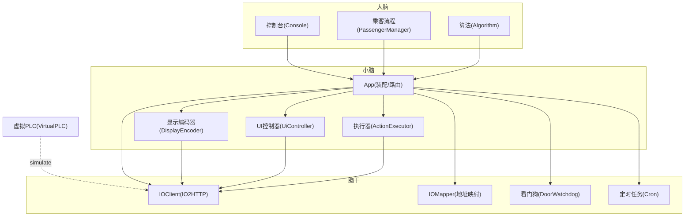
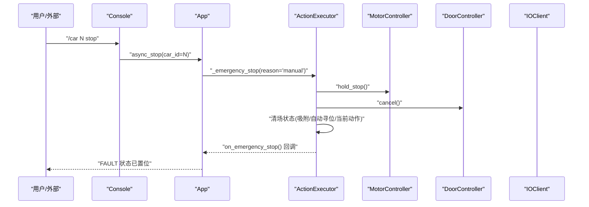
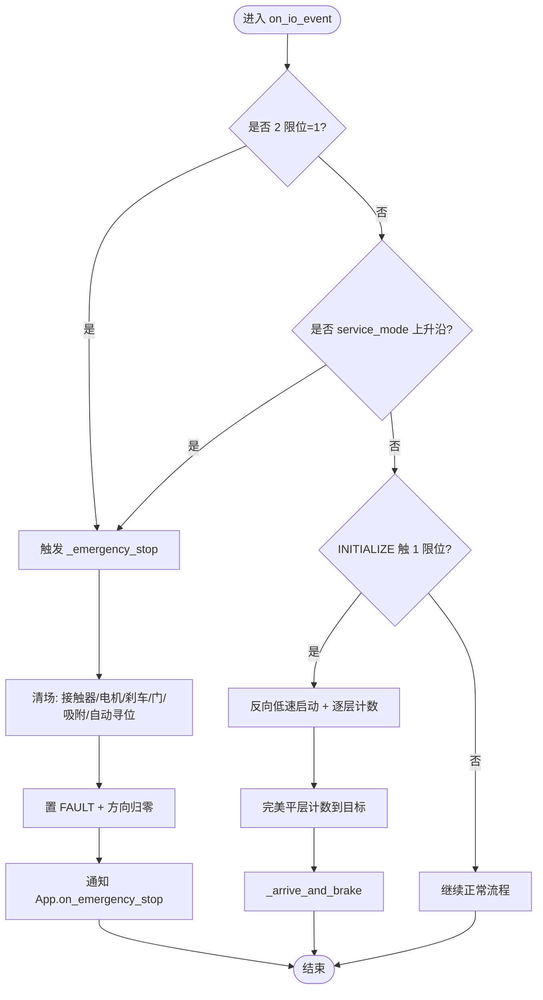
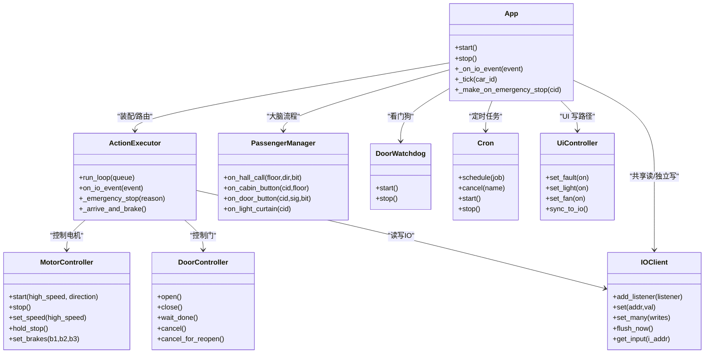

# 紧急停止恢复系统

<cite>
**本文引用的文件**   
- [core/app.py](file://core/app.py)
- [core/executor.py](file://core/executor.py)
- [core/controllers.py](file://core/controllers.py)
- [core/actions.py](file://core/actions.py)
- [core/io_client.py](file://core/io_client.py)
- [core/passenger.py](file://core/passenger.py)
- [core/watchdog.py](file://core/watchdog.py)
- [core/console.py](file://core/console.py)
- [core/algorithm.py](file://core/algorithm.py)
- [core/player.py](file://core/player.py)
- [core/display.py](file://core/display.py)
- [core/io_mapper.py](file://core/io_mapper.py)
- [core/cron.py](file://core/cron.py)
- [core/logging.py](file://core/logging.py)
- [core/ui.py](file://core/ui.py)
- [core/virtual_plc.py](file://core/virtual_plc.py)
</cite>

## 目录
1. [引言](#引言)
2. [项目结构](#项目结构)
3. [核心组件](#核心组件)
4. [架构总览](#架构总览)
5. [详细组件分析](#详细组件分析)
6. [依赖关系分析](#依赖关系分析)
7. [性能与可靠性考量](#性能与可靠性考量)
8. [故障排查指南](#故障排查指南)
9. [结论](#结论)
10. [附录](#附录)

## 引言
本文件聚焦“紧急停止恢复系统”的设计与实现，围绕三层架构（大脑/小脑/脑干）展开：
- 大脑（决策层）：用户交互 + 算法 + REPL。不直接监听 IO，仅通过 App API 交互。
- 小脑（物理层）：运动 FSM + UI + 硬件控制。负责将高层动作展开为具体 IO 序列并等待传感器确认。
- 脑干（IO 层）：WS + HTTP + 映射。提供输入事件分发、输出批量合并与写通道隔离。

在紧急停止（EMERGENCY_STOP）场景下，系统需做到：
- 立即清场所有长寿命状态（接触器、电机、刹车、站点吸附、自动寻位等）。
- 安全地中断门动作，避免死锁。
- 在检修信号释放后，按配置自动复位并重新初始化。
- 保证日志可追溯、UI 一致性、以及多轿厢并发下的稳定性。

## 项目结构
本项目采用分层与模块化组织，关键模块职责如下：
- app.py：装配与主循环，事件路由，高层 API 暴露，跨组件协调。
- executor.py：硬件层 FSM，动作执行与传感器等待，紧急停止与恢复流程。
- controllers.py：电机/门控制器，封装 IO 写操作。
- actions.py：动作抽象与队列，作为大脑与小脑的契约。
- io_client.py：IO2HTTP 客户端，WS 订阅、bitmap 派发、写缓冲合并。
- passenger.py：乘客流程管理（大脑），独立请求队列与关门 cron。
- watchdog.py：独立看门狗，CLOSING 卡死检测与强制完成。
- console.py：REPL 控制台，命令入口与调试开关。
- algorithm.py：高层调度算法（纯函数式，无 IO 耦合）。
- player.py：Car 实体与状态枚举，算法唯一可见的状态模型。
- display.py：7 段数码管编码与 IO 写入。
- io_mapper.py：逻辑信号名到 I/DB 地址的映射。
- cron.py：事件驱动延时定时器，支持 reschedule/cancel。
- logging.py：日志分流与时间戳。
- ui.py：UI 指示灯控制器，统一 set_many 路径。
- virtual_plc.py：模拟 PLC，simulate 模式下反向驱动 IO。

图表来源
- [core/app.py:62-255](file://core/app.py#L62-L255)
- [core/executor.py:29-149](file://core/executor.py#L29-L149)
- [core/controllers.py:28-177](file://core/controllers.py#L28-L177)
- [core/actions.py:15-78](file://core/actions.py#L15-L78)
- [core/io_client.py:35-126](file://core/io_client.py#L35-L126)
- [core/passenger.py:124-171](file://core/passenger.py#L124-L171)
- [core/watchdog.py:24-57](file://core/watchdog.py#L24-L57)
- [core/console.py:88-151](file://core/console.py#L88-L151)
- [core/algorithm.py:19-49](file://core/algorithm.py#L19-L49)
- [core/player.py:12-95](file://core/player.py#L12-L95)
- [core/display.py:20-62](file://core/display.py#L20-L62)
- [core/io_mapper.py:19-77](file://core/io_mapper.py#L19-L77)
- [core/cron.py:57-149](file://core/cron.py#L57-L149)
- [core/virtual_plc.py:33-96](file://core/virtual_plc.py#L33-L96)

章节来源
- [core/app.py:62-255](file://core/app.py#L62-L255)
- [core/executor.py:29-149](file://core/executor.py#L29-L149)
- [core/controllers.py:28-177](file://core/controllers.py#L28-L177)
- [core/actions.py:15-78](file://core/actions.py#L15-L78)
- [core/io_client.py:35-126](file://core/io_client.py#L35-L126)
- [core/passenger.py:124-171](file://core/passenger.py#L124-L171)
- [core/watchdog.py:24-57](file://core/watchdog.py#L24-L57)
- [core/console.py:88-151](file://core/console.py#L88-L151)
- [core/algorithm.py:19-49](file://core/algorithm.py#L19-L49)
- [core/player.py:12-95](file://core/player.py#L12-L95)
- [core/display.py:20-62](file://core/display.py#L20-L62)
- [core/io_mapper.py:19-77](file://core/io_mapper.py#L19-L77)
- [core/cron.py:57-149](file://core/cron.py#L57-L149)
- [core/virtual_plc.py:33-96](file://core/virtual_plc.py#L33-L96)

## 核心组件
- 执行器（ActionExecutor）：维护当前动作、传感器等待、多级减速、站点吸附、完美平层计数；处理紧急停止与恢复。
- 控制器（MotorController/DoorController）：封装电机/接触器/刹车/门的 IO 写操作，提供 hold_stop、cancel_for_reopen 等能力。
- IO 客户端（IOClient）：WS 订阅 bitmap、增量边沿、写缓冲合并、已知地址过滤、共享缓存。
- 应用（App）：装配多轿厢、事件路由、高层 API、重量三态机集成、看门狗、cron、Web 服务。
- 乘客流程（PassengerManager）：外呼/内召/光幕/门按钮流程，独立队列与关门 cron。
- 看门狗（DoorWatchdog）：CLOSING 超时检测，强制完成关门。
- 控制台（Console）：REPL 命令，含 /car N stop 触发紧急停止。
- 算法（ElevatorAlgorithm）：纯函数式决策，只读 Car 与 pending_calls。
- 玩家（Car）：电梯实体状态，不含 IO 地址。
- 显示（DisplayEncoder）：楼层数字/字符映射与 IO 写入。
- 映射（IOMapper）：逻辑信号 → I/DB 地址映射。
- 定时（Cron）：事件驱动延时任务，支持 reschedule/cancel。
- 日志（logging）：stderr 双写与时间戳。
- UI 控制器（UiController）：统一 set_many 路径，事件观测。
- 虚拟 PLC（VirtualPLC）：simulate 模式反向驱动 IO。

章节来源
- [core/executor.py:29-149](file://core/executor.py#L29-L149)
- [core/controllers.py:28-177](file://core/controllers.py#L28-L177)
- [core/io_client.py:35-126](file://core/io_client.py#L35-L126)
- [core/app.py:62-255](file://core/app.py#L62-L255)
- [core/passenger.py:124-171](file://core/passenger.py#L124-L171)
- [core/watchdog.py:24-57](file://core/watchdog.py#L24-L57)
- [core/console.py:88-151](file://core/console.py#L88-L151)
- [core/algorithm.py:19-49](file://core/algorithm.py#L19-L49)
- [core/player.py:12-95](file://core/player.py#L12-L95)
- [core/display.py:20-62](file://core/display.py#L20-L62)
- [core/io_mapper.py:19-77](file://core/io_mapper.py#L19-L77)
- [core/cron.py:57-149](file://core/cron.py#L57-L149)
- [core/logging.py:65-94](file://core/logging.py#L65-L94)
- [core/ui.py:36-160](file://core/ui.py#L36-L160)
- [core/virtual_plc.py:33-96](file://core/virtual_plc.py#L33-L96)

## 架构总览
紧急停止恢复的关键路径：
- 触发源：2 限位、检修信号上升沿、手动命令 /car N stop。
- 执行器急停：清场所有接触器/电机/刹车，置 FAULT，取消门动作，清理站点吸附与自动寻位状态。
- 上层联动：App 收到 on_emergency_stop 回调，进行额外清理（如关闭 Web、重置标志）。
- 恢复流程：检修信号下降沿且在 usermode 时，调用 reset 并重新初始化。

图表来源
- [core/console.py:786-790](file://core/console.py#L786-L790)
- [core/app.py:370-400](file://core/app.py#L370-L400)
- [core/executor.py:528-556](file://core/executor.py#L528-L556)
- [core/controllers.py:82-92](file://core/controllers.py#L82-L92)
- [core/controllers.py:258-272](file://core/controllers.py#L258-L272)
- [core/io_client.py:149-176](file://core/io_client.py#L149-L176)

## 详细组件分析

### 执行器（ActionExecutor）—— 紧急停止与恢复
- 触发条件：
  - 2 限位（top_limit_2/bottom_limit_2）= 1。
  - 检修信号 service_mode 上升沿。
  - 运行中撞 1 限位时的保护性停车与重初始化。
- 清场内容：
  - 全断接触器/电机/刹车（hold_stop）。
  - 置 FAULT、方向归零、清空 current_action/waiting_sensor。
  - 取消门动作（door.cancel），防止 wait_done 阻塞。
  - 清理站点吸附与自动寻位相关标志，避免后续误触发。
- 恢复流程：
  - 检修信号下降沿且 usermode 时，调用 App.reset 并传入初始化方向与目标楼层。
  - 若 MOVE 期间撞 1 限位，则停车并入队 INITIALIZE 以重新定位。

图表来源
- [core/executor.py:227-390](file://core/executor.py#L227-L390)
- [core/executor.py:528-556](file://core/executor.py#L528-L556)
- [core/executor.py:574-607](file://core/executor.py#L574-L607)

章节来源
- [core/executor.py:227-390](file://core/executor.py#L227-L390)
- [core/executor.py:528-556](file://core/executor.py#L528-L556)
- [core/executor.py:574-607](file://core/executor.py#L574-L607)

### 控制器（MotorController/DoorController）—— 安全与幂等
- MotorController：
  - start/stop/set_speed/set_brakes/all_off 均通过 set_many 批量写，减少 S7 read-modify-write 次数。
  - hold_stop 同时断电机与全刹，确保到站固位。
  - slow_brake_level 在低速阶段叠加刹车档位，提升制动效果。
- DoorController：
  - open/close 后立即 flush_now，确保继电器先到达 PLC，再注册监听器。
  - cancel/cancel_for_reopen 用于紧急停止或重开场景，避免 door_state 不一致。
  - 内部监听 door_open_done/door_close_done、light_curtain、floor_door_lock 等信号。

章节来源
- [core/controllers.py:28-177](file://core/controllers.py#L28-L177)
- [core/controllers.py:179-355](file://core/controllers.py#L179-L355)

### IO 客户端（IOClient）—— 事件分发与写合并
- 输入：
  - WS 接收 bitmap 与 change_gpio，更新输入缓存并串行派发事件，保证 2 限位优先于 1 限位被处理。
  - 支持 set_known_i_addresses 过滤，避免 800 位全扫描。
- 输出：
  - set/set_many 加入写缓冲区，tick 周期批量 flush，降低网络开销。
  - 每部电梯独立 write 实例，避免 6 车共享拥堵。
  - 共享 input/output 缓存，让“只写”实例也能看到最新 IO 状态。

章节来源
- [core/io_client.py:35-126](file://core/io_client.py#L35-L126)
- [core/io_client.py:149-176](file://core/io_client.py#L149-L176)
- [core/io_client.py:270-345](file://core/io_client.py#L270-L345)

### 应用（App）—— 装配与协调
- 多轿厢装配：每车独立 ActionQueue、ActionExecutor、IOClient(write)，共享 IOClient(read)。
- IO 事件路由：按 car_id 转发至对应 executor。
- 高层 API：call_internal/change_internal/reset/status 等供 Console/PassengerManager 使用。
- 重量三态机：通过 executor 轮询 weight word，weight_manager 负责副作用（开门/亮灯/关门）。
- 看门狗：独立监控 CLOSING 超时，强制完成关门。
- Cron：事件驱动延时任务，支持 reschedule/cancel。

章节来源
- [core/app.py:62-255](file://core/app.py#L62-L255)
- [core/app.py:310-400](file://core/app.py#L310-L400)
- [core/app.py:471-613](file://core/app.py#L471-L613)
- [core/app.py:619-800](file://core/app.py#L619-L800)

### 乘客流程（PassengerManager）—— 大脑侧流程
- 外呼/内召/门按钮/光幕事件由 App 解析后转发给 PM。
- 独立 PassengerQueue 收集内召，关门后 compile 生成路线，next/mark_served 消费。
- 关门 cron 支持 light_curtain 自毁与重调度，避免夹人风险。
- 外呼灯一致性校验：灯亮必须有活跃呼叫或按钮按住，有车在该层开门则灭灯。

章节来源
- [core/passenger.py:40-122](file://core/passenger.py#L40-L122)
- [core/passenger.py:124-171](file://core/passenger.py#L124-L171)
- [core/passenger.py:356-548](file://core/passenger.py#L356-L548)
- [core/passenger.py:579-636](file://core/passenger.py#L579-L636)
- [core/passenger.py:695-723](file://core/passenger.py#L695-L723)
- [core/passenger.py:726-800](file://core/passenger.py#L726-L800)

### 看门狗（DoorWatchdog）—— CLOSING 卡死自愈
- 固定间隔轮询每部车的门状态，超过阈值检查 door_close_done/car_door_lock。
- 若 IO 确认已关，则强制完成关门（door.cancel）或直接修正 door_state。
- 不参与调度、不修改 Car 属性，只做解除死锁。

章节来源
- [core/watchdog.py:24-110](file://core/watchdog.py#L24-L110)

### 控制台（Console）—— 命令入口
- /car N stop 触发异步紧急停止。
- 大量 debug 监视项便于定位问题（exec_trace、level_check、station_seek、door_event 等）。

章节来源
- [core/console.py:88-151](file://core/console.py#L88-L151)
- [core/console.py:786-790](file://core/console.py#L786-L790)

### 算法（ElevatorAlgorithm）—— 纯函数式决策
- SimpleInternalCall：未初始化→INITIALIZE；有任务→MOVE_UP/MOVE_DOWN；门未关→拒绝派车。
- 顺路多站停靠：根据当前位置与方向选择最近顺路站作为实际目标。

章节来源
- [core/algorithm.py:19-49](file://core/algorithm.py#L19-L49)
- [core/algorithm.py:51-113](file://core/algorithm.py#L51-L113)

### 玩家（Car）—— 状态模型
- CarState/Direction/DoorState/FaultFlags/IndicatorState 定义清晰，不含 IO 地址。
- snapshot 方法供 REPL 展示。

章节来源
- [core/player.py:12-95](file://core/player.py#L12-L95)
- [core/player.py:99-136](file://core/player.py#L99-L136)

### 显示（DisplayEncoder）—— 楼层数字/字符映射
- show_number/show_glyph/clear_display 统一经 IOClient.set_many 写入。
- 支持 leading_zero_for_single_digit 与自定义 floor_display 映射。

章节来源
- [core/display.py:20-62](file://core/display.py#L20-L62)
- [core/display.py:64-111](file://core/display.py#L64-L111)

### 映射（IOMapper）—— 地址映射
- 加载 io_config.yaml，提供 addr_output/addr_input/addr_word_input。
- 反向索引：I 地址 → (car_id, signal_name)，用于事件反查。

章节来源
- [core/io_mapper.py:19-77](file://core/io_mapper.py#L19-L77)
- [core/io_mapper.py:89-124](file://core/io_mapper.py#L89-L124)

### 定时（Cron）—— 事件驱动延时任务
- schedule/cancel 支持同名覆盖与懒删除。
- event_rules 支持 reschedule/cancel，首次 schedule 含规则时注册 IO listener。

章节来源
- [core/cron.py:57-149](file://core/cron.py#L57-L149)
- [core/cron.py:189-245](file://core/cron.py#L189-L245)

### 日志（logging）—— stderr 双写与时间戳
- init_log 创建带时间戳的日志文件，替换 sys.stderr 为 TeeStderr。
- executor._log_stream 走纯文件，终端受 exec_log_enabled 控制。

章节来源
- [core/logging.py:65-94](file://core/logging.py#L65-L94)

### UI 控制器（UiController）—— 统一写路径
- set_xxx 同步更新 Car.ui 并写 IO，事件驱动通知 observers。
- sync_to_io 全量同步，用于 reset/reload 后一致性修复。

章节来源
- [core/ui.py:36-160](file://core/ui.py#L36-L160)

### 虚拟 PLC（VirtualPLC）—— simulate 模式
- 监听 output_cache，驱动 position 变化，触发 level_up/down、1/2 限位、门传感器。
- 完全独立于 executor/算法/action_queue，仅通过 IOClient 交互。

章节来源
- [core/virtual_plc.py:33-96](file://core/virtual_plc.py#L33-L96)
- [core/virtual_plc.py:119-249](file://core/virtual_plc.py#L119-L249)

## 依赖关系分析
- 执行器依赖控制器（电机/门）、显示、IOClient、IOMapper、Car。
- 应用依赖 IOClient、IOMapper、算法、乘客流程、看门狗、cron、UI 控制器。
- IOClient 依赖 aiohttp/websockets，提供事件分发与写合并。
- 乘客流程依赖 App API，不直接访问 IO。
- 控制台依赖 App API，提供调试与命令入口。

图表来源
- [core/app.py:62-255](file://core/app.py#L62-L255)
- [core/executor.py:29-149](file://core/executor.py#L29-L149)
- [core/controllers.py:28-177](file://core/controllers.py#L28-L177)
- [core/controllers.py:179-355](file://core/controllers.py#L179-L355)
- [core/io_client.py:35-126](file://core/io_client.py#L35-L126)
- [core/passenger.py:124-171](file://core/passenger.py#L124-L171)
- [core/watchdog.py:24-57](file://core/watchdog.py#L24-L57)
- [core/cron.py:57-149](file://core/cron.py#L57-L149)
- [core/ui.py:36-160](file://core/ui.py#L36-L160)

章节来源
- [core/app.py:62-255](file://core/app.py#L62-L255)
- [core/executor.py:29-149](file://core/executor.py#L29-L149)
- [core/controllers.py:28-177](file://core/controllers.py#L28-L177)
- [core/controllers.py:179-355](file://core/controllers.py#L179-L355)
- [core/io_client.py:35-126](file://core/io_client.py#L35-L126)
- [core/passenger.py:124-171](file://core/passenger.py#L124-L171)
- [core/watchdog.py:24-57](file://core/watchdog.py#L24-L57)
- [core/cron.py:57-149](file://core/cron.py#L57-L149)
- [core/ui.py:36-160](file://core/ui.py#L36-L160)

## 性能与可靠性考量
- 写通道隔离：每部电梯独立 IOClient(write)，避免 6 车共享一个 write_buffer 导致 tick flush 时一次 POST 30+ 个地址，S7 read-modify-write 顺序即车号顺序，接触器建立时间错开。
- 写合并：IOClient 每 tick 批量 flush，减少网络开销。
- 事件过滤：set_known_i_addresses 仅对已知 I 地址派发，避免 800 位全扫描。
- 站点吸附：事件驱动，无轮询无阻塞，偏离即反冲，恢复即刹死。
- 关门自愈：看门狗检测 CLOSING 超时，IO 确认已关则强制完成，避免死锁。
- 刹车策略：距目标 1 层临时拉满刹（slow_brake_level=6），提高制动效果；hold_stop 同时断电机与全刹。

[本节为通用指导，无需源码引用]

## 故障排查指南
- 紧急停止无法恢复：
  - 检查 service_mode 信号是否释放（下降沿）。
  - 确认 usermode 已启用，App.reset 是否被调用。
  - 查看日志中的 EMERGENCY STOP 原因（limit_2_touched/service_mode/manual）。
- 关门卡死：
  - 观察 DoorWatchdog 是否触发，door_close_done/car_door_lock 是否为 1。
  - 检查 DoorController 的 cancel/cancel_for_reopen 是否被调用。
- 站点吸附异常：
  - 启用 /debug show station_seek，观察吸附状态与反冲中。
  - 检查 level_up/level_down 信号时序与缓存同步。
- 外呼灯不一致：
  - 启用 /debug show ui_light_listener，观察 UI 输出。
  - 检查 PassengerManager.reconcile_hall_indicators 是否被调用。

章节来源
- [core/executor.py:528-556](file://core/executor.py#L528-L556)
- [core/watchdog.py:74-110](file://core/watchdog.py#L74-L110)
- [core/controllers.py:258-272](file://core/controllers.py#L258-L272)
- [core/passenger.py:204-276](file://core/passenger.py#L204-L276)
- [core/console.py:112-144](file://core/console.py#L112-L144)

## 结论
紧急停止恢复系统通过严格的清场流程、安全的门动作中断、事件驱动的站点吸附与看门狗自愈，确保了在多轿厢并发与复杂 IO 时序下的稳定性。大脑/小脑/脑干的清晰分层使得紧急停止与恢复逻辑易于扩展与维护。建议在实机验证刹车接法与 1/2 限位时序，并根据现场反馈微调慢速刹车档位与关门超时阈值。

[本节为总结，无需源码引用]

## 附录
- 硬件契约要点：PLC 刹车假设“通电刹死/失电释放”，若现场接法相反，改 set_brakes 一处映射即可。
- 工程哲学例外：brake-before-stop 100ms sleep 违反“零 sleep”哲学，但实机实测需要，不可改为 cron 或删除，除非有 PLC 反馈信号替代方案。
- passenger_flow 模块（自动关门/熄灯 cron、human_presence 状态迁移）尚未实现，列为路线图。

章节来源
- [core/controllers.py:1-16](file://core/controllers.py#L1-L16)
- [core/executor.py:599-607](file://core/executor.py#L599-L607)
- [core/passenger.py:124-171](file://core/passenger.py#L124-L171)