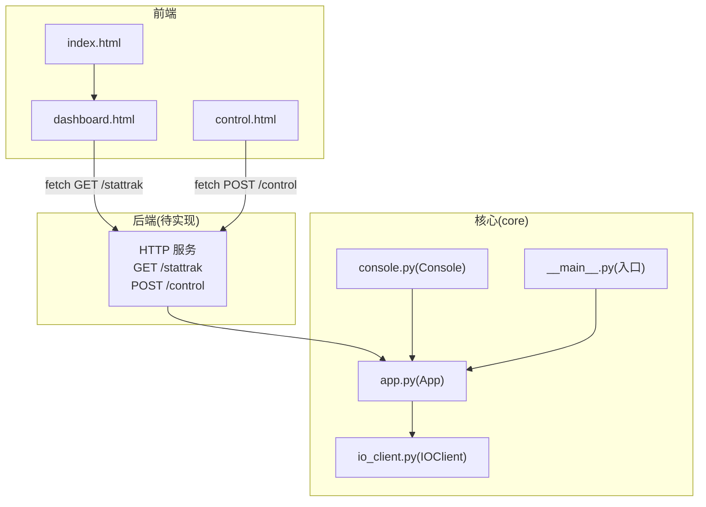
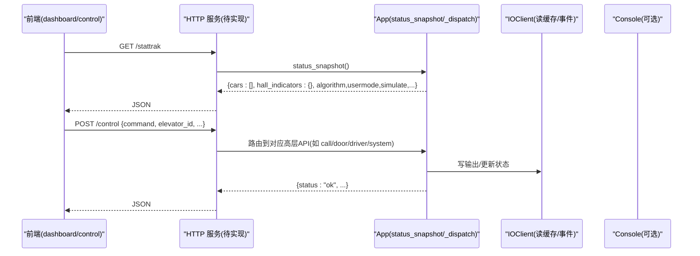
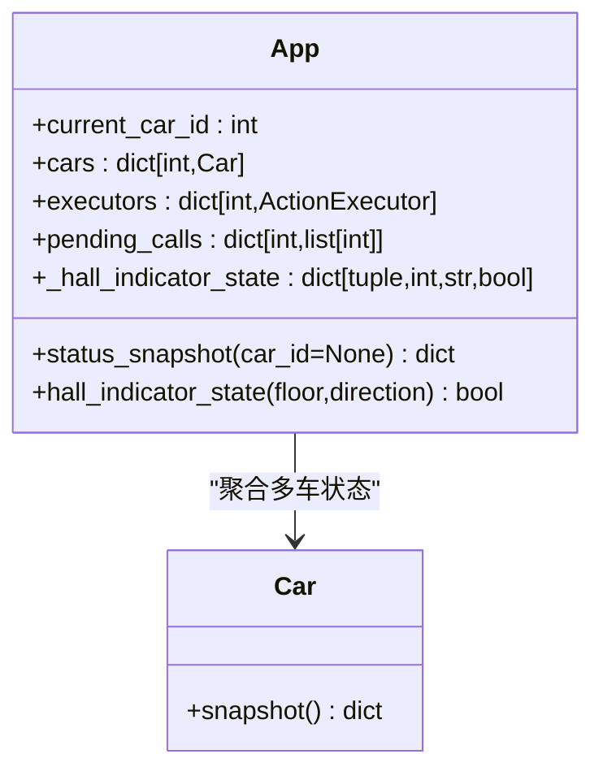
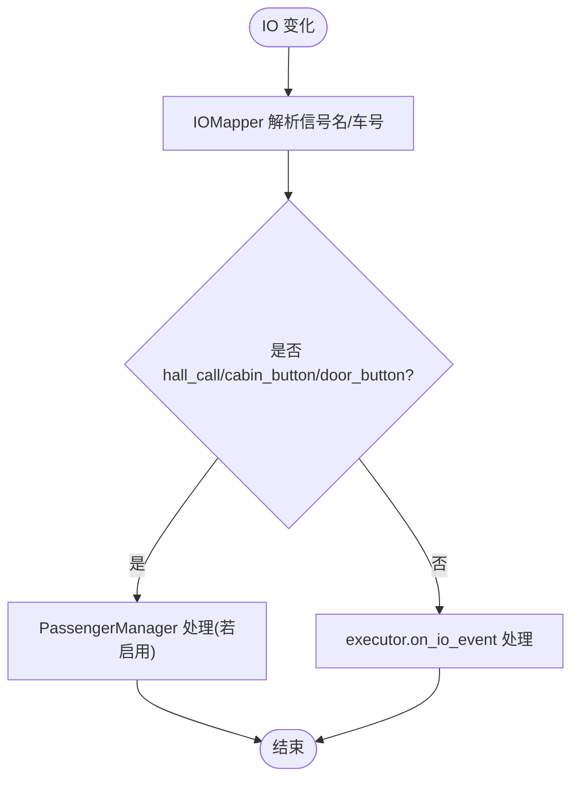
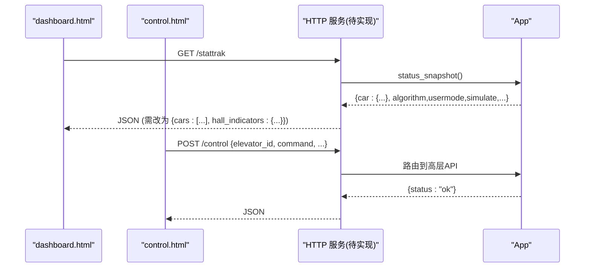
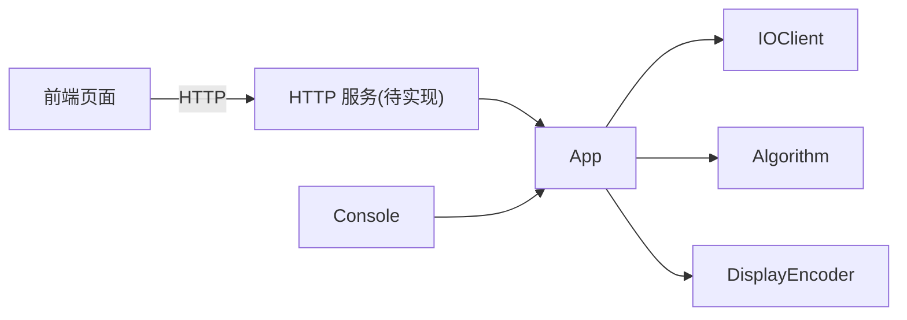

# 重量检测系统

<cite>
**本文引用的文件列表**
- [core/app.py](file://core/app.py)
- [core/console.py](file://core/console.py)
- [core/io_client.py](file://core/io_client.py)
- [core/__main__.py](file://core/__main__.py)
- [example_web/dashboard.html](file://example_web/dashboard.html)
- [example_web/control.html](file://example_web/control.html)
- [example_web/index.html](file://example_web/index.html)
- [requirements.txt](file://requirements.txt)
</cite>

## 目录
1. [简介](#简介)
2. [项目结构](#项目结构)
3. [核心组件](#核心组件)
4. [架构总览](#架构总览)
5. [详细组件分析](#详细组件分析)
6. [依赖关系分析](#依赖关系分析)
7. [性能与扩展性](#性能与扩展性)
8. [故障排查指南](#故障排查指南)
9. [结论](#结论)
10. [附录：接口契约与对齐建议](#附录接口契约与对齐建议)

## 简介
本仓库实现了一套“电梯控制系统”的仿真/实机运行框架，采用三层架构（大脑/小脑/脑干）组织代码。当前仓库已具备完整的 IO 轮询、动作执行、算法调度、UI 编码与多轿厢管理；但尚未内置 HTTP Web 服务，前端 example_web 所期望的 /stattrak 与 /control 两个端点未在后端实现，导致 HMI 无法直接连通后端。

围绕“重量检测系统”的目标，本文聚焦于：
- 重量数据在系统中的采集、缓存与展示路径
- 前端 dashboard/control 页面如何消费状态与控制命令
- 为打通前后端而需要补齐的 HTTP 层设计与数据模型对齐方案

## 项目结构
- core：核心逻辑（App 装配、IO 客户端、动作执行器、算法、控制台等）
- example_web：Win95 风格的前端监控与控制页面（假设后端提供 /stattrak 与 /control）
- config：配置项（主配置、IO 映射、显示配置、UI 配置等）
- tests：单元测试与集成测试
- docs：文档与说明

图表来源
- [core/app.py:1-1745](file://core/app.py#L1-L1745)
- [core/console.py:690-750](file://core/console.py#L690-L750)
- [core/io_client.py:1-32](file://core/io_client.py#L1-L32)
- [core/__main__.py:1-77](file://core/__main__.py#L1-L77)
- [example_web/dashboard.html:589-619](file://example_web/dashboard.html#L589-L619)
- [example_web/control.html:496-518](file://example_web/control.html#L496-L518)
- [example_web/index.html:99-131](file://example_web/index.html#L99-L131)

章节来源
- [core/__main__.py:1-77](file://core/__main__.py#L1-L77)
- [core/app.py:1-1745](file://core/app.py#L1-L1745)
- [example_web/dashboard.html:589-619](file://example_web/dashboard.html#L589-L619)
- [example_web/control.html:496-518](file://example_web/control.html#L496-L518)
- [example_web/index.html:99-131](file://example_web/index.html#L99-L131)

## 核心组件
- App（大脑+协调者）
  - 负责加载配置、装配多轿厢、共享 IOClient/IOMapper/DisplayEncoder/Algorithm
  - 维护全局外召灯状态 _hall_indicator_state
  - 暴露 status_snapshot(car_id=None) 给 Console 使用
- IOClient（脑干）
  - 通过 HTTP/WebSocket 与外部 IO2HTTP 服务交互，维护输入缓存并广播 IOEvent
- Console（大脑 REPL）
  - 解析命令行，调用 App API，打印状态快照
- 前端页面
  - dashboard.html 定时 GET /stattrak 拉取全局状态
  - control.html 发送 POST /control 下发控制命令
  - index.html 简易登录跳转

章节来源
- [core/app.py:61-1745](file://core/app.py#L61-L1745)
- [core/io_client.py:1-32](file://core/io_client.py#L1-L32)
- [core/console.py:690-750](file://core/console.py#L690-L750)
- [example_web/dashboard.html:589-619](file://example_web/dashboard.html#L589-L619)
- [example_web/control.html:496-518](file://example_web/control.html#L496-L518)
- [example_web/index.html:99-131](file://example_web/index.html#L99-L131)

## 架构总览
整体遵循“三层架构”：
- 大脑（决策层）：用户交互 + 算法 + REPL（Console）
- 小脑（物理层）：运动 FSM + UI + 硬件控制（Executor/Door/Motor 等）
- 脑干（IO 层）：WS + HTTP + 映射（IOClient/IOMapper）

当前缺失的是“Web 服务”这一对外通道，导致前端无法访问后端能力。

图表来源
- [core/app.py:1732-1745](file://core/app.py#L1732-L1745)
- [core/console.py:690-750](file://core/console.py#L690-L750)
- [example_web/dashboard.html:589-619](file://example_web/dashboard.html#L589-L619)
- [example_web/control.html:496-518](file://example_web/control.html#L496-L518)

## 详细组件分析

### App 状态快照与全局外召灯
- status_snapshot 目前仅返回“单车快照”，不包含 cars 数组与 hall_indicators，无法满足 dashboard 的全局视图需求。
- 全局外召灯状态保存在 app._hall_indicator_state，需聚合到 /stattrak 响应中。

图表来源
- [core/app.py:204-206](file://core/app.py#L204-L206)
- [core/app.py:1467-1469](file://core/app.py#L1467-L1469)
- [core/app.py:1732-1745](file://core/app.py#L1732-L1745)

章节来源
- [core/app.py:204-206](file://core/app.py#L204-L206)
- [core/app.py:1467-1469](file://core/app.py#L1467-L1469)
- [core/app.py:1732-1745](file://core/app.py#L1732-L1745)

### IO 事件与重量轮询
- IOClient 维护输入缓存并通过 WebSocket 订阅 gpio_change 事件，App 注册监听器将 IO 事件分发到对应 executor。
- 重量读取由 executor 后台轮询器完成，App 提供 _read_car_weight 供 Console 查询。

图表来源
- [core/io_client.py:1-32](file://core/io_client.py#L1-L32)
- [core/app.py:378-390](file://core/app.py#L378-L390)
- [core/app.py:510-582](file://core/app.py#L510-L582)

章节来源
- [core/io_client.py:1-32](file://core/io_client.py#L1-L32)
- [core/app.py:378-390](file://core/app.py#L378-L390)
- [core/app.py:510-582](file://core/app.py#L510-L582)

### 前端与后端对接现状
- dashboard.html 每 N 秒 GET /stattrak，期望返回 data.cars 数组与元信息（algorithm/usermode/simulate/init_direction）。
- control.html 初始化时 GET /stattrak 校验后端在线，随后 POST /control 发送内召、门控、司机模式、急停、模块设置等命令。
- 当前后端无 HTTP 服务，前端回退到本地 mock 数据演示。

图表来源
- [example_web/dashboard.html:589-619](file://example_web/dashboard.html#L589-L619)
- [example_web/control.html:496-518](file://example_web/control.html#L496-L518)
- [core/app.py:1732-1745](file://core/app.py#L1732-L1745)

章节来源
- [example_web/dashboard.html:589-619](file://example_web/dashboard.html#L589-L619)
- [example_web/control.html:496-518](file://example_web/control.html#L496-L518)
- [core/app.py:1732-1745](file://core/app.py#L1732-L1745)

## 依赖关系分析
- 前端依赖 aiohttp 提供的 HTTP 服务（requirements.txt 包含 aiohttp），但当前未启动任何 web 应用。
- App 依赖 IOClient 进行 IO 读写，依赖 Algorithm 做决策，依赖 DisplayEncoder 驱动数码管。
- Console 通过 App 的公开 API 获取状态与下发指令。

图表来源
- [requirements.txt:1-6](file://requirements.txt#L1-L6)
- [core/app.py:79-111](file://core/app.py#L79-L111)
- [core/console.py:690-750](file://core/console.py#L690-L750)

章节来源
- [requirements.txt:1-6](file://requirements.txt#L1-L6)
- [core/app.py:79-111](file://core/app.py#L79-L111)
- [core/console.py:690-750](file://core/console.py#L690-L750)

## 性能与扩展性
- IO 写入采用 per-car 独立 IOClient 实例，避免多车同时刷新导致的冲突；读缓存共享，保证一致性。
- 重量轮询间隔可配置，executor 内部缓存 weight_kg/weight_state，减少频繁 IO 开销。
- 建议后续引入轻量级 HTTP 服务（aiohttp）以最小侵入方式暴露 /stattrak 与 /control，复用现有 App API。

[本节为通用指导，不直接分析具体文件]

## 故障排查指南
- 前端连接失败
  - 现象：dashboard/control 显示“未连接”，日志提示获取失败。
  - 原因：后端未实现 /stattrak 与 /control。
  - 解决：新增 HTTP 服务并挂载路由，确保端口可达。
- 全局视图为空
  - 现象：data.cars 为 undefined，面板渲染失败。
  - 原因：status_snapshot 只返回单车快照。
  - 解决：新增 /stattrak 聚合所有 car.snapshot() 与 hall_indicators。
- 外召灯状态不可见
  - 现象：楼层图上无法显示哪些外召被点亮。
  - 原因：_hall_indicator_state 未随 /stattrak 返回。
  - 解决：在 /stattrak 响应中包含 hall_indicators。

章节来源
- [example_web/dashboard.html:589-619](file://example_web/dashboard.html#L589-L619)
- [example_web/control.html:496-518](file://example_web/control.html#L496-L518)
- [core/app.py:1732-1745](file://core/app.py#L1732-L1745)

## 结论
- 当前系统已具备完整的大脑/小脑/脑干能力，但缺少对外 HTTP 服务，导致前端无法工作。
- 为实现“重量检测系统”的前端可视化与控制，需在 App 之上增加 aiohttp 服务，并将 status_snapshot 升级为全局快照，同时暴露 /control 路由以支持前端控制命令。
- 数据模型需对齐前端预期：/stattrak 返回 cars 数组与 hall_indicators；/control 接受前端 payload 并映射到 App 高层 API。

[本节为总结，不直接分析具体文件]

## 附录：接口契约与对齐建议

### /stattrak（GET）
- 目的：提供全局状态快照，供 dashboard/control 使用
- 建议返回字段
  - cars: list[car_snapshot]
  - hall_indicators: dict[(floor, direction), bool]
  - algorithm: string
  - usermode: boolean
  - simulate: boolean
  - init_direction: string
- 数据来源
  - cars: 遍历 app.cars.items() 聚合每个 Car.snapshot()
  - hall_indicators: 读取 app._hall_indicator_state
  - 其他元信息来自 App 自身属性

章节来源
- [core/app.py:1732-1745](file://core/app.py#L1732-L1745)
- [core/app.py:204-206](file://core/app.py#L204-L206)
- [core/app.py:1467-1469](file://core/app.py#L1467-L1469)

### /control（POST）
- 目的：接收前端控制命令，映射到 App 高层 API
- 典型命令示例（payload 字段）
  - 内召: {elevator_id, command:"car_call", floor}
  - 门控: {elevator_id, command:"door", action:"open|close"}
  - 司机模式: {elevator_id, command:"car", action:"driver", value:true|false}
  - 急停: {elevator_id, command:"car", action:"stop"}
  - 系统级: {command:"system", action:"escape", value:true}
  - 模块设置: {command:"module", action:"usermode|station_seek|queue", value/mode:...}
  - 参数设置: {command:"settings", key:"slow_brake", value:0..7}
- 行为
  - 路由到 App 对应方法（如 call_internal、async_stop、driver_mode 设置等）
  - 返回统一 JSON 格式 {status:"ok"|error, ...}

章节来源
- [example_web/control.html:618-720](file://example_web/control.html#L618-L720)
- [core/console.py:754-889](file://core/console.py#L754-L889)

### 重量相关数据流
- 采集：executor 后台轮询器读取 ADC/字寄存器，换算为 weight_kg，更新 Car.weight_state
- 展示：dashboard 根据 Car.weight_kg/max_weight/weight_state 渲染载重条
- 控制：关门前检查 weight_state，超重或临界时拒绝关门或触发提示

章节来源
- [core/app.py:207-224](file://core/app.py#L207-L224)
- [core/app.py:393-403](file://core/app.py#L393-L403)
- [example_web/dashboard.html:677-706](file://example_web/dashboard.html#L677-L706)