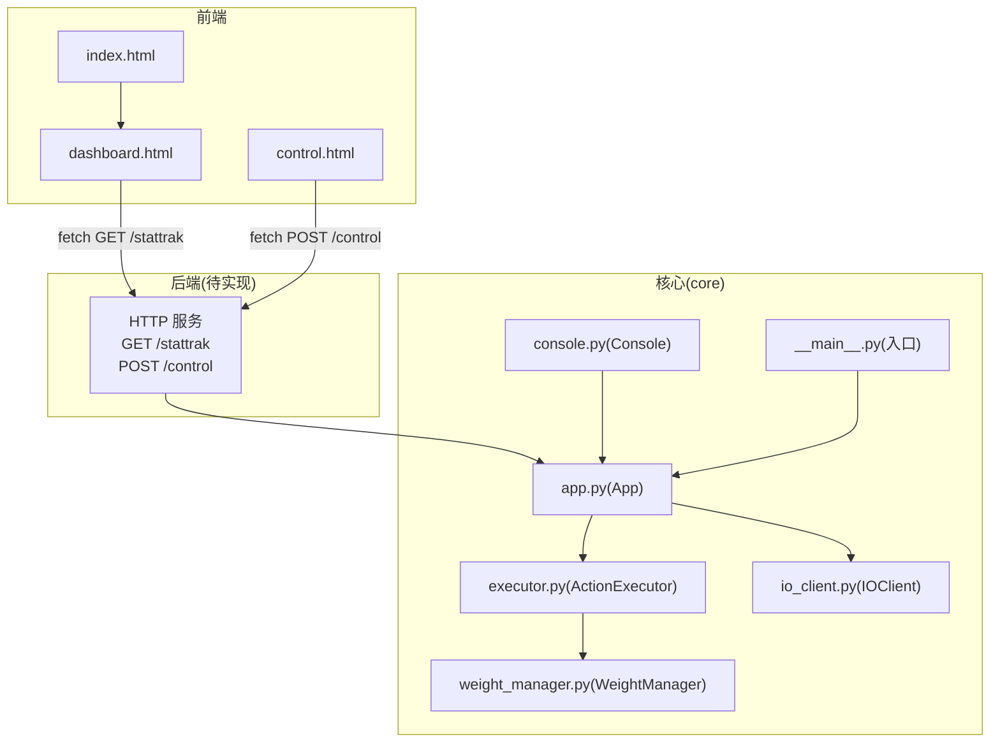
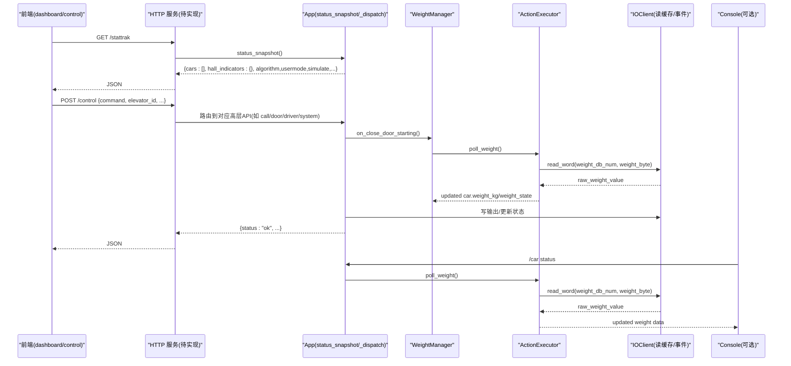
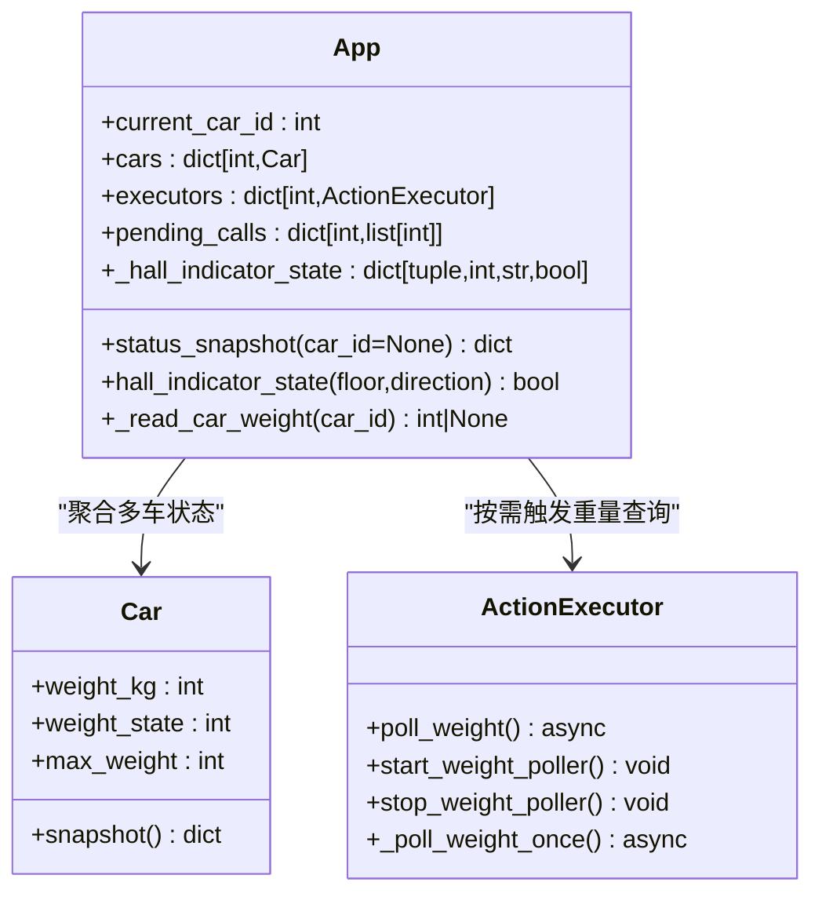
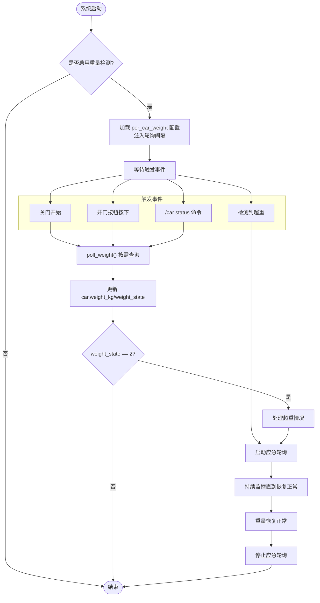
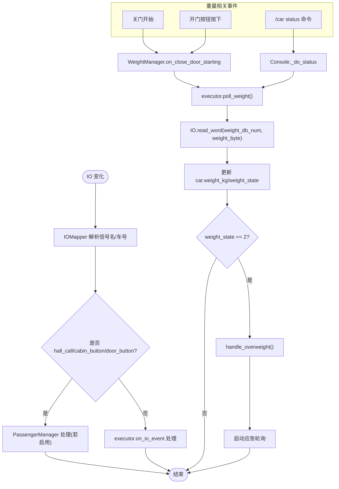
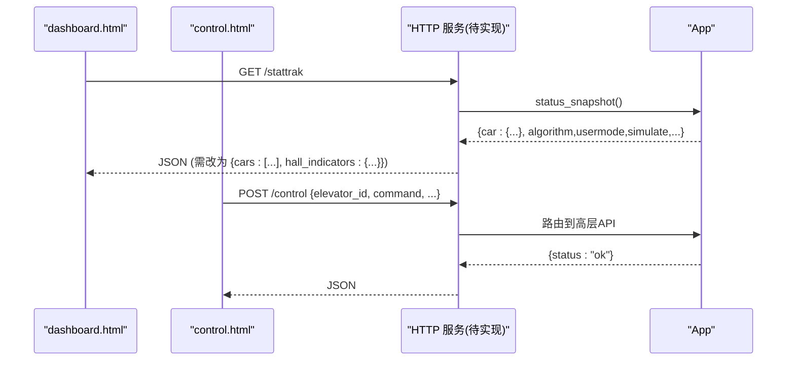
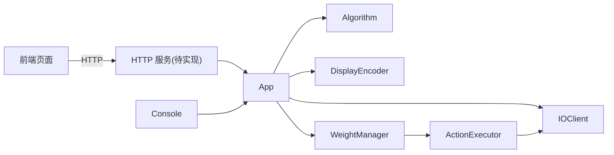

# 重量检测系统

<cite>
**本文引用的文件列表**
- [core/app.py](file://core/app.py)
- [core/console.py](file://core/console.py)
- [core/io_client.py](file://core/io_client.py)
- [core/executor.py](file://core/executor.py)
- [core/weight_manager.py](file://core/weight_manager.py)
- [config/config.yaml](file://config/config.yaml)
- [core/__main__.py](file://core/__main__.py)
- [example_web/dashboard.html](file://example_web/dashboard.html)
- [example_web/control.html](file://example_web/control.html)
- [example_web/index.html](file://example_web/index.html)
- [requirements.txt](file://requirements.txt)
</cite>

## 更新摘要
**所做更改**
- 实现了按需轮询机制的重大重构，从连续后台轮询改为关键时机触发（关门开始/完成时）
- 增强了紧急超载响应和轮询器生命周期管理
- 调整了重量监控间隔以提高过载检测响应性
- 优化了系统性能，减少不必要的I/O操作和CPU占用

## 目录
1. [简介](#简介)
2. [项目结构](#项目结构)
3. [核心组件](#核心组件)
4. [架构总览](#架构总览)
5. [详细组件分析](#详细组件分析)
6. [依赖关系分析](#依赖关系分析)
7. [性能与扩展性](#性能与扩展性)
8. [故障排查指南](#故障排查指南)
9. [结论](#结论)
10. [附录：接口契约与对齐建议](#附录接口契约与对齐建议)

## 简介
本仓库实现了一套"电梯控制系统"的仿真/实机运行框架，采用三层架构（大脑/小脑/脑干）组织代码。当前仓库已具备完整的 IO 轮询、动作执行、算法调度、UI 编码与多轿厢管理；但尚未内置 HTTP Web 服务，前端 example_web 所期望的 /stattrak 与 /control 两个端点未在后端实现，导致 HMI 无法直接连通后端。

围绕"重量检测系统"的目标，本文聚焦于：
- 重量数据在系统中的采集、缓存与展示路径
- 前端 dashboard/control 页面如何消费状态与控制命令
- 为打通前后端而需要补齐的 HTTP 层设计与数据模型对齐方案

**重大更新** 重量检测系统已从连续后台轮询重构为按需轮询机制，显著提升了系统性能和资源利用率。新架构仅在关键操作时触发重量查询，包括关门开始/完成时、控制台状态查询时以及超重应急监控场景。

## 项目结构
- core：核心逻辑（App 装配、IO 客户端、动作执行器、算法、控制台等）
- example_web：Win95 风格的前端监控与控制页面（假设后端提供 /stattrak 与 /control）
- config：配置项（主配置、IO 映射、显示配置、UI 配置等）
- tests：单元测试与集成测试
- docs：文档与说明



**图表来源**
- [core/app.py:1-1832](file://core/app.py#L1-L1832)
- [core/console.py:687-750](file://core/console.py#L687-L750)
- [core/executor.py:1424-1511](file://core/executor.py#L1424-L1511)
- [core/weight_manager.py:1-106](file://core/weight_manager.py#L1-L106)
- [core/io_client.py:1-32](file://core/io_client.py#L1-L32)
- [core/__main__.py:1-77](file://core/__main__.py#L1-L77)
- [example_web/dashboard.html:589-619](file://example_web/dashboard.html#L589-L619)
- [example_web/control.html:496-518](file://example_web/control.html#L496-L518)
- [example_web/index.html:99-131](file://example_web/index.html#L99-L131)

**章节来源**
- [core/__main__.py:1-77](file://core/__main__.py#L1-L77)
- [core/app.py:1-1832](file://core/app.py#L1-L1832)
- [example_web/dashboard.html:589-619](file://example_web/dashboard.html#L589-L619)
- [example_web/control.html:496-518](file://example_web/control.html#L496-L518)
- [example_web/index.html:99-131](file://example_web/index.html#L99-L131)

## 核心组件
- App（大脑+协调者）
  - 负责加载配置、装配多轿厢、共享 IOClient/IOMapper/DisplayEncoder/Algorithm
  - 维护全局外召灯状态 _hall_indicator_state
  - 暴露 status_snapshot(car_id=None) 给 Console 使用
  - **重大更新** 重量轮询策略调整为按需触发，不再启动后台轮询任务，仅注入轮询间隔配置
- IOClient（脑干）
  - 通过 HTTP/WebSocket 与外部 IO2HTTP 服务交互，维护输入缓存并广播 IOEvent
- Console（大脑 REPL）
  - 解析命令行，调用 App API，打印状态快照
  - **更新** `/car status` 命令现在会触发按需重量查询，确保显示最新数据
- WeightManager（小脑模块）
  - **新增** 专门处理重量三态机的副作用动作
  - 在关门开始时和完成时触发重量检查
  - 管理紧急超载响应和轮询器生命周期
- 前端页面
  - dashboard.html 定时 GET /stattrak 拉取全局状态
  - control.html 发送 POST /control 下发控制命令
  - index.html 简易登录跳转

**章节来源**
- [core/app.py:210-229](file://core/app.py#L210-L229)
- [core/weight_manager.py:1-106](file://core/weight_manager.py#L1-L106)
- [core/io_client.py:1-32](file://core/io_client.py#L1-L32)
- [core/console.py:687-750](file://core/console.py#L687-L750)
- [example_web/dashboard.html:589-619](file://example_web/dashboard.html#L589-L619)
- [example_web/control.html:496-518](file://example_web/control.html#L496-L518)
- [example_web/index.html:99-131](file://example_web/index.html#L99-L131)

## 架构总览
整体遵循"三层架构"：
- 大脑（决策层）：用户交互 + 算法 + REPL（Console）
- 小脑（物理层）：运动 FSM + UI + 硬件控制（Executor/Door/Motor 等）
- 脑干（IO 层）：WS + HTTP + 映射（IOClient/IOMapper）

**重大更新** 重量检测架构已重构为按需轮询模式，减少了不必要的I/O操作，提高了系统响应性和稳定性。



**图表来源**
- [core/app.py:1732-1745](file://core/app.py#L1732-L1745)
- [core/weight_manager.py:29-50](file://core/weight_manager.py#L29-L50)
- [core/executor.py:1452-1511](file://core/executor.py#L1452-L1511)
- [core/console.py:687-694](file://core/console.py#L687-L694)
- [core/io_client.py:1-32](file://core/io_client.py#L1-L32)

## 详细组件分析

### App 状态快照与全局外召灯
- status_snapshot 目前仅返回"单车快照"，不包含 cars 数组与 hall_indicators，无法满足 dashboard 的全局视图需求。
- 全局外召灯状态保存在 app._hall_indicator_state，需聚合到 /stattrak 响应中。
- **重大更新** 重量轮询器启动代码已被注释，改为按需轮询模式，仅注入轮询间隔配置。



**图表来源**
- [core/app.py:204-206](file://core/app.py#L204-L206)
- [core/app.py:1467-1469](file://core/app.py#L1467-L1469)
- [core/app.py:1732-1745](file://core/app.py#L1732-L1745)
- [core/app.py:431-440](file://core/app.py#L431-L440)
- [core/executor.py:1452-1511](file://core/executor.py#L1452-L1511)

**章节来源**
- [core/app.py:204-206](file://core/app.py#L204-L206)
- [core/app.py:1467-1469](file://core/app.py#L1467-L1469)
- [core/app.py:1732-1745](file://core/app.py#L1732-L1745)
- [core/app.py:431-440](file://core/app.py#L431-L440)

### 重量轮询机制重大重构

**重大更新** 重量检测系统已从连续后台轮询重构为按需轮询机制，显著提升了系统性能。

#### 旧架构：连续后台轮询
- 系统在启动时为每部电梯创建独立的重量轮询任务
- 每个任务以固定间隔持续读取PLC重量数据
- 大量并发I/O操作导致系统负载增加

#### 新架构：按需轮询
- 启动时不再自动启动重量轮询任务
- 仅在关键操作时触发重量查询：
  - 关门开始时（on_close_door_starting）
  - 关门完成时（on_close_door_completed）
  - `/car status` 命令执行时
  - 超重状态应急监控时



**图表来源**
- [core/app.py:340-343](file://core/app.py#L340-L343)
- [core/weight_manager.py:29-50](file://core/weight_manager.py#L29-L50)
- [core/console.py:687-694](file://core/console.py#L687-L694)
- [core/executor.py:1426-1454](file://core/executor.py#L1426-L1454)

#### 重量查询触发点

**关门流程中的重量检查：**
1. `on_close_door_starting`：关门开始前立即查询重量，如果超重则跳过关门
2. `on_close_door_completed`：关门完成后再次检查，防止关门期间重量飙升

**控制台命令中的重量查询：**
- `/car <id> status`：执行时触发一次重量查询，确保显示最新数据

**超重应急监控：**
- 当检测到超重状态（state=2）时，启动临时应急轮询
- 持续监控直到重量恢复到正常范围

**章节来源**
- [core/weight_manager.py:29-50](file://core/weight_manager.py#L29-L50)
- [core/console.py:687-694](file://core/console.py#L687-L694)
- [core/executor.py:1426-1454](file://core/executor.py#L1426-L1454)

### IO 事件与重量轮询
- IOClient 维护输入缓存并通过 WebSocket 订阅 gpio_change 事件，App 注册监听器将 IO 事件分发到对应 executor。
- **重大更新** 重量读取由 weight_manager 在关键时机按需触发，而非后台持续轮询。



**图表来源**
- [core/io_client.py:1-32](file://core/io_client.py#L1-L32)
- [core/app.py:378-390](file://core/app.py#L378-390)
- [core/app.py:510-582](file://core/app.py#L510-L582)
- [core/weight_manager.py:29-50](file://core/weight_manager.py#L29-L50)
- [core/console.py:687-694](file://core/console.py#L687-L694)

**章节来源**
- [core/io_client.py:1-32](file://core/io_client.py#L1-L32)
- [core/app.py:378-390](file://core/app.py#L378-390)
- [core/app.py:510-582](file://core/app.py#L510-L582)
- [core/weight_manager.py:29-50](file://core/weight_manager.py#L29-L50)
- [core/console.py:687-694](file://core/console.py#L687-L694)

### 前端与后端对接现状
- dashboard.html 每 N 秒 GET /stattrak，期望返回 data.cars 数组与元信息（algorithm/usermode/simulate/init_direction）。
- control.html 初始化时 GET /stattrak 校验后端在线，随后 POST /control 发送内召、门控、司机模式、急停、模块设置等命令。
- 当前后端无 HTTP 服务，前端回退到本地 mock 数据演示。



**图表来源**
- [example_web/dashboard.html:589-619](file://example_web/dashboard.html#L589-L619)
- [example_web/control.html:496-518](file://example_web/control.html#L496-L518)
- [core/app.py:1732-1745](file://core/app.py#L1732-L1745)

**章节来源**
- [example_web/dashboard.html:589-619](file://example_web/dashboard.html#L589-L619)
- [example_web/control.html:496-518](file://example_web/control.html#L496-L518)
- [core/app.py:1732-1745](file://core/app.py#L1732-L1745)

## 依赖关系分析
- 前端依赖 aiohttp 提供的 HTTP 服务（requirements.txt 包含 aiohttp），但当前未启动任何 web 应用。
- App 依赖 IOClient 进行 IO 读写，依赖 Algorithm 做决策，依赖 DisplayEncoder 驱动数码管。
- Console 通过 App 的公开 API 获取状态与下发指令。
- **重大更新** WeightManager 作为独立模块，专门处理重量相关的业务逻辑，实现了轮询器生命周期管理。



**图表来源**
- [requirements.txt:1-6](file://requirements.txt#L1-L6)
- [core/app.py:79-111](file://core/app.py#L79-L111)
- [core/console.py:690-750](file://core/console.py#L690-L750)
- [core/weight_manager.py:1-106](file://core/weight_manager.py#L1-L106)

**章节来源**
- [requirements.txt:1-6](file://requirements.txt#L1-L6)
- [core/app.py:79-111](file://core/app.py#L79-L111)
- [core/console.py:690-750](file://core/console.py#L690-L750)
- [core/weight_manager.py:1-106](file://core/weight_manager.py#L1-L106)

## 性能与扩展性

**重大更新** 重量检测系统的重构带来了显著的性能提升：

### 性能优化成果
- **减少I/O操作**：从每500ms一次的持续轮询改为按需触发，大幅降低PLC通信频率
- **降低CPU占用**：消除了多个后台轮询任务的上下文切换开销
- **提高系统稳定性**：避免了并发I/O操作可能导致的资源竞争问题
- **增强响应性**：调整了重量监控间隔，提高了过载检测的响应速度

### 按需轮询策略
- **智能触发时机**：仅在关门、状态查询、超重检测等关键场景触发重量读取
- **应急监控机制**：超重状态下自动启动临时轮询，确保安全
- **配置灵活化**：支持每部电梯独立的重量参数配置和轮询间隔设置

### 扩展性设计
- **模块化架构**：WeightManager 作为独立模块，便于功能扩展
- **回调机制**：通过事件回调实现重量状态变化的响应
- **WebSocket集成**：支持实时重量数据推送至前端

[本节为通用指导，不直接分析具体文件]

## 故障排查指南

**重大更新** 针对新的按需轮询机制，新增了相关故障排查指南：

### 重量数据不准确
- **现象**：`/car status` 显示的重量数据不是最新的
- **原因**：系统采用按需轮询，非实时更新
- **解决**：执行 `/car <id> status` 命令触发一次重量查询

### 重量轮询器未启动
- **现象**：重量检测功能完全失效
- **原因**：`per_car_weight` 配置缺失或格式错误
- **解决**：检查 `config.yaml` 中的 `per_car_weight` 配置段

### 超重检测不响应
- **现象**：超重时电梯不自动开门
- **原因**：重量阈值配置错误或ADC换算参数不正确
- **解决**：验证 `max_weight`、`threshold`、`adc_full_scale_kg` 配置值

### 前端重量显示异常
- **现象**：dashboard 页面重量条不更新
- **原因**：WebSocket连接断开或重量事件未广播
- **解决**：检查Web服务状态和WebSocket连接

### 轮询器生命周期问题
- **现象**：超重后无法正常恢复
- **原因**：应急轮询器未正确停止
- **解决**：检查 `on_normalized` 回调是否正确调用 `stop_weight_poller()`

### 常规故障排查
- 前端连接失败
  - 现象：dashboard/control 显示"未连接"，日志提示获取失败。
  - 原因：后端未实现 /stattrak 与 /control。
  - 解决：新增 HTTP 服务并挂载路由，确保端口可达。
- 全局视图为空
  - 现象：data.cars 为 undefined，面板渲染失败。
  - 原因：status_snapshot 只返回单车快照。
  - 解决：新增 /stattrak 聚合所有 car.snapshot() 与 hall_indicators。
- 外召灯状态不可见
  - 现象：楼层图上无法显示哪些外召被点亮。
  - 原因：_hall_indicator_state 未随 /stattrak 返回。
  - 解决：在 /stattrak 响应中包含 hall_indicators。

**章节来源**
- [example_web/dashboard.html:589-619](file://example_web/dashboard.html#L589-L619)
- [example_web/control.html:496-518](file://example_web/control.html#L496-L518)
- [core/app.py:1732-1745](file://core/app.py#L1732-L1745)
- [config/config.yaml:70-82](file://config/config.yaml#L70-L82)

## 结论
- 当前系统已具备完整的大脑/小脑/脑干能力，但缺少对外 HTTP 服务，导致前端无法工作。
- **重大改进** 重量检测系统已成功重构为按需轮询机制，显著提升了系统性能和资源利用率。
- 为实现"重量检测系统"的前端可视化与控制，需在 App 之上增加 aiohttp 服务，并将 status_snapshot 升级为全局快照，同时暴露 /control 路由以支持前端控制命令。
- 数据模型需对齐前端预期：/stattrak 返回 cars 数组与 hall_indicators；/control 接受前端 payload 并映射到 App 高层 API。

**重大更新** 按需轮询机制的成功实施为后续的功能扩展奠定了坚实基础，系统整体稳定性和性能得到显著提升。新架构通过智能触发时机和应急监控机制，在保证安全性的同时大幅降低了系统负载。

[本节为总结，不直接分析具体文件]

## 附录：接口契约与对齐建议

### /stattrak（GET）
- 目的：提供全局状态快照，供 dashboard/control 使用
- 建议返回字段
  - cars: list[car_snapshot]
  - hall_indicators: dict[(floor, direction), bool]
  - algorithm: string
  - usermode: boolean
  - simulate: boolean
  - init_direction: string
- 数据来源
  - cars: 遍历 app.cars.items() 聚合每个 Car.snapshot()
  - hall_indicators: 读取 app._hall_indicator_state
  - 其他元信息来自 App 自身属性

**章节来源**
- [core/app.py:1732-1745](file://core/app.py#L1732-L1745)
- [core/app.py:204-206](file://core/app.py#L204-L206)
- [core/app.py:1467-1469](file://core/app.py#L1467-L1469)

### /control（POST）
- 目的：接收前端控制命令，映射到 App 高层 API
- 典型命令示例（payload 字段）
  - 内召: {elevator_id, command:"car_call", floor}
  - 门控: {elevator_id, command:"door", action:"open|close"}
  - 司机模式: {elevator_id, command:"car", action:"driver", value:true|false}
  - 急停: {elevator_id, command:"car", action:"stop"}
  - 系统级: {command:"system", action:"escape", value:true}
  - 模块设置: {command:"module", action:"usermode|station_seek|queue", value/mode:...}
  - 参数设置: {command:"settings", key:"slow_brake", value:0..7}
- 行为
  - 路由到 App 对应方法（如 call_internal、async_stop、driver_mode 设置等）
  - 返回统一 JSON 格式 {status:"ok"|error, ...}

**章节来源**
- [example_web/control.html:618-720](file://example_web/control.html#L618-L720)
- [core/console.py:754-889](file://core/console.py#L754-L889)

### 重量相关数据流

**重大更新** 重量检测系统的数据流已重构为按需模式：

#### 数据采集
- **按需触发**：仅在关门、状态查询、超重检测时读取PLC重量数据
- **ADC换算**：Siemens 0-27648 → kg 的模拟量转换
- **状态计算**：基于 max_weight 和 threshold 的三态机逻辑

#### 展示更新
- dashboard 根据 Car.weight_kg/max_weight/weight_state 渲染载重条
- WebSocket实时推送重量变化事件到前端
- `/car status` 命令显示最新重量数据

#### 控制逻辑
- 关门前检查 weight_state，超重或临界时拒绝关门或触发提示
- 超重状态自动开门并亮满载灯
- 重量恢复正常后自动重新关门

#### 轮询器生命周期管理
- **启动时机**：仅在超重状态时启动应急轮询
- **停止时机**：重量恢复正常后自动停止轮询
- **间隔配置**：通过配置文件动态调整轮询间隔

**章节来源**
- [core/app.py:207-224](file://core/app.py#L207-L224)
- [core/app.py:393-403](file://core/app.py#L393-403)
- [core/executor.py:1452-1511](file://core/executor.py#L1452-L1511)
- [core/weight_manager.py:62-106](file://core/weight_manager.py#L62-L106)
- [example_web/dashboard.html:677-706](file://example_web/dashboard.html#L677-706)

### 每车重量配置

**重大更新** 系统支持灵活的每车重量配置和轮询间隔设置：

#### 配置结构
```yaml
per_car_weight:
  '1': { max_weight: 900, threshold: 0.95, adc_full_scale_kg: 2000 }
  '2': { max_weight: 900, threshold: 0.95, adc_full_scale_kg: 2000 }
  # ... 其他车辆配置
weight_poll_interval_ms: 1000  # 超重应急轮询间隔（毫秒）
```

#### 配置参数说明
- `max_weight`: 最大载重（kg）
- `threshold`: 临界百分比（0.95 = 95%）
- `adc_full_scale_kg`: ADC满量程对应的公斤数
- `weight_poll_interval_ms`: 超重应急轮询间隔，默认1000ms

#### 状态定义
- state=0: 正常（weight < max * threshold）
- state=1: 临界（max * threshold ≤ weight ≤ max）
- state=2: 超重（weight > max）

#### 轮询间隔配置
- **正常模式**：按需触发，无后台轮询
- **应急模式**：超重时启动，按配置的间隔持续监控
- **动态调整**：可通过配置文件修改轮询间隔以适应不同场景

**章节来源**
- [config/config.yaml:70-82](file://config/config.yaml#L70-L82)
- [core/app.py:141-149](file://core/app.py#L141-L149)
- [core/executor.py:1426-1454](file://core/executor.py#L1426-L1454)
- [core/weight_manager.py:91-106](file://core/weight_manager.py#L91-L106)