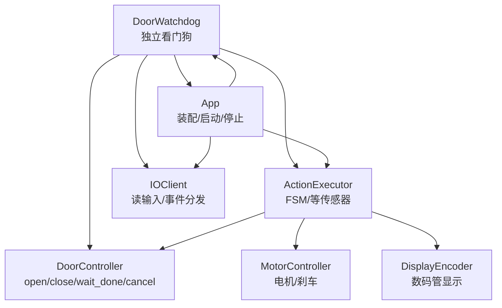
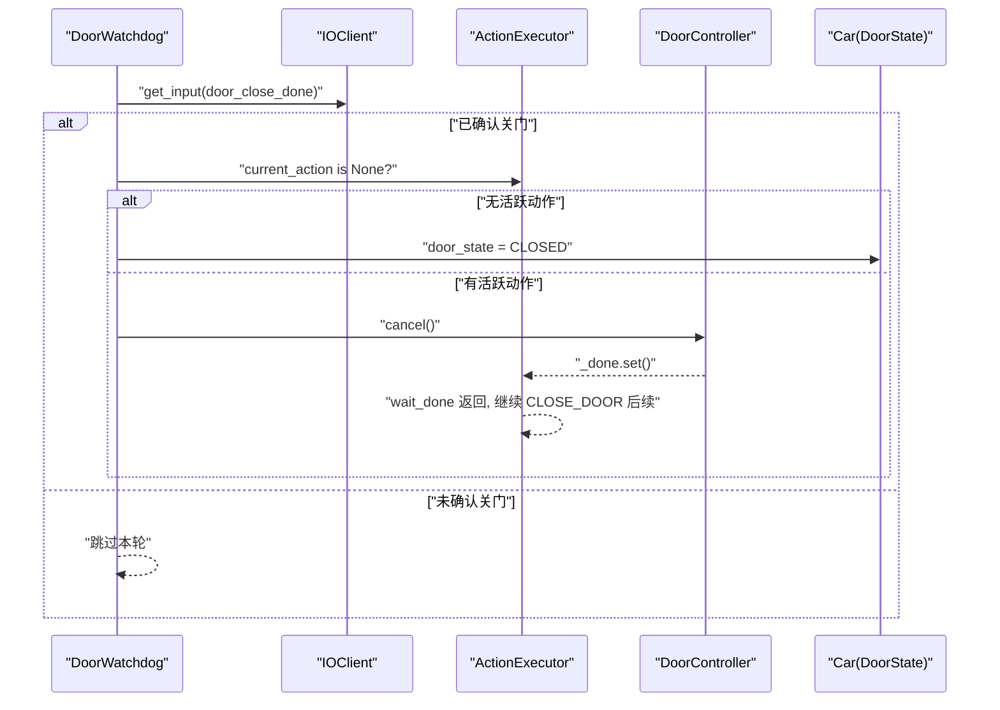
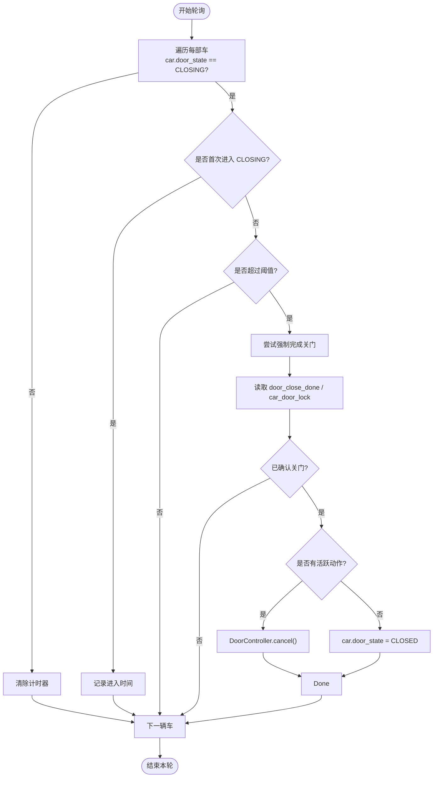
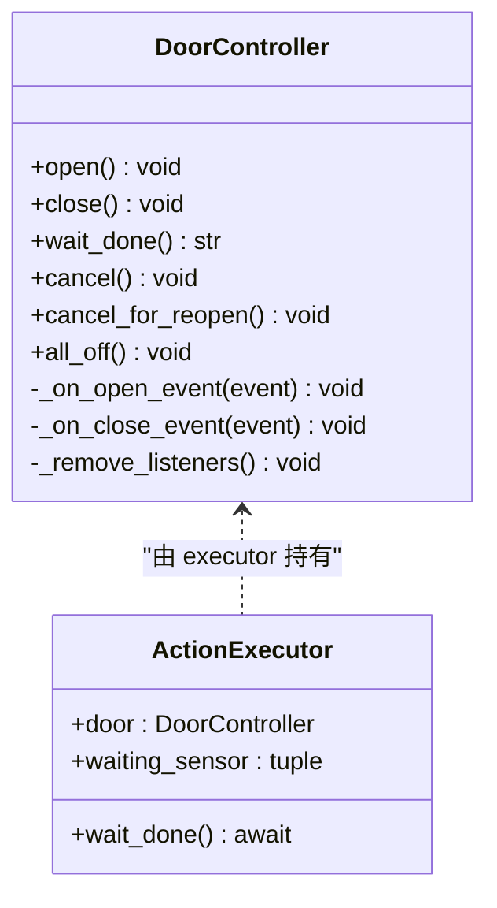
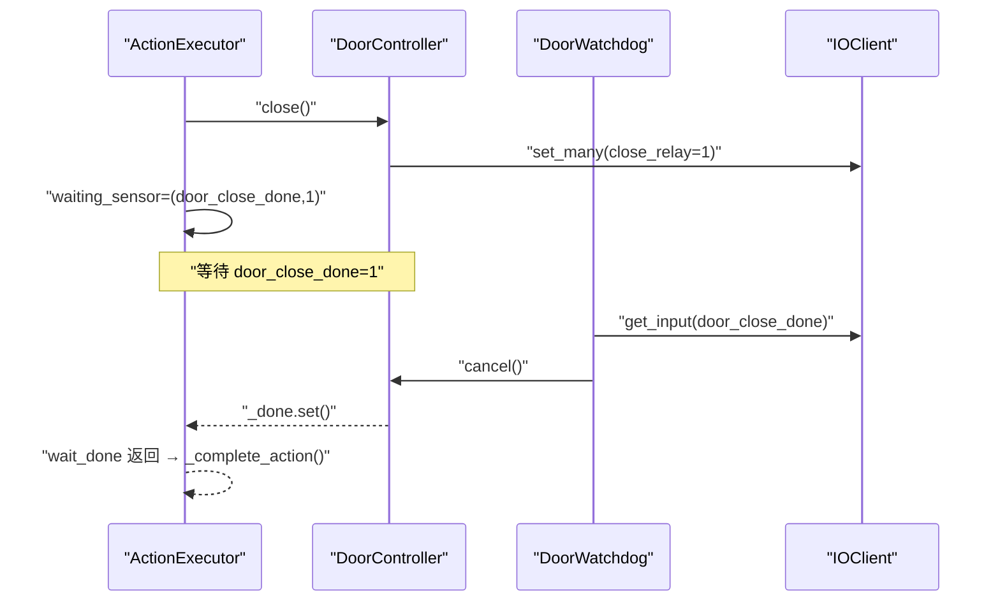
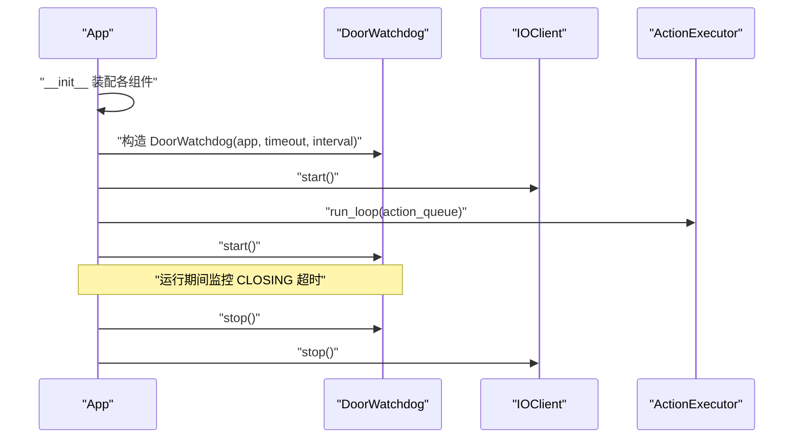
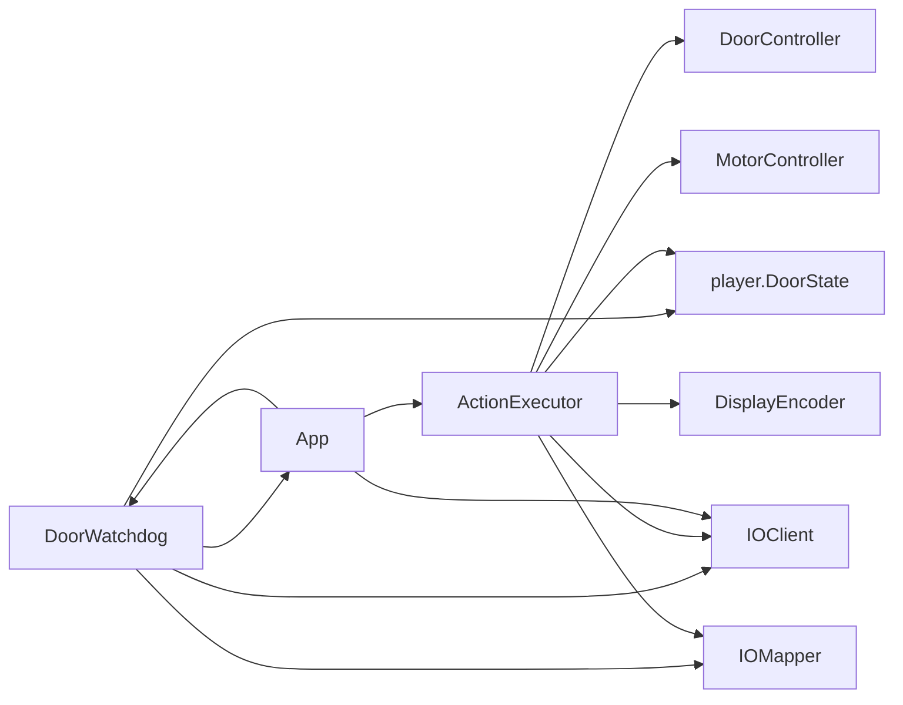

# 门看门狗系统

<cite>
**本文引用的文件**   
- [core/watchdog.py](file://core/watchdog.py)
- [core/app.py](file://core/app.py)
- [core/controllers.py](file://core/controllers.py)
- [core/executor.py](file://core/executor.py)
- [core/io_client.py](file://core/io_client.py)
- [core/player.py](file://core/player.py)
- [core/actions.py](file://core/actions.py)
- [core/algorithm.py](file://core/algorithm.py)
- [core/cron.py](file://core/cron.py)
- [tests/test_door.py](file://tests/test_door.py)
</cite>

## 目录
1. [引言](#引言)
2. [项目结构](#项目结构)
3. [核心组件](#核心组件)
4. [架构总览](#架构总览)
5. [详细组件分析](#详细组件分析)
6. [依赖关系分析](#依赖关系分析)
7. [性能与可靠性考量](#性能与可靠性考量)
8. [故障排查指南](#故障排查指南)
9. [结论](#结论)
10. [附录](#附录)

## 引言
本文件聚焦“门看门狗系统”，即独立于主执行器（executor）的关门卡死检测与自愈机制。其目标是：当电梯处于 CLOSING 状态超过阈值时，检查硬件确认信号（door_close_done 或 car_door_lock），若已关则强制完成关门流程，解除 executor 的 wait_done 阻塞，避免长时间卡死影响调度与乘客体验。

该子系统遵循“脑干/小脑/大脑”三层分离原则：
- 不修改 Car 属性、不参与调度、不推 Action；
- 仅通过 IO 层读取输入并调用 DoorController.cancel() 触发自然完成；
- 在极端残留状态下直接修正 door_state，保证状态一致性。

## 项目结构
围绕门看门狗的关键代码分布在以下模块：
- 看门狗实现：core/watchdog.py
- 装配与生命周期：core/app.py
- 控制器（电机/门）：core/controllers.py
- 执行器（FSM + 等待传感器）：core/executor.py
- IO 抽象（WS/HTTP、事件分发、写合并）：core/io_client.py
- 玩家实体（Car 状态机）：core/player.py
- 动作定义与队列：core/actions.py
- 算法决策（大脑）：core/algorithm.py
- 定时任务（cron）：core/cron.py
- 相关测试用例：tests/test_door.py

图表来源
- [core/watchdog.py:24-110](file://core/watchdog.py#L24-L110)
- [core/app.py:256-262](file://core/app.py#L256-L262)
- [core/executor.py:29-100](file://core/executor.py#L29-L100)
- [core/controllers.py:179-280](file://core/controllers.py#L179-L280)
- [core/io_client.py:35-126](file://core/io_client.py#L35-L126)

章节来源
- [core/watchdog.py:1-110](file://core/watchdog.py#L1-L110)
- [core/app.py:256-262](file://core/app.py#L256-L262)

## 核心组件
- DoorWatchdog：独立后台任务，固定间隔轮询每部车的门状态，CLOSING 超时后尝试强制完成关门。
- DoorController：管理开门/关门继电器与传感器监听，提供 cancel()/cancel_for_reopen() 以中断当前门动作。
- ActionExecutor：硬件层 FSM，维护 waiting_sensor 与 wait_done Event，被 DoorWatchdog 通过 cancel() 唤醒。
- App：装配 DoorWatchdog，注入 mapper/io，并在 start/stop 中启停看门狗。
- IOClient：提供 get_input() 读取输入缓存，供看门狗判断 door_close_done/car_door_lock。

章节来源
- [core/watchdog.py:24-110](file://core/watchdog.py#L24-L110)
- [core/controllers.py:179-280](file://core/controllers.py#L179-L280)
- [core/executor.py:29-100](file://core/executor.py#L29-L100)
- [core/app.py:256-262](file://core/app.py#L256-L262)
- [core/io_client.py:217-228](file://core/io_client.py#L217-L228)

## 架构总览
门看门狗系统与现有系统的交互如下：
- 看门狗只读 IO 输入，不写输出；
- 通过 DoorController.cancel() 设置 _done event，让 executor 自然推进 CLOSE_DOOR 后续逻辑；
- 若无活跃动作但 door_state 仍为 CLOSING，则直接修正为 CLOSED，恢复状态一致。

图表来源
- [core/watchdog.py:74-104](file://core/watchdog.py#L74-L104)
- [core/controllers.py:258-272](file://core/controllers.py#L258-L272)
- [core/executor.py:227-296](file://core/executor.py#L227-L296)
- [core/player.py:26-32](file://core/player.py#L26-L32)

## 详细组件分析

### 看门狗：DoorWatchdog
职责
- 独立后台任务，按 interval 轮询所有轿厢；
- 记录进入 CLOSING 的时间戳，超过 timeout 后尝试强制完成关门；
- 优先检查 door_close_done，其次回退到 car_door_lock；
- 若有活跃动作，调用 DoorController.cancel()；否则直接修正 door_state。

关键设计点
- 不修改 Car 其他属性，不推 Action，不改变调度；
- 异常捕获确保自身崩溃不影响主循环；
- 日志写入 app._log_file，便于诊断。

图表来源
- [core/watchdog.py:49-104](file://core/watchdog.py#L49-L104)

章节来源
- [core/watchdog.py:24-110](file://core/watchdog.py#L24-L110)

### 控制器：DoorController
职责
- open()/close() 拉对应继电器，注册 IO 监听；
- wait_done() 等待完成事件；
- cancel()/cancel_for_reopen() 用于紧急或重开场景中断当前动作；
- 内部处理 door_open_done、door_close_done、light_curtain、floor_door_lock 等事件。

与看门狗的协作
- 看门狗调用 cancel() 设置 _done event，使 executor 的 wait_done 返回，从而推进 CLOSE_DOOR 后续逻辑。

图表来源
- [core/controllers.py:179-280](file://core/controllers.py#L179-L280)
- [core/executor.py:77-86](file://core/executor.py#L77-L86)

章节来源
- [core/controllers.py:179-280](file://core/controllers.py#L179-L280)

### 执行器：ActionExecutor
职责
- 从 ActionQueue 取 Action，展开为 IO 操作；
- 监听 IO 事件，等待传感器确认（如 door_close_done）；
- 维护 Car 的现实状态（position/door_state/direction/fault）。

与看门狗的协作
- 当 DoorController.cancel() 被调用，_done 被设置，executor 的 wait_done 返回，随后 _complete_action 推进后续流程。

图表来源
- [core/executor.py:227-296](file://core/executor.py#L227-L296)
- [core/controllers.py:239-256](file://core/controllers.py#L239-L256)
- [core/watchdog.py:74-104](file://core/watchdog.py#L74-L104)

章节来源
- [core/executor.py:29-100](file://core/executor.py#L29-L100)
- [core/executor.py:227-296](file://core/executor.py#L227-L296)

### 装配与生命周期：App
职责
- 装配多轿厢、共享 IOClient/IOMapper/Algorithm；
- 启动 DoorWatchdog，并在 stop 中停止；
- 将 mapper/io 注入看门狗，使其能解析地址与读取输入。

图表来源
- [core/app.py:256-262](file://core/app.py#L256-L262)
- [core/app.py:311-368](file://core/app.py#L311-L368)
- [core/app.py:370-399](file://core/app.py#L370-L399)

章节来源
- [core/app.py:256-262](file://core/app.py#L256-L262)
- [core/app.py:311-368](file://core/app.py#L311-L368)
- [core/app.py:370-399](file://core/app.py#L370-L399)

### 数据模型与动作：Player/Actions/Algorithm
- Player.Car：包含 door_state 等状态，供看门狗读取。
- Actions.ActionKind：CLOSE_DOOR 等动作类型，供 executor 执行。
- Algorithm：纯函数式决策，不接触 IO，与看门狗解耦。

章节来源
- [core/player.py:26-32](file://core/player.py#L26-L32)
- [core/actions.py:15-28](file://core/actions.py#L15-L28)
- [core/algorithm.py:19-47](file://core/algorithm.py#L19-L47)

## 依赖关系分析
- DoorWatchdog 依赖 App（访问 cars/executors/mapper/io）、player.DoorState。
- DoorController 依赖 IOClient/IOMapper，被 ActionExecutor 持有。
- ActionExecutor 依赖 DoorController/MotorController/DisplayEncoder/IOClient/IOMapper/Player。
- App 装配并协调上述组件，负责生命周期与事件路由。

图表来源
- [core/watchdog.py:18-22](file://core/watchdog.py#L18-L22)
- [core/controllers.py:179-280](file://core/controllers.py#L179-L280)
- [core/executor.py:77-86](file://core/executor.py#L77-L86)
- [core/app.py:256-262](file://core/app.py#L256-L262)

章节来源
- [core/watchdog.py:18-22](file://core/watchdog.py#L18-L22)
- [core/controllers.py:179-280](file://core/controllers.py#L179-L280)
- [core/executor.py:77-86](file://core/executor.py#L77-L86)
- [core/app.py:256-262](file://core/app.py#L256-L262)

## 性能与可靠性考量
- 低开销轮询：默认 interval=1s，timeout=5s，对 CPU 和网络几乎无压力。
- 非侵入性：不修改 Car 其他属性、不推 Action，避免干扰调度与 UI 同步。
- 快速自愈：一旦检测到硬件确认关门，立即 cancel() 或修正状态，减少卡顿。
- 健壮性：看门狗自身异常被捕获，不会导致主循环崩溃。
- 与 executor 的协同：通过 cancel() 而非直接改状态，保持状态机完整性。

[本节为通用指导，无需具体文件引用]

## 故障排查指南
常见问题与定位方法
- CLOSING 超时但未自动完成
  - 检查 door_close_done 与 car_door_lock 是否为 1（可通过 IOClient.get_input 或日志查看）。
  - 查看看门狗日志输出，确认是否进入 _try_force_close 分支。
- 看门狗未生效
  - 确认 App.start() 中已调用 door_watchdog.start()，且 App.stop() 中正确停止。
  - 检查 config 中的 door_watchdog_timeout 与 door_watchdog_interval 配置。
- 误判或频繁触发
  - 调整 timeout 与 interval；确认 PLC 上报时序与去抖策略。
- 与 executor 的状态不一致
  - 观察 executor 的 door_trace 日志，确认 wait_done 是否被 cancel() 唤醒并完成后续流程。

章节来源
- [core/watchdog.py:74-110](file://core/watchdog.py#L74-L110)
- [core/app.py:311-368](file://core/app.py#L311-L368)
- [core/executor.py:211-224](file://core/executor.py#L211-L224)
- [tests/test_door.py:1-200](file://tests/test_door.py#L1-L200)

## 结论
门看门狗系统以最小侵入的方式解决了 CLOSING 卡死的实际问题，通过独立的后台轮询与硬件确认信号联动，既保证了安全性，又提升了用户体验。其设计与现有三层架构高度契合，未来可进一步扩展为更通用的“设备健康监控”框架。

[本节为总结，无需具体文件引用]

## 附录
- 相关命令与调试
  - 使用 /debug on/off 控制执行器日志输出；
  - 查看 logs 目录下的输出文件，关注 [watchdog] 与 [door_trace] 标签。
- 配置文件
  - elevator.door_watchdog_timeout：CLOSING 超时阈值（秒）；
  - elevator.door_watchdog_interval：轮询间隔（秒）。

章节来源
- [core/app.py:311-368](file://core/app.py#L311-L368)
- [core/watchdog.py:27-36](file://core/watchdog.py#L27-L36)