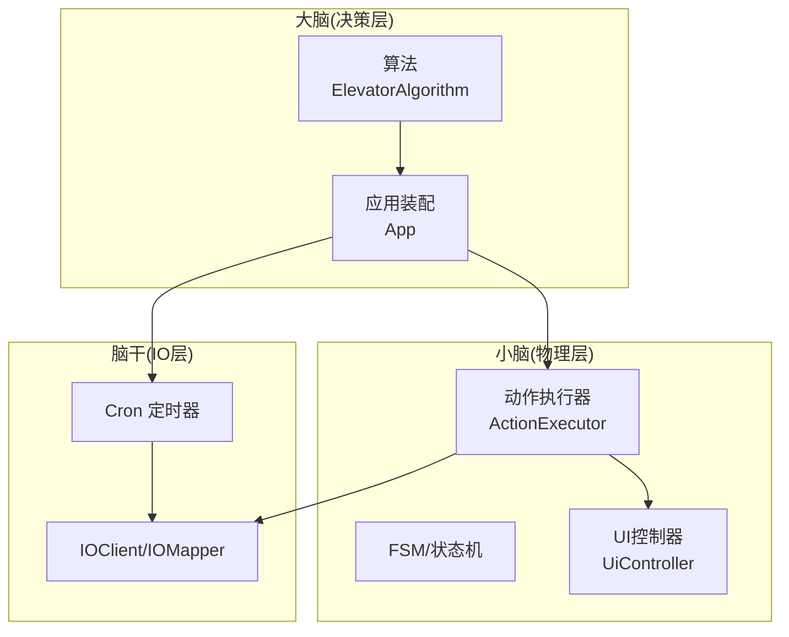
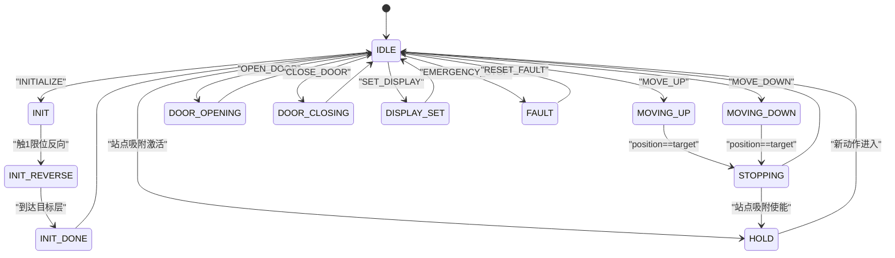
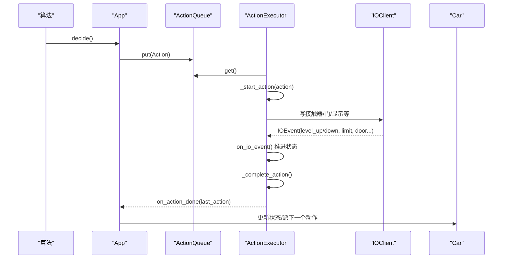
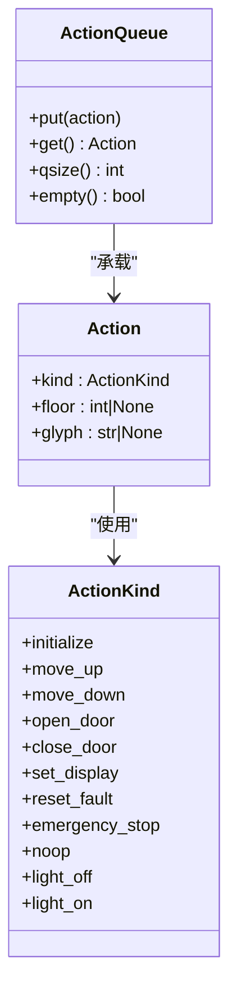
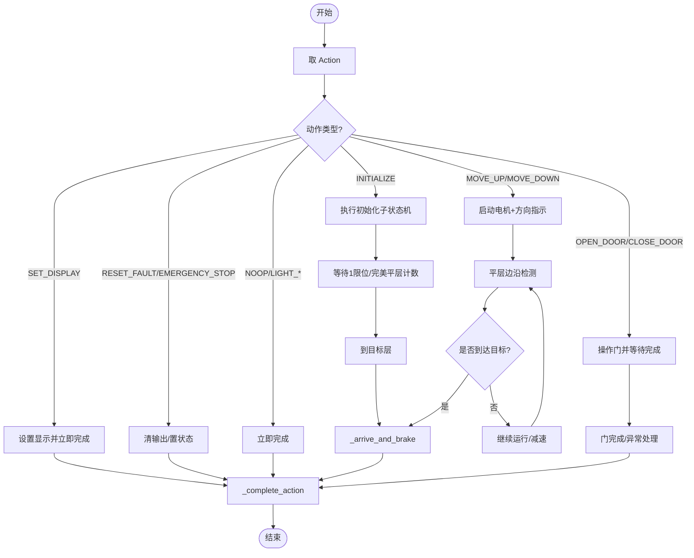
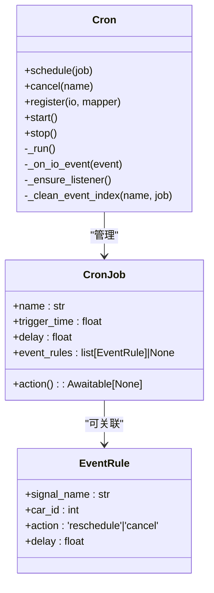
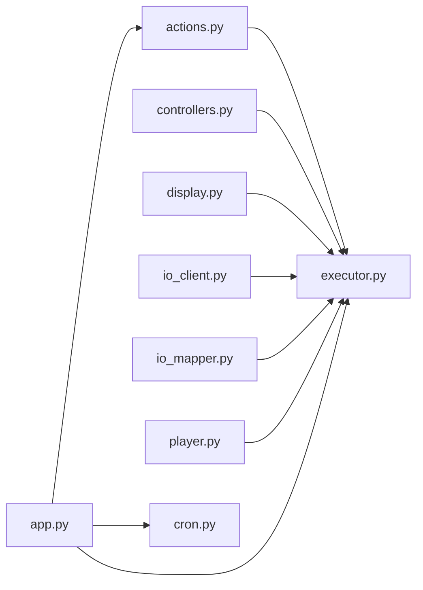

# 接口契约

<cite>
**本文引用的文件**   
- [actions.py](file://core/actions.py)
- [executor.py](file://core/executor.py)
- [cron.py](file://core/cron.py)
- [app.py](file://core/app.py)
</cite>

## 目录
1. [简介](#简介)
2. [项目结构](#项目结构)
3. [核心组件](#核心组件)
4. [架构总览](#架构总览)
5. [详细组件分析](#详细组件分析)
6. [依赖关系分析](#依赖关系分析)
7. [性能与实现要点](#性能与实现要点)
8. [故障排查指南](#故障排查指南)
9. [结论](#结论)

## 简介
本文件聚焦于“接口契约”的明确定义，围绕以下四个维度展开：
- Action 枚举与动作语义
- 完成判据（各动作何时视为完成）
- 状态机概览（执行器侧的状态迁移）
- cron 接口（事件驱动延时定时器）

文档以代码级事实为依据，结合架构图、类图、时序图和流程图，帮助读者快速理解并正确使用这些接口。

## 项目结构
本项目采用三层架构：大脑（决策层）、小脑（物理层）、脑干（IO 层）。Action 枚举位于动作队列模块，由算法层写入；执行器在硬件层消费动作并推进状态机；cron 提供事件驱动的定时能力，供上层编排自动化流程。

图表来源
- [app.py:190-241](file://core/app.py#L190-L241)
- [executor.py:132-143](file://core/executor.py#L132-L143)
- [cron.py:126-184](file://core/cron.py#L126-L184)

章节来源
- [app.py:190-241](file://core/app.py#L190-L241)
- [executor.py:132-143](file://core/executor.py#L132-L143)
- [cron.py:126-184](file://core/cron.py#L126-L184)

## 核心组件
本节给出 Action 枚举表、完成判据与状态机概览，以及 cron 接口说明。

### Action 枚举与参数约定
- 动作类型
  - INITIALIZE：启动定位，按配置方向运行至基站段，再反向逐层计数到目标楼层
  - MOVE_UP：上行至 car.target_floor
  - MOVE_DOWN：下行至 car.target_floor
  - OPEN_DOOR：开门
  - CLOSE_DOOR：关门
  - SET_DISPLAY：设置数码管显示（floor 或 glyph 二选一）
  - RESET_FAULT：复位故障
  - EMERGENCY_STOP：紧急停止
  - NOOP：空动作（占位/心跳）
  - LIGHT_OFF/LIGHT_ON：指示灯控制（当前保留 handler，暂不 dispatch）

- 参数约定
  - floor：用于 SET_DISPLAY 映射数字显示，或作为 INITIALIZE 的目标楼层
  - glyph：用于 SET_DISPLAY 直接显示字符（如 up/down/fault），跳过 floor 映射

章节来源
- [actions.py:15-52](file://core/actions.py#L15-L52)

### 完成判据（各动作何时视为完成）
- INITIALIZE
  - 完成条件：到达目标楼层后执行统一刹车流程，置 READY，清除端站限位 fault 标志，显示当前位置
  - 关键路径：_execute_initialize → on_io_event 完美平层计数 → _arrive_and_brake → _complete_action
- MOVE_UP / MOVE_DOWN
  - 完成条件：经过平层边沿更新 position，当 position == target_floor 时触发 _arrive_and_brake → _complete_action
- OPEN_DOOR
  - 完成条件：门打开完成（或错误楼层自动关闭后再完成）→ _complete_action
- CLOSE_DOOR
  - 完成条件：门关闭完成（或被光幕打断转为开门完成）→ _complete_action
- SET_DISPLAY
  - 完成条件：立即完成（无传感器等待）→ _complete_action
- RESET_FAULT
  - 完成条件：清输出、置 READY → _complete_action
- EMERGENCY_STOP
  - 完成条件：清所有输出、置 FAULT → _complete_action
- NOOP
  - 完成条件：立即完成（保持模式不被退出）→ _complete_action
- LIGHT_OFF / LIGHT_ON
  - 完成条件：写灯信号后立即完成（当前不 dispatch）→ _complete_action

章节来源
- [executor.py:596-700](file://core/executor.py#L596-L700)
- [executor.py:700-780](file://core/executor.py#L700-L780)
- [executor.py:805-843](file://core/executor.py#L805-L843)

### 状态机概览（执行器侧）

图表来源
- [executor.py:596-700](file://core/executor.py#L596-L700)
- [executor.py:700-780](file://core/executor.py#L700-L780)
- [executor.py:805-843](file://core/executor.py#L805-L843)

## 架构总览
从调用链看，算法通过 App 将 Action 推入每部电梯的 ActionQueue；执行器循环取动作并展开为 IO 序列，监听传感器推进状态机；完成后回调 App，再由 App 调度下一步。

图表来源
- [app.py:354-374](file://core/app.py#L354-L374)
- [executor.py:134-143](file://core/executor.py#L134-L143)
- [executor.py:153-217](file://core/executor.py#L153-L217)
- [executor.py:805-843](file://core/executor.py#L805-L843)

## 详细组件分析

### Action 枚举与队列
- ActionKind 定义了高层动作抽象，不包含任何 IO 地址
- Action 数据类支持可选参数 floor/glyph
- ActionQueue 是 asyncio.Queue 的轻包装，提供 put/get/qsize/empty

图表来源
- [actions.py:15-74](file://core/actions.py#L15-L74)

章节来源
- [actions.py:15-74](file://core/actions.py#L15-L74)

### 执行器状态机与完成逻辑
- 主循环 run_loop 阻塞取动作，分派 _start_action
- on_io_event 处理传感器变化，推进状态机（含安全保护、INITIALIZE 反向计数、平层边沿检测、保持模式反冲）
- _complete_action 根据动作类型更新 Car 状态并回调 App

图表来源
- [executor.py:134-143](file://core/executor.py#L134-L143)
- [executor.py:596-700](file://core/executor.py#L596-L700)
- [executor.py:700-780](file://core/executor.py#L700-L780)
- [executor.py:805-843](file://core/executor.py#L805-L843)

章节来源
- [executor.py:134-143](file://core/executor.py#L134-L143)
- [executor.py:596-700](file://core/executor.py#L596-L700)
- [executor.py:700-780](file://core/executor.py#L700-L780)
- [executor.py:805-843](file://core/executor.py#L805-L843)

### cron 接口（事件驱动延时定时器）
- CronJob：包含 name、trigger_time、action、delay、event_rules
- EventRule：监听 (car_id, signal_name)，支持 reschedule（重设触发时间）与 cancel（自毁）
- 公共 API
  - schedule(job)：调度任务（同名覆盖旧任务）
  - cancel(name)：取消任务
  - register(io, mapper)：注册 IO 监听（首次有 event_rules 的任务时自动注册）
  - start()/stop()：生命周期管理
- 设计要点
  - 纯事件驱动，零轮询
  - 小顶堆排序，懒删除
  - 重调度记录最新 trigger_time，旧 heap entry 自动跳过

图表来源
- [cron.py:23-55](file://core/cron.py#L23-L55)
- [cron.py:57-144](file://core/cron.py#L57-L144)
- [cron.py:148-241](file://core/cron.py#L148-L241)

章节来源
- [cron.py:23-55](file://core/cron.py#L23-L55)
- [cron.py:57-144](file://core/cron.py#L57-L144)
- [cron.py:148-241](file://core/cron.py#L148-L241)

## 依赖关系分析
- 执行器依赖
  - actions.Action/ActionKind/ActionQueue：动作抽象与队列
  - controllers.MotorController/DoorController：电机与门的低层控制
  - display.DisplayEncoder：数码管显示
  - io_client.IOClient/io_mapper.IOMapper：IO 读写与地址映射
  - player.Car/Direction/DoorState：实体状态
- App 协调
  - 装配多轿厢，共享 IOClient/IOMapper/DisplayEncoder/Algorithm
  - 为每部车创建独立 ActionExecutor 与 ActionQueue
  - 暴露高层 API（call_internal/change_internal/fireman/reset/reload/set_station_seek 等）

图表来源
- [executor.py:19-25](file://core/executor.py#L19-L25)
- [app.py:19-28](file://core/app.py#L19-L28)

章节来源
- [executor.py:19-25](file://core/executor.py#L19-L25)
- [app.py:19-28](file://core/app.py#L19-L28)

## 性能与实现要点
- 站点吸附（level_seek）：事件驱动的反冲修正，避免 sleep 轮询，仅在偏离时低速微调
- 紧急停止：同步清场所有长寿命状态，防止残留导致后续误触发
- 初始化两段式：基站段全程低速，客运段复用标准减速曲线，确保“刹得住”
- 保持模式激活时机：_arrive_and_brake 中统一处理，避免三处重复代码
- 工程哲学例外：brake-before-stop 的 100ms 固位 sleep 实机必需，不可随意改为 cron 或删除

章节来源
- [executor.py:428-453](file://core/executor.py#L428-L453)
- [executor.py:516-555](file://core/executor.py#L516-L555)
- [executor.py:380-410](file://core/executor.py#L380-L410)
- [executor.py:454-470](file://core/executor.py#L454-L470)

## 故障排查指南
- 2 限位触发：立即急停，置 FAULT，清所有输出与门动作，恢复需手动推出后自动回 READY
- 光幕/光栅：中断关门，转为开门完成；同时设置 human_presence 并通知上层
- 站点吸附超时：反冲等待 3s 超时仍会 hold_stop，检查 level_up/down 信号与接线
- 初始化计数异常：确认完美平层边沿检测逻辑与缓存一致性，避免同帧并发导致的漏检

章节来源
- [executor.py:226-242](file://core/executor.py#L226-L242)
- [executor.py:380-410](file://core/executor.py#L380-L410)
- [executor.py:516-555](file://core/executor.py#L516-L555)
- [executor.py:280-349](file://core/executor.py#L280-L349)

## 结论
本文明确了 Action 枚举与参数约定、各动作的完成判据、执行器状态机概览，以及 cron 的事件驱动接口。通过这些契约，大脑层可以稳定地通过 App 下发高层动作，小脑层负责将其展开为可靠的 IO 序列与状态迁移，cron 则提供灵活的定时与事件联动能力，共同构成清晰、可扩展的电梯控制系统接口体系。