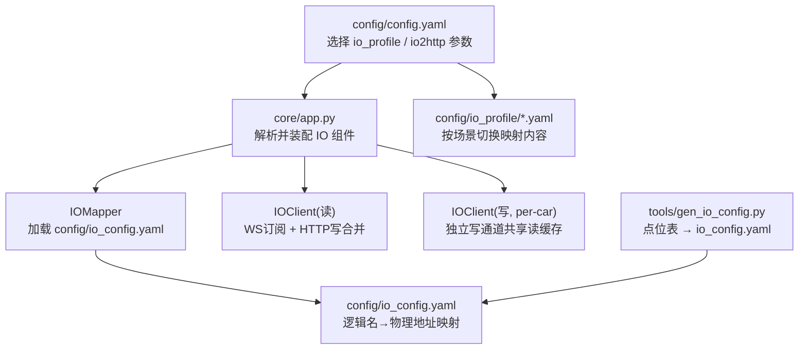
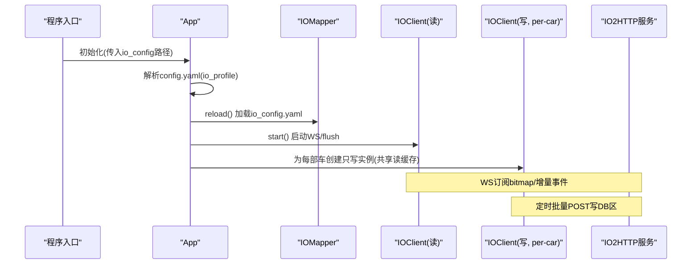
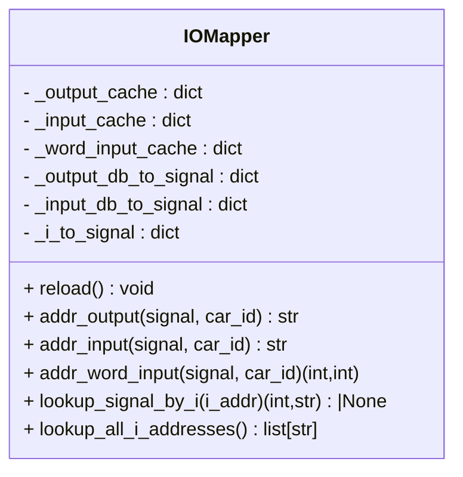
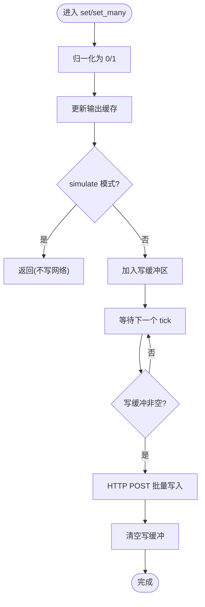
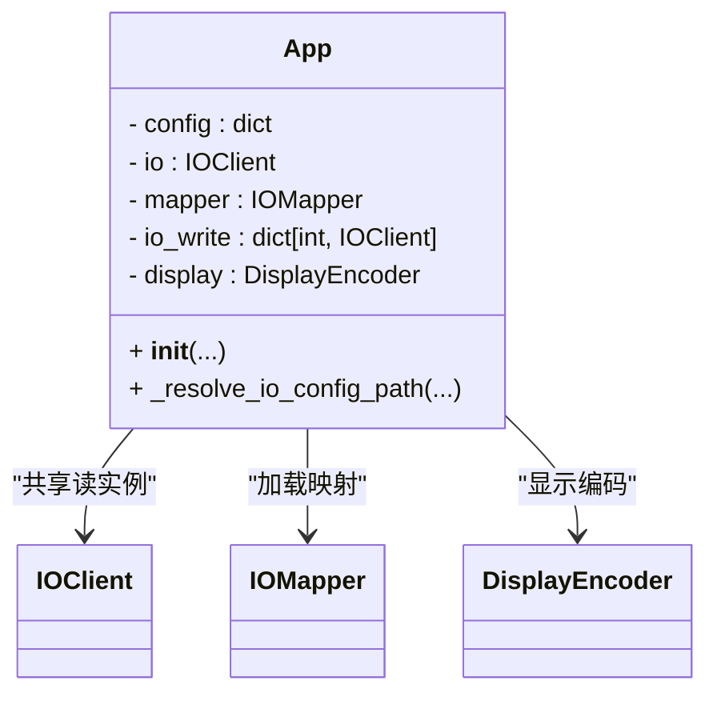
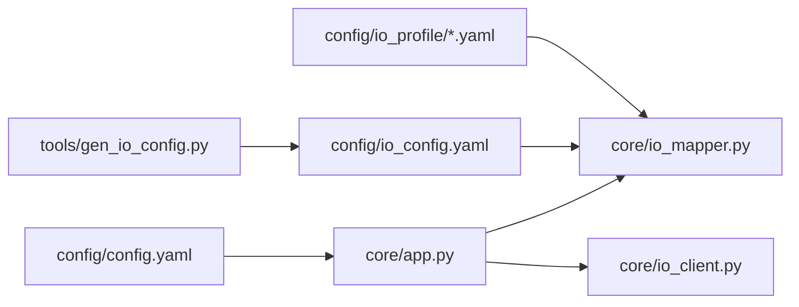

# IO配置文件管理

<cite>
**本文引用的文件**
- [config/config.yaml](file://config/config.yaml)
- [config/io_config.yaml](file://config/io_config.yaml)
- [config/io_profile/README.md](file://config/io_profile/README.md)
- [config/io_profile/competition.yaml](file://config/io_profile/competition.yaml)
- [config/io_profile/local_train.yaml](file://config/io_profile/local_train.yaml)
- [config/io_profile/local_with_weight.yaml](file://config/io_profile/local_with_weight.yaml)
- [core/app.py](file://core/app.py)
- [core/io_mapper.py](file://core/io_mapper.py)
- [core/io_client.py](file://core/io_client.py)
- [tools/gen_io_config.py](file://tools/gen_io_config.py)
</cite>

## 目录
1. [引言](#引言)
2. [项目结构](#项目结构)
3. [核心组件](#核心组件)
4. [架构总览](#架构总览)
5. [详细组件分析](#详细组件分析)
6. [依赖关系分析](#依赖关系分析)
7. [性能与吞吐特性](#性能与吞吐特性)
8. [故障排查指南](#故障排查指南)
9. [结论](#结论)
10. [附录：配置项速查](#附录配置项速查)

## 引言
本文件聚焦于“IO配置文件管理”的完整生命周期：从点位表到生成映射、从多环境 Profile 选择、到运行时加载与热更新，以及 IOClient 的读写合并策略。目标是帮助读者理解 Haku_EET 中 IO 层如何以配置为中心驱动硬件交互，并在不同场景（训练、比赛、带载重）间平滑切换。

## 项目结构
围绕 IO 配置的关键目录与文件如下：
- 顶层主配置：选择 IO Profile、IO2HTTP 连接参数、电梯运行参数等
- IO 映射：由工具从点位表自动生成，定义逻辑信号名与物理地址的对应关系
- IO Profile：按场景提供不同的输入/输出/模拟量 Word 配置
- 运行时组件：负责加载配置、建立 IO 客户端、维护写合并缓存、分发事件

图表来源
- [core/app.py:61-137](file://core/app.py#L61-L137)
- [core/io_mapper.py:19-76](file://core/io_mapper.py#L19-L76)
- [core/io_client.py:35-104](file://core/io_client.py#L35-L104)
- [config/config.yaml:1-20](file://config/config.yaml#L1-L20)
- [tools/gen_io_config.py:173-195](file://tools/gen_io_config.py#L173-L195)

章节来源
- [config/config.yaml:1-20](file://config/config.yaml#L1-L20)
- [core/app.py:61-137](file://core/app.py#L61-L137)

## 核心组件
- IOMapper：读取并缓存 IO 映射，提供“逻辑信号名+车号→物理地址”的查询能力；支持输入(I)、输出(DB)、Word 输入三类地址；维护反向索引用于事件反查和已知地址过滤。
- IOClient：异步 IO 客户端，维护输入缓存、输出缓存与写缓冲区；通过 WebSocket 接收 bitmap 增量事件，通过 HTTP POST 批量写入 DB 区；支持 simulate 模式与共享缓存。
- App：装配器，根据主配置选择 IO Profile，创建共享 IOClient 与各车的独立写 IOClient，注入 DisplayEncoder、算法、执行器等。
- gen_io_config.py：从点位表解析并生成 io_config.yaml，屏蔽点位表格式差异，统一为系统可消费的 YAML 映射。

章节来源
- [core/io_mapper.py:19-124](file://core/io_mapper.py#L19-L124)
- [core/io_client.py:35-104](file://core/io_client.py#L35-L104)
- [core/app.py:61-137](file://core/app.py#L61-L137)
- [tools/gen_io_config.py:173-195](file://tools/gen_io_config.py#L173-L195)

## 架构总览
IO 配置在系统中的流转路径如下：
- 启动时，App 读取主配置中的 io_profile，确定具体使用的 io_config 文件路径
- IOMapper 加载该映射文件，构建正向/反向索引
- IOClient 启动 WS 订阅与 flush 循环，维护输入/输出缓存与写缓冲
- 上层逻辑通过 mapper 获取地址，调用 IOClient.set/set_many 写入，或 get_input 读取

图表来源
- [core/app.py:61-137](file://core/app.py#L61-L137)
- [core/io_mapper.py:33-76](file://core/io_mapper.py#L33-L76)
- [core/io_client.py:89-104](file://core/io_client.py#L89-L104)

## 详细组件分析

### IOMapper：IO 地址映射
- 职责
  - 加载 config/io_config.yaml，构建三张缓存：输出、输入、Word 输入
  - 维护反向索引：DB/I 地址 → (car_id, signal_name)，用于事件反查与已知地址过滤
  - 暴露 addr_output / addr_input / addr_word_input 查询接口
- 关键流程
  - reload() 清空并重建所有缓存
  - 遍历 input/output 段，填充 per_car/hall_call/hall_indicator/auto_run/ready 等键
  - 若存在 word_per_car，则记录每个信号的 db_num/byte 位置
- 复杂度
  - 加载时间 O(N)，N 为信号总数；查询 O(1)
- 错误处理
  - 未知信号抛出 KeyError，便于快速定位配置缺失

图表来源
- [core/io_mapper.py:19-124](file://core/io_mapper.py#L19-L124)

章节来源
- [core/io_mapper.py:19-124](file://core/io_mapper.py#L19-L124)

### IOClient：异步 IO 客户端
- 职责
  - 维护输入缓存、输出缓存、写缓冲区
  - 通过 WebSocket 订阅 gpio_change 事件，解析 bitmap 与 change_gpio 增量
  - 通过 HTTP POST 批量写入 DB 区，tick 间隔合并减少网络开销
  - 支持 simulate 模式与共享缓存（多实例共享同一份输入/输出缓存）
- 关键流程
  - start(): 初始化 aiohttp session，按需启动 WS 任务与 flush 任务
  - set()/set_many(): 归一化值、更新输出缓存、加入写缓冲
  - _flush_loop(): 定时唤醒，将写缓冲一次性 POST
  - _apply_bitmap(): 解析 hex 字符串，逐位比较更新输入缓存，构造 IOEvent 串行派发
  - read_word(): 可选地通过独立端点读取 WORD 数据
- 性能要点
  - tick_interval_ms 控制写合并频率，默认 20ms，降低 HTTP 请求数
  - 已知地址集合过滤避免全 800 位扫描，提升 dispatch 效率
  - 每车独立写通道避免拥堵，但共享读缓存保证状态一致

图表来源
- [core/io_client.py:149-206](file://core/io_client.py#L149-L206)
- [core/io_client.py:179-188](file://core/io_client.py#L179-L188)

章节来源
- [core/io_client.py:35-104](file://core/io_client.py#L35-L104)
- [core/io_client.py:149-206](file://core/io_client.py#L149-L206)
- [core/io_client.py:270-330](file://core/io_client.py#L270-L330)

### App：装配与 IO 拓扑
- 职责
  - 解析主配置，选择 io_profile 对应的 io_config 文件
  - 创建共享 IOClient（读）与各车的独立 IOClient（写），共享输入/输出缓存
  - 注入 IOMapper、DisplayEncoder、算法、执行器等
- 关键点
  - io_profile 冷切换：启动时确定，/reload 不生效
  - 每车独立写通道，避免 6 部车同时写导致 S7 读改写顺序问题
  - 共享读缓存让“只写”实例也能看到最新 IO 状态

图表来源
- [core/app.py:61-137](file://core/app.py#L61-L137)

章节来源
- [core/app.py:61-137](file://core/app.py#L61-L137)

### gen_io_config.py：点位表到映射
- 职责
  - 解析点位表表格，提取输入/输出行
  - 使用翻译规则将中文描述转换为 snake_case 逻辑信号名
  - 生成标准结构的 io_config.yaml，包含 hall_call/hall_indicator/per_car/auto_run/ready 等
- 特点
  - 跳过虚假点位（如门锁指示灯实际为段码 LEDa）
  - 支持自定义输入/输出路径参数

章节来源
- [tools/gen_io_config.py:79-195](file://tools/gen_io_config.py#L79-L195)

## 依赖关系分析
- 配置依赖
  - config/config.yaml 决定 io_profile 与 io2http 参数
  - io_profile 指向 config/io_profile/*.yaml，决定最终映射内容
  - tools/gen_io_config.py 产出 config/io_config.yaml
- 运行时依赖
  - App 依赖 IOMapper 与 IOClient
  - IOMapper 仅依赖 YAML 文件
  - IOClient 依赖 aiohttp/websockets 与外部 IO2HTTP 服务

图表来源
- [config/config.yaml:1-20](file://config/config.yaml#L1-L20)
- [core/app.py:61-137](file://core/app.py#L61-L137)
- [core/io_mapper.py:19-76](file://core/io_mapper.py#L19-L76)
- [core/io_client.py:35-104](file://core/io_client.py#L35-L104)
- [tools/gen_io_config.py:173-195](file://tools/gen_io_config.py#L173-L195)

章节来源
- [config/config.yaml:1-20](file://config/config.yaml#L1-L20)
- [core/app.py:61-137](file://core/app.py#L61-L137)
- [core/io_mapper.py:19-76](file://core/io_mapper.py#L19-L76)
- [core/io_client.py:35-104](file://core/io_client.py#L35-L104)
- [tools/gen_io_config.py:173-195](file://tools/gen_io_config.py#L173-L195)

## 性能与吞吐特性
- 写合并
  - tick_interval_ms 越小，延迟越低但 HTTP 请求越多；越大则相反。默认 20ms，适合现场高频写需求。
- 事件派发
  - 通过 set_known_i_addresses 限制 bitmap 扫描范围，避免全 800 位扫描导致的 CPU 抖动。
- 多车并发
  - 每车独立写通道，避免一次 tick 内大量地址竞争；共享读缓存确保全局一致性。
- 模拟量读取
  - read_word 使用独立端点与超时控制，失败返回 None，不影响数字量 IO。

[本节为通用性能讨论，无需特定文件引用]

## 故障排查指南
- 无法切换到新 Profile
  - 现象：修改 io_profile 后未生效
  - 原因：Profile 为冷切换，需重启程序
  - 参考：profile 说明文档
- 信号地址报错 KeyError
  - 现象：addr_input/addr_output 抛 KeyError
  - 原因：io_config.yaml 缺少对应信号或拼写不一致
  - 处理：检查点位表是否已更新，重新运行 gen_io_config.py
- 写操作无响应
  - 现象：set/set_many 后硬件无变化
  - 排查：确认 http_url 可达、tick_interval_ms 合理、write_buffer 非空且已 flush
- 输入事件丢失或延迟
  - 现象：WS 推送 bitmap 后监听器未触发
  - 排查：确认 set_known_i_addresses 已设置，避免全量扫描；检查 ws_url 连通性

章节来源
- [config/io_profile/README.md:1-30](file://config/io_profile/README.md#L1-L30)
- [core/io_mapper.py:89-116](file://core/io_mapper.py#L89-L116)
- [core/io_client.py:179-206](file://core/io_client.py#L179-L206)
- [core/io_client.py:270-330](file://core/io_client.py#L270-L330)

## 结论
Haku_EET 的 IO 配置体系以“配置即真相”为核心：点位表作为唯一事实源，经工具生成标准化映射；多环境 Profile 实现场景化切换；运行时通过 IOMapper 与 IOClient 解耦业务逻辑与硬件细节，并以写合并与事件过滤保障性能与稳定性。遵循此设计，可在不同部署环境下快速适配，同时保持代码稳定与可维护性。

[本节为总结性内容，无需特定文件引用]

## 附录：配置项速查
- 主配置 key
  - io_profile：选择 local_train / competition / local_with_weight
  - io2http.http_url/ws_url：IO2HTTP 服务地址
  - io2http.tick_interval_ms：写合并周期（毫秒）
- IO 映射结构
  - input.hall_call：全局大厅上行/下行召唤
  - input.per_car.<car_id>.<signal>：轿厢输入信号
  - input.auto_run：自动运行信号
  - output.hall_indicator：全局大厅指示灯
  - output.per_car.<car_id>.<signal>：轿厢输出信号
  - output.ready：准备就绪信号
  - input.word_per_car.<car_id>.weight.db_num/byte：模拟量字地址
- Profile 差异
  - local_train：含 overload 布尔，无 weight_word
  - competition：无 overload，有 auto_run 与 weight_word
  - local_with_weight：同 local_train 并启用 weight_word

章节来源
- [config/config.yaml:1-20](file://config/config.yaml#L1-L20)
- [config/io_config.yaml:1-501](file://config/io_config.yaml#L1-L501)
- [config/io_profile/competition.yaml:1-524](file://config/io_profile/competition.yaml#L1-L524)
- [config/io_profile/local_train.yaml:1-501](file://config/io_profile/local_train.yaml#L1-L501)
- [config/io_profile/local_with_weight.yaml:1-514](file://config/io_profile/local_with_weight.yaml#L1-L514)
- [config/io_profile/README.md:1-30](file://config/io_profile/README.md#L1-L30)