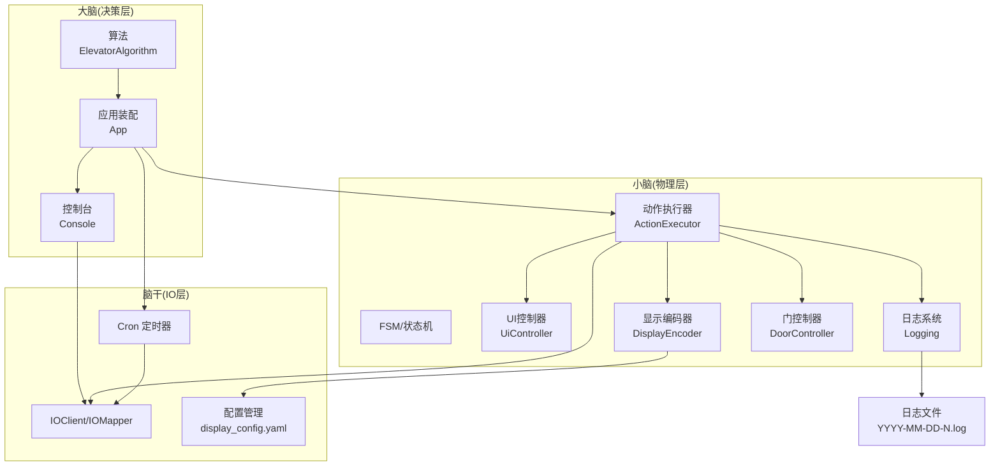
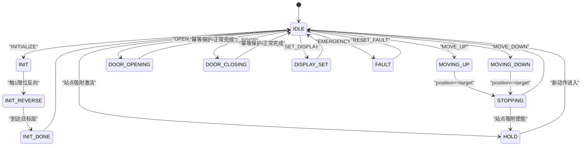
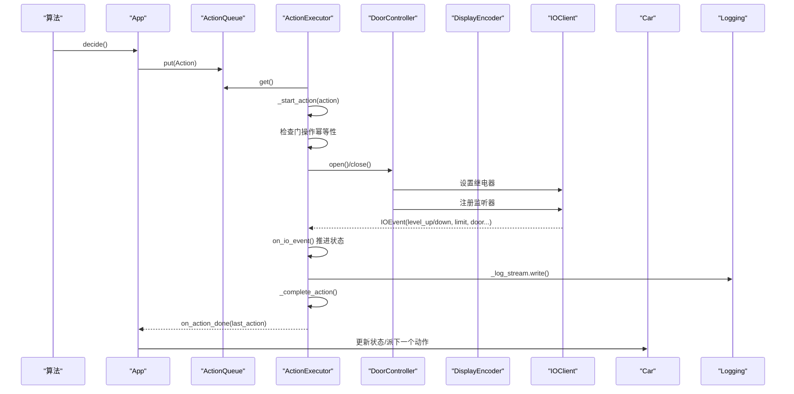
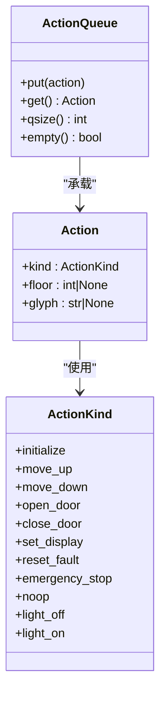
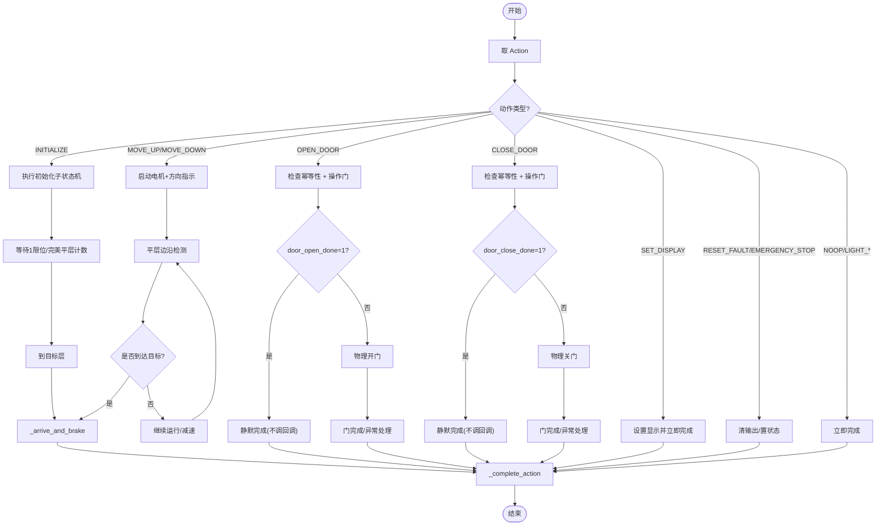
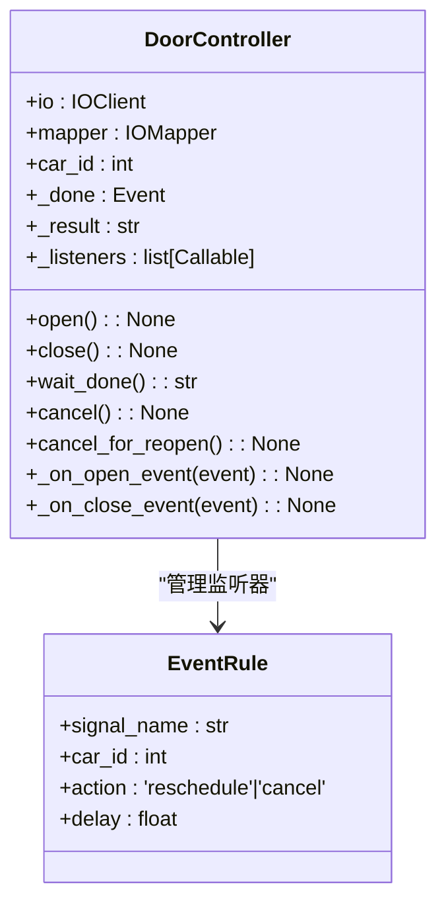
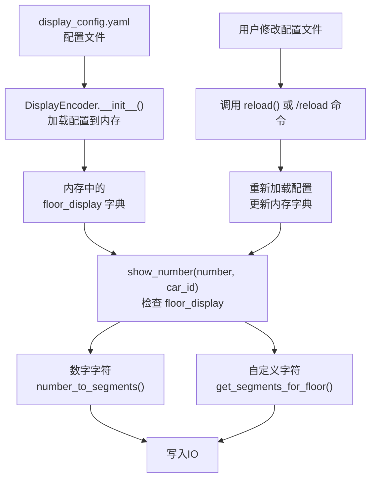
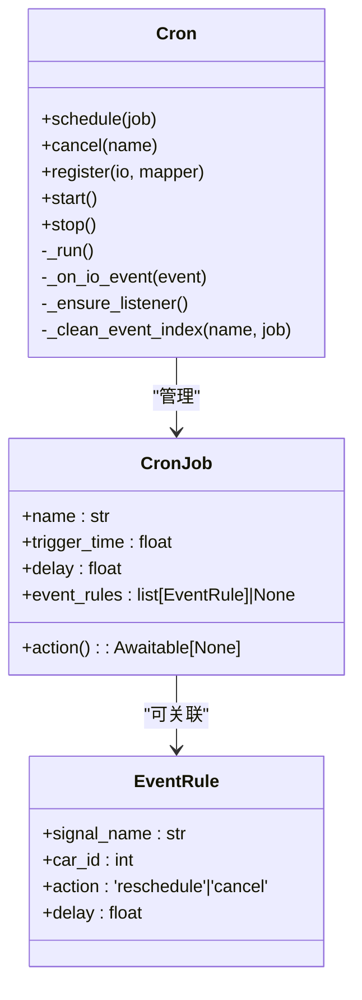
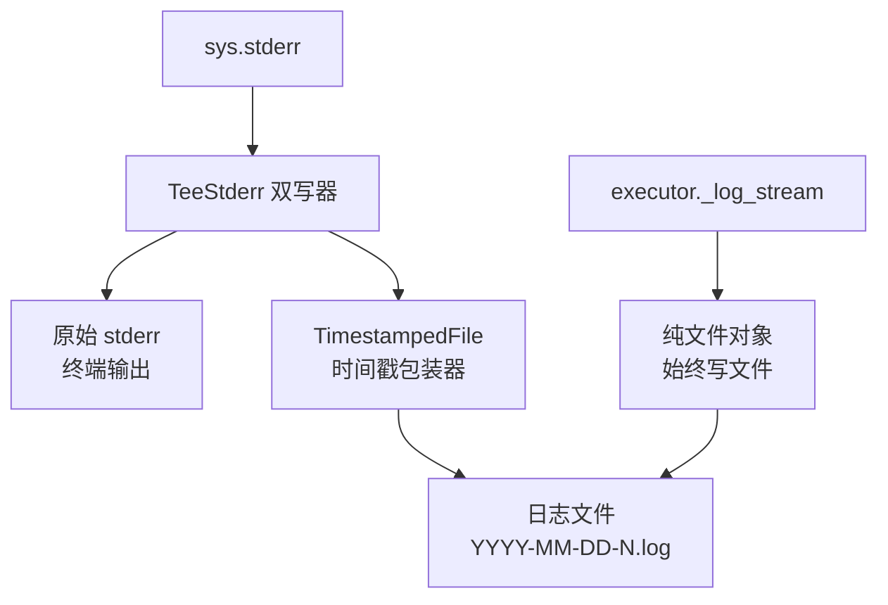
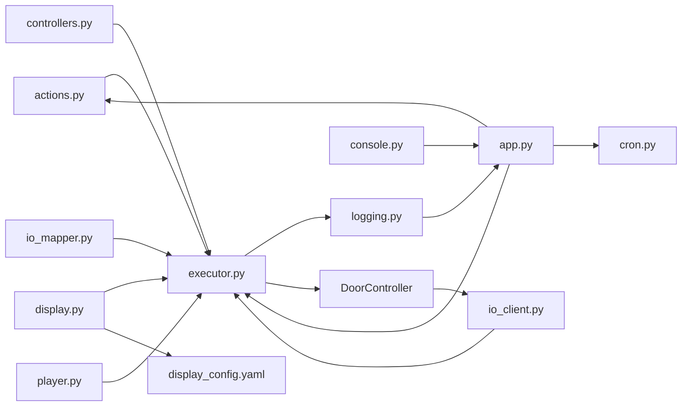

# 接口契约

<cite>
**本文引用的文件**   
- [actions.py](file://core/actions.py)
- [executor.py](file://core/executor.py)
- [cron.py](file://core/cron.py)
- [app.py](file://core/app.py)
- [display.py](file://core/display.py)
- [logging.py](file://core/logging.py)
- [console.py](file://core/console.py)
- [controllers.py](file://core/controllers.py)
</cite>

## 更新摘要
**变更内容**   
- 增强了 OPEN_DOOR 和 CLOSE_DOOR 动作的幂等保护逻辑，防止并发请求导致的竞态条件
- 新增门操作完成信号检查机制，通过 PLC 输入信号（door_open_done, door_close_done）进行冗余保护
- 完善了门操作的异常处理流程，确保在门已物理到位时跳过重复操作
- 增强了系统的健壮性和可靠性，避免永久阻塞问题

## 目录
1. [简介](#简介)
2. [项目结构](#项目结构)
3. [核心组件](#核心组件)
4. [架构总览](#架构总览)
5. [详细组件分析](#详细组件分析)
6. [日志诊断基础设施](#日志诊断基础设施)
7. [控制台调试命令](#控制台调试命令)
8. [依赖关系分析](#依赖关系分析)
9. [性能与实现要点](#性能与实现要点)
10. [故障排查指南](#故障排查指南)
11. [结论](#结论)

## 简介
本文件聚焦于"接口契约"的明确定义，围绕以下四个维度展开：
- Action 枚举与动作语义
- 完成判据（各动作何时视为完成）
- 状态机概览（执行器侧的状态迁移）
- cron 接口（事件驱动延时定时器）

此外，本文档还涵盖了新增的日志诊断基础设施和调试命令，为系统提供完整的可观测性和调试能力。

## 项目结构
本项目采用三层架构：大脑（决策层）、小脑（物理层）、脑干（IO 层）。Action 枚举位于动作队列模块，由算法层写入；执行器在硬件层消费动作并推进状态机；cron 提供事件驱动的定时能力，供上层编排自动化流程。

图表来源
- [app.py:190-241](file://core/app.py#L190-L241)
- [executor.py:132-143](file://core/executor.py#L132-L243)
- [cron.py:126-184](file://core/cron.py#L126-L184)
- [display.py:20-30](file://core/display.py#L20-L30)
- [logging.py:65-93](file://core/logging.py#L65-L93)
- [console.py:88-144](file://core/console.py#L88-L144)
- [controllers.py:168-184](file://core/controllers.py#L168-L184)

章节来源
- [app.py:190-241](file://core/app.py#L190-L241)
- [executor.py:132-143](file://core/executor.py#L132-L143)
- [cron.py:126-184](file://core/cron.py#L126-L184)

## 核心组件
本节给出 Action 枚举表、完成判据与状态机概览，以及 cron 接口说明。

### Action 枚举与参数约定
- 动作类型
  - INITIALIZE：启动定位，按配置方向运行至基站段，再反向逐层计数到目标楼层
  - MOVE_UP：上行至 car.target_floor
  - MOVE_DOWN：下行至 car.target_floor
  - OPEN_DOOR：开门（增强幂等保护）
  - CLOSE_DOOR：关门（增强幂等保护）
  - SET_DISPLAY：设置数码管显示（floor 或 glyph 二选一）
  - RESET_FAULT：复位故障
  - EMERGENCY_STOP：紧急停止
  - NOOP：空动作（占位/心跳）
  - LIGHT_OFF/LIGHT_ON：指示灯控制（当前保留 handler，暂不 dispatch）

- 参数约定
  - floor：用于 SET_DISPLAY 映射数字显示，或作为 INITIALIZE 的目标楼层
  - glyph：用于 SET_DISPLAY 直接显示字符（如 up/down/fault），跳过 floor 映射

章节来源
- [actions.py:15-52](file://core/actions.py#L15-L52)

### 完成判据（各动作何时视为完成）
- INITIALIZE
  - 完成条件：到达目标楼层后执行统一刹车流程，置 READY，清除端站限位 fault 标志，显示当前位置
  - 关键路径：_execute_initialize → on_io_event 完美平层计数 → _arrive_and_brake → _complete_action
- MOVE_UP / MOVE_DOWN
  - 完成条件：经过平层边沿更新 position，当 position == target_floor 时触发 _arrive_and_brake → _complete_action
- OPEN_DOOR
  - **增强**：完成条件包括幂等保护检查，如果 PLC 已报 door_open_done=1，跳过物理开门直接标记 OPEN
  - 关键路径：_start_action → 检查 door_open_done → 幂等保护 → door.open() → wait_done() → _complete_action
- CLOSE_DOOR
  - **增强**：完成条件包括幂等保护检查，如果 PLC 已报 door_close_done=1，跳过物理关门直接标记 CLOSED
  - 关键路径：_start_action → 检查 door_close_done → 幂等保护 → door.close() → wait_done() → _complete_action
- SET_DISPLAY
  - 完成条件：立即完成（无传感器等待）→ _complete_action
- RESET_FAULT
  - 完成条件：清输出、置 READY → _complete_action
- EMERGENCY_STOP
  - 完成条件：清所有输出、置 FAULT → _complete_action
- NOOP
  - 完成条件：立即完成（保持模式不被退出）→ _complete_action
- LIGHT_OFF / LIGHT_ON
  - 完成条件：写灯信号后立即完成（当前不 dispatch）→ _complete_action

**更新** OPEN_DOOR 和 CLOSE_DOOR 动作现在包含幂等保护逻辑，防止并发请求导致的竞态条件。

章节来源
- [executor.py:596-700](file://core/executor.py#L596-L700)
- [executor.py:700-780](file://core/executor.py#L700-L780)
- [executor.py:805-843](file://core/executor.py#L805-L843)

### 状态机概览（执行器侧）

**更新** 门操作状态转换现在包含幂等保护路径，允许在门已物理到位时直接完成。

图表来源
- [executor.py:596-700](file://core/executor.py#L596-L700)
- [executor.py:700-780](file://core/executor.py#L700-L780)
- [executor.py:805-843](file://core/executor.py#L805-L843)

## 架构总览
从调用链看，算法通过 App 将 Action 推入每部电梯的 ActionQueue；执行器循环取动作并展开为 IO 序列，监听传感器推进状态机；完成后回调 App，再由 App 调度下一步。

**更新** 增加了 DoorController 组件和门操作幂等性检查步骤。

图表来源
- [app.py:354-374](file://core/app.py#L354-L374)
- [executor.py:134-143](file://core/executor.py#L134-L143)
- [executor.py:153-217](file://core/executor.py#L153-L217)
- [executor.py:805-843](file://core/executor.py#L805-L843)
- [controllers.py:215-245](file://core/controllers.py#L215-L245)
- [display.py:61-72](file://core/display.py#L61-L72)
- [logging.py:65-93](file://core/logging.py#L65-L93)

## 详细组件分析

### Action 枚举与队列
- ActionKind 定义了高层动作抽象，不包含任何 IO 地址
- Action 数据类支持可选参数 floor/glyph
- ActionQueue 是 asyncio.Queue 的轻包装，提供 put/get/qsize/empty

图表来源
- [actions.py:15-74](file://core/actions.py#L15-L74)

章节来源
- [actions.py:15-74](file://core/actions.py#L15-L74)

### 执行器状态机与完成逻辑
- 主循环 run_loop 阻塞取动作，分派 _start_action
- on_io_event 处理传感器变化，推进状态机（含安全保护、INITIALIZE 反向计数、平层边沿检测、保持模式反冲）
- _complete_action 根据动作类型更新 Car 状态并回调 App

**更新** 新增了门操作的幂等性检查分支，包括 door_open_done 和 door_close_done 的信号检查。

图表来源
- [executor.py:134-143](file://core/executor.py#L134-L143)
- [executor.py:596-700](file://core/executor.py#L596-L700)
- [executor.py:700-780](file://core/executor.py#L700-L780)
- [executor.py:805-843](file://core/executor.py#L805-L843)

章节来源
- [executor.py:134-143](file://core/executor.py#L134-L143)
- [executor.py:596-700](file://core/executor.py#L596-L700)
- [executor.py:700-780](file://core/executor.py#L700-L780)
- [executor.py:805-843](file://core/executor.py#L805-L843)

### 门控制器与幂等保护机制

**新增** 门控制器实现了完整的门操作管理和幂等保护机制：

- **DoorController 类**：封装门继电器的控制逻辑，管理 IO 监听器和完成信号
- **幂等保护**：在执行物理门操作前检查 PLC 输入信号，避免重复操作
- **异步事件处理**：使用 asyncio.Event 管理门操作的完成状态
- **错误处理**：支持错层检测、光幕触发等异常情况

**图表来源**
- [controllers.py:168-184](file://core/controllers.py#L168-L184)
- [controllers.py:215-245](file://core/controllers.py#L215-L245)
- [controllers.py:272-329](file://core/controllers.py#L272-L329)

### 显示模块与配置约束（关键架构约束）

**重要架构约束 - Bug #3 说明**

显示模块存在一个关键的架构约束，开发者在处理楼层显示功能时必须理解这一限制：

- **配置热重载机制**：`DisplayEncoder` 在初始化时加载 `display_config.yaml` 配置到内存中的 `floor_display` 字典
- **运行时配置限制**：`show_number()` 函数虽然检查 `floor_display` 配置，但配置更改不会立即生效
- **手动重载要求**：修改配置文件后，必须显式调用 `reload()` 方法或通过 `/reload` 命令重新加载配置
- **影响范围**：所有依赖楼层显示的功能（包括电梯运行时的楼层显示、初始化完成后的位置显示等）都会受到此限制影响

图表来源
- [display.py:20-30](file://core/display.py#L20-L30)
- [display.py:32-39](file://core/display.py#L32-L39)
- [display.py:61-72](file://core/display.py#L61-L72)

**章节来源**
- [display.py:20-30](file://core/display.py#L20-L30)
- [display.py:32-39](file://core/display.py#L32-L39)
- [display.py:61-72](file://core/display.py#L61-L72)

### cron 接口（事件驱动延时定时器）
- CronJob：包含 name、trigger_time、action、delay、event_rules
- EventRule：监听 (car_id, signal_name)，支持 reschedule（重设触发时间）与 cancel（自毁）
- 公共 API
  - schedule(job)：调度任务（同名覆盖旧任务）
  - cancel(name)：取消任务
  - register(io, mapper)：注册 IO 监听（首次有 event_rules 的任务时自动注册）
  - start()/stop()：生命周期管理
- 设计要点
  - 纯事件驱动，零轮询
  - 小顶堆排序，懒删除
  - 重调度记录最新 trigger_time，旧 heap entry 自动跳过

图表来源
- [cron.py:23-55](file://core/cron.py#L23-L55)
- [cron.py:57-144](file://core/cron.py#L57-L144)
- [cron.py:148-241](file://core/cron.py#L148-L241)

章节来源
- [cron.py:23-55](file://core/cron.py#L23-L55)
- [cron.py:57-144](file://core/cron.py#L57-L144)
- [cron.py:148-241](file://core/cron.py#L148-L241)

## 日志诊断基础设施

### TeeStderr 双写机制
系统实现了强大的日志诊断基础设施，核心是 TeeStderr 双写机制：

- **TeeStderr 类**：同时写入原始 stderr 和日志文件，确保所有标准错误输出都被持久化
- **TimestampedFile 类**：为每行日志自动添加 `[HH:MM:SS.mmm]` 格式的时间戳
- **init_log() 函数**：创建日志目录和文件，返回 TeeStderr 实例和纯文件对象

图表来源
- [logging.py:38-63](file://core/logging.py#L38-L63)
- [logging.py:15-36](file://core/logging.py#L15-L36)
- [logging.py:65-93](file://core/logging.py#L65-L93)

### 按模块日志控制
系统提供了灵活的日志控制机制：

- **全局 stderr 捕获**：所有模块的 stderr 输出自动双写到文件和终端
- **执行器专用日志**：executor._log 走纯文件对象，不受终端开关影响
- **终端控制开关**：exec_log_enabled 控制是否在终端显示执行器日志
- **REPL 命令日志**：独立的 REPL 命令记录，避免与业务日志混淆

### 日志文件命名策略
- 文件名格式：`YYYY-MM-DD-N.log`（类似 Minecraft 服务端）
- 每日自动轮转，同一天内多次启动会递增 N
- 文件编码：UTF-8，缓冲模式：行缓冲（buffering=1）

**章节来源**
- [logging.py:15-93](file://core/logging.py#L15-L93)
- [app.py:173-186](file://core/app.py#L173-L186)

## 控制台调试命令

### AI 需求诊断命令

#### `/debug show ai_need_1` - 轿厢状态快照监视
该命令提供电梯关门完成时的完整状态快照，用于诊断 AI 算法决策问题：

- **触发时机**：每次检测到 `door_close_done=1` 信号时自动触发
- **输出内容**：
  - 基础状态：state、position、direction、door_state、target_floor
  - 调度信息：last_dispatch_direction、current_action
  - 请求信息：pending_calls、pending_call_origin
  - 乘客管理：queue_mode、button_cache、passenger_queue、pickup_active
  - 待处理外召：_pending_hall_calls 列表

#### `/debug show human_presence` - 人类存在状态监视
监控 human_presence 三态变化（-1/0/1），帮助诊断乘客检测逻辑：

- **状态含义**：
  - `-1`：确认无人（超时未检测到活动）
  - `0`：可能有人（等待确认中）
  - `1`：确认有人（检测到按钮按下或光幕遮挡）
- **输出格式**：`[HP] carN human_presence: old → new`
- **智能过滤**：仅在状态发生变化时输出，避免刷屏

### 其他调试命令

#### `/module station_seek` - 站点吸附模块控制
- **查看状态**：`/module station_seek`
- **启用功能**：`/module station_seek true`
- **禁用功能**：`/module station_seek false`

#### 其他可用的调试监视项
- `pass_floor`：平层监视
- `input_change`：输入变化监视  
- `websocket_connect_status`：WebSocket 连接状态监视
- `exec_trace`：执行器跟踪日志
- `elevator_speed`：速度档位监视
- `level_check`：平层检测监视
- `station_seek`：站点吸附监视
- `door_status`：门动作完成监视
- `ui_listener`：UI 事件监视
- `door_event`：门事件监视
- `ui_light_listener`：UI 灯光监视
- `ai_need_2`：乘客管理器事件级日志
- `weight_event`：重量查询事件监视

**章节来源**
- [console.py:2562-2612](file://core/console.py#L2562-L2612)
- [console.py:2479-2511](file://core/console.py#L2479-L2511)
- [console.py:1611-1650](file://core/console.py#L1611-L1650)
- [console.py:260-261](file://core/console.py#L260-L261)

## 依赖关系分析
- 执行器依赖
  - actions.Action/ActionKind/ActionQueue：动作抽象与队列
  - controllers.MotorController/DoorController：电机与门的低层控制
  - display.DisplayEncoder：数码管显示
  - io_client.IOClient/io_mapper.IOMapper：IO 读写与地址映射
  - player.Car/Direction/DoorState：实体状态
  - logging.init_log：日志基础设施
- App 协调
  - 装配多轿厢，共享 IOClient/IOMapper/DisplayEncoder/Algorithm
  - 为每部车创建独立 ActionExecutor 与 ActionQueue
  - 暴露高层 API（call_internal/change_internal/fireman/reset/reload/set_station_seek 等）
  - 集成 Console 控制台和日志系统

**更新** 增加了 DoorController 的依赖关系。

图表来源
- [executor.py:19-25](file://core/executor.py#L19-L25)
- [app.py:19-28](file://core/app.py#L19-L28)
- [display.py:20-30](file://core/display.py#L20-L30)
- [logging.py:32](file://core/logging.py#L32)
- [console.py:14](file://core/console.py#L14)
- [controllers.py:168-184](file://core/controllers.py#L168-L184)

章节来源
- [executor.py:19-25](file://core/executor.py#L19-L25)
- [app.py:19-28](file://core/app.py#L19-L28)

## 性能与实现要点
- 站点吸附（level_seek）：事件驱动的反冲修正，避免 sleep 轮询，仅在偏离时低速微调
- 紧急停止：同步清场所有长寿命状态，防止残留导致后续误触发
- 初始化两段式：基站段全程低速，客运段复用标准减速曲线，确保"刹得住"
- 保持模式激活时机：_arrive_and_brake 中统一处理，避免三处重复代码
- 工程哲学例外：brake-before-stop 的 100ms 固位 sleep 实机必需，不可随意改为 cron 或删除
- **配置热重载约束**：显示配置修改后必须调用 reload() 才能生效，这是重要的架构约束
- **日志性能优化**：TeeStderr 使用异步双写，避免阻塞主线程；纯文件对象用于高频日志输出
- **调试命令开销**：所有调试监视项默认禁用，按需启用，最小化性能影响
- **门操作幂等保护**：通过检查 PLC 输入信号避免重复操作，提高系统健壮性

**更新** 新增了门操作幂等保护的性能考虑。

章节来源
- [executor.py:428-453](file://core/executor.py#L428-L453)
- [executor.py:516-555](file://core/executor.py#L516-L555)
- [executor.py:380-410](file://core/executor.py#L380-L410)
- [executor.py:454-470](file://core/executor.py#L454-L470)
- [display.py:32-39](file://core/display.py#L32-L39)
- [logging.py:44-49](file://core/logging.py#L44-L49)
- [executor.py:665-751](file://core/executor.py#L665-L751)

## 故障排查指南
- 2 限位触发：立即急停，置 FAULT，清所有输出与门动作，恢复需手动推出后自动回 READY
- 光幕/光栅：中断关门，转为开门完成；同时设置 human_presence 并通知上层
- 站点吸附超时：反冲等待 3s 超时仍会 hold_stop，检查 level_up/down 信号与接线
- 初始化计数异常：确认完美平层边沿检测逻辑与缓存一致性，避免同帧并发导致的漏检
- **楼层显示配置不生效**：检查是否调用了 reload() 方法或 /reload 命令，配置文件修改后必须手动重载
- **日志文件缺失**：检查 logs 目录权限，确认 init_log() 是否正常调用
- **调试命令无效**：确认对应监视项已启用，检查 IO 监听器是否正确注册
- **human_presence 状态异常**：使用 `/debug show human_presence` 监控状态变化，检查光幕和按钮信号
- **AI 决策问题**：使用 `/debug show ai_need_1` 获取关门时的完整状态快照进行诊断
- **门操作卡死**：检查 door_open_done/door_close_done 信号是否正常，确认幂等保护逻辑是否正常工作
- **并发门操作冲突**：验证门操作的幂等保护是否避免了重复操作导致的竞态条件

**更新** 新增了门操作相关的故障排查指导。

**章节来源**
- [executor.py:226-242](file://core/executor.py#L226-L242)
- [executor.py:380-410](file://core/executor.py#L380-L410)
- [executor.py:516-555](file://core/executor.py#L516-L555)
- [executor.py:280-349](file://core/executor.py#L280-L349)
- [display.py:32-39](file://core/display.py#L32-L39)
- [logging.py:65-93](file://core/logging.py#L65-L93)
- [console.py:2562-2612](file://core/console.py#L2562-L2612)
- [console.py:2479-2511](file://core/console.py#L2479-L2511)
- [executor.py:665-751](file://core/executor.py#L665-L751)

## 结论
本文明确了 Action 枚举与参数约定、各动作的完成判据、执行器状态机概览，以及 cron 的事件驱动接口。通过这些契约，大脑层可以稳定地通过 App 下发高层动作，小脑层负责将其展开为可靠的 IO 序列与状态迁移，cron 则提供灵活的定时与事件联动能力，共同构成清晰、可扩展的电梯控制系统接口体系。

**重要提醒**：在处理楼层显示功能时，必须注意显示模块的配置热重载约束。修改 `display_config.yaml` 配置文件后，必须通过 `/reload` 命令或调用 `reload()` 方法才能使配置更改立即生效。这是一个关键的架构约束，直接影响系统的实时性和用户体验。

**新增的诊断能力**：系统现在提供了完善的日志诊断基础设施和调试命令，包括 TeeStderr 双写机制、时间戳日志文件、按模块日志控制，以及 `/debug show ai_need_1` 和 `/debug show human_presence` 等专用调试命令，大大提升了系统的可观测性和问题诊断能力。这些工具对于生产环境的故障排查和性能优化具有重要价值。

**门操作增强**：OPEN_DOOR 和 CLOSE_DOOR 动作现在包含了增强的幂等保护逻辑，通过检查 PLC 输入信号（door_open_done, door_close_done）来防止并发请求导致的竞态条件。这种冗余保护机制确保了即使在多重回调同时触发门操作的情况下，系统也能正确处理和完成门操作，避免了永久阻塞的问题。

**章节来源**
- [executor.py:665-751](file://core/executor.py#L665-L751)
- [controllers.py:168-184](file://core/controllers.py#L168-L184)
- [controllers.py:215-245](file://core/controllers.py#L215-L245)