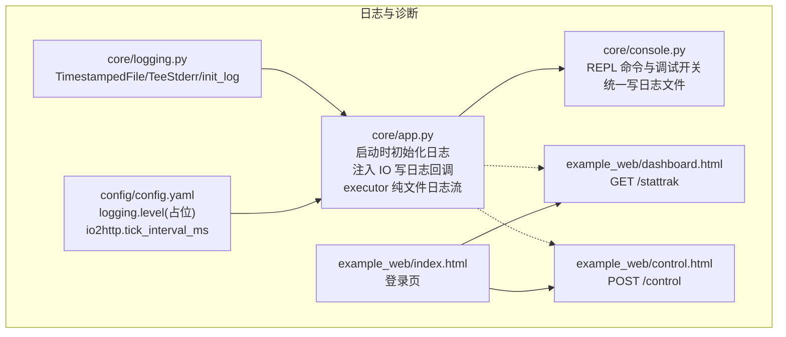
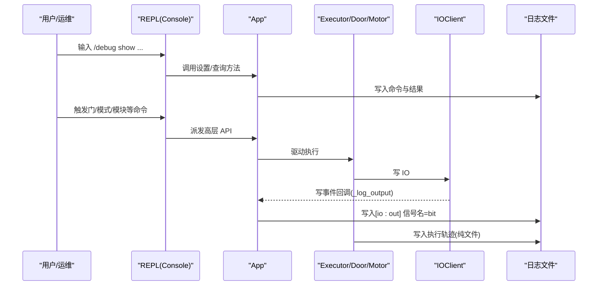
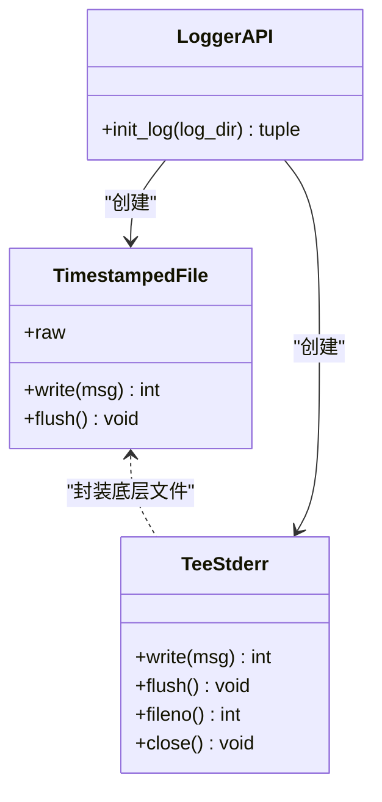
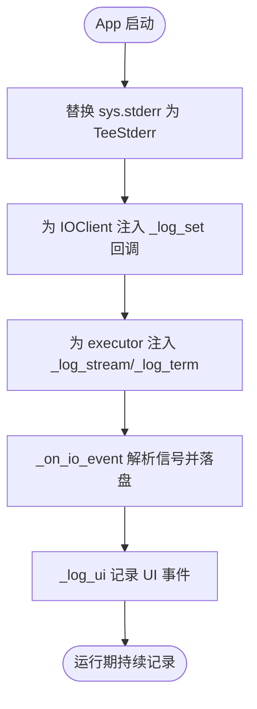
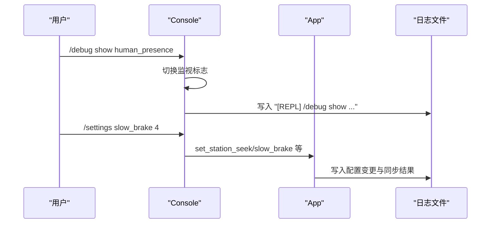
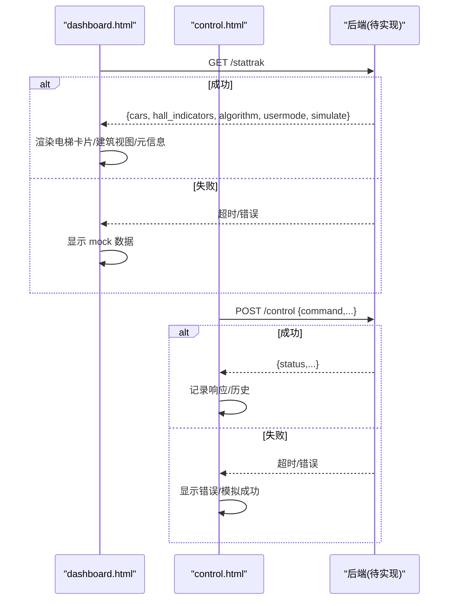
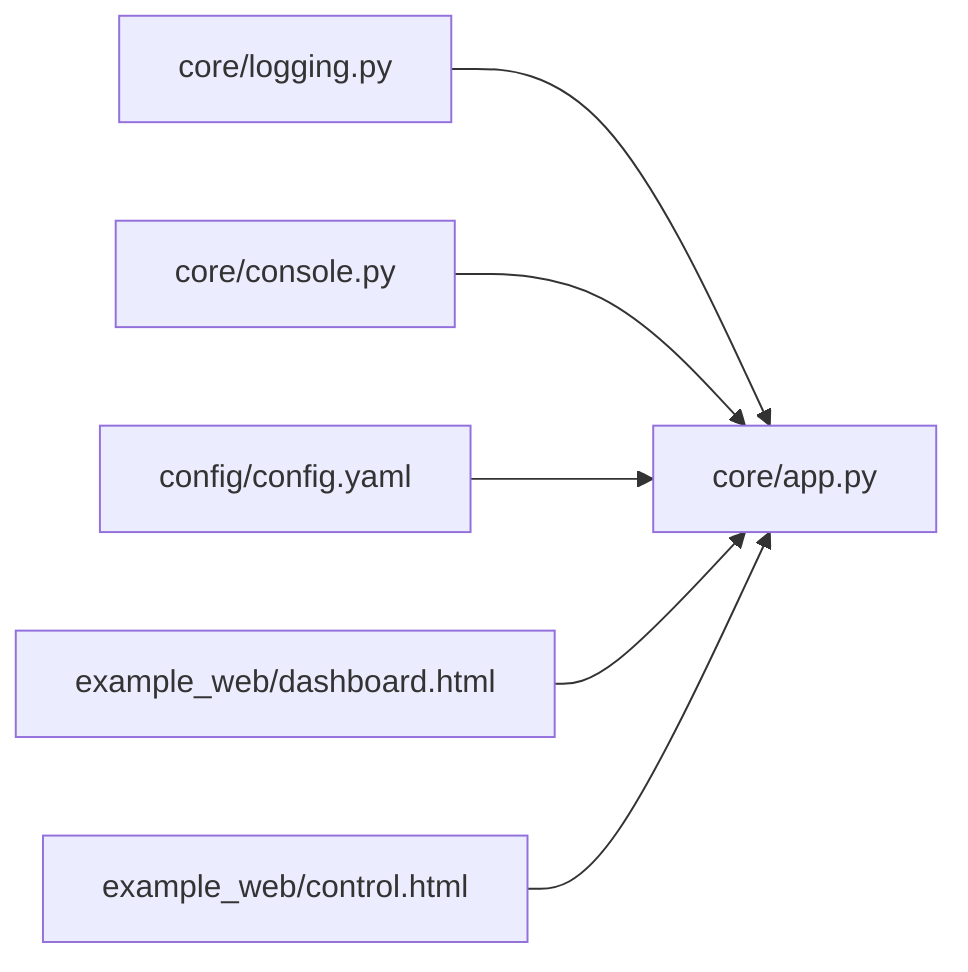

# 日志与诊断系统

<cite>
**本文引用的文件**   
- [core/app.py](file://core/app.py)
- [core/logging.py](file://core/logging.py)
- [core/console.py](file://core/console.py)
- [config/config.yaml](file://config/config.yaml)
- [example_web/dashboard.html](file://example_web/dashboard.html)
- [example_web/control.html](file://example_web/control.html)
- [example_web/index.html](file://example_web/index.html)
</cite>

## 目录
1. [简介](#简介)
2. [项目结构](#项目结构)
3. [核心组件](#核心组件)
4. [架构总览](#架构总览)
5. [详细组件分析](#详细组件分析)
6. [依赖关系分析](#依赖关系分析)
7. [性能考量](#性能考量)
8. [故障排查指南](#故障排查指南)
9. [结论](#结论)
10. [附录](#附录)

## 简介
本文件聚焦于“日志与诊断系统”的设计与实现，覆盖以下方面：
- 日志输出机制：stderr 分流、时间戳写入、纯文件通道、IO 写事件翻译
- 诊断能力：REPL 命令、调试开关、监视项、事件级日志
- 前端监控与控制：Web 页面如何消费后端状态（当前未实现 HTTP 服务时的降级策略）
- 三层架构约束下的职责划分：大脑/小脑/脑干在日志与诊断中的协作方式

## 项目结构
围绕日志与诊断的关键位置：
- core/logging.py：提供 TimestampedFile、TeeStderr、init_log，负责日志文件创建、时间戳注入、stderr 双写
- core/app.py：应用装配阶段启用日志；将 IO 写事件回调注入到 IOClient；为 executor 注入纯文件日志流；提供大量诊断钩子与状态快照
- core/console.py：REPL 控制台，提供 /debug show 系列开关、/module、/settings、/usermode 等命令，统一记录到日志文件
- config/config.yaml：logging.level 占位、io2http tick_interval_ms 影响日志吞吐
- example_web/*：前端通过 GET /stattrak 拉取全局状态，POST /control 下发控制指令（当前后端未实现 HTTP 服务，前端有 mock 降级）

图表来源
- [core/logging.py:1-94](file://core/logging.py#L1-L94)
- [core/app.py:173-186](file://core/app.py#L173-L186)
- [core/console.py:1973-2020](file://core/console.py#L1973-L2020)
- [config/config.yaml:84-87](file://config/config.yaml#L84-L87)
- [example_web/dashboard.html:579-619](file://example_web/dashboard.html#L579-L619)
- [example_web/control.html:565-613](file://example_web/control.html#L565-L613)
- [example_web/index.html:99-131](file://example_web/index.html#L99-L131)

章节来源
- [core/logging.py:1-94](file://core/logging.py#L1-L94)
- [core/app.py:173-186](file://core/app.py#L173-L186)
- [core/console.py:1973-2020](file://core/console.py#L1973-L2020)
- [config/config.yaml:84-87](file://config/config.yaml#L84-L87)
- [example_web/dashboard.html:579-619](file://example_web/dashboard.html#L579-L619)
- [example_web/control.html:565-613](file://example_web/control.html#L565-L613)
- [example_web/index.html:99-131](file://example_web/index.html#L99-L131)

## 核心组件
- 日志子系统
  - TimestampedFile：每行自动加 [HH:MM:SS.mmm] 时间戳并 flush
  - TeeStderr：同时写入原始 stderr 和带时间戳的日志文件
  - init_log：创建 logs 目录、按日期+序号命名日志文件、返回 TeeStderr 与纯文件对象
- 应用集成点
  - App.__init__：非测试环境下替换 sys.stderr 为 TeeStderr，并将 IO 写事件回调注入到 IOClient 实例，使 DB 地址→信号名映射后落盘
  - App.start：为每个轿厢的 executor 注入 _log_stream/_log_term，用于执行轨迹与门动作细节的纯文件记录
- REPL 控制台
  - Console.run：基于 prompt_toolkit 的异步 REPL，支持 Tab 补全、历史
  - /debug show：多种监视项开关（pass_floor、input_change、websocket_connect_status、exec_trace、elevator_speed、level_check、station_seek、door_status、ui_listener、human_presence、door_event、ui_light_listener、ai_need_1、ai_need_2、weight_event）
  - /module、/settings、/usermode、/competition 等命令均会记录到日志文件
- 配置项
  - logging.level：占位字段，便于未来接入标准 logger
  - io2http.tick_interval_ms：影响 IO 合并频率，间接影响日志量

章节来源
- [core/logging.py:15-94](file://core/logging.py#L15-L94)
- [core/app.py:173-186](file://core/app.py#L173-L186)
- [core/console.py:1973-2020](file://core/console.py#L1973-L2020)
- [config/config.yaml:84-87](file://config/config.yaml#L84-L87)

## 架构总览
日志与诊断贯穿三层架构：
- 大脑（决策层）：App 暴露高层 API，Console 作为交互入口，所有命令与关键状态变更均落盘
- 小脑（物理层）：Executor/Door/Motor 等执行路径通过纯文件日志记录动作序列与传感器变化
- 脑干（IO 层）：IOClient 写事件经 mapper 翻译为信号名后落盘，避免直接暴露 DB 地址

图表来源
- [core/console.py:1973-2020](file://core/console.py#L1973-L2020)
- [core/app.py:269-280](file://core/app.py#L269-L280)
- [core/app.py:173-186](file://core/app.py#L173-L186)

## 详细组件分析

### 日志子系统（core/logging.py）
- 设计要点
  - 时间戳精确到毫秒，保证回放定位问题
  - TeeStderr 确保 print/sys.stderr 输出不丢失
  - 纯文件对象供 executor 使用，不受终端开关影响
- 复杂度与开销
  - 每次 write 追加时间戳并 flush，适合高频 IO 写事件但需关注磁盘压力
- 优化建议
  - 可考虑批量写入或异步落盘（需谨慎保证顺序）
  - 对极高频事件（如 IO bitmap 解析）可降采样或仅保留差异

图表来源
- [core/logging.py:15-94](file://core/logging.py#L15-L94)

章节来源
- [core/logging.py:15-94](file://core/logging.py#L15-L94)

### 应用集成（core/app.py）
- 启动期
  - 替换 sys.stderr → TeeStderr，所有模块 stderr 自动进文件+终端
  - 为 IOClient 注入 _log_set 回调，将 DB 地址翻译为信号名后落盘
  - 为各车 executor 注入 _log_stream/_log_term，用于执行轨迹
- 运行期
  - _on_io_event：根据 mapper 解析信号归属轿厢，写纯文件日志
  - _log_ui：UI 事件可选刷终端，始终落盘
  - set_hall_indicator：外召灯状态更新后通知观察者（可用于前端展示）
- 诊断钩子
  - on_action_done/on_emergency_stop/on_breach/on_light_curtain 等回调中记录关键状态迁移

图表来源
- [core/app.py:173-186](file://core/app.py#L173-L186)
- [core/app.py:378-389](file://core/app.py#L378-L389)
- [core/app.py:369-376](file://core/app.py#L369-L376)
- [core/app.py:269-280](file://core/app.py#L269-L280)

章节来源
- [core/app.py:173-186](file://core/app.py#L173-L186)
- [core/app.py:369-389](file://core/app.py#L369-L389)
- [core/app.py:269-280](file://core/app.py#L269-L280)

### REPL 控制台（core/console.py）
- 功能概览
  - /debug show：切换各类监视项，打印当前状态
  - /module：功能模块开关（如 station_seek）
  - /settings：运行时参数修改（如 slow_brake），并持久化回配置文件
  - /usermode、/competition：系统模式切换
- 日志行为
  - 所有命令执行与错误均写入纯文件日志，便于离线复盘
  - 部分监视项受控输出到终端，默认静默

图表来源
- [core/console.py:1973-2020](file://core/console.py#L1973-L2020)
- [core/console.py:2623-2628](file://core/console.py#L2623-L2628)

章节来源
- [core/console.py:1973-2020](file://core/console.py#L1973-L2020)
- [core/console.py:2623-2628](file://core/console.py#L2623-L2628)

### 前端监控与控制（example_web/*）
- 数据接口
  - dashboard.html 定时 GET /stattrak，期望返回 cars/hall_indicators/algorithm/usermode/simulate 等
  - control.html POST /control 发送内召、门控制、司机模式、急停、模块/设置等
- 现状与降级
  - 当前后端未实现 aiohttp Web 服务，前端在无响应时渲染 mock 数据
  - 连接状态与刷新失败会在界面提示

图表来源
- [example_web/dashboard.html:579-619](file://example_web/dashboard.html#L579-L619)
- [example_web/control.html:565-613](file://example_web/control.html#L565-L613)
- [example_web/index.html:99-131](file://example_web/index.html#L99-L131)

章节来源
- [example_web/dashboard.html:579-619](file://example_web/dashboard.html#L579-L619)
- [example_web/control.html:565-613](file://example_web/control.html#L565-L613)
- [example_web/index.html:99-131](file://example_web/index.html#L99-L131)

## 依赖关系分析
- 组件耦合
  - app.py 依赖 logging.init_log 完成日志基础设施搭建
  - console.py 依赖 app.py 的高层 API 与状态，并通过纯文件对象落盘
  - 前端依赖后端 HTTP 端点（尚未实现），当前以 mock 降级
- 外部依赖
  - requirements.txt 包含 aiohttp/websockets/prompt-toolkit/PyYAML/pytest
  - 日志子系统无第三方依赖，纯 stdlib 实现

图表来源
- [core/logging.py:1-94](file://core/logging.py#L1-L94)
- [core/app.py:173-186](file://core/app.py#L173-L186)
- [core/console.py:1973-2020](file://core/console.py#L1973-L2020)
- [config/config.yaml:84-87](file://config/config.yaml#L84-L87)
- [example_web/dashboard.html:579-619](file://example_web/dashboard.html#L579-L619)
- [example_web/control.html:565-613](file://example_web/control.html#L565-L613)

章节来源
- [core/logging.py:1-94](file://core/logging.py#L1-L94)
- [core/app.py:173-186](file://core/app.py#L173-L186)
- [core/console.py:1973-2020](file://core/console.py#L1973-L2020)
- [config/config.yaml:84-87](file://config/config.yaml#L84-L87)
- [example_web/dashboard.html:579-619](file://example_web/dashboard.html#L579-L619)
- [example_web/control.html:565-613](file://example_web/control.html#L565-L613)

## 性能考量
- 日志写入频率
  - IO 写事件频繁，采用纯文件直写 + flush，可能成为瓶颈
  - 建议：在高负载场景下评估是否引入缓冲队列或异步落盘
- 终端输出
  - TeeStderr 同时写终端与文件，生产环境建议关闭终端输出，仅保留文件
- 前端轮询
  - dashboard.html 定时拉取 /stattrak，若后端实现应合理设置间隔与超时

## 故障排查指南
- 常见问题
  - 日志文件未生成：检查 logs 目录权限与 init_log 是否被调用
  - 终端无输出：确认是否替换了 sys.stderr，以及 exec_log_enabled 相关开关
  - IO 写事件过多导致磁盘压力：调整 io2http.tick_interval_ms 降低请求频率
  - 前端无法连接后端：当前未实现 HTTP 服务，前端会回退到 mock 数据
- 定位步骤
  - 查看 logs 目录下最新日志文件，搜索 [io:out]/[REPL]/[door]/[hp_fallback] 等标签
  - 使用 /debug show 打开对应监视项，观察实时输出
  - 通过 /reload 热加载配置后验证生效

章节来源
- [core/logging.py:65-94](file://core/logging.py#L65-L94)
- [core/app.py:369-389](file://core/app.py#L369-L389)
- [core/console.py:1973-2020](file://core/console.py#L1973-L2020)
- [config/config.yaml:10-17](file://config/config.yaml#L10-L17)
- [example_web/dashboard.html:579-619](file://example_web/dashboard.html#L579-L619)

## 结论
- 日志体系完备：stderr 分流、时间戳、纯文件通道满足开发与现场排障需求
- 诊断能力丰富：REPL 命令与多类监视项覆盖 IO、门、速度、站点吸附、人类存在等关键路径
- 前端监控就绪：数据结构与交互已定义，待后端 HTTP 服务实现后即可联调
- 建议后续优化：在高并发 IO 场景下评估异步落盘与批处理，减少磁盘压力

## 附录
- 相关命令速查（来自 REPL 帮助）
  - /debug show pass_floor/input_change/websocket_connect_status/exec_trace/elevator_speed/level_check/station_seek/door_status/ui_listener/human_presence/door_event/ui_light_listener/ai_need_1/ai_need_2/weight_event
  - /module station_seek true/false
  - /settings slow_brake 0-7
  - /usermode true|false|partial true|false
  - /competition true|false

章节来源
- [core/console.py:19-85](file://core/console.py#L19-L85)