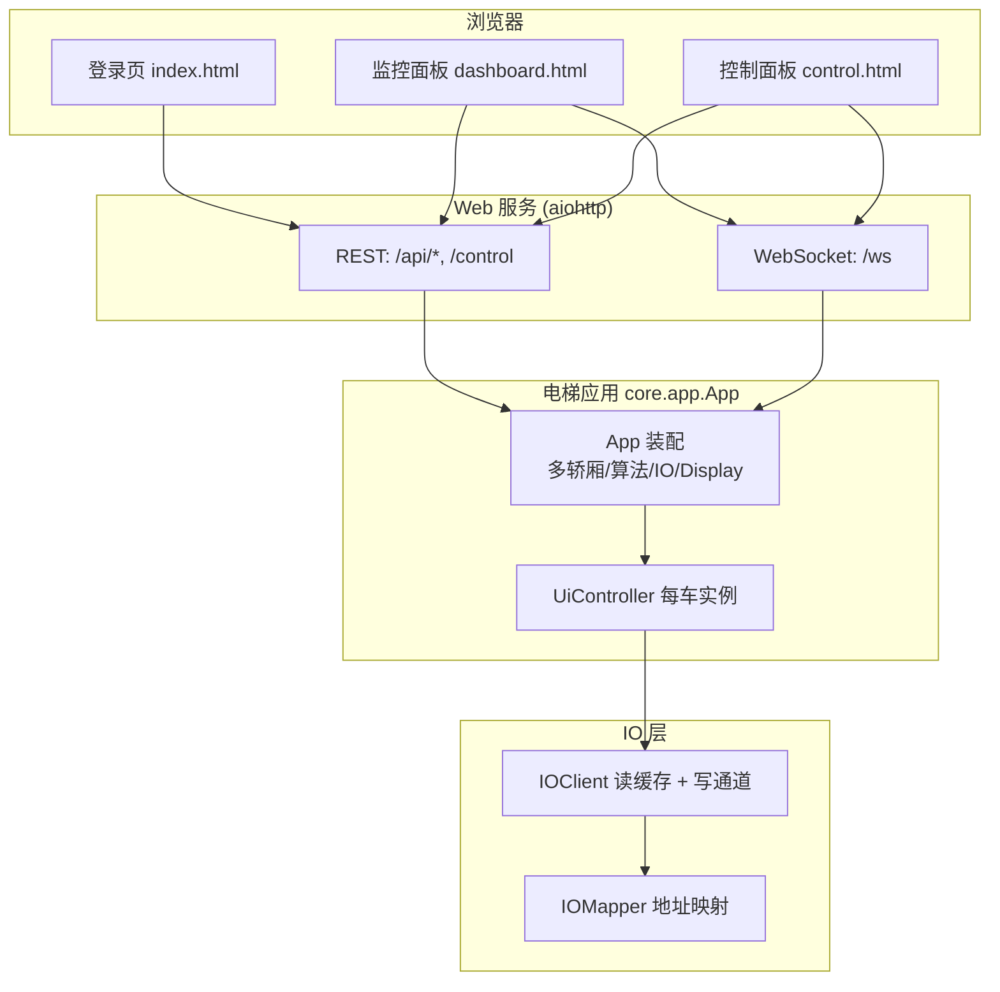
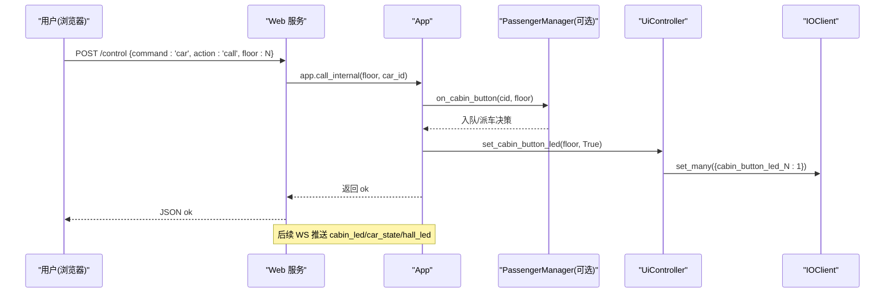
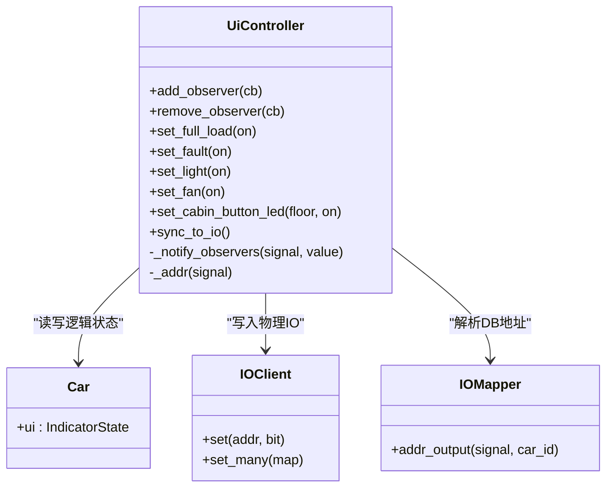
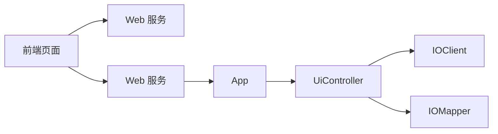

# 用户界面系统

<cite>
**本文引用的文件**   
- [core/app.py](file://core/app.py)
- [core/ui.py](file://core/ui.py)
- [web/server.py](file://web/server.py)
- [example_web/dashboard.html](file://example_web/dashboard.html)
- [example_web/control.html](file://example_web/control.html)
- [example_web/index.html](file://example_web/index.html)
- [config/ui_config.yaml](file://config/ui_config.yaml)
- [IO_UI.md](file://IO_UI.md)
</cite>

## 目录
1. [简介](#简介)
2. [项目结构](#项目结构)
3. [核心组件](#核心组件)
4. [架构总览](#架构总览)
5. [详细组件分析](#详细组件分析)
6. [依赖关系分析](#依赖关系分析)
7. [性能与实时性](#性能与实时性)
8. [故障排查指南](#故障排查指南)
9. [结论](#结论)
10. [附录：API 与信号映射](#附录api-与信号映射)

## 简介
本文件聚焦“用户界面系统”，覆盖从浏览器前端到后端 Web 服务、再到小脑 UI 控制器与 IO 输出的完整链路。该系统遵循三层架构：大脑（决策层）、小脑（物理层，含 UI 控制）、脑干（IO 层）。UI 不直接绑定硬件事件，所有写操作走 set_many 单一路径，由 IOClient tick 自动合并；读侧通过 WebSocket 推送实现低延迟刷新。

## 项目结构
围绕 UI 的关键文件组织如下：
- 后端 Web 服务：提供 REST API 与 WebSocket，负责状态聚合与广播
- 前端页面：登录页、监控面板、控制面板，使用 Win95 风格 UI
- UI 控制器：将逻辑状态同步至物理 IO，并支持观察者模式
- 配置：UI 行为参数（队列模式、关门延时、闪烁间隔等）

图表来源
- [web/server.py:285-307](file://web/server.py#L285-L307)
- [core/app.py:201-210](file://core/app.py#L201-L210)
- [core/ui.py:36-56](file://core/ui.py#L36-L56)

章节来源
- [web/server.py:285-307](file://web/server.py#L285-L307)
- [core/app.py:201-210](file://core/app.py#L201-L210)
- [core/ui.py:36-56](file://core/ui.py#L36-L56)

## 核心组件
- Web 服务（REST + WS）：统一入口 /control，状态查询 /stattrak，WS 推送 car_state/hall_led/cabin_led 等
- 前端页面：登录校验、状态轮询/WS 订阅、按钮交互、日志记录
- UiController：封装 set_xxx(bool) 方法，同步 Car.ui 逻辑状态到 IO 输出，支持观察者回调
- App 装配：为每部电梯创建独立 UiController，注入 per-car 写通道，避免并发拥堵
- 配置 ui_config.yaml：乘客交互相关 UI 行为（队列模式、关门延时、外召灯闪烁间隔等）

章节来源
- [web/server.py:131-172](file://web/server.py#L131-L172)
- [web/server.py:191-231](file://web/server.py#L191-L231)
- [core/ui.py:36-160](file://core/ui.py#L36-L160)
- [core/app.py:201-210](file://core/app.py#L201-L210)
- [config/ui_config.yaml:1-28](file://config/ui_config.yaml#L1-L28)

## 架构总览
下图展示一次“控制面板内召”的端到端流程：前端 → REST → App → 算法/调度 → UI 更新 → WS 推送 → 前端渲染。

图表来源
- [web/server.py:131-172](file://web/server.py#L131-L172)
- [core/app.py:569-605](file://core/app.py#L569-L605)
- [core/ui.py:120-131](file://core/ui.py#L120-L131)

## 详细组件分析

### Web 服务（REST + WebSocket）
- REST 路由
  - GET /stattrak：返回多车状态、算法名、模拟标志、初始化方向、用户模式等
  - POST /control：统一命令入口，支持 car call/door/stop/driver、system escape、module usermode/station_seek、settings slow_brake
  - 其他专用接口：/api/car/{id}/call、/api/car/{id}/door/{open|close}、/api/hall_call、/api/usermode、/api/reset
- WebSocket
  - 连接时推送 init_state（cars、hall_leds、meta）
  - 运行时推送 car_state、hall_led、cabin_led 等增量事件
  - 模块级客户端集合，失败连接清理

章节来源
- [web/server.py:53-172](file://web/server.py#L53-L172)
- [web/server.py:191-231](file://web/server.py#L191-L231)
- [web/server.py:285-307](file://web/server.py#L285-L307)

### 前端页面（登录/监控/控制）
- 登录页 index.html：简易 session 校验，登录后跳转监控面板
- 监控面板 dashboard.html
  - 通过 WS 接收 init_state 与增量事件，驱动卡片、建筑视图、日志
  - 工具栏显示算法、用户模式、模拟/实机、初始化方向、连接状态、时钟
- 控制面板 control.html
  - 内召按钮网格（1-10F），点击发送 /control 命令
  - 门控制、司机模式、急停、模块开关（usermode/station_seek/queue/slow_brake）
  - 响应区与历史记录，离线演示模式提示

章节来源
- [example_web/index.html:113-163](file://example_web/index.html#L113-L163)
- [example_web/dashboard.html:623-800](file://example_web/dashboard.html#L623-L800)
- [example_web/control.html:525-800](file://example_web/control.html#L525-L800)

### UI 控制器（小脑）
- 设计原则
  - 上层只通过 set_xxx(bool) 修改 UI，严禁直接赋值 car.ui.*
  - 读：car.ui.xxx 直读；写：app.ui[cid].set_xxx(...) 同时改逻辑状态与触发 IO 写入
  - 单一 IO 写路径：每次 set_xxx 调用一次 set_many，由 IOClient tick 自动合并
  - 事件驱动：每次 set_xxx 后通知注册的 observer，供调试监视器消费
- 主要能力
  - 轿厢指示灯：满载、故障、照明、风扇
  - 轿内按钮 LED：按楼层设置亮灭
  - 批量同步：reset/reload 后全量同步 Car.ui 到 IO

图表来源
- [core/ui.py:36-160](file://core/ui.py#L36-L160)

章节来源
- [core/ui.py:36-160](file://core/ui.py#L36-L160)

### App 装配与事件路由（小脑）
- 为每部电梯创建独立 UiController，注入 per-car 写通道，避免 6 部车共享写通道拥堵
- 注册 IO 监听器，将原始 IO 事件解析后转发给 PassengerManager（大脑），再由大脑决定 UI 亮灭策略
- 外召灯 observer 列表：当 hall indicator 变化时主动推送到 WS

章节来源
- [core/app.py:201-210](file://core/app.py#L201-L210)
- [core/app.py:541-622](file://core/app.py#L541-L622)
- [web/server.py:276-283](file://web/server.py#L276-L283)

### 配置（UI 行为）
- queue_mode：discard（过站丢弃）/ keep（全部保留）
- door_close_delay_ms：开门后等待多久关门
- closing_timeout_seconds：CLOSING 超时保护
- human_presence_off_delay：无人确认延时
- flash_interval_ms：外召灯闪烁间隔

章节来源
- [config/ui_config.yaml:1-28](file://config/ui_config.yaml#L1-L28)

## 依赖关系分析
- 前端依赖 Web 服务提供的 REST/WS
- Web 服务依赖 App 暴露的高层 API（如 call_internal、door_open/close、set_usermode 等）
- App 装配 UiController，并通过 IOClient/IOMapper 访问物理 IO
- UI 控制器仅依赖 IOClient 与 IOMapper，不感知高层业务逻辑

图表来源
- [web/server.py:285-307](file://web/server.py#L285-L307)
- [core/app.py:201-210](file://core/app.py#L201-L210)
- [core/ui.py:36-56](file://core/ui.py#L36-L56)

章节来源
- [web/server.py:285-307](file://web/server.py#L285-L307)
- [core/app.py:201-210](file://core/app.py#L201-L210)
- [core/ui.py:36-56](file://core/ui.py#L36-L56)

## 性能与实时性
- 写路径优化：每车独立 IOClient 写通道，避免 6 部车同时写造成 S7 read-modify-write 拥堵；tick 自动合并多次 set_many
- 读路径优化：WS 推送增量事件，前端本地缓存状态，减少轮询压力
- 外召灯闪烁：按配置间隔进行，避免频繁 IO 抖动
- 建议：在高频 UI 更新场景下优先使用 sync_to_io 一次性批量写入，降低 tick 次数

[本节为通用指导，无需具体文件引用]

## 故障排查指南
- 现象：控制面板按钮点击无反应
  - 检查 /control 是否返回 ok，查看网络请求与后端日志
  - 确认 App 已启动 Web 服务且端口未被占用
- 现象：WS 断开或状态不更新
  - 检查 WS 连接建立与重连逻辑，关注错误日志
  - 确认服务端 ws_broadcast 是否正常推送
- 现象：轿内按钮灯不亮
  - 确认 App 中 _on_cabin_button_event 是否被触发
  - 检查 UiController.set_cabin_button_led 是否调用成功，IO 地址是否在 io_config 中配置
- 现象：外召灯异常
  - 检查 App 的 _on_hall_call_event 边沿检测逻辑
  - 确认 _hall_indicator_state 与 WS 推送一致

章节来源
- [web/server.py:131-172](file://web/server.py#L131-L172)
- [web/server.py:191-231](file://web/server.py#L191-L231)
- [core/app.py:541-622](file://core/app.py#L541-L622)
- [core/ui.py:120-131](file://core/ui.py#L120-L131)

## 结论
该用户界面系统以“事件驱动 + 批量写合并”为核心，实现了前后端解耦、低延迟刷新与高并发写安全。UI 控制器作为小脑的一部分，严格遵循“上层只改逻辑状态、底层自动落盘 IO”的原则，配合 Web 服务的 REST/WS 双通道，提供了稳定可靠的可视化与操控体验。

[本节为总结，无需具体文件引用]

## 附录：API 与信号映射

### REST API 概览
- GET /stattrak：获取系统状态（多车状态、算法、模拟标志、初始化方向、用户模式）
- POST /control：统一命令入口（car call/door/stop/driver、system escape、module usermode/station_seek、settings slow_brake）
- 专用接口：/api/car/{id}/call、/api/car/{id}/door/{open|close}、/api/hall_call、/api/usermode、/api/reset

章节来源
- [web/server.py:53-172](file://web/server.py#L53-L172)
- [web/server.py:285-307](file://web/server.py#L285-L307)

### WebSocket 事件
- init_state：初始全量状态（cars、hall_leds、meta）
- car_state：增量更新某车状态
- hall_led：外召灯变化
- cabin_led：轿内按钮 LED 变化

章节来源
- [web/server.py:191-231](file://web/server.py#L191-L231)

### UI 信号映射（节选）
- set_full_load → full_load_indicator
- set_fault → fault_indicator
- set_light → light_indicator
- set_fan → fan_indicator
- set_cabin_button_led(N) → cabin_button_led_N
- App.set_hall_indicator(floor, dir, on) → hall_indicator_{dir}_{floor}

章节来源
- [IO_UI.md:128-146](file://IO_UI.md#L128-L146)
- [core/ui.py:86-131](file://core/ui.py#L86-L131)