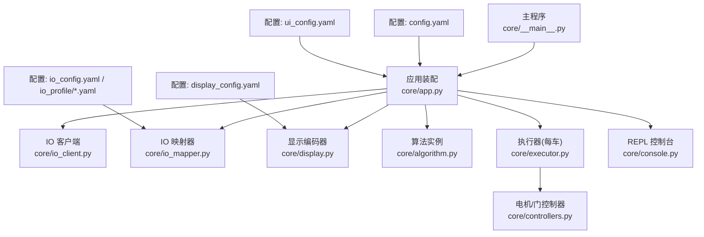
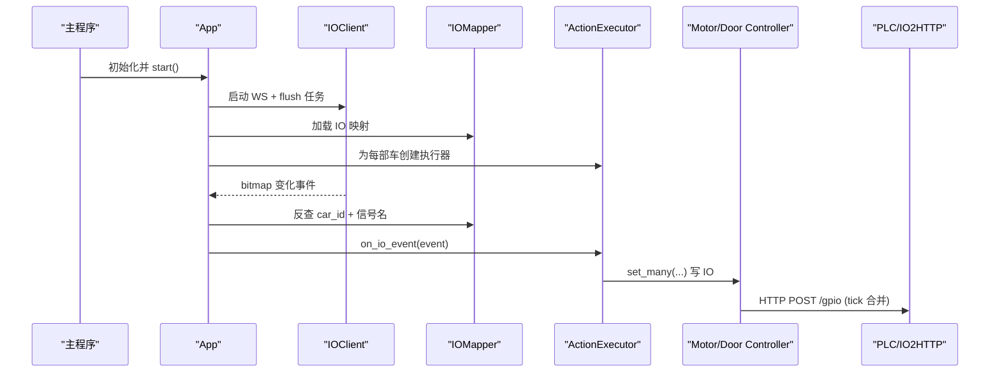
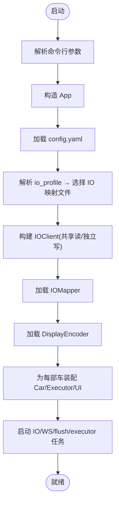
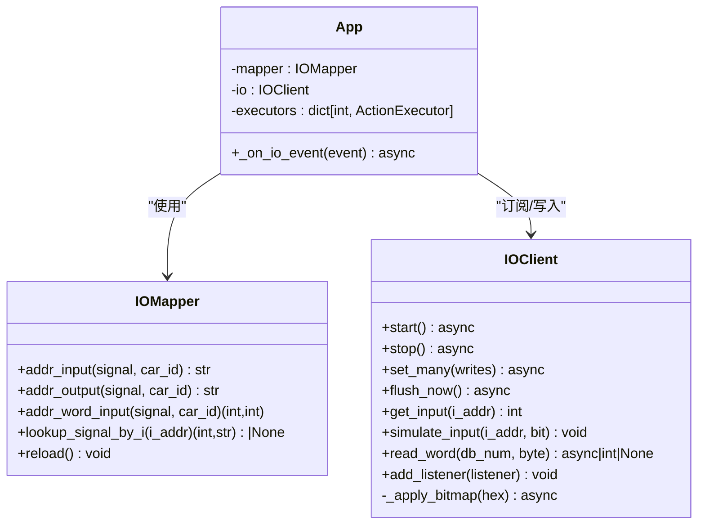
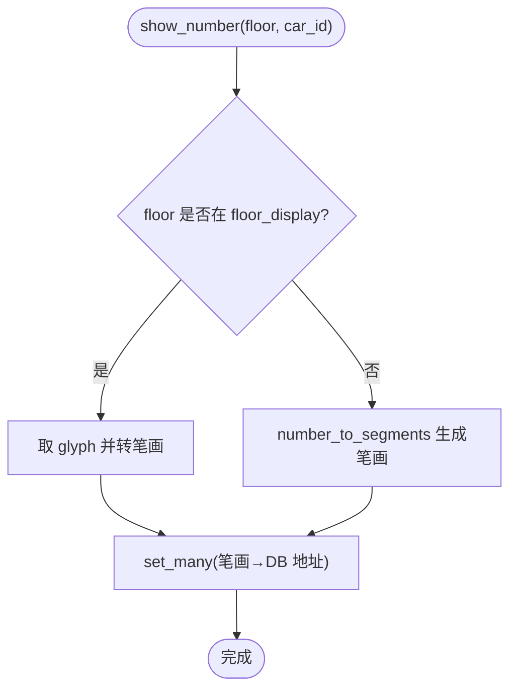
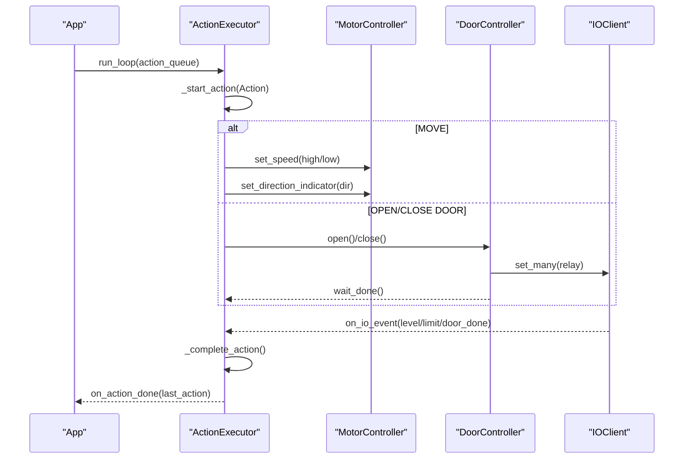
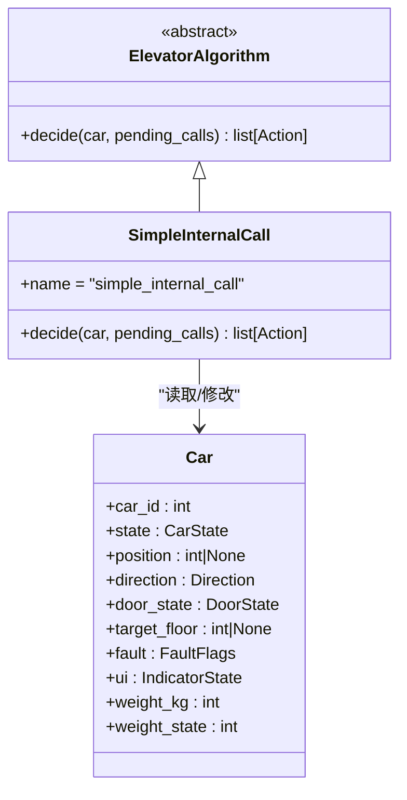
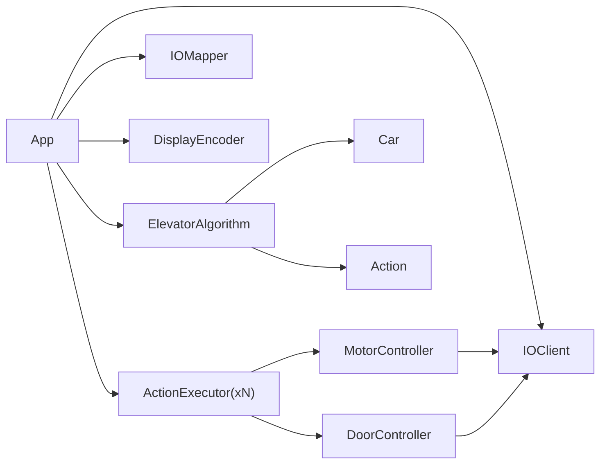

# 配置管理系统

<cite>
**本文引用的文件**   
- [config.yaml](file://config/config.yaml)
- [io_config.yaml](file://config/io_config.yaml)
- [display_config.yaml](file://config/display_config.yaml)
- [ui_config.yaml](file://config/ui_config.yaml)
- [competition.yaml](file://config/io_profile/competition.yaml)
- [local_train.yaml](file://config/io_profile/local_train.yaml)
- [app.py](file://core/app.py)
- [executor.py](file://core/executor.py)
- [controllers.py](file://core/controllers.py)
- [player.py](file://core/player.py)
- [actions.py](file://core/actions.py)
- [algorithm.py](file://core/algorithm.py)
- [display.py](file://core/display.py)
- [io_client.py](file://core/io_client.py)
- [io_mapper.py](file://core/io_mapper.py)
- [console.py](file://core/console.py)
- [__main__.py](file://core/__main__.py)
</cite>

## 目录
1. [简介](#简介)
2. [项目结构](#项目结构)
3. [核心组件](#核心组件)
4. [架构总览](#架构总览)
5. [详细组件分析](#详细组件分析)
6. [依赖关系分析](#依赖关系分析)
7. [性能与实时性](#性能与实时性)
8. [故障排查指南](#故障排查指南)
9. [结论](#结论)
10. [附录：配置项速查](#附录配置项速查)

## 简介
本仓库实现了一个面向西门子杯的电梯控制系统，采用“三层架构”：大脑（决策层）、小脑（物理层）、脑干（IO 层）。系统通过配置文件驱动 IO 映射、显示编码、UI 行为与运行参数，支持热重载与多场景切换。本文聚焦“配置管理系统”，从配置加载、解析、路由到运行时生效的全链路进行说明，并给出架构图、流程图与关键路径定位。

## 项目结构
- 配置中心
  - 主配置：config/config.yaml（选择 IO profile、IO2HTTP 地址、建筑/电梯参数、算法名、日志/Web 端口等）
  - IO 映射：config/io_config.yaml（输入 I 区、输出 DB 区、按轿厢分组）
  - 显示编码：config/display_config.yaml（7 段数码管笔画映射、楼层→字符映射）
  - UI 交互：config/ui_config.yaml（队列模式、关门延时、外召闪烁间隔等）
  - IO Profile：config/io_profile/*.yaml（比赛/训练等不同硬件点位表）
- 核心模块
  - 装配与生命周期：core/app.py
  - 执行器与控制器：core/executor.py, core/controllers.py
  - 玩家实体与动作：core/player.py, core/actions.py
  - 算法：core/algorithm.py
  - 显示编码器：core/display.py
  - IO 客户端与映射：core/io_client.py, core/io_mapper.py
  - REPL 控制台：core/console.py
  - 启动入口：core/__main__.py

图表来源
- [__main__.py:51-64](file://core/__main__.py#L51-L64)
- [app.py:62-138](file://core/app.py#L62-L138)
- [io_client.py:35-104](file://core/io_client.py#L35-L104)
- [io_mapper.py:19-31](file://core/io_mapper.py#L19-L31)
- [display.py:20-31](file://core/display.py#L20-L31)
- [algorithm.py:19-31](file://core/algorithm.py#L19-L31)
- [executor.py:29-86](file://core/executor.py#L29-L86)
- [controllers.py:28-177](file://core/controllers.py#L28-L177)
- [console.py:88-110](file://core/console.py#L88-L110)

章节来源
- [__main__.py:24-48](file://core/__main__.py#L24-L48)
- [app.py:62-138](file://core/app.py#L62-L138)

## 核心组件
- 配置加载与热重载
  - 主配置由 App 在启动时加载，支持 /reload 热重载；IO profile 冷切换（改完需重启），但可通过 io_profile 字段自动选择对应 profile 文件。
- IO 映射与事件分发
  - IOMapper 负责逻辑信号名 ↔ 物理地址的双向映射；IOClient 维护输入缓存并通过 WebSocket bitmap 增量派发事件。
- 显示编码
  - DisplayEncoder 根据 display_config.yaml 将楼层数字转换为笔画集合，再批量写入 IO。
- 执行器与控制器
  - ActionExecutor 将高层 Action 展开为具体 IO 序列；MotorController/DoorController 封装接触器、继电器、刹车等底层写操作。
- 算法与玩家
  - ElevatorAlgorithm 仅依赖 Car 状态与待处理召唤列表，输出 Action 列表；Car 是游戏化实体，不接触 IO 地址。
- 控制台与 Web
  - Console 提供 REPL 命令；Web 服务用于 HMI 展示（可选）。

章节来源
- [app.py:279-307](file://core/app.py#L279-L307)
- [io_mapper.py:33-76](file://core/io_mapper.py#L33-L76)
- [io_client.py:270-345](file://core/io_client.py#L270-L345)
- [display.py:33-61](file://core/display.py#L33-L61)
- [executor.py:186-201](file://core/executor.py#L186-L201)
- [controllers.py:28-177](file://core/controllers.py#L28-L177)
- [algorithm.py:19-49](file://core/algorithm.py#L19-L49)
- [player.py:70-95](file://core/player.py#L70-L95)
- [console.py:88-110](file://core/console.py#L88-L110)

## 架构总览
系统以 App 为中心装配各组件，按“大脑—小脑—脑干”分层协作，所有 IO 事件经 IOClient → IOMapper → App 路由至对应轿厢的 executor，再由控制器落盘到 PLC。

图表来源
- [__main__.py:51-64](file://core/__main__.py#L51-L64)
- [app.py:311-332](file://core/app.py#L311-L332)
- [io_client.py:367-410](file://core/io_client.py#L367-L410)
- [io_mapper.py:110-116](file://core/io_mapper.py#L110-L116)
- [executor.py:227-276](file://core/executor.py#L227-L276)
- [controllers.py:162-177](file://core/controllers.py#L162-L177)
- [io_client.py:189-206](file://core/io_client.py#L189-L206)

## 详细组件分析

### 配置加载与热重载流程
- 启动阶段
  - __main__.py 解析命令行参数，构造 App，调用 app.start()。
  - App._load_config() 读取 config.yaml；_resolve_io_config_path() 根据 io_profile 选择 io_profile/*.yaml 或回退默认 io_config.yaml。
  - 构建共享 IOClient（读+写），并为每部车创建独立 IOClient（只写，共享输入缓存）。
  - 加载 IOMapper、DisplayEncoder、算法实例，装配每部车的 Car/Executor/UI。
- 热重载
  - Console 的 /reload 会触发各组件 reload()，如 DisplayEncoder.reload()、IOMapper.reload()，以及 App 对部分配置的重新注入。

图表来源
- [__main__.py:51-64](file://core/__main__.py#L51-L64)
- [app.py:279-307](file://core/app.py#L279-L307)
- [app.py:80-138](file://core/app.py#L80-L138)
- [display.py:33-61](file://core/display.py#L33-L61)
- [io_mapper.py:33-76](file://core/io_mapper.py#L33-L76)

章节来源
- [__main__.py:24-48](file://core/__main__.py#L24-L48)
- [app.py:279-307](file://core/app.py#L279-L307)
- [app.py:80-138](file://core/app.py#L80-L138)
- [display.py:33-61](file://core/display.py#L33-L61)
- [io_mapper.py:33-76](file://core/io_mapper.py#L33-L76)

### IO 映射与事件分发
- IOMapper
  - 加载 input/output/word_per_car 三段映射，建立双向索引：信号名↔地址、地址↔(car_id, signal)。
  - 提供 addr_input/addr_output/addr_word_input 与 lookup_signal_by_i。
- IOClient
  - 维护 _input_cache/_output_cache，定时 flush 写缓冲区；WebSocket 接收 bitmap，按已知 I 地址过滤后派发 IOEvent。
  - 支持 simulate 模式与 word_read 接口（模拟量读取）。
- App 路由
  - _on_io_event 使用 mapper.lookup_signal_by_i 确定 car_id，转发给对应 executor.on_io_event。

图表来源
- [io_mapper.py:19-124](file://core/io_mapper.py#L19-L124)
- [io_client.py:35-104](file://core/io_client.py#L35-L104)
- [io_client.py:270-345](file://core/io_client.py#L270-L345)
- [app.py:476-487](file://core/app.py#L476-L487)

章节来源
- [io_mapper.py:33-76](file://core/io_mapper.py#L33-L76)
- [io_client.py:270-345](file://core/io_client.py#L270-L345)
- [app.py:476-487](file://core/app.py#L476-L487)

### 显示编码与 7 段数码管
- DisplayEncoder
  - 从 display_config.yaml 载入 segments/glyphs/floor_display/leading_zero_for_single_digit。
  - show_number(floor, car_id) 将楼层转为笔画集合，批量写入 IO。
- 运行时
  - executor 在平层计数与到站时刷新显示；App 在状态变更时也更新显示。

图表来源
- [display.py:64-86](file://core/display.py#L64-L86)
- [display.py:98-110](file://core/display.py#L98-L110)
- [display.py:131-139](file://core/display.py#L131-L139)

章节来源
- [display.py:33-61](file://core/display.py#L33-L61)
- [display.py:64-86](file://core/display.py#L64-L86)
- [display.py:98-110](file://core/display.py#L98-L110)

### 执行器与控制器（小脑）
- ActionExecutor
  - 从 ActionQueue 取出 Action，展开为 IO 序列；监听传感器确认完成；维护 Car 现实状态；完成后回调 app 层继续调度。
  - 包含站点吸附、auto-seek、紧急停止、关门超时自愈等保护逻辑。
- MotorController/DoorController
  - 封装电机接触器、速度档位、刹车组合、开关门继电器等写操作；DoorController 管理自身监听与结果返回。

图表来源
- [executor.py:186-201](file://core/executor.py#L186-L201)
- [executor.py:227-276](file://core/executor.py#L227-L276)
- [controllers.py:41-177](file://core/controllers.py#L41-L177)
- [io_client.py:189-206](file://core/io_client.py#L189-L206)

章节来源
- [executor.py:186-201](file://core/executor.py#L186-L201)
- [executor.py:227-276](file://core/executor.py#L227-L276)
- [controllers.py:41-177](file://core/controllers.py#L41-L177)

### 算法与玩家（大脑）
- ElevatorAlgorithm
  - 纯函数式 decide(car, pending_calls) → list[Action]；首版 SimpleInternalCall 响应内召，忽略门状态由控制层兜底。
- Car
  - 游戏化实体，包含位置、方向、门状态、故障标志、UI 指示灯、重量三态机属性等；不提供 IO 地址。

图表来源
- [algorithm.py:19-49](file://core/algorithm.py#L19-L49)
- [algorithm.py:51-113](file://core/algorithm.py#L51-L113)
- [player.py:70-95](file://core/player.py#L70-L95)

章节来源
- [algorithm.py:19-49](file://core/algorithm.py#L19-L49)
- [algorithm.py:51-113](file://core/algorithm.py#L51-L113)
- [player.py:70-95](file://core/player.py#L70-L95)

### 控制台与用户交互
- Console
  - 提供 /help、/car、/door、/module、/settings、/usermode、/competition、/reload 等命令；支持补全与历史。
  - /reload 触发配置热重载；/module station_seek 可动态启用站点吸附。

章节来源
- [console.py:88-110](file://core/console.py#L88-L110)
- [console.py:226-276](file://core/console.py#L226-L276)

## 依赖关系分析
- 组件耦合
  - App 强依赖 IOClient/IOMapper/DisplayEncoder/Algorithm/Executor；每车独立 Executor 与 IOClient（写通道）。
  - Executor 依赖 Controllers（Motor/Door）与 Display；Controllers 依赖 IOClient。
  - Algorithm 仅依赖 Player（Car）与 Actions，无 IO 耦合。
- 外部依赖
  - aiohttp/websockets 用于 HTTP/WS 通信；PyYAML 用于配置解析；prompt-toolkit 用于 REPL。

图表来源
- [app.py:80-138](file://core/app.py#L80-L138)
- [executor.py:77-86](file://core/executor.py#L77-L86)
- [controllers.py:28-177](file://core/controllers.py#L28-L177)
- [algorithm.py:19-49](file://core/algorithm.py#L19-L49)
- [player.py:70-95](file://core/player.py#L70-L95)
- [actions.py:15-28](file://core/actions.py#L15-L28)

章节来源
- [app.py:80-138](file://core/app.py#L80-L138)
- [executor.py:77-86](file://core/executor.py#L77-L86)
- [controllers.py:28-177](file://core/controllers.py#L28-L177)
- [algorithm.py:19-49](file://core/algorithm.py#L19-L49)
- [player.py:70-95](file://core/player.py#L70-L95)
- [actions.py:15-28](file://core/actions.py#L15-L28)

## 性能与实时性
- IO 写合并
  - IOClient 使用 tick_interval_ms 合并写缓冲，降低 HTTP 请求频率；多车独立写通道避免一次 POST 过大导致顺序竞争。
- 事件派发优化
  - IOClient 支持 set_known_i_addresses，bitmap 仅对已知 I 地址扫描，减少 800 位全量扫描开销。
- 显示与状态刷新
  - 显示与状态广播仅在必要时触发（如平层计数、到站），避免频繁网络/IO 操作。
- 建议
  - 合理设置 tick_interval_ms（默认 20ms）与 weight_poll_interval_ms（默认 1000ms），平衡延迟与负载。
  - 在大规模 IO 变化场景下优先使用 bitmap 而非 change_gpio 增量，确保一致性。

章节来源
- [io_client.py:179-206](file://core/io_client.py#L179-L206)
- [io_client.py:261-268](file://core/io_client.py#L261-L268)
- [app.py:114-138](file://core/app.py#L114-L138)

## 故障排查指南
- 常见问题
  - IO 未生效：检查 io_config.yaml 或 io_profile 中地址映射是否正确；确认 IOClient 已连接且 tick 正常。
  - 显示异常：检查 display_config.yaml 的 glyphs/floor_display 是否完整；确认 segment 名称与 IO 映射一致。
  - 门卡死：查看 door_complete_timeout 与 door_watchdog_timeout；关注 DoorController 的 done/breach/wrong_floor 结果。
  - 站点吸附异常：确认 station_seek 开启与 level_up/down 信号正确；观察 _level_seek_active 与 _level_correct_in_progress。
- 调试手段
  - Console 的 /debug show 系列命令可打开各类监视（平层、输入变化、WS 连接、执行日志、速度档位、门事件、重量事件等）。
  - 日志文件位于 logs/，App 会将 IO 输出与 UI 事件写入纯文件，便于离线分析。

章节来源
- [console.py:19-85](file://core/console.py#L19-L85)
- [app.py:177-190](file://core/app.py#L177-L190)
- [controllers.py:179-280](file://core/controllers.py#L179-L280)
- [executor.py:733-800](file://core/executor.py#L733-L800)

## 结论
本配置管理系统通过“配置即代码”的方式，将 IO 映射、显示编码、UI 行为与运行参数集中管理，配合 App 的装配与热重载机制，实现了灵活、可扩展、易运维的电梯控制系统。三层架构清晰解耦，算法层专注策略，执行层专注安全与实时，IO 层专注可靠传输与事件分发。

## 附录：配置项速查
- 主配置（config/config.yaml）
  - io_profile：选择 IO profile（competition/local_train/local_with_weight）
  - io2http：HTTP/WS 地址、tick_interval_ms、模拟量读取端点
  - building：min/max/top_base/bottom_base 楼层
  - elevator：car_ids、per_car_init、station_seek、slow_brake、door 相关超时、seek_drift_timeout_s、competition_init_timeout、per_car_weight、weight_poll_interval_ms
  - algorithm：算法名（simple_internal_call）
  - console：提示符
  - logging：日志级别
  - web：HMI 端口
- IO 映射（config/io_config.yaml 或 config/io_profile/*.yaml）
  - input.hall_call/per_car/auto_run
  - output.per_car/hall_indicator/ready
  - input.word_per_car.weight（db_num, byte）
- 显示编码（config/display_config.yaml）
  - leading_zero_for_single_digit
  - segments/glyphs/floor_display
- UI 交互（config/ui_config.yaml）
  - passenger.queue_mode、door_close_delay_ms、closing_timeout_seconds、human_presence_off_delay、flash_interval_ms

章节来源
- [config.yaml:1-107](file://config/config.yaml#L1-L107)
- [io_config.yaml:1-501](file://config/io_config.yaml#L1-L501)
- [display_config.yaml:1-62](file://config/display_config.yaml#L1-L62)
- [ui_config.yaml:1-28](file://config/ui_config.yaml#L1-L28)
- [competition.yaml:1-524](file://config/io_profile/competition.yaml#L1-L524)
- [local_train.yaml:1-501](file://config/io_profile/local_train.yaml#L1-L501)