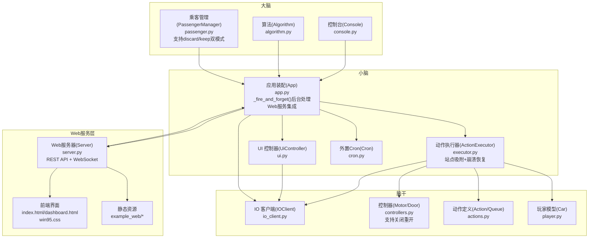
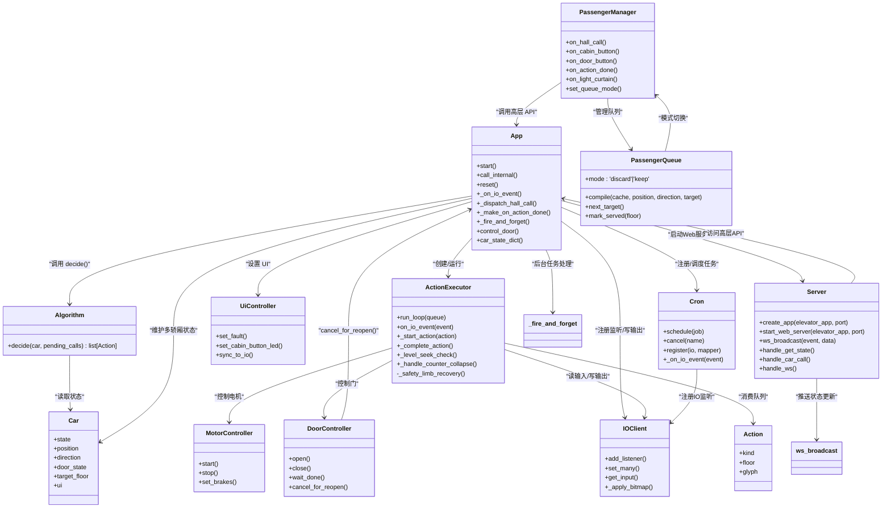
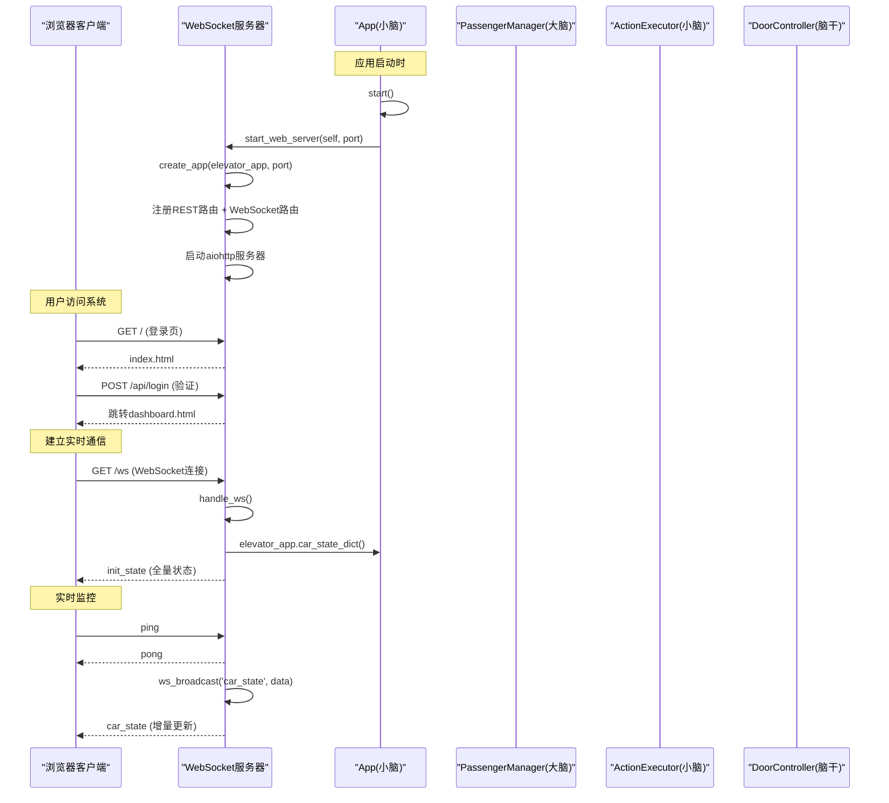
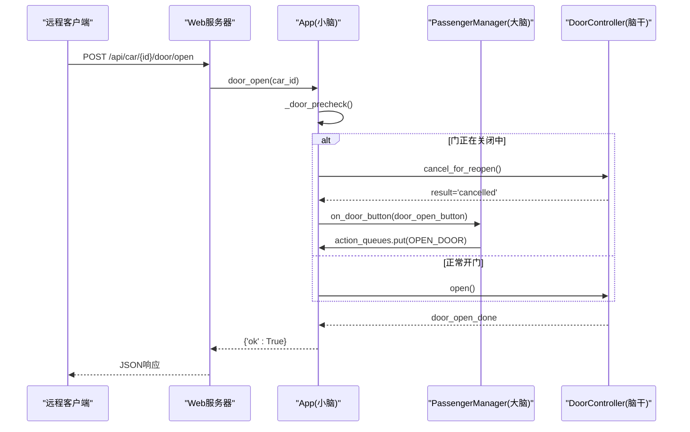
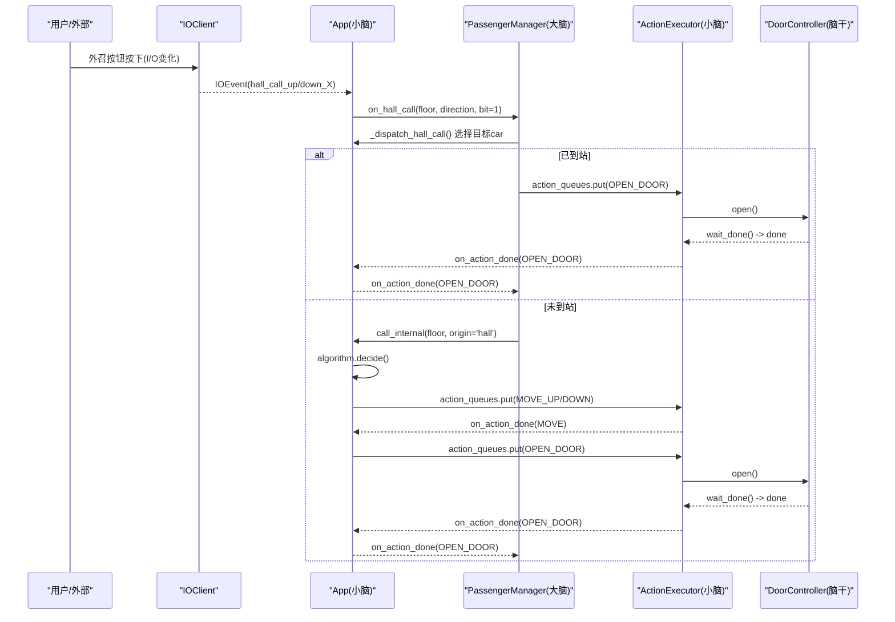
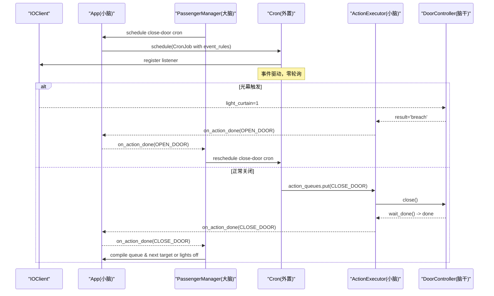
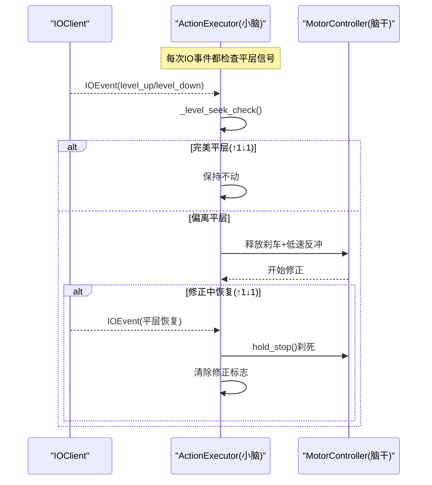
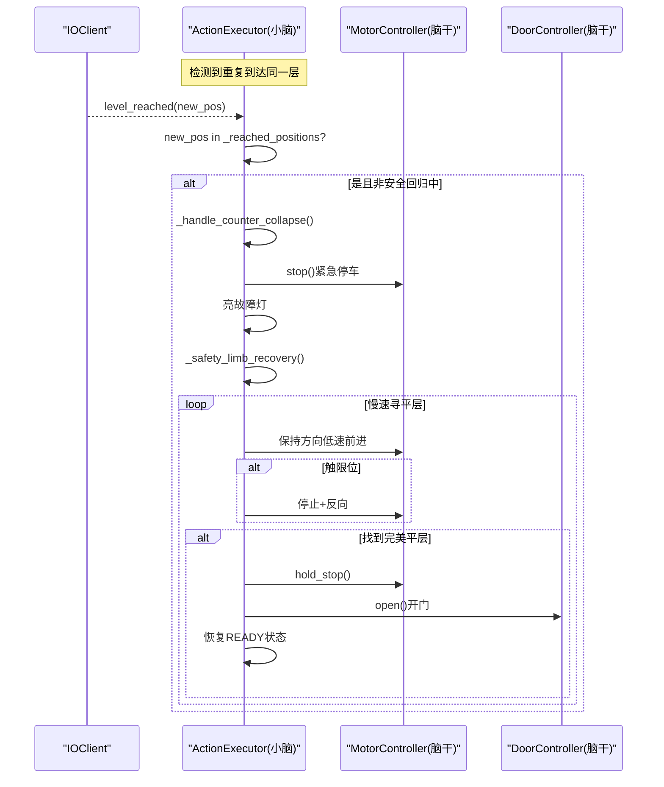
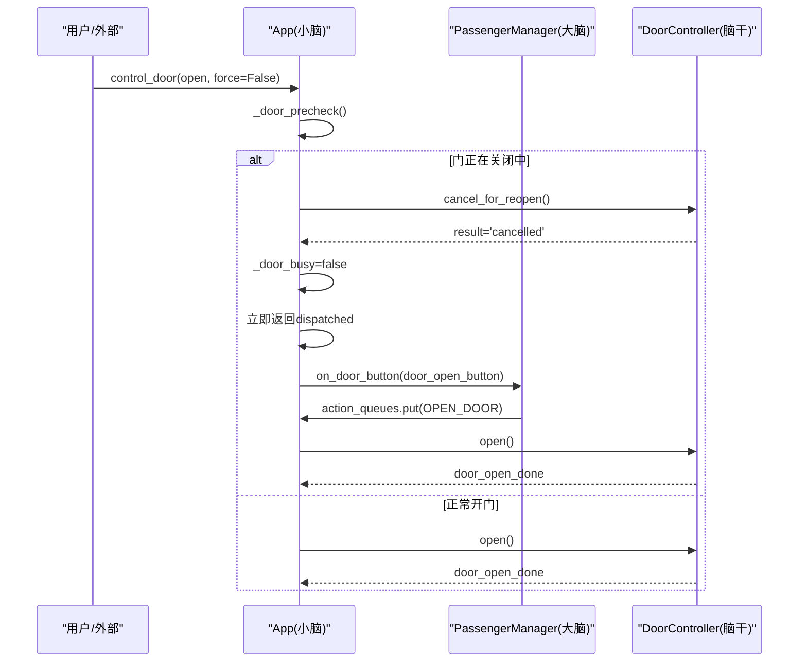
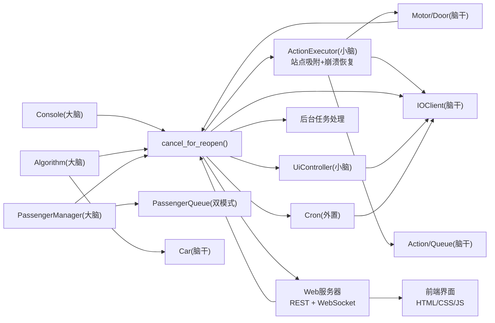

# 系统架构概览

<cite>
**本文引用的文件**   
- [core/app.py](file://core/app.py)
- [core/passenger.py](file://core/passenger.py)
- [core/executor.py](file://core/executor.py)
- [core/controllers.py](file://core/controllers.py)
- [core/io_client.py](file://core/io_client.py)
- [core/ui.py](file://core/ui.py)
- [core/actions.py](file://core/actions.py)
- [core/player.py](file://core/player.py)
- [core/console.py](file://core/console.py)
- [core/cron.py](file://core/cron.py)
- [web/server.py](file://web/server.py)
- [example_web/index.html](file://example_web/index.html)
- [example_web/dashboard.html](file://example_web/dashboard.html)
- [config/config.yaml](file://config/config.yaml)
</cite>

## 更新摘要
**所做更改**   
- 实现了从单体调度到分层架构的重大重构，明确了大脑（乘客管理）、小脑（应用逻辑）、脑干（硬件执行）的职责分离
- 新增了完整的Web服务器基础设施，提供WebSocket实时通信和RESTful API接口
- 增强了系统可靠性和用户体验，包括前端监控面板和登录界面
- 改进了配置参数如门操作超时时间、竞赛初始化超时等
- 完善了事件驱动通信模式和后台任务处理机制
- 更新了站点吸附系统的完全重写，从轮询模式改为事件驱动架构
- 新增了计数器式崩溃检测和自动安全回归找平层功能

## 目录
1. [简介](#简介)
2. [项目结构](#项目结构)
3. [核心组件](#核心组件)
4. [架构总览（大脑/小脑/脑干/Web服务）](#架构总览大脑小脑脑干web服务)
5. [分层职责与通信方式](#分层职责与通信方式)
6. [关键数据流与序列图](#关键数据流与序列图)
7. [依赖关系分析](#依赖关系分析)
8. [性能与实时性要点](#性能与实时性要点)
9. [故障与安全处理](#故障与安全处理)
10. [结论](#结论)

## 简介
本仓库采用"大脑/小脑/脑干/Web服务"四层架构，将电梯控制系统的决策、执行、IO通信与Web交互解耦：
- **大脑（决策层）**：用户交互 + 算法 + 乘客流程管理。只通过高层 API 与小脑交互，不接触任何 IO 事件。
- **小脑（物理层）**：运动 FSM + UI + 硬件控制编排。负责动作展开、传感器等待、状态同步与 UI 更新。
- **脑干（IO 层）**：WS + HTTP + 映射。提供输入缓存、批量写合并、事件分发等能力。
- **Web服务层（HMI层）**：RESTful API + WebSocket + 静态页面。提供实时监控、远程控制和管理界面。

各层之间通过事件总线与队列进行通信，禁止跳层调用，确保可测试性与可扩展性。

**更新** 新增了严格关注点分离原则、事件驱动通信模式、外置cron机制独立性、"电梯即玩家"设计理念以及完整的Web服务基础设施的详细说明。

## 项目结构
- core/app.py：装配多轿厢、共享 IOClient/IOMapper/DisplayEncoder/Algorithm；暴露高层 API；IO 事件路由到对应 executor；新增_fire_and_forget()后台任务处理；集成Web服务启动。
- core/passenger.py：乘客交互管理器（大脑），维护独立乘客队列与关门/熄灯 cron，支持'discard'和'keep'双模式队列。
- core/executor.py：硬件层 FSM，Action → IO 序列 + 等传感器确认；新增站点吸附事件驱动系统和崩溃恢复机制。
- core/controllers.py：电机/门控制器封装，屏蔽 IO 地址细节，支持关闭过程中重新开启。
- core/io_client.py：异步 IO2HTTP 客户端，WS 订阅 + HTTP POST 批量写 + 输入缓存。
- core/ui.py：UI 指示灯控制器，统一 set_many 路径，由 IOClient tick 自动合并。
- core/actions.py：动作抽象与队列，连接算法层与硬件层。
- core/player.py：Car 实体（游戏化建模），仅包含现实状态，不含 IO 地址。
- core/console.py：REPL 控制台，命令入口，调用 App 高层 API。
- core/cron.py：外置事件驱动定时器，支持事件规则的重调度与自毁机制。
- web/server.py：aiohttp Web服务器，提供REST API + WebSocket实时通信 + 静态页面托管。
- example_web/*：前端界面文件，包含登录页、监控面板和控制界面。

**图表来源**
- [core/app.py:41-169](file://core/app.py#L41-L169)
- [core/passenger.py:39-110](file://core/passenger.py#L39-L110)
- [core/executor.py:27-131](file://core/executor.py#L27-L131)
- [core/controllers.py:182-248](file://core/controllers.py#L182-L248)
- [core/io_client.py:33-118](file://core/io_client.py#L33-L118)
- [core/ui.py:32-132](file://core/ui.py#L32-L132)
- [core/actions.py:15-74](file://core/actions.py#L15-L74)
- [core/player.py:68-123](file://core/player.py#L68-L123)
- [core/cron.py:57-148](file://core/cron.py#L57-L148)
- [web/server.py:1-320](file://web/server.py#L1-L320)

## 核心组件
- **算法（ElevatorAlgorithm）**：纯函数式决策，输入 Car + pending_calls，输出 Action 列表。
- **乘客管理（PassengerManager）**：外召派车、内召缓存、关门/熄灯 cron、独立 PassengerQueue，支持'discard'和'keep'双模式。
- **应用装配（App）**：启动 IO、注册监听、按 car_id 路由事件、协调算法与执行器、暴露高层 API；新增_fire_and_forget()后台任务处理；集成Web服务启动。
- **执行器（ActionExecutor）**：FSM 驱动，Action → IO 序列，等传感器完成，回调 app 继续调度；新增站点吸附事件驱动系统和崩溃恢复机制。
- **控制器（MotorController/DoorController）**：屏蔽 IO 地址，提供 start/stop/open/close 等高层方法，支持关闭过程中重新开启。
- **IO 客户端（IOClient）**：WS 订阅 + HTTP 批量写 + 输入缓存 + 事件分发。
- **UI 控制器（UiController）**：统一 set_many 路径，tick 合并写入。
- **动作（Action/ActionQueue）**：高层抽象，隔离 IO 细节。
- **玩家（Car）**：电梯实体，仅含状态，不含 IO 地址。
- **外置Cron（Cron）**：事件驱动延时定时器，支持事件规则的重调度与自毁机制。
- **Web服务器（Server）**：aiohttp应用，提供REST API、WebSocket实时通信、静态文件托管。
- **前端界面**：Win95风格登录界面、实时监控面板、控制面板。

**章节来源**
- [core/passenger.py:39-110](file://core/passenger.py#L39-L110)
- [core/app.py:41-54](file://core/app.py#L41-L54)
- [core/controllers.py:216-225](file://core/controllers.py#L216-L225)
- [web/server.py:263-319](file://web/server.py#L263-L319)

## 架构总览（大脑/小脑/脑干/Web服务）

**图表来源**
- [core/app.py:41-54](file://core/app.py#L41-L54)
- [core/passenger.py:39-110](file://core/passenger.py#L39-L110)
- [core/controllers.py:216-225](file://core/controllers.py#L216-L225)
- [web/server.py:263-319](file://web/server.py#L263-L319)

## 分层职责与通信方式

### 大脑（算法 + 乘客管理 + 控制台）
- **职责**：策略决策、乘客流程编排、用户交互。
- **通信**：通过 App 的高层 API（如 call_internal、action_queues.put、ui.set_xxx）与小脑交互；不注册 IO 监听器。
- **关注点分离**：完全不知道 IO 地址，不 import io/ 任何东西，保持纯函数式决策。
- **队列模式支持**：PassengerQueue 支持'discard'和'keep'两种操作模式，可通过配置动态切换。

### 小脑（App + Executor + UI + 外置Cron）
- **职责**：IO 事件路由、动作编排、FSM 执行、UI 同步、定时任务管理。
- **通信**：接收 IO 事件并转发到大脑；将算法输出的 Action 入队；驱动控制器与显示。
- **后台任务处理**：新增_fire_and_forget()函数，为后台任务提供统一的异常处理和日志记录。
- **外置Cron独立性**：Cron 作为独立模块，不属于特定架构层，被小脑使用但保持松耦合。
- **站点吸附事件驱动**：完全重写为事件驱动架构，使用后台任务监听电平信号替代轮询。
- **Web服务集成**：在启动时自动加载并启动Web服务器，提供REST API和WebSocket通信。

### 脑干（IOClient + Controllers + Actions + Player）
- **职责**：网络通信、信号映射、批量写合并、传感器事件分发、底层设备控制。
- **通信**：向小脑派发 IOEvent；接受小脑的 set_many 指令；为算法提供 Car 状态。
- **玩家抽象**：Car 作为"玩家"实体，仅包含现实状态，不含 IO 地址，便于算法层操作。
- **门操作改进**：DoorController支持关闭过程中的重新开启，通过cancel_for_reopen()方法实现无缝切换。
- **崩溃恢复机制**：新增计数器式崩溃检测和自动安全回归找平层功能。

### Web服务层（Server + 前端界面）
- **职责**：提供RESTful API接口、WebSocket实时通信、静态页面托管、用户认证和权限管理。
- **通信**：通过App的高层API访问电梯控制系统；通过WebSocket向客户端推送实时状态；提供HTTP REST接口供外部系统集成。
- **实时通信**：WebSocket连接建立时推送初始全量状态，后续通过事件广播推送增量更新。
- **前端界面**：Win95风格的登录界面和监控面板，支持电梯状态可视化、远程控制、系统配置等功能。
- **配置管理**：支持运行时修改配置参数，如门操作超时时间、竞赛初始化超时等。

**更新** 强调了严格的关注点分离原则、外置cron机制的独立性、"电梯即玩家"的设计理念，以及新增的双模式队列支持、后台任务处理机制、站点吸附事件驱动、崩溃恢复功能和完整的Web服务基础设施。

**章节来源**
- [core/passenger.py:39-110](file://core/passenger.py#L39-L110)
- [core/app.py:41-54](file://core/app.py#L41-L54)
- [core/controllers.py:216-225](file://core/controllers.py#L216-L225)
- [web/server.py:263-319](file://web/server.py#L263-L319)

## 关键数据流与序列图

### Web服务启动与WebSocket通信流程

**图表来源**
- [core/app.py:345-354](file://core/app.py#L345-L354)
- [web/server.py:311-319](file://web/server.py#L311-L319)
- [web/server.py:191-231](file://web/server.py#L191-L231)

### REST API调用流程（远程开门控制）

**图表来源**
- [web/server.py:85-96](file://web/server.py#L85-L96)
- [core/app.py:1105-1161](file://core/app.py#L1105-L1161)
- [core/controllers.py:216-225](file://core/controllers.py#L216-L225)

### 外召派车与开门流程（用户模式）

**图表来源**
- [core/app.py:303-348](file://core/app.py#L303-348)
- [core/passenger.py:190-212](file://core/passenger.py#L190-212)
- [core/executor.py:632-646](file://core/executor.py#L632-646)
- [core/controllers.py:184-204](file://core/controllers.py#L184-L204)

### 关门与光幕防夹流程

**图表来源**
- [core/passenger.py:348-398](file://core/passenger.py#L348-398)
- [core/executor.py:648-660](file://core/executor.py#L648-660)
- [core/controllers.py:262-284](file://core/controllers.py#L262-L284)
- [core/cron.py:87-148](file://core/cron.py#L87-L148)

### 站点吸附事件驱动系统（完全重写）

**图表来源**
- [core/executor.py:551-587](file://core/executor.py#L551-587)
- [core/executor.py:244-246](file://core/executor.py#L244-246)

### 计数器崩溃检测与自动安全回归

**图表来源**
- [core/executor.py:512-515](file://core/executor.py#L512-515)
- [core/executor.py:1008-1041](file://core/executor.py#L1008-1041)
- [core/executor.py:1043-1131](file://core/executor.py#L1043-L1131)

### 门操作关闭过程中重新开启

**图表来源**
- [core/app.py:1105-1161](file://core/app.py#L1105-L1161)
- [core/controllers.py:216-225](file://core/controllers.py#L216-L225)
- [core/passenger.py:276-288](file://core/passenger.py#L276-L288)

## 依赖关系分析
- **大脑对 IO 无直接依赖**，仅通过 App 暴露的 API 进行交互。
- **小脑依赖算法、执行器、UI、IOClient、Cron**，承担事件路由与动作编排。
- **脑干提供 IO 通信与设备控制**，被小脑和控制器使用。
- **动作与玩家模型作为跨层契约**，避免高层耦合 IO 细节。
- **外置Cron独立于架构层**，通过事件规则与IOClient解耦。
- **Web服务层依赖App高层API**，通过REST和WebSocket与核心系统交互。
- **新增依赖**：_fire_and_forget()函数为后台任务提供统一的异常处理。
- **新增依赖**：站点吸附事件驱动系统与崩溃恢复机制集成在executor中。
- **新增依赖**：Web服务器与前端界面的静态资源管理。

**图表来源**
- [core/app.py:41-54](file://core/app.py#L41-L54)
- [core/passenger.py:39-110](file://core/passenger.py#L39-L110)
- [core/controllers.py:216-225](file://core/controllers.py#L216-L225)
- [web/server.py:263-319](file://web/server.py#L263-L319)

## 性能与实时性要点
- **每部电梯独立的 io_write 实例**，避免 6 部车共享 write_buffer 导致单次 flush 过多地址拥堵。
- **IOClient 定时 tick 合并写操作**，减少 HTTP POST 次数。
- **站点吸附保持模式事件驱动**，无轮询 sleep，仅在需要时微动反冲。
- **外置Cron采用事件驱动**，使用 asyncio.Event wakeup，零轮询，高效节能。
- **紧急停止与限位保护优先于常规逻辑**，确保安全性与响应速度。
- **新增**：_fire_and_forget()函数防止后台任务异常被吞掉，提升系统稳定性。
- **新增**：门操作关闭过程中重新开启的即时响应，无需等待物理完成。
- **新增**：站点吸附完全重写为事件驱动架构，使用后台任务监听电平信号替代轮询。
- **新增**：计数器式崩溃检测提供快速故障响应，自动安全回归确保系统恢复。
- **新增**：WebSocket实时通信，支持增量状态推送，减少网络带宽占用。
- **新增**：REST API异步处理，避免阻塞主事件循环。
- **新增**：静态文件缓存优化，提升前端加载性能。

**更新** 新增了外置Cron的事件驱动特性、后台任务异常处理机制、门操作改进的性能优势，以及站点吸附事件驱动和崩溃恢复机制的性能优化说明，还包括Web服务的实时通信性能和前端界面优化。

**章节来源**
- [core/app.py:41-54](file://core/app.py#L41-L54)
- [core/app.py:1105-1161](file://core/app.py#L1105-L1161)
- [core/controllers.py:216-225](file://core/controllers.py#L216-L225)
- [web/server.py:244-256](file://web/server.py#L244-L256)

## 故障与安全处理
- **2 限位触发立即急停**，清所有输出与长寿命状态，置 FAULT。
- **错误楼层开门检测**：若门锁与位置不符，强制关门并报错。
- **光幕触发在关门过程中反转开门**，并重新安排关门 cron。
- **重置流程清理 executor 瞬态状态与 cron**，恢复 READY。
- **外置Cron支持事件规则自毁**，防止任务泄漏和资源浪费。
- **新增**：后台任务异常统一处理，通过_fire_and_forget()记录异常信息。
- **新增**：门操作关闭过程中重新开启的安全处理，确保状态一致性。
- **新增**：计数器式崩溃检测，检测到重复到达同一层时触发安全回归。
- **新增**：自动安全回归找平层功能，慢速寻平层→触限位反冲→完美平层→开门停车。
- **新增**：Web服务异常处理，确保HTTP请求和WebSocket连接的稳定性。
- **新增**：前端界面错误提示和用户友好的错误反馈。
- **新增**：配置参数超时保护，如门操作超时、竞赛初始化超时等。

**更新** 新增了后台任务异常处理机制、门操作安全处理、计数器式崩溃检测和自动安全回归功能的说明，还包括Web服务的安全处理和前端界面的错误管理机制。

**章节来源**
- [core/app.py:41-54](file://core/app.py#L41-L54)
- [core/app.py:1105-1161](file://core/app.py#L1105-L1161)
- [core/controllers.py:216-225](file://core/controllers.py#L216-L225)
- [config/config.yaml:52-62](file://config/config.yaml#L52-L62)

## 结论
该架构以清晰的四层划分实现了高内聚、低耦合的电梯控制系统：
- **大脑专注策略与流程**，不受 IO 细节干扰，保持纯函数式决策，支持灵活的队列模式配置。
- **小脑负责编排与执行**，保证安全与实时，集成外置Cron进行任务管理，新增后台任务异常处理机制，完全重写站点吸附为事件驱动架构。
- **脑干提供稳定可靠的 IO 通道与设备控制**，通过"电梯即玩家"抽象简化算法层操作，支持门操作的灵活控制，新增崩溃恢复机制。
- **Web服务层提供现代化的用户界面和远程管理能力**，通过REST API和WebSocket实现实时监控和远程控制，支持多客户端并发访问。
- **严格的关注点分离**确保各层职责清晰，**事件驱动通信模式**替代轮询提升性能，**外置Cron机制**提供灵活的定时任务管理能力。
- **新增的双模式队列支持**提升了乘客管理的灵活性，**后台任务异常处理**增强了系统稳定性，**门操作改进**优化了用户体验。
- **新增的站点吸附事件驱动系统**提供了更高效的平层保持能力，**计数器式崩溃检测与自动安全回归**确保了系统的可靠性和自愈能力。
- **新增的Web服务基础设施**提供了完整的监控系统、远程控制接口和现代化用户界面，支持实时状态推送和异步API调用。

通过事件总线与队列通信，系统具备良好的扩展性与可测试性，便于后续引入更多算法与功能模块。Web服务层的加入使得系统具备了现代化的监控和管理能力，为未来的智能化发展奠定了坚实基础。

**更新** 总结了新的架构特性，包括严格关注点分离、事件驱动通信、外置Cron独立性、"电梯即玩家"设计理念，以及新增的双模式队列支持、后台任务异常处理、门操作改进、站点吸附事件驱动、崩溃恢复机制和完整的Web服务基础设施的综合优势。