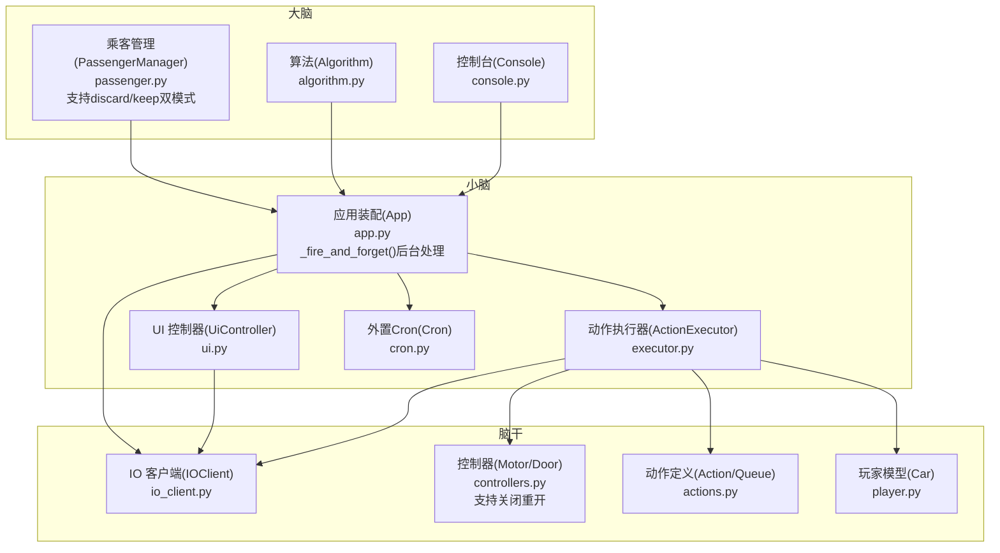
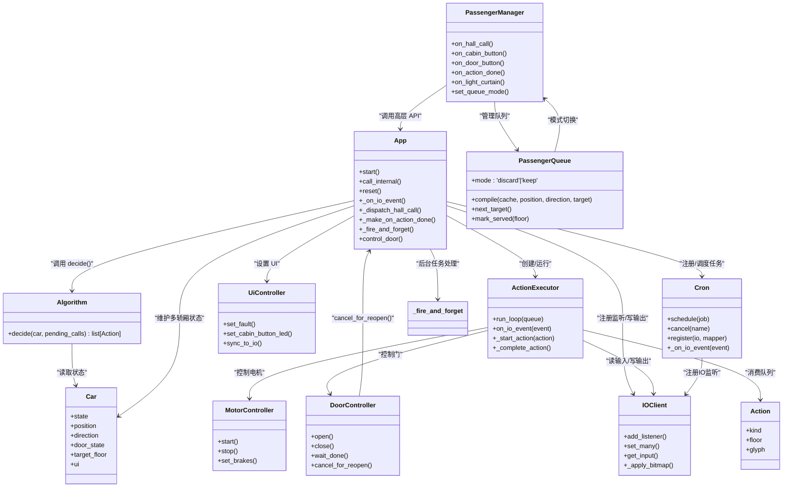
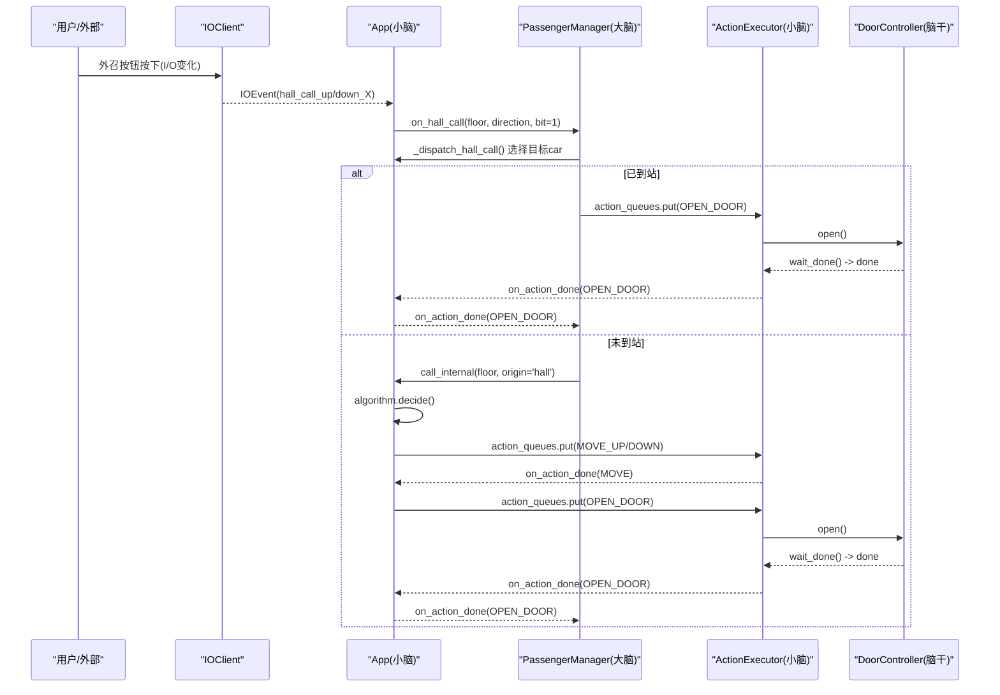
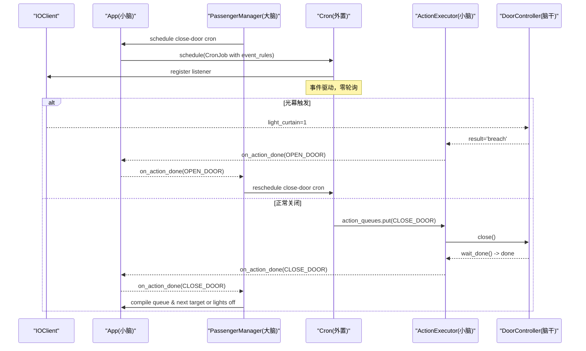
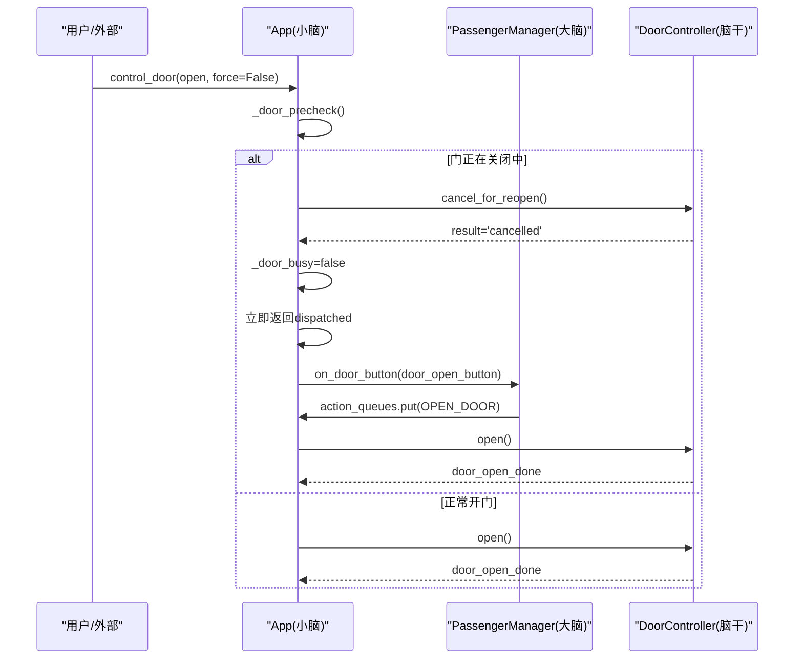
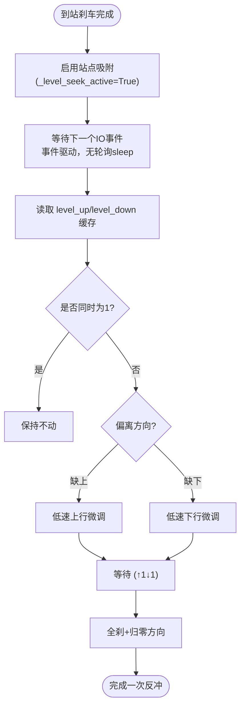
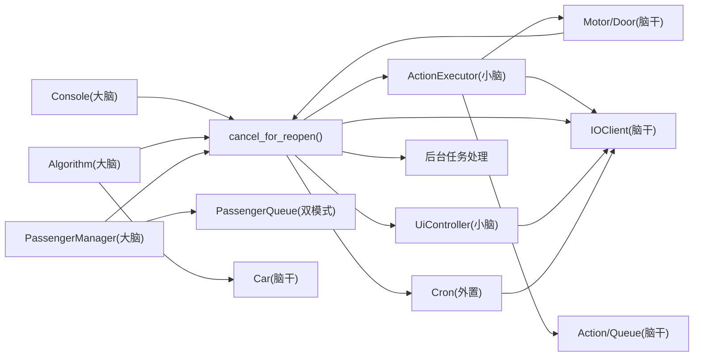

# 系统架构概览

<cite>
**本文引用的文件**   
- [core/app.py](file://core/app.py)
- [core/passenger.py](file://core/passenger.py)
- [core/executor.py](file://core/executor.py)
- [core/controllers.py](file://core/controllers.py)
- [core/io_client.py](file://core/io_client.py)
- [core/ui.py](file://core/ui.py)
- [core/actions.py](file://core/actions.py)
- [core/player.py](file://core/player.py)
- [core/console.py](file://core/console.py)
- [core/cron.py](file://core/cron.py)
</cite>

## 更新摘要
**所做更改**   
- 增强了三层架构的详细解释，突出严格的关注点分离原则
- 详细说明了事件驱动通信模式如何替代轮询和sleep方法
- 明确了外置cron机制不属于特定架构层的设计决策
- 深入解释了"电梯即玩家"隐喻的具体实现方式和设计理念
- 更新了架构图和数据流图以反映最新的架构设计
- **新增**：乘客管理系统队列架构的'discard'和'keep'双模式支持
- **新增**：应用层_fire_and_forget()后台任务异常处理机制
- **新增**：门操作关闭过程中重新开启的改进处理逻辑

## 目录
1. [简介](#简介)
2. [项目结构](#项目结构)
3. [核心组件](#核心组件)
4. [架构总览（大脑/小脑/脑干）](#架构总览大脑小脑脑干)
5. [分层职责与通信方式](#分层职责与通信方式)
6. [关键数据流与序列图](#关键数据流与序列图)
7. [依赖关系分析](#依赖关系分析)
8. [性能与实时性要点](#性能与实时性要点)
9. [故障与安全处理](#故障与安全处理)
10. [结论](#结论)

## 简介
本仓库采用"大脑/小脑/脑干"三层架构，将电梯控制系统的决策、执行与 IO 通信解耦：
- **大脑（决策层）**：用户交互 + 算法 + 乘客流程管理。只通过高层 API 与小脑交互，不接触任何 IO 事件。
- **小脑（物理层）**：运动 FSM + UI + 硬件控制编排。负责动作展开、传感器等待、状态同步与 UI 更新。
- **脑干（IO 层）**：WS + HTTP + 映射。提供输入缓存、批量写合并、事件分发等能力。

各层之间通过事件总线与队列进行通信，禁止跳层调用，确保可测试性与可扩展性。

**更新** 新增了严格关注点分离原则、事件驱动通信模式、外置cron机制独立性和"电梯即玩家"设计理念的详细说明。

## 项目结构
- core/app.py：装配多轿厢、共享 IOClient/IOMapper/DisplayEncoder/Algorithm；暴露高层 API；IO 事件路由到对应 executor；新增_fire_and_forget()后台任务处理。
- core/passenger.py：乘客交互管理器（大脑），维护独立乘客队列与关门/熄灯 cron，支持'discard'和'keep'双模式队列。
- core/executor.py：硬件层 FSM，Action → IO 序列 + 等传感器确认。
- core/controllers.py：电机/门控制器封装，屏蔽 IO 地址细节，支持关闭过程中重新开启。
- core/io_client.py：异步 IO2HTTP 客户端，WS 订阅 + HTTP POST 批量写 + 输入缓存。
- core/ui.py：UI 指示灯控制器，统一 set_many 路径，由 IOClient tick 自动合并。
- core/actions.py：动作抽象与队列，连接算法层与硬件层。
- core/player.py：Car 实体（游戏化建模），仅包含现实状态，不含 IO 地址。
- core/console.py：REPL 控制台，命令入口，调用 App 高层 API。
- core/cron.py：外置事件驱动定时器，支持事件规则的重调度与自毁机制。

**图表来源**
- [core/app.py:41-169](file://core/app.py#L41-L169)
- [core/passenger.py:39-110](file://core/passenger.py#L39-L110)
- [core/executor.py:27-131](file://core/executor.py#L27-L131)
- [core/controllers.py:182-248](file://core/controllers.py#L182-L248)
- [core/io_client.py:33-118](file://core/io_client.py#L33-L118)
- [core/ui.py:32-132](file://core/ui.py#L32-L132)
- [core/actions.py:15-74](file://core/actions.py#L15-L74)
- [core/player.py:68-123](file://core/player.py#L68-L123)
- [core/cron.py:57-148](file://core/cron.py#L57-L148)

## 核心组件
- **算法（ElevatorAlgorithm）**：纯函数式决策，输入 Car + pending_calls，输出 Action 列表。
- **乘客管理（PassengerManager）**：外召派车、内召缓存、关门/熄灯 cron、独立 PassengerQueue，支持'discard'和'keep'双模式。
- **应用装配（App）**：启动 IO、注册监听、按 car_id 路由事件、协调算法与执行器、暴露高层 API；新增_fire_and_forget()后台任务处理。
- **执行器（ActionExecutor）**：FSM 驱动，Action → IO 序列，等传感器完成，回调 app 继续调度。
- **控制器（MotorController/DoorController）**：屏蔽 IO 地址，提供 start/stop/open/close 等高层方法，支持关闭过程中重新开启。
- **IO 客户端（IOClient）**：WS 订阅 + HTTP 批量写 + 输入缓存 + 事件分发。
- **UI 控制器（UiController）**：统一 set_many 路径，tick 合并写入。
- **动作（Action/ActionQueue）**：高层抽象，隔离 IO 细节。
- **玩家（Car）**：电梯实体，仅含状态，不含 IO 地址。
- **外置Cron（Cron）**：事件驱动延时定时器，支持事件规则的重调度与自毁机制。

**章节来源**
- [core/passenger.py:39-110](file://core/passenger.py#L39-L110)
- [core/app.py:41-54](file://core/app.py#L41-L54)
- [core/controllers.py:216-225](file://core/controllers.py#L216-L225)

## 架构总览（大脑/小脑/脑干）

**图表来源**
- [core/app.py:41-54](file://core/app.py#L41-L54)
- [core/passenger.py:39-110](file://core/passenger.py#L39-L110)
- [core/controllers.py:216-225](file://core/controllers.py#L216-L225)

## 分层职责与通信方式

### 大脑（算法 + 乘客管理 + 控制台）
- **职责**：策略决策、乘客流程编排、用户交互。
- **通信**：通过 App 的高层 API（如 call_internal、action_queues.put、ui.set_xxx）与小脑交互；不注册 IO 监听器。
- **关注点分离**：完全不知道 IO 地址，不 import io/ 任何东西，保持纯函数式决策。
- **队列模式支持**：PassengerQueue 支持'discard'和'keep'两种操作模式，可通过配置动态切换。

### 小脑（App + Executor + UI + 外置Cron）
- **职责**：IO 事件路由、动作编排、FSM 执行、UI 同步、定时任务管理。
- **通信**：接收 IO 事件并转发到大脑；将算法输出的 Action 入队；驱动控制器与显示。
- **后台任务处理**：新增_fire_and_forget()函数，为后台任务提供统一的异常处理和日志记录。
- **外置Cron独立性**：Cron 作为独立模块，不属于特定架构层，被小脑使用但保持松耦合。

### 脑干（IOClient + Controllers + Actions + Player）
- **职责**：网络通信、信号映射、批量写合并、传感器事件分发、底层设备控制。
- **通信**：向小脑派发 IOEvent；接受小脑的 set_many 指令；为算法提供 Car 状态。
- **玩家抽象**：Car 作为"玩家"实体，仅包含现实状态，不含 IO 地址，便于算法层操作。
- **门操作改进**：DoorController支持关闭过程中的重新开启，通过cancel_for_reopen()方法实现无缝切换。

**更新** 强调了严格的关注点分离原则、外置cron机制的独立性、"电梯即玩家"的设计理念，以及新增的双模式队列支持和后台任务处理机制。

**章节来源**
- [core/passenger.py:39-110](file://core/passenger.py#L39-L110)
- [core/app.py:41-54](file://core/app.py#L41-L54)
- [core/controllers.py:216-225](file://core/controllers.py#L216-L225)

## 关键数据流与序列图

### 外召派车与开门流程（用户模式）

**图表来源**
- [core/app.py:303-348](file://core/app.py#L303-348)
- [core/passenger.py:190-212](file://core/passenger.py#L190-212)
- [core/executor.py:632-646](file://core/executor.py#L632-646)
- [core/controllers.py:184-204](file://core/controllers.py#L184-L204)

### 关门与光幕防夹流程

**图表来源**
- [core/passenger.py:348-398](file://core/passenger.py#L348-398)
- [core/executor.py:648-660](file://core/executor.py#L648-660)
- [core/controllers.py:262-284](file://core/controllers.py#L262-L284)
- [core/cron.py:87-148](file://core/cron.py#L87-L148)

### 门操作关闭过程中重新开启

**图表来源**
- [core/app.py:1105-1161](file://core/app.py#L1105-L1161)
- [core/controllers.py:216-225](file://core/controllers.py#L216-L225)
- [core/passenger.py:276-288](file://core/passenger.py#L276-L288)

### 站点吸附保持（反冲修正）

**图表来源**
- [core/executor.py:516-555](file://core/executor.py#L516-L555)
- [core/executor.py:428-453](file://core/executor.py#L428-L453)

## 依赖关系分析
- **大脑对 IO 无直接依赖**，仅通过 App 暴露的 API 进行交互。
- **小脑依赖算法、执行器、UI、IOClient、Cron**，承担事件路由与动作编排。
- **脑干提供 IO 通信与设备控制**，被小脑和控制器使用。
- **动作与玩家模型作为跨层契约**，避免高层耦合 IO 细节。
- **外置Cron独立于架构层**，通过事件规则与IOClient解耦。
- **新增依赖**：_fire_and_forget()函数为后台任务提供统一的异常处理。

**图表来源**
- [core/app.py:41-54](file://core/app.py#L41-L54)
- [core/passenger.py:39-110](file://core/passenger.py#L39-L110)
- [core/controllers.py:216-225](file://core/controllers.py#L216-L225)

## 性能与实时性要点
- **每部电梯独立的 io_write 实例**，避免 6 部车共享 write_buffer 导致单次 flush 过多地址拥堵。
- **IOClient 定时 tick 合并写操作**，减少 HTTP POST 次数。
- **站点吸附保持模式事件驱动**，无轮询 sleep，仅在需要时微动反冲。
- **外置Cron采用事件驱动**，使用 asyncio.Event wakeup，零轮询，高效节能。
- **紧急停止与限位保护优先于常规逻辑**，确保安全性与响应速度。
- **新增**：_fire_and_forget()函数防止后台任务异常被吞掉，提升系统稳定性。
- **新增**：门操作关闭过程中重新开启的即时响应，无需等待物理完成。

**更新** 新增了外置Cron的事件驱动特性、后台任务异常处理机制和门操作改进的性能优势说明。

**章节来源**
- [core/app.py:41-54](file://core/app.py#L41-L54)
- [core/app.py:1105-1161](file://core/app.py#L1105-L1161)
- [core/controllers.py:216-225](file://core/controllers.py#L216-L225)

## 故障与安全处理
- **2 限位触发立即急停**，清所有输出与长寿命状态，置 FAULT。
- **错误楼层开门检测**：若门锁与位置不符，强制关门并报错。
- **光幕触发在关门过程中反转开门**，并重新安排关门 cron。
- **重置流程清理 executor 瞬态状态与 cron**，恢复 READY。
- **外置Cron支持事件规则自毁**，防止任务泄漏和资源浪费。
- **新增**：后台任务异常统一处理，通过_fire_and_forget()记录异常信息。
- **新增**：门操作关闭过程中重新开启的安全处理，确保状态一致性。

**更新** 新增了后台任务异常处理机制和门操作安全处理的说明。

**章节来源**
- [core/app.py:41-54](file://core/app.py#L41-L54)
- [core/app.py:1105-1161](file://core/app.py#L1105-L1161)
- [core/controllers.py:216-225](file://core/controllers.py#L216-L225)

## 结论
该架构以清晰的三层划分实现了高内聚、低耦合的电梯控制系统：
- **大脑专注策略与流程**，不受 IO 细节干扰，保持纯函数式决策，支持灵活的队列模式配置。
- **小脑负责编排与执行**，保证安全与实时，集成外置Cron进行任务管理，新增后台任务异常处理机制。
- **脑干提供稳定可靠的 IO 通道与设备控制**，通过"电梯即玩家"抽象简化算法层操作，支持门操作的灵活控制。
- **严格的关注点分离**确保各层职责清晰，**事件驱动通信模式**替代轮询提升性能，**外置Cron机制**提供灵活的定时任务管理能力。
- **新增的双模式队列支持**提升了乘客管理的灵活性，**后台任务异常处理**增强了系统稳定性，**门操作改进**优化了用户体验。

通过事件总线与队列通信，系统具备良好的扩展性与可测试性，便于后续引入更多算法与功能模块。

**更新** 总结了新的架构特性，包括严格关注点分离、事件驱动通信、外置Cron独立性、"电梯即玩家"设计理念，以及新增的双模式队列支持、后台任务异常处理和门操作改进的综合优势。