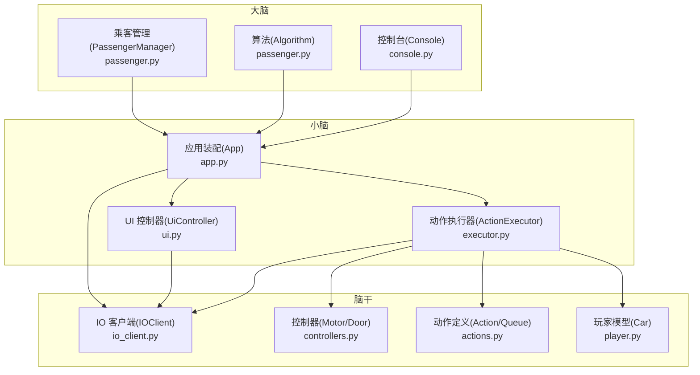
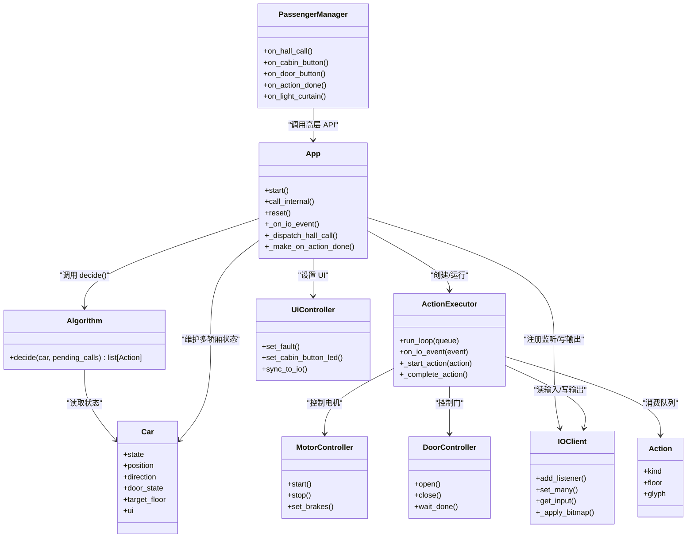
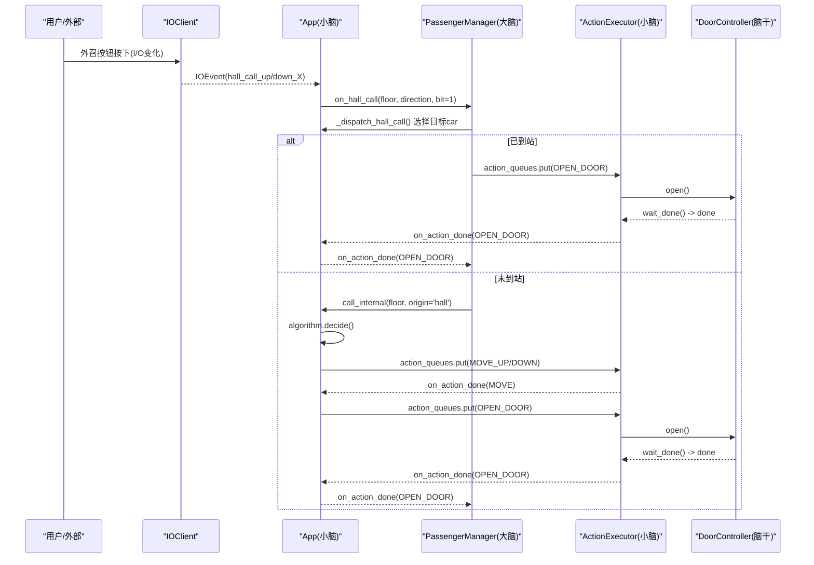
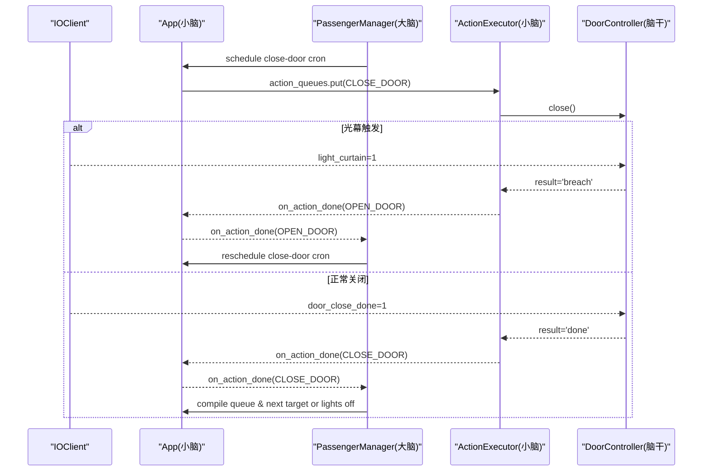
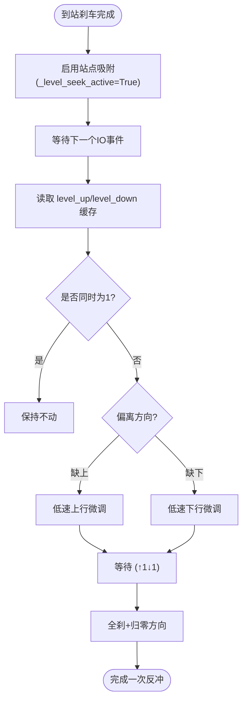
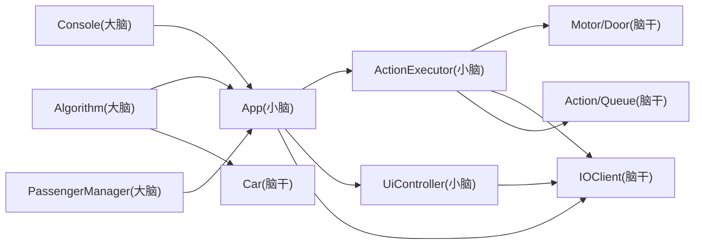

# 系统架构概览

<cite>
**本文引用的文件**   
- [core/app.py](file://core/app.py)
- [core/algorithm.py](file://core/algorithm.py)
- [core/passenger.py](file://core/passenger.py)
- [core/executor.py](file://core/executor.py)
- [core/controllers.py](file://core/controllers.py)
- [core/io_client.py](file://core/io_client.py)
- [core/ui.py](file://core/ui.py)
- [core/actions.py](file://core/actions.py)
- [core/player.py](file://core/player.py)
- [core/console.py](file://core/console.py)
</cite>

## 目录
1. [简介](#简介)
2. [项目结构](#项目结构)
3. [核心组件](#核心组件)
4. [架构总览（大脑/小脑/脑干）](#架构总览大脑小脑脑干)
5. [分层职责与通信方式](#分层职责与通信方式)
6. [关键数据流与序列图](#关键数据流与序列图)
7. [依赖关系分析](#依赖关系分析)
8. [性能与实时性要点](#性能与实时性要点)
9. [故障与安全处理](#故障与安全处理)
10. [结论](#结论)

## 简介
本仓库采用“大脑/小脑/脑干”三层架构，将电梯控制系统的决策、执行与 IO 通信解耦：
- 大脑（决策层）：用户交互 + 算法 + 乘客流程管理。只通过高层 API 与小脑交互，不接触任何 IO 事件。
- 小脑（物理层）：运动 FSM + UI + 硬件控制编排。负责动作展开、传感器等待、状态同步与 UI 更新。
- 脑干（IO 层）：WS + HTTP + 映射。提供输入缓存、批量写合并、事件分发等能力。

各层之间通过事件总线与队列进行通信，禁止跳层调用，确保可测试性与可扩展性。

## 项目结构
- core/app.py：装配多轿厢、共享 IOClient/IOMapper/DisplayEncoder/Algorithm；暴露高层 API；IO 事件路由到对应 executor。
- core/algorithm.py：高层调度算法（只看 Car + pending_calls，输出 Action）。
- core/passenger.py：乘客交互管理器（大脑），维护独立乘客队列与关门/熄灯 cron。
- core/executor.py：硬件层 FSM，Action → IO 序列 + 等传感器确认。
- core/controllers.py：电机/门控制器封装，屏蔽 IO 地址细节。
- core/io_client.py：异步 IO2HTTP 客户端，WS 订阅 + HTTP POST 批量写 + 输入缓存。
- core/ui.py：UI 指示灯控制器，统一 set_many 路径，由 IOClient tick 自动合并。
- core/actions.py：动作抽象与队列，连接算法层与硬件层。
- core/player.py：Car 实体（游戏化建模），仅包含现实状态，不含 IO 地址。
- core/console.py：REPL 控制台，命令入口，调用 App 高层 API。

图表来源
- [core/app.py:41-169](file://core/app.py#L41-L169)
- [core/algorithm.py:19-105](file://core/algorithm.py#L19-L105)
- [core/passenger.py:112-188](file://core/passenger.py#L112-L188)
- [core/executor.py:27-131](file://core/executor.py#L27-L131)
- [core/controllers.py:28-120](file://core/controllers.py#L28-L120)
- [core/io_client.py:33-118](file://core/io_client.py#L33-L118)
- [core/ui.py:32-132](file://core/ui.py#L32-L132)
- [core/actions.py:15-74](file://core/actions.py#L15-L74)
- [core/player.py:68-123](file://core/player.py#L68-L123)

章节来源
- [core/app.py:41-169](file://core/app.py#L41-L169)
- [core/algorithm.py:19-105](file://core/algorithm.py#L19-L105)
- [core/passenger.py:112-188](file://core/passenger.py#L112-L188)
- [core/executor.py:27-131](file://core/executor.py#L27-L131)
- [core/controllers.py:28-120](file://core/controllers.py#L28-L120)
- [core/io_client.py:33-118](file://core/io_client.py#L33-L118)
- [core/ui.py:32-132](file://core/ui.py#L32-L132)
- [core/actions.py:15-74](file://core/actions.py#L15-L74)
- [core/player.py:68-123](file://core/player.py#L68-L123)

## 核心组件
- 算法（ElevatorAlgorithm）：纯函数式决策，输入 Car + pending_calls，输出 Action 列表。
- 乘客管理（PassengerManager）：外召派车、内召缓存、关门/熄灯 cron、独立 PassengerQueue。
- 应用装配（App）：启动 IO、注册监听、按 car_id 路由事件、协调算法与执行器、暴露高层 API。
- 执行器（ActionExecutor）：FSM 驱动，Action → IO 序列，等传感器完成，回调 app 继续调度。
- 控制器（MotorController/DoorController）：屏蔽 IO 地址，提供 start/stop/open/close 等高层方法。
- IO 客户端（IOClient）：WS 订阅 + HTTP 批量写 + 输入缓存 + 事件分发。
- UI 控制器（UiController）：统一 set_many 路径，tick 合并写入。
- 动作（Action/ActionQueue）：高层抽象，隔离 IO 细节。
- 玩家（Car）：电梯实体，仅含状态，不含 IO 地址。

章节来源
- [core/algorithm.py:19-105](file://core/algorithm.py#L19-L105)
- [core/passenger.py:112-188](file://core/passenger.py#L112-L188)
- [core/app.py:191-241](file://core/app.py#L191-L241)
- [core/executor.py:134-150](file://core/executor.py#L134-L150)
- [core/controllers.py:28-120](file://core/controllers.py#L28-L120)
- [core/io_client.py:139-188](file://core/io_client.py#L139-L188)
- [core/ui.py:32-132](file://core/ui.py#L32-L132)
- [core/actions.py:15-74](file://core/actions.py#L15-L74)
- [core/player.py:68-123](file://core/player.py#L68-L123)

## 架构总览（大脑/小脑/脑干）

图表来源
- [core/app.py:41-169](file://core/app.py#L41-L169)
- [core/algorithm.py:19-105](file://core/algorithm.py#L19-L105)
- [core/passenger.py:112-188](file://core/passenger.py#L112-L188)
- [core/executor.py:27-131](file://core/executor.py#L27-L131)
- [core/controllers.py:28-120](file://core/controllers.py#L28-L120)
- [core/io_client.py:33-118](file://core/io_client.py#L33-L118)
- [core/ui.py:32-132](file://core/ui.py#L32-L132)
- [core/actions.py:15-74](file://core/actions.py#L15-L74)
- [core/player.py:68-123](file://core/player.py#L68-L123)

## 分层职责与通信方式
- 大脑（算法 + 乘客管理 + 控制台）
  - 职责：策略决策、乘客流程编排、用户交互。
  - 通信：通过 App 的高层 API（如 call_internal、action_queues.put、ui.set_xxx）与小脑交互；不注册 IO 监听器。
- 小脑（App + Executor + UI）
  - 职责：IO 事件路由、动作编排、FSM 执行、UI 同步。
  - 通信：接收 IO 事件并转发到大脑；将算法输出的 Action 入队；驱动控制器与显示。
- 脑干（IOClient + Controllers + Actions + Player）
  - 职责：网络通信、信号映射、批量写合并、传感器事件分发、底层设备控制。
  - 通信：向小脑派发 IOEvent；接受小脑的 set_many 指令；为算法提供 Car 状态。

章节来源
- [core/app.py:243-348](file://core/app.py#L243-L348)
- [core/passenger.py:188-243](file://core/passenger.py#L188-L243)
- [core/executor.py:152-217](file://core/executor.py#L152-L217)
- [core/io_client.py:139-188](file://core/io_client.py#L139-L188)
- [core/ui.py:32-132](file://core/ui.py#L32-L132)
- [core/actions.py:15-74](file://core/actions.py#L15-L74)
- [core/player.py:68-123](file://core/player.py#L68-L123)

## 关键数据流与序列图

### 外召派车与开门流程（用户模式）

图表来源
- [core/app.py:303-348](file://core/app.py#L303-L348)
- [core/passenger.py:190-212](file://core/passenger.py#L190-L212)
- [core/executor.py:632-646](file://core/executor.py#L632-L646)
- [core/controllers.py:155-180](file://core/controllers.py#L155-L180)

### 关门与光幕防夹流程

图表来源
- [core/passenger.py:348-398](file://core/passenger.py#L348-L398)
- [core/executor.py:648-660](file://core/executor.py#L648-L660)
- [core/controllers.py:223-248](file://core/controllers.py#L223-L248)

### 站点吸附保持（反冲修正）

图表来源
- [core/executor.py:516-555](file://core/executor.py#L516-L555)
- [core/executor.py:428-453](file://core/executor.py#L428-L453)

## 依赖关系分析
- 大脑对 IO 无直接依赖，仅通过 App 暴露的 API 进行交互。
- 小脑依赖算法、执行器、UI、IOClient，承担事件路由与动作编排。
- 脑干提供 IO 通信与设备控制，被小脑和控制器使用。
- 动作与玩家模型作为跨层契约，避免高层耦合 IO 细节。

图表来源
- [core/console.py:77-117](file://core/console.py#L77-L117)
- [core/app.py:41-169](file://core/app.py#L41-L169)
- [core/algorithm.py:19-105](file://core/algorithm.py#L19-L105)
- [core/passenger.py:112-188](file://core/passenger.py#L112-L188)
- [core/executor.py:27-131](file://core/executor.py#L27-L131)
- [core/controllers.py:28-120](file://core/controllers.py#L28-L120)
- [core/io_client.py:33-118](file://core/io_client.py#L33-L118)
- [core/ui.py:32-132](file://core/ui.py#L32-L132)
- [core/actions.py:15-74](file://core/actions.py#L15-L74)
- [core/player.py:68-123](file://core/player.py#L68-L123)

## 性能与实时性要点
- 每部电梯独立的 io_write 实例，避免 6 部车共享 write_buffer 导致单次 flush 过多地址拥堵。
- IOClient 定时 tick 合并写操作，减少 HTTP POST 次数。
- 站点吸附保持模式事件驱动，无轮询 sleep，仅在需要时微动反冲。
- 紧急停止与限位保护优先于常规逻辑，确保安全性与响应速度。

章节来源
- [core/app.py:87-111](file://core/app.py#L87-L111)
- [core/io_client.py:161-188](file://core/io_client.py#L161-L188)
- [core/executor.py:516-555](file://core/executor.py#L516-L555)
- [core/executor.py:380-410](file://core/executor.py#L380-L410)

## 故障与安全处理
- 2 限位触发立即急停，清所有输出与长寿命状态，置 FAULT。
- 错误楼层开门检测：若门锁与位置不符，强制关门并报错。
- 光幕触发在关门过程中反转开门，并重新安排关门 cron。
- 重置流程清理 executor 瞬态状态与 cron，恢复 READY。

章节来源
- [core/executor.py:380-410](file://core/executor.py#L380-L410)
- [core/executor.py:632-646](file://core/executor.py#L632-L646)
- [core/controllers.py:223-248](file://core/controllers.py#L223-L248)
- [core/app.py:616-669](file://core/app.py#L616-L669)

## 结论
该架构以清晰的三层划分实现了高内聚、低耦合的电梯控制系统：
- 大脑专注策略与流程，不受 IO 细节干扰。
- 小脑负责编排与执行，保证安全与实时。
- 脑干提供稳定可靠的 IO 通道与设备控制。
通过事件总线与队列通信，系统具备良好的扩展性与可测试性，便于后续引入更多算法与功能模块。