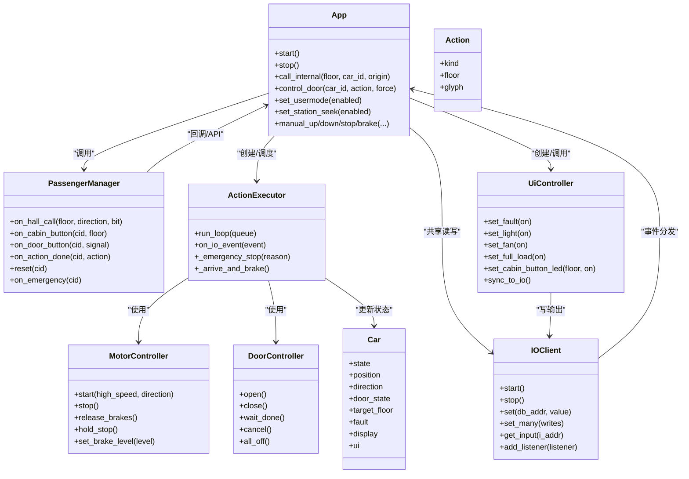

# 设计哲学

<cite>
**本文引用的文件**   
- [core/app.py](file://core/app.py)
- [core/controllers.py](file://core/controllers.py)
- [core/executor.py](file://core/executor.py)
- [core/ui.py](file://core/ui.py)
- [core/io_client.py](file://core/io_client.py)
- [core/passenger.py](file://core/passenger.py)
- [core/player.py](file://core/player.py)
- [core/actions.py](file://core/actions.py)
</cite>

## 设计原则不变量
- 三层架构不可跳层：大脑（决策层）、小脑（物理层）、脑干（IO 层）通过事件总线沟通，禁止跨层直调。
- 游戏化编程范式：电梯即“玩家”，Car 是实体，不接触 IO 地址；大脑改 Car 属性，小脑自动同步到物理 IO。
- 大脑零 IO 监听：大脑不注册任何 IO 监听器、不接触 IO 事件，仅通过 app.py API 交互；PassengerQueue 独立于 pending_calls，三步工作流 collect → compile → consume，支持 discard/keep 两种模式。
- UI 不自动绑定事件：轿内按钮按下不会自动亮灯，上层逻辑自行决定；所有 UI 写操作走 set_many 单一路径，由 IOClient tick 自动合并。
- 硬件契约明确：PLC 刹车假设“通电刹死/失电释放”（brake=0 释放，brake=1 刹死），若现场接法相反，仅需修改一处映射。
- executor 设计要点：使用 cache 而非 _last_* 字段进行多信号同步判定；INITIALIZE 两段式（基站段低速/客运段复用标准减速）；NOOP 不退出保持模式；EMERGENCY_STOP 同步清场所有长寿命状态；_arrive_and_brake 统一刹车流程避免重复；LIGHT_OFF/LIGHT_ON 保留 handler 但不 dispatch（为未来 passenger_flow 预留）。
- 工程哲学例外：brake-before-stop 的 100ms sleep 违反“零 sleep”哲学，但实机实测需要，不可改为 cron 或删除，除非有 PLC 反馈信号替代方案。
- 路线图说明：passenger_flow 模块（自动关门/熄灯 cron、human_presence 状态迁移）尚未实现，列为后续路线。

**章节来源**
- [core/app.py:243-351](file://core/app.py#L243-L351)
- [core/passenger.py:39-110](file://core/passenger.py#L39-L110)
- [core/ui.py:7-20](file://core/ui.py#L7-L20)
- [core/controllers.py:7-16](file://core/controllers.py#L7-L16)
- [core/executor.py:86-131](file://core/executor.py#L86-L131)
- [core/executor.py:428-453](file://core/executor.py#L428-L453)
- [core/executor.py:685-698](file://core/executor.py#L685-L698)

## 代码嵌入式设计哲学
- 分层职责与边界
  - 大脑（决策层）：负责乘客流程管理、派车策略、队列编排与 UI 配置，不碰 IO 事件，只调用小脑暴露的高层 API。
  - 小脑（物理层）：负责 IO 事件路由、高层 API 实现、动作编排与门/电机控制协调，维护每部电梯的执行器与 UI 控制器。
  - 脑干（IO 层）：提供异步 IO 客户端、输入缓存、批量写合并、WebSocket 订阅与事件分发，屏蔽网络细节。
- 数据与状态模型
  - Car 作为“玩家”实体，仅包含现实状态（位置、方向、门、故障、显示等），不包含任何 IO 地址，算法层唯一可见的状态对象。
  - Action 作为高层抽象，不含 IO 地址，算法层 put，硬件层 get，硬件层负责将 Action 展开为具体 IO 序列。
- 事件驱动与解耦
  - IO 变化通过 IOClient 的 WebSocket 推送或 bitmap 全帧同步，按已知 I 地址过滤后串行派发事件，确保关键保护路径顺序性。
  - 小脑在收到 IO 事件后解析并转发到大脑流程方法，大脑再回写小脑 API（如 call_internal、action_queues.put、ui.set_xxx），形成清晰的双向解耦。
- 并发与批处理
  - 每部电梯拥有独立的 IO 写入实例，共享输入缓存，避免多车同时写导致的 S7 read-modify-write 顺序问题；tick 定时 flush 合并写缓冲，降低网络开销。
  - UI 控制器每次 set_xxx 内部一次 set_many，后续由 IOClient tick 自动合并不同控制器的调用，保证单一写路径。
- 安全与容错
  - 紧急停止路径同步清场所有长寿命状态（保持模式、反冲 future、auto-seek 标志等），防止残留状态导致二次危险。
  - 门动作具备超时兜底与互斥锁，后台任务跟踪完成与错层检测，cron 触发强制释放 mutex，避免死锁。
- 可观测性与调试
  - 执行器日志走 stderr + flush，避免被 REPL 吞掉；UI 读 car.ui 直读逻辑状态，写通过 set_xxx 同步 IO，便于 /status 快照与调试。
- 扩展点与预留
  - LIGHT_OFF/LIGHT_ON 保留处理器但不参与当前调度，为未来 passenger_flow 模块预留；passenger_flow 的自动关门/熄灯 cron 与 human_presence 迁移待实现。

**图表来源**
- [core/app.py:41-169](file://core/app.py#L41-L169)
- [core/passenger.py:112-150](file://core/passenger.py#L112-L150)
- [core/executor.py:27-131](file://core/executor.py#L27-L131)
- [core/controllers.py:28-119](file://core/controllers.py#L28-L119)
- [core/ui.py:32-52](file://core/ui.py#L32-L52)
- [core/io_client.py:33-78](file://core/io_client.py#L33-L78)
- [core/player.py:68-86](file://core/player.py#L68-L86)
- [core/actions.py:30-52](file://core/actions.py#L30-L52)

**章节来源**
- [core/app.py:41-169](file://core/app.py#L41-L169)
- [core/passenger.py:112-150](file://core/passenger.py#L112-L150)
- [core/executor.py:27-131](file://core/executor.py#L27-L131)
- [core/controllers.py:28-119](file://core/controllers.py#L28-L119)
- [core/ui.py:32-52](file://core/ui.py#L32-L52)
- [core/io_client.py:33-78](file://core/io_client.py#L33-L78)
- [core/player.py:68-86](file://core/player.py#L68-L86)
- [core/actions.py:30-52](file://core/actions.py#L30-L52)

## 工程哲学例外
- “零 sleep/wait”原则的例外：_arrive_and_brake 中 brake-before-stop 的 100ms sleep 违反该原则，但实机实测必需，用于等待 PLC 物理时序稳定，不允许改为 cron 或删除，除非出现可靠的 PLC 反馈信号替代方案。
- 原因与影响：该延时确保电机接触器/刹车已稳定后再通知上层完成动作，避免 app 的 _on_action_done 立刻发下一个动作抢占刹车，从而防止过冲与安全异常。
- 约束条件：仅在到站统一刹车流程中使用，且注释明确标注为工程例外；替换方案需满足“零 sleep”与“可靠反馈”的双重要求。

**章节来源**
- [core/executor.py:428-453](file://core/executor.py#L428-L453)