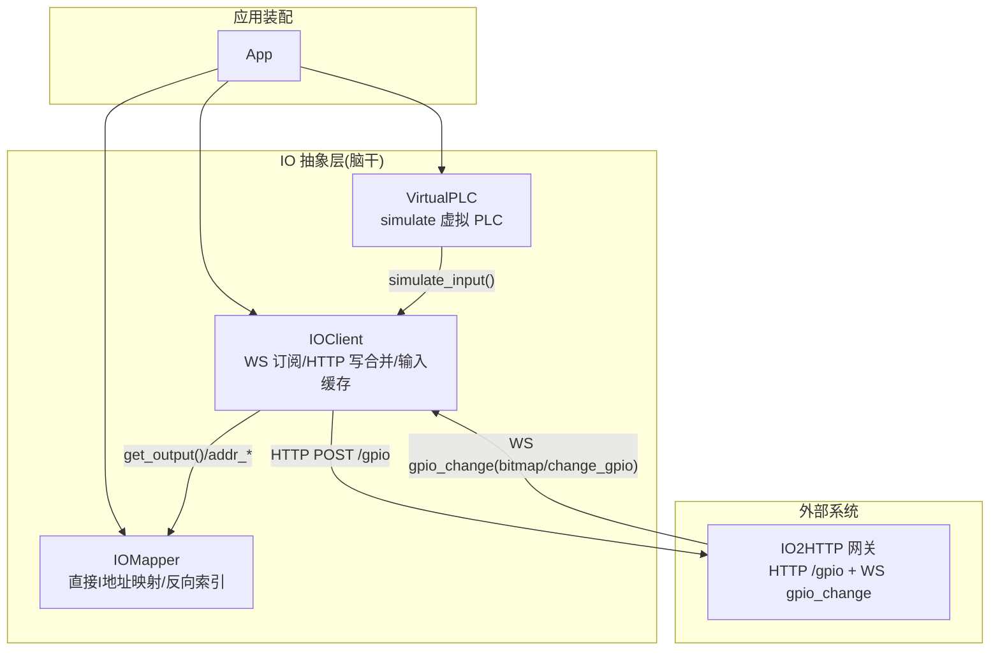
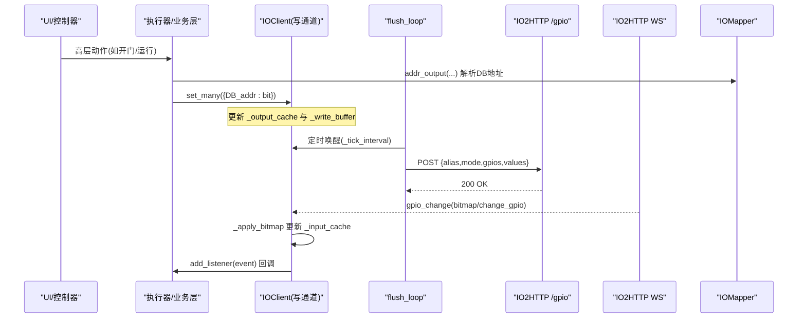
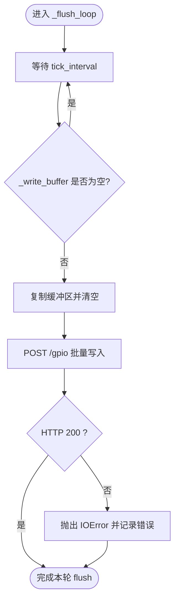
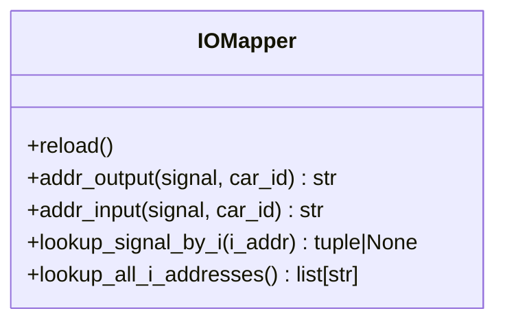
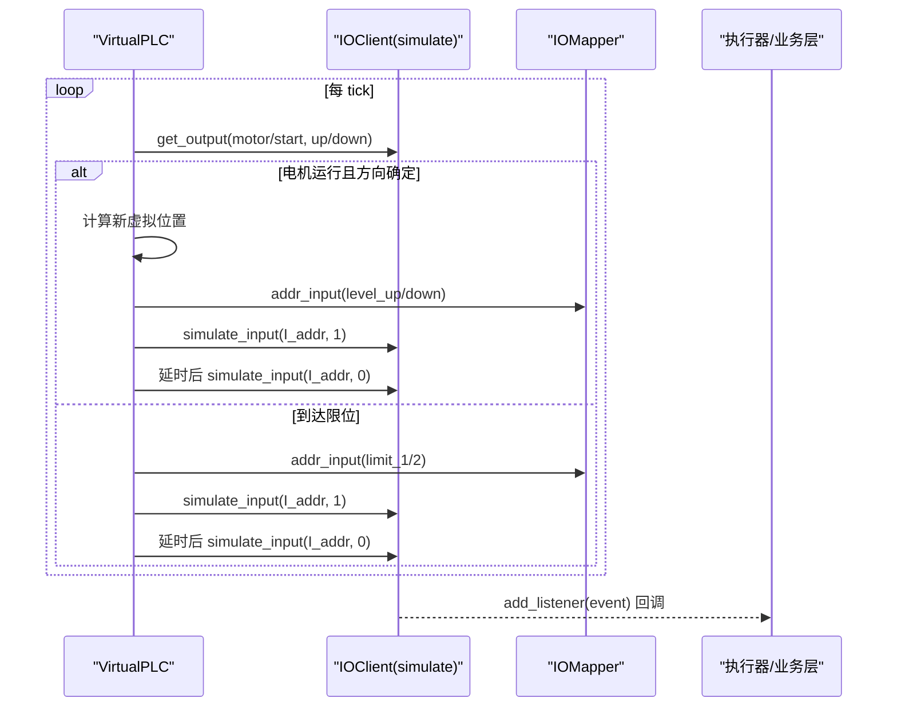
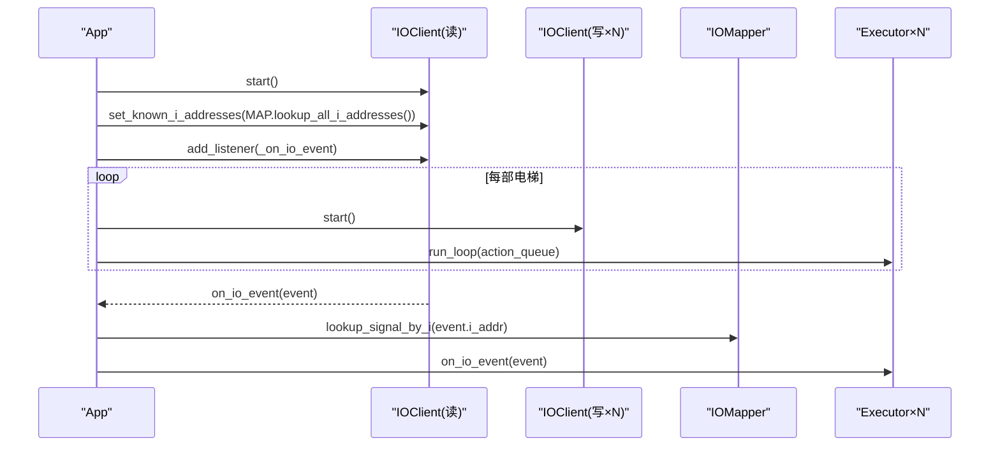
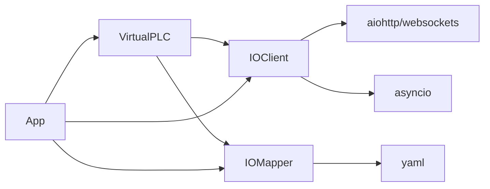

# 脑干模块

<cite>
**本文引用的文件**   
- [core/io_client.py](file://core/io_client.py)
- [core/io_mapper.py](file://core/io_mapper.py)
- [config/io_config.yaml](file://config/io_config.yaml)
- [core/virtual_plc.py](file://core/virtual_plc.py)
- [core/app.py](file://core/app.py)
</cite>

## 更新摘要
**变更内容**   
- IO配置系统重大重构：从DB地址格式迁移到直接I地址格式
- 移除了db_to_i_offset参数和地址转换方法
- 简化了IO映射逻辑，直接使用I地址格式
- 更新了IOMapper类结构和方法接口

## 目录
1. [简介](#简介)
2. [项目结构](#项目结构)
3. [核心组件](#核心组件)
4. [架构总览](#架构总览)
5. [详细组件分析](#详细组件分析)
6. [依赖关系分析](#依赖关系分析)
7. [性能与吞吐特性](#性能与吞吐特性)
8. [故障排查指南](#故障排查指南)
9. [结论](#结论)

## 简介
本章节聚焦"脑干"（IO 抽象层）的三大能力：WS 客户端、HTTP 写合并、虚拟 PLC。该层负责将上层逻辑信号映射到硬件 IO，并通过异步网络通道与 IO2HTTP 网关交互；在 simulate 模式下，以虚拟 PLC 反向驱动输入事件，形成闭环仿真。

**更新** IO配置系统已完成重大重构，从复杂的DB地址格式迁移到直接的I地址格式，简化了映射逻辑并移除了地址转换方法。

## 项目结构
- IOClient：异步 WS 订阅 + HTTP 批量写 + 输入缓存 + 事件分发
- IOMapper：加载 io_config.yaml，维护 DB/I 地址映射与反向索引（已简化为直接I地址映射）
- VirtualPLC：simulate 模式下的"虚拟电梯驱动器"，监听输出缓存并模拟输入事件
- App：装配共享 IOClient、每车独立写通道、事件路由与生命周期管理

**图表来源**   
- [core/app.py:59-106](file://core/app.py#L59-L106)
- [core/io_client.py:33-118](file://core/io_client.py#L33-L118)
- [core/io_mapper.py:19-36](file://core/io_mapper.py#L19-L36)
- [core/virtual_plc.py:33-98](file://core/virtual_plc.py#L33-L98)

**章节来源**   
- [core/app.py:59-106](file://core/app.py#L59-L106)
- [core/io_client.py:33-118](file://core/io_client.py#L33-L118)
- [core/io_mapper.py:19-36](file://core/io_mapper.py#L19-L36)
- [core/virtual_plc.py:33-98](file://core/virtual_plc.py#L33-L98)

## 核心组件
- IOClient
  - 职责：HTTP 批量写输出、WS 订阅 gpio_change、维护输入/输出缓存、事件分发、tick 写合并
  - 关键接口：set/set_many、get_input/get_output、add_listener/remove_listener、start/stop
- IOMapper
  - 职责：加载配置、提供逻辑名→I地址查表、I地址→(car_id, signal) 反查
  - 关键接口：addr_output/addr_input、lookup_signal_by_i、lookup_all_i_addresses
- VirtualPLC
  - 职责：在 simulate 模式下读取输出缓存，按接触器/电机状态推进虚拟位置，触发平层/限位/门锁等输入事件
  - 关键接口：start/stop、内部脉冲与延时任务

**更新** IOMapper已移除db_to_i/i_to_db地址转换方法，现在直接使用I地址格式进行映射。

**章节来源**   
- [core/io_client.py:33-118](file://core/io_client.py#L33-L118)
- [core/io_mapper.py:19-36](file://core/io_mapper.py#L19-L36)
- [core/virtual_plc.py:33-98](file://core/virtual_plc.py#L33-L98)

## 架构总览
IO 抽象层采用"读共享、写隔离"的模型：
- 所有实例共享同一份 input/output 缓存，保证只写实例也能读到最新状态
- 每部电梯拥有独立的 IOClient 写通道，避免多车并发写入导致 S7 read-modify-write 顺序冲突
- 通过 tick 定时 flush 将多次 set/set_many 合并为一次 HTTP POST，降低网络与 PLC 压力

**图表来源**   
- [core/app.py:191-205](file://core/app.py#L191-L205)
- [core/io_client.py:141-188](file://core/io_client.py#L141-L188)
- [core/io_client.py:220-263](file://core/io_client.py#L220-L263)
- [core/io_mapper.py:85-105](file://core/io_mapper.py#L85-L105)

## 详细组件分析

### IOClient：WS 客户端与 HTTP 写合并
- 写路径
  - set/set_many 将位写入 _output_cache，并在非 simulate 模式下加入 _write_buffer
  - _flush_loop 每 tick_interval_ms 唤醒，若缓冲区非空则调用 _flush_now
  - _flush_now 构造 payload 并一次性 POST 到 /gpio，成功后清空缓冲区
- 读路径
  - WS 连接后持续接收 gpio_change 消息
  - 支持两种数据源：
    - bitmap：全量字节数组，逐位解析更新 _input_cache，并按已知 I 地址集合过滤派发事件
    - change_gpio：增量边沿，仅对变化位派发事件
  - 提供 observe_input/simulate_input 用于测试或 simulate 模式注入输入
- 事件分发
  - add_listener 注册回调，_dispatch 串行 await，确保处理顺序稳定
  - set_known_i_addresses 限制 dispatch 范围，避免 800 位全量广播造成抖动

**图表来源**   
- [core/io_client.py:161-188](file://core/io_client.py#L161-L188)

**章节来源**   
- [core/io_client.py:33-118](file://core/io_client.py#L33-L118)
- [core/io_client.py:141-188](file://core/io_client.py#L141-L188)
- [core/io_client.py:220-263](file://core/io_client.py#L220-L263)

### IOMapper：简化的IO映射表与直接I地址映射
**更新** 经过重大重构，IOMapper现在直接使用I地址格式，移除了复杂的地址转换逻辑。

- 配置加载
  - 从 io_config.yaml 读取 per_car/hall 的输入输出点位
  - 构建正向映射（car_id+signal → I地址）、反向索引（I地址 → car_id+signal）
  - **不再需要 db_to_i_offset 参数**，输入直接配置为I地址格式
- 地址映射
  - addr_input：直接返回配置的I地址（如"I7.6"），无需转换
  - addr_output：返回DB地址（如"DB11.DBX6.1"），用于HTTP写入
  - lookup_signal_by_i：通过I地址反查对应的(car_id, signal_name)
- 使用场景
  - 上层通过 addr_output/addr_input 获取对应地址
  - IOClient 通过 set_known_i_addresses 设置已知 I 地址集合，减少无效事件派发

**图表来源**   
- [core/io_mapper.py:19-105](file://core/io_mapper.py#L19-L105)

**章节来源**   
- [core/io_mapper.py:19-105](file://core/io_mapper.py#L19-L105)
- [config/io_config.yaml:1-501](file://config/io_config.yaml#L1-501)

### VirtualPLC：虚拟 PLC（simulate 模式）
- 工作模型
  - 每 tick 检查 motor_start 与 up/down_contactor 输出
  - 按 floor_travel_time 步进虚拟位置，跨越楼层时触发 level_up/level_down 脉冲
  - 到达 base 触发 1 限位，越过 base±1 触发 2 限位
  - 门继电器变化时，模拟门锁到位与 door_open_done/door_close_done 时序
- 与 IOClient 的交互
  - 通过 mapper.addr_input 获取I地址
  - 通过 io.simulate_input 注入输入事件，走 IOClient 的缓存与事件分发链路

**图表来源**   
- [core/virtual_plc.py:115-212](file://core/virtual_plc.py#L115-L212)
- [core/virtual_plc.py:213-246](file://core/virtual_plc.py#L213-L246)
- [core/virtual_plc.py:248-351](file://core/virtual_plc.py#L248-L351)
- [core/io_client.py:267-282](file://core/io_client.py#L267-L282)

**章节来源**   
- [core/virtual_plc.py:33-98](file://core/virtual_plc.py#L33-L98)
- [core/virtual_plc.py:115-212](file://core/virtual_plc.py#L115-L212)
- [core/virtual_plc.py:213-246](file://core/virtual_plc.py#L213-L246)
- [core/virtual_plc.py:248-351](file://core/virtual_plc.py#L248-L351)

### 装配与事件路由（App 中的脑干集成）
- 启动流程
  - 创建共享 IOClient（读通道），并为每部电梯创建独立 IOClient 写通道（ws_url=None，仅写）
  - 共享 input/output 缓存，避免只写实例无法看到最新状态
  - 注册 IO 事件监听器，按 car_id 路由到对应 executor
- 停止流程
  - 先 flush 剩余写入，再取消任务、关闭会话

**图表来源**   
- [core/app.py:191-205](file://core/app.py#L191-L205)
- [core/app.py:245-251](file://core/app.py#L245-L251)
- [core/io_mapper.py:99-105](file://core/io_mapper.py#L99-L105)

**章节来源**   
- [core/app.py:59-106](file://core/app.py#L59-L106)
- [core/app.py:191-205](file://core/app.py#L191-L205)
- [core/app.py:245-251](file://core/app.py#L245-L251)

## 依赖关系分析
- IOClient 依赖 aiohttp/websockets 进行网络通信，依赖 asyncio 实现定时器与任务
- IOMapper 依赖 yaml 解析配置文件，**不再依赖正则表达式进行地址格式匹配**
- VirtualPLC 依赖 IOClient 的 simulate_input 与 get_output，依赖 IOMapper 的地址映射
- App 协调各组件，提供事件路由与生命周期管理

**图表来源**   
- [core/io_client.py:13-21](file://core/io_client.py#L13-L21)
- [core/io_mapper.py:12-16](file://core/io_mapper.py#L12-L16)
- [core/virtual_plc.py:24-31](file://core/virtual_plc.py#L24-L31)
- [core/app.py:12-28](file://core/app.py#L12-L28)

**章节来源**   
- [core/io_client.py:13-21](file://core/io_client.py#L13-L21)
- [core/io_mapper.py:12-16](file://core/io_mapper.py#L12-L16)
- [core/virtual_plc.py:24-31](file://core/virtual_plc.py#L24-L31)
- [core/app.py:12-28](file://core/app.py#L12-L28)

## 性能与吞吐特性
- 写合并
  - 通过 _flush_loop 与 _tick_interval 控制批量发送频率，显著降低 HTTP 请求数与 PLC 读写次数
  - 每车独立写通道避免多车并发导致的 S7 read-modify-write 竞争
- 事件派发
  - 通过 set_known_i_addresses 限制 bitmap 变更事件的派发范围，避免 800 位全量广播带来的抖动
  - _dispatch 串行 await，保证事件处理顺序稳定，有利于安全相关逻辑（如限位优先级）
- 内存与对象
  - 输入/输出缓存为 dict，O(1) 读写；bitmap 解析为线性扫描 O(N)，N 为字节数（通常 ≤100）
- **配置解析优化**
  - 移除了复杂的DB地址解析和转换逻辑，配置加载速度提升
  - 直接使用I地址格式，减少了运行时地址转换开销

## 故障排查指南
- HTTP flush 失败
  - 现象：flush 抛出 IOError，包含 HTTP 状态码与响应体
  - 排查：确认 IO2HTTP 服务可达、/gpio 接口正常、payload 字段正确
  - 参考路径：[core/io_client.py:171-188](file://core/io_client.py#L171-L188)
- WS 连接断开
  - 现象：ws_connected 置 False，自动重连
  - 排查：检查 ws_url 连通性、防火墙策略、ping_interval 配置
  - 参考路径：[core/io_client.py:285-326](file://core/io_client.py#L285-L326)
- 输入事件未触发
  - 现象：listener 未收到事件
  - 排查：确认 set_known_i_addresses 是否限制了 I 地址集合；检查 bitmap/change_gpio 数据格式
  - 参考路径：[core/io_client.py:211-263](file://core/io_client.py#L211-L263)
- 虚拟 PLC 未驱动输入
  - 现象：simulate 模式下无输入事件
  - 排查：确认 io.simulate=True；检查 VirtualPLC.start 是否被调用；核对 addr_input 结果
  - 参考路径：[core/virtual_plc.py:85-98](file://core/virtual_plc.py#L85-L98), [core/virtual_plc.py:213-246](file://core/virtual_plc.py#L213-L246)
- **配置映射问题**
  - 现象：addr_input返回错误的I地址或KeyError异常
  - 排查：检查io_config.yaml中input.per_car配置是否正确；确认信号名称与配置一致
  - 参考路径：[core/io_mapper.py:96-101](file://core/io_mapper.py#L96-L101)

**章节来源**   
- [core/io_client.py:171-188](file://core/io_client.py#L171-L188)
- [core/io_client.py:285-326](file://core/io_client.py#L285-L326)
- [core/io_client.py:211-263](file://core/io_client.py#L211-L263)
- [core/virtual_plc.py:85-98](file://core/virtual_plc.py#L85-L98)
- [core/virtual_plc.py:213-246](file://core/virtual_plc.py#L213-L246)

## 结论
脑干模块通过 IOClient 实现了稳定的 WS 订阅与 HTTP 写合并，结合重构后的 IOMapper 的直接I地址映射，为上层提供了更简洁统一的 IO 抽象；在 simulate 模式下，VirtualPLC 反向驱动输入事件，形成完整的端到端仿真闭环。**经过IO配置系统重大重构后，系统架构更加清晰，配置管理更加直观，移除了复杂的地址转换逻辑，提升了整体性能和可维护性**。该设计兼顾了实时性与可靠性，适合多轿厢并发场景与调试验证需求。