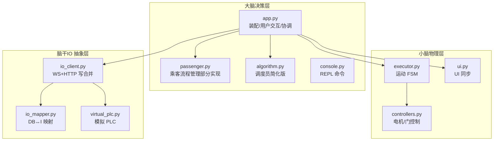
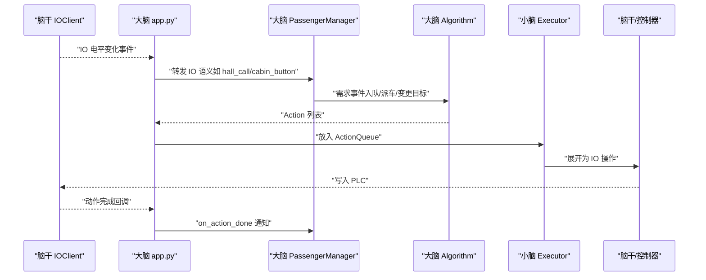
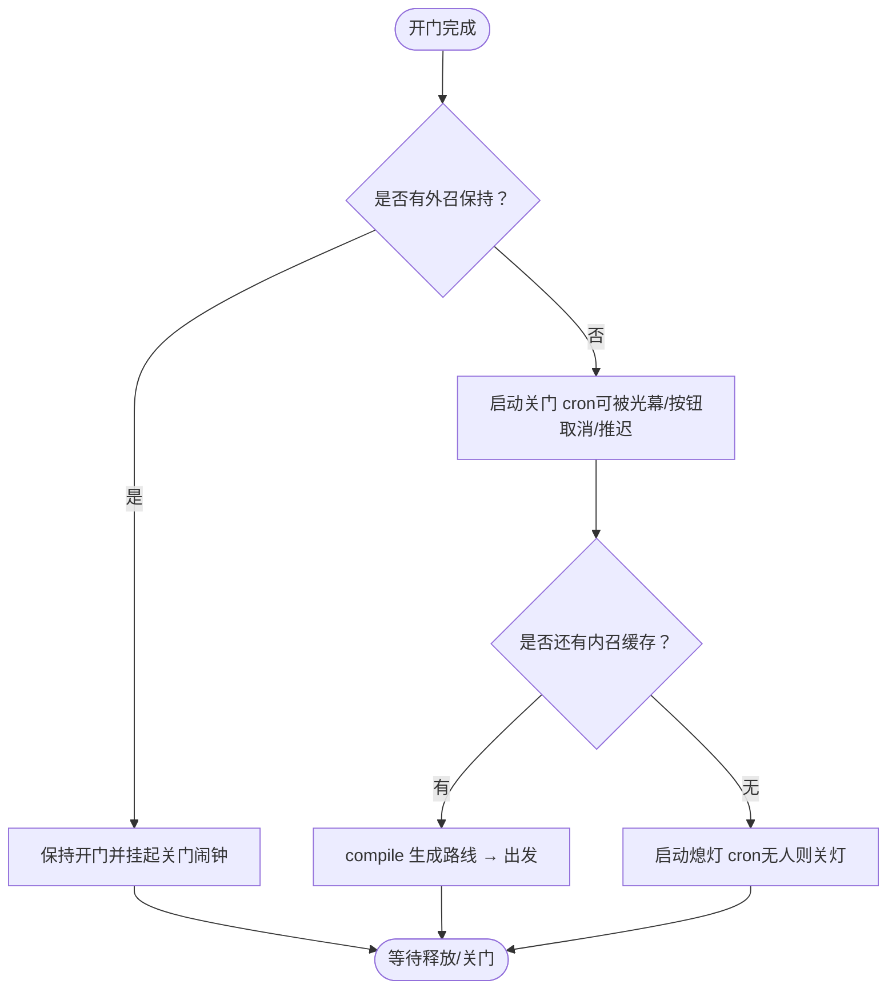
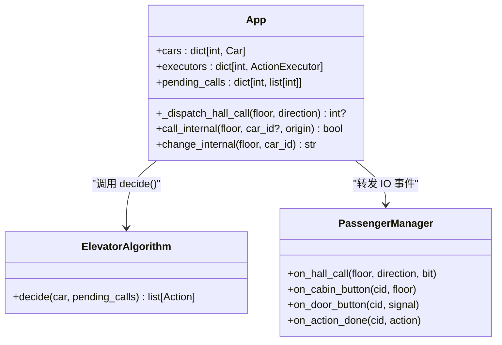
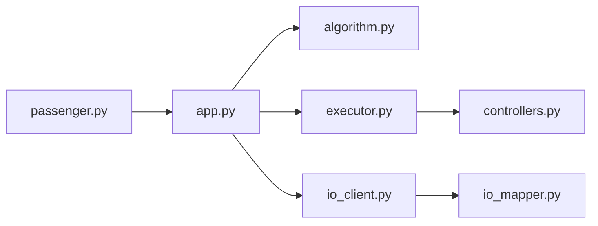

# 路线图与未对齐项

<cite>
**本文引用的文件**   
- [SPEC.md](file://SPEC.md)
- [README.md](file://README.md)
- [core/app.py](file://core/app.py)
- [core/passenger.py](file://core/passenger.py)
- [core/executor.py](file://core/executor.py)
- [core/console.py](file://core/console.py)
- [config/config.yaml](file://config/config.yaml)
</cite>

## 目录
1. [引言](#引言)
2. [项目结构](#项目结构)
3. [核心组件](#核心组件)
4. [架构总览](#架构总览)
5. [详细组件分析](#详细组件分析)
6. [依赖关系分析](#依赖关系分析)
7. [性能考量](#性能考量)
8. [故障排查指南](#故障排查指南)
9. [结论](#结论)
10. [附录](#附录)

## 引言
本文件聚焦于“未实现功能（passenger_flow、群控等）”和“已知未对齐问题”，依据 SPEC.md §10-§11 的官方评估与路线图，结合代码现状进行系统化梳理。目标是让读者快速定位：哪些能力尚未落地、为何未落地、下一步如何补齐，以及当前已知的风险点与约束。

## 项目结构
仓库采用三层架构：大脑（决策层）、小脑（物理层）、脑干（IO 抽象层），并通过事件广播总线解耦。当前版本在“多轿厢支持”上已有基础，但全局调度与乘客流程自动化尚未完成。

图表来源
- [core/app.py:41-169](file://core/app.py#L41-L169)
- [core/passenger.py:112-149](file://core/passenger.py#L112-L149)
- [core/executor.py:277-313](file://core/executor.py#L277-L313)
- [core/ui.py:1-200](file://core/ui.py#L1-L200)
- [core/controllers.py:1-120](file://core/controllers.py#L1-L120)
- [core/io_client.py:1-200](file://core/io_client.py#L1-L200)
- [core/io_mapper.py:1-200](file://core/io_mapper.py#L1-L200)
- [core/virtual_plc.py:1-200](file://core/virtual_plc.py#L1-L200)

章节来源
- [SPEC.md:105-157](file://SPEC.md#L105-L157)
- [README.md:103-139](file://README.md#L103-L139)

## 核心组件
- 大脑（决策层）
  - app.py：装配、事件路由、高层 API、与 cron 协作；对外暴露 call_internal、reset、set_usermode 等接口。
  - passenger.py：乘客流程管理（PassengerManager + PassengerQueue），提供关门/熄灯 cron 框架与队列编译逻辑，但完整流程尚未上线。
  - algorithm.py：当前为简化版 SimpleInternalCall，仅单车内召视角，未实现全局调度与外召分配。
  - console.py：REPL 命令入口，包含批量操作与 UI 控制命令。
- 小脑（物理层）
  - executor.py：运动 FSM，Action→IO 序列展开，站点吸附、反冲修正、急停清场等。
  - ui.py/display.py：Car.ui 属性到 IO 的同步与数码管显示。
  - controllers.py：电机/门硬件封装，含刹车假设契约。
- 脑干（IO 抽象层）
  - io_client.py：WS bitmap 解析、HTTP 写合并 tick flush。
  - io_mapper.py：DB ↔ I 地址映射。
  - virtual_plc.py：模拟 PLC，便于无硬件调试。

章节来源
- [core/app.py:41-169](file://core/app.py#L41-L169)
- [core/passenger.py:39-128](file://core/passenger.py#L39-L128)
- [core/executor.py:277-313](file://core/executor.py#L277-L313)
- [core/io_client.py:387-454](file://core/io_client.py#L387-L454)
- [core/io_mapper.py:1-200](file://core/io_mapper.py#L1-L200)
- [core/console.py:678-700](file://core/console.py#L678-L700)

## 架构总览
- 事件驱动：所有层通过事件广播通信，禁止跳层调用。
- 游戏化范式：电梯=玩家，大脑只改 Car 属性，小脑自动同步到物理 IO。
- 独立队列：PassengerQueue 独立于算法 pending_calls，三步工作流 collect→compile→consume，两种模式 discard/keep。
- 外置 cron：不属于任何层，通过 EventRule 做 reschedule/cancel。

图表来源
- [core/app.py:245-348](file://core/app.py#L245-L348)
- [core/passenger.py:190-243](file://core/passenger.py#L190-L243)
- [core/executor.py:277-313](file://core/executor.py#L277-L313)

## 详细组件分析

### 未实现功能一：passenger_flow（自动关门/熄灯 cron、human_presence 迁移）
- 现状
  - 代码中预留了相关结构与钩子：
    - PassengerManager 提供了关门 cron、熄灯 cron 的调度框架与状态快照。
    - executor 保留 LIGHT_OFF/LIGHT_ON handler，但未 dispatch。
    - app.py 在 OPEN_DOOR 完成后阻止 _tick，等待未来 passenger_flow 关门后恢复调度。
  - 配置项 door_close_delay、light_off_delay 已存在，供上层使用。
- 未对齐点
  - 自动关门 cron 与光幕联动、外召保持开门等场景未完成闭环。
  - human_presence 三态迁移（确定无人/不确定/确定有人）未由上层统一推进。
  - 外召需求翻译与需求事件广播未完全接入算法层。
- 影响面
  - 首版以“手动 /door close 或外部触发”为主，缺少“无人则自动关门/熄灯”的节能与安全策略。
  - 外召响应不完整，影响用户体验与效率。
- 建议补齐路径
  - 完善 on_hall_call/on_cabin_button/on_door_button 的事件→需求映射。
  - 启用 LIGHT_OFF/LIGHT_ON 的 dispatch 路径，配合 cron 实现节能。
  - 将 human_presence 迁移纳入统一状态机，确保 reset/emergency 时一致清零。

图表来源
- [core/passenger.py:348-421](file://core/passenger.py#L348-L421)
- [core/app.py:446-452](file://core/app.py#L446-L452)
- [core/executor.py:685-698](file://core/executor.py#L685-L698)
- [config/config.yaml:810-812](file://config/config.yaml#L810-L812)

章节来源
- [SPEC.md:856-877](file://SPEC.md#L856-L877)
- [SPEC.md:921-924](file://SPEC.md#L921-L924)
- [core/app.py:446-452](file://core/app.py#L446-L452)
- [core/passenger.py:348-421](file://core/passenger.py#L348-L421)
- [core/executor.py:685-698](file://core/executor.py#L685-L698)
- [config/config.yaml:810-812](file://config/config.yaml#L810-L812)

### 未实现功能二：群控（多轿厢全局调度）
- 现状
  - 支持最多 6 部电梯实例化，每部独立 IO 写通道，避免 tick 拥堵。
  - 当前算法层为简化版，仅单车内召视角；hall_call 点位已映射但未被算法层消费。
- 未对齐点
  - 调度视野局限：decide 仅看到一部车与局部 pending_calls。
  - 输出能力不足：无法输出“谁去哪/谁变更目的地”的全局指令。
  - 外召分配缺失：hall_call 未进入决策输入。
  - 运行中变更目的地未纳入算法层。
- 影响面
  - 多梯并发场景下无法实现顺向优先、空闲最近等全局优化策略。
- 建议补齐路径
  - 扩展 decide 输入为全局状态 + 全局需求。
  - 引入外召分配策略（顺向经过优先、空闲就近）。
  - 支持 change_internal 的算法级判定与执行。

图表来源
- [core/app.py:252-300](file://core/app.py#L252-L300)
- [core/app.py:481-540](file://core/app.py#L481-L540)
- [core/passenger.py:190-243](file://core/passenger.py#L190-L243)

章节来源
- [SPEC.md:860-869](file://SPEC.md#L860-L869)
- [README.md:196-202](file://README.md#L196-L202)
- [core/app.py:252-300](file://core/app.py#L252-L300)
- [core/app.py:481-540](file://core/app.py#L481-L540)

### 已知未对齐问题（节选）
- 算法层未对齐
  - 调度视野仅单车；需升级为全局调度员。
  - 外召分配缺失；需接入 hall_call 需求。
  - 运行中变更目的地未纳入算法层。
- 用户交互模块未对齐
  - passenger_flow 未实现（关门/熄灯 cron、human_presence 迁移）。
  - cron 交互链路待完善（关门闹钟挂起/恢复/延时窗口）。
  - hall_call 需求未翻译为需求事件。
- Critical 缺陷（节选）
  - ActionQueue.get_nowait() 缺失导致 /reset 崩溃。
  - floor_display 配置死代码。
  - 全局信号误路由隐患。
  - idle 唤醒浪费 CPU。
  - 双重 MOVE dispatch 可能导致过冲。
  - cron stop 后 listener 泄漏。
  - create_task 静默吞异常。
  - WS reconnect 吞连接错误。
  - 测试重复定义造成覆盖假象。

章节来源
- [SPEC.md:856-894](file://SPEC.md#L856-L894)

## 依赖关系分析
- 耦合与内聚
  - app.py 作为装配中心，集中管理 cars/executors/action_queues/pending_calls，并与 PM、cron、IO 层交互。
  - passenger.py 与 app.py 强耦合（通过 App 实例访问 UI、cron、action_queues），符合“大脑不注册 IO 监听器”的原则。
  - executor.py 与 controllers.py 紧密协作，负责 Action 展开与硬件契约。
- 外部依赖
  - IO2HTTP 守护进程必须先于程序启动，否则 HTTP POST 失败。
  - 点位表是 IO 真相来源，修改后需重新生成 io_config.yaml。

图表来源
- [core/app.py:41-169](file://core/app.py#L41-L169)
- [core/passenger.py:112-149](file://core/passenger.py#L112-L149)
- [core/executor.py:277-313](file://core/executor.py#L277-L313)
- [core/io_client.py:387-454](file://core/io_client.py#L387-L454)

章节来源
- [README.md:206-212](file://README.md#L206-L212)
- [SPEC.md:726-787](file://SPEC.md#L726-L787)

## 性能考量
- tick 写合并：默认 20ms，避免小包冲击 IO2HTTP，保证原子性。
- idle 唤醒与重复写入：当前即使无 IO 变化也会周期 flush，存在性能损耗。
- 6 部车独立 write 实例：避免一次 tick flush 过多地址导致的 S7 read-modify-write 顺序错乱。

章节来源
- [SPEC.md:395-454](file://SPEC.md#L395-L454)

## 故障排查指南
- 常见问题
  - 外召无效：检查 hall_call 是否被算法层忽略；确认 usermode 已启用。
  - 关门不自动：确认 passenger_flow 未实现；手动 /door close 验证链路。
  - 急停后行为异常：检查 executor 长寿命状态是否被同步清场。
  - 重启后 cron 失效：检查 cron stop 后 listener 泄漏修复情况。
- 建议步骤
  - 打开 debug 日志，观察 tick 与 executor 行为。
  - 使用虚拟 PLC 复现问题，隔离硬件差异。
  - 针对 Critical 缺陷逐项修复并补充安全关键测试覆盖。

章节来源
- [README.md:163-168](file://README.md#L163-L168)
- [SPEC.md:878-894](file://SPEC.md#L878-L894)

## 结论
- 当前版本在多轿厢支持与底层稳定性方面具备良好基础，但“乘客流程自动化”和“全局群控调度”仍是主要缺口。
- 短期应优先修复 Critical 缺陷并补齐安全关键测试；中期升级算法层与用户交互模块，逐步实现 passenger_flow 与外召分配；长期规划多算法热切换与 Web 控制台。
- 遵循“不允许跳层”与“事件驱动”原则，确保新增功能以最小侵入方式融入现有架构。

## 附录
- 配置要点
  - door_close_delay、light_off_delay 为 passenger_flow 预留参数。
  - station_seek 开关用于站点吸附，需在 reload 时同步至各车。
- 命令参考
  - REPL 命令包含批量 init/call/manual/stop 与 UI 指示灯控制。

章节来源
- [config/config.yaml:810-812](file://config/config.yaml#L810-L812)
- [core/console.py:678-700](file://core/console.py#L678-L700)