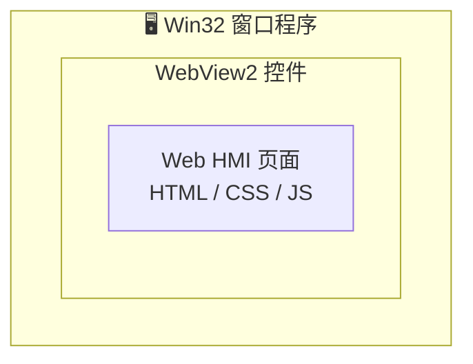
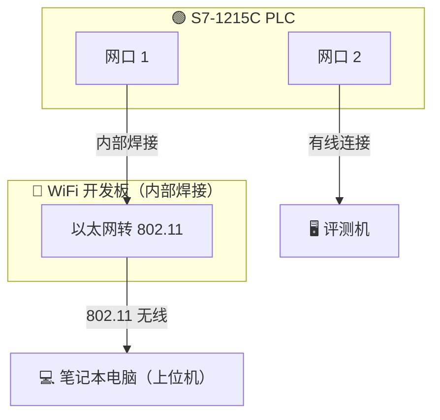
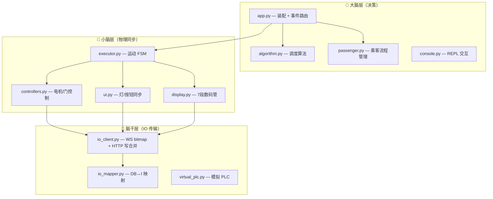
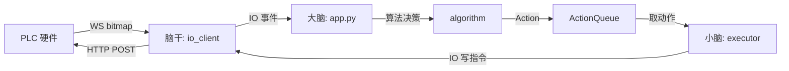
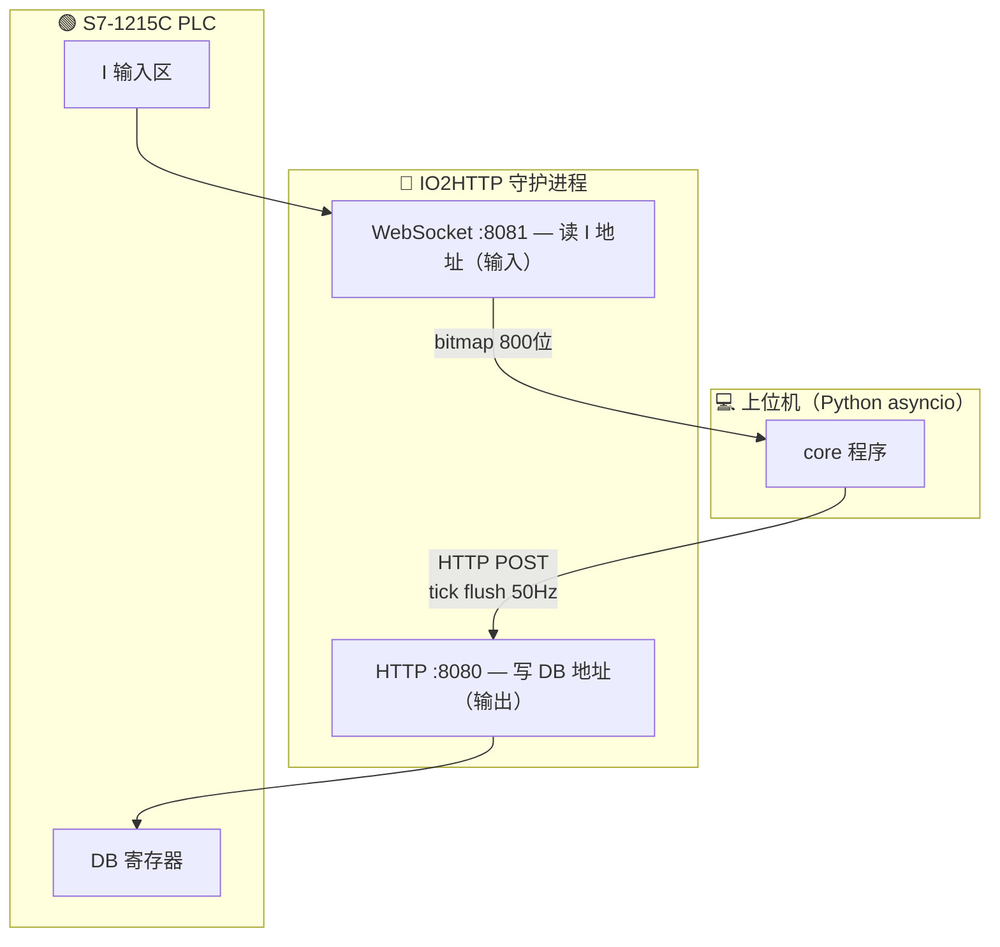

# 西门子 2026 大赛总结与传承手册

> 📋 本文档为西门子 2026 大赛（CIMC 离散行业自动化赛道）赛后总结，旨在为下一届参赛同学提供实战经验、避坑指南与技术传承。
>
> 项目已开源：[github.com/xmb505/Haku_EET](https://github.com/xmb505/Haku_EET)

---

## 📑 目录

**第一部分：比赛实战经验**

| 章节 | 内容概要 |
|:-----|:---------|
| [一、比赛现场注意事项](#一比赛现场注意事项) | 评委、环境、作业书 |
| [二、HMI / WinCC 实现方案](#二hmi--wincc-实现方案) | 浏览器套壳方案与自动运行信号 |
| [三、参赛技术路线](#三参赛技术路线) | 传统 PLC vs 上位机方案 |
| [四、硬件选型与改造](#四硬件选型与改造) | PLC 型号选择与 WiFi 模块加装 |
| [五、避坑指南](#五避坑指南) | 评测机 IP 配置顺序（血泪教训） |

**第二部分：仿真与练习环境**

| 章节 | 内容概要 |
|:-----|:---------|
| [六、EET 仿真环境](#六eet-仿真环境) | 虚拟机、快照、破解说明 |

**第三部分：程序技术文档**

| 章节 | 内容概要 |
|:-----|:---------|
| [七、程序架构总览](#七程序架构总览) | 三层架构、事件流、通信协议 |
| [八、快速上手](#八快速上手) | 启动流程与关键命令 |
| [九、程序后续优化计划](#九程序后续优化计划) | 下一届待修复与待开发项 |

**第四部分：协作与建议**

| 章节 | 内容概要 |
|:-----|:---------|
| [十、开源项目](#十开源项目) | 项目地址与协作说明 |
| [十一、给老师的建议](#十一给老师的建议) | AI 工具、待遇、功耗 |

---

## 第一部分：比赛实战经验

---

## 一、比赛现场注意事项

| 项目 | 说明 |
|:-----|:-----|
| **学生评委** | 比赛时旁边会坐一位学生评委，负责 WinCC 画面评分。评分标准相对宽松，浏览器伪装的 WinCC 画面即可通过，本届获得 6 分。 |
| **监考老师** | 讲台上有一位监考老师，全程巡视，气场较强，做好心理准备。 |
| **比赛作业书** | 比赛开始后会下发作业书。**注意：本届作业书明确要求不允许使用上位机**，对上位机方案有较大限制。 |

---

## 二、HMI / WinCC 实现方案

### 2.1 浏览器套壳方案

HMI 画面可以**完全基于浏览器技术实现**，但需要套一个 WinCC 的外壳：



- 编写一个 **Win32 窗口程序**，内嵌 **WebView2** 控件
- 将 Web HMI 页面加载到 WebView2 中
- 呈现效果与 WinCC 画面无异，评委无法区分

### 2.2 自动运行信号（⚠️ 关键得分点）

评委会下发**自动运行信号**，随后要求选手操作按钮，控制电梯运行至指定楼层。

> **此功能必须实现，否则该部分直接零分。**

📌 **本届教训**：由于 IP 配置顺序错误（详见[第五章 避坑指南](#五避坑指南)），自动运行信号未能接收，导致该部分仅得 6 分。下一届只要信号链路通畅，这部分分数是稳拿的。

---

## 三、参赛技术路线

下一届参赛有两种可选技术路线：

| 路线 | 方案说明 | 适用场景 |
|:-----|:---------|:---------|
| **传统 PLC 方案** | 使用梯形图 / SCL 编写控制逻辑，走正统路线 | 稳扎稳打，符合作业书要求 |
| **上位机方案（邪修）** | 上位机程序接管全部控制逻辑，PLC 仅做 IO 转发 | 开发效率高，但有合规风险 |

> 📖 本文档主要传承**上位机方案**的实战经验。

### 3.1 传统 PLC 方案建议

如果选择传统打法，以下几点建议：

| 项目 | 说明 |
|:-----|:-----|
| **PLC 编程** | 必须过关，梯形图/SCL 要熟练，这是基本功 |
| **HMI** | 可以不做，用浏览器糊弄大法（见[第二章](#二hmi--wincc-实现方案)） |
| **AI 辅助** | 尽量用 AI 辅助，但**不要想着 AI 全写** |

> ⚠️ 现在的 MCP 还不好用，AI 能帮你查资料、写片段、调逻辑，但核心控制逻辑还是得自己写。别指望 AI 一键生成整个 PLC 工程。

### 3.2 上位机方案（邪修）继承者必备素质

> 🚨 **必须找一个懂网络和基本编程思想的同学！**

这不是写梯形图的思路，是写软件的思路。找对人比什么都重要。

| 能力 | 说明 |
|:-----|:-----|
| 事件驱动思维 | 理解异步、回调、状态机，不是只会顺序执行 |
| 软件解耦意识 | 模块之间不能耦合，改一个不能崩全局 |
| 模块化思想 | 分层架构、接口抽象、可插拔设计 |
| 网络基础 | IP/子网/端口/路由，不然连 PLC 都连不上 |

---

## 四、硬件选型与改造

### 4.1 PLC 型号推荐

| 推荐型号 | 理由 |
|:---------|:-----|
| **S7-1215C AC/DC/RLY** | 双网口、性能够用、学校库存充足 |

> 💡 **强烈建议自带 PLC**，学校实验室有充足库存，提前借一台即可。

### 4.2 WiFi 模块加装（上位机方案核心）

选择上位机方案时，**强烈建议在 PLC 内部加装 WiFi 模块**（以太网转 802.11 小开发板）：



**工作原理**：

- 断开外部网线后，电脑通过 WiFi 与 PLC 保持**同一网段**通信
- 评测机侧网口正常连接，不受影响
- 无线通信隐蔽性强，不易被察觉

**为什么选 1215C？** —— 因为它有**两个独立网口**：一个内部焊接 WiFi 开发板，另一个正常对接评测机，互不干扰。

### 4.3 比赛中电梯个体差异

> ⚠️ 比赛中**每一部电梯参数都不一样**

| 差异项 | 说明 |
|:-------|:-----|
| 速度特质 | 每部电梯有快/中/慢三种特质 |
| 载重 | 不同的电梯不同的载重 |
| 微调 | 每部车都需要单独微调参数 |

算法必须考虑个体差异，不能用统一参数跑所有车。

---

## 五、避坑指南

> ⚠️ **血泪教训，务必仔细阅读！**

### 5.1 评测机 IP 配置顺序

在评测机器上，**必须严格按以下顺序操作**：

| 步骤 | 操作 | 说明 |
|:----:|:-----|:-----|
| ① | 设置 IP 地址 | 先配置评测机网络 |
| ② | 导入工程 | 将 PLC 工程导入 |
| ③ | 设置 EET IP | **最后**再配置 EET 通信 IP |

### 5.2 错误顺序的后果

**千万不要**先设置 EET IP 再导入工程！

> 导入工程操作会**覆盖已配置的 IP 地址**，导致 EET 通信链路断裂，自动运行信号无法接收。
>
> 这是评测机软件的设计缺陷，无法规避，只能严格遵守正确顺序。

### 5.3 功耗问题（严重扣分项）

> ⚠️ **本届严重扣分项**

程序跑起来**功耗非常大**，回实验室跑真题时发现 EET 软件的功耗评分扣得很严重。

- 原因：上位机方案持续运行，CPU 占用高，电机频繁动作，EET 功耗计分直接拉低总分
- 影响：功耗评分占比不低，直接拉低总分
- **下一届必须优化**：优化调度算法减少无效动作、减少无效 IO 写入、优化 tick 间隔

---

## 第二部分：仿真与练习环境

---

## 六、EET 仿真环境

### 6.1 机器位置

> 📍 **PC211 教室**，找那台主机上**贴了二次元贴纸**的机器，就是它。

### 6.2 虚拟机环境

该机器上装有 **VMware**，内含 **3 台虚拟机**，均已破解 EET 软件：

| 项目 | 说明 |
|:-----|:-----|
| 虚拟机数量 | 3 台（可同时运行 3 个 EET 仿真） |
| EET 状态 | 已破解（工程加密狗不让用，没办法） |
| 真题 | 电脑内有 **2026 年真题** |
| 快照 | ✅ 已拍好，用于快速恢复 EET 状态 |

### 6.3 注意事项

> ⚠️ **快照千万别删！**

- 快照是专门用来**恢复 EET 状态**的，删了就得重新破解
- 虚拟机可以拍快照，这是好事，操作前记得先拍一个
- 工程那边加密狗不让用，只能破解，理解万岁

### 6.4 练习环境搭建建议

> 💡 推荐组建自己的局域网练习环境

| 设备 | 说明 |
|:-----|:-----|
| **OpenWrt 路由器** | 刷了 OpenWrt 的路由器，装个 OpenClash，体验很爽 |
| 网络拓扑 | 路由器把所有 PLC 串在一起，组建独立局域网 |
| 优势 | 练习时不受学校网络限制，自由调试；不用看工程学院那边的脸色，舔着个脸去借加密狗 |

---

## 第三部分：程序技术文档

---

## 七、程序架构总览

> 核心设计哲学：**电梯 = 玩家** · **事件驱动** · **模块化解耦**。大脑改属性，小脑自动同步到物理 IO，脑干只做物理传输。
>
> 完整设计规格见 [SPEC.md](./SPEC.md)，交接入门见 [HANDOVER.md](./HANDOVER.md)。

### 7.1 三层架构



**各层职责**：

| 层 | 职责 | 关键约束 |
|:---|:-----|:---------|
| 大脑 | 决策、调度、用户交互 | 只看 Car 属性，不碰 IO 地址 |
| 小脑 | 运动控制、UI 同步、门控制 | 双向同步 Car ↔ IO |
| 脑干 | WS bitmap 收、HTTP POST 写 | 纯物理传输，不触碰电梯语义 |
| cron（外置） | 事件驱动闹钟 | 不属于任何层，通过 EventRule 做 reschedule/cancel |
| watchdog（外置） | CLOSING 卡死兜底 | 独立于 executor，只解除 wait_done 死锁 |

### 7.2 事件驱动流程



> 全程没有 `sleep()`、没有 `while: poll`、没有跨层硬调用——所有联系都通过事件广播。

### 7.3 通信协议架构



**tick 写合并机制**：`io.set(addr, val)` 不会立即 HTTP POST，而是记到内部 buffer，等 20ms tick 周期一到，把所有变化合并成一次 HTTP POST。保证 S7 read-modify-write 的原子性，避免中间状态被 PLC 读到。

### 7.4 关键设计原则

| 原则 | 说明 |
|:-----|:-----|
| 电梯 = 玩家 | Car 实体即游戏角色，属性驱动行为 |
| 严格分层 | 大脑不注册 IO 监听，禁止跨层调用 |
| 零 sleep/轮询 | 纯事件驱动，不用定时扫描 |
| 点位表为唯一真相源 | io_config.yaml 由 gen_io_config.py 自动生成 |
| 单一 IO 写路径 | 所有输出经 tick flush 合并写入 |
| cron 外置 | 定时器不属于任何层，独立调度 |
| 看门狗兜底 | cron 不完美，watchdog 做 CLOSING 卡死最后防线 |
| 急停同步清场 | 急停必须重置所有长寿命状态，防止旧逻辑复活 |

### 7.5 看门狗机制（P0 关键）

> 独立于 executor 的 action loop，以固定间隔轮询每部车的门状态。

**唯一使命**：如果 CLOSING 持续超过阈值（默认 5s），检查 `door_close_done` 信号，若为 1 则强制完成关门（解除 `wait_done` 阻塞）。

实际跑时 CLOSING 状态卡了很久，最后没办法才引入的看门狗，**必须保留**。

来源：[core/watchdog.py](../core/watchdog.py)

---

## 八、快速上手

### 8.1 启动流程

```bash
# ① 先启 IO2HTTP 守护进程（必须先于 Haku_EET）
cd ~/GPIOSERVER/IO2HTTP && python3 daemon_gpio.py

# ② 启动 Haku_EET
python3 -m core --simulate    # 模拟模式（无硬件）
python3 -m core               # 实机模式（连 IO2HTTP）
```

### 8.2 比赛日常流程

| 步骤 | 操作 | 命令 |
|:----:|:-----|:-----|
| 1 | 先按一个按钮触发 bitmap | （物理按钮） |
| 2 | 全部车初始化 | `/car all init down` |
| 3 | 确认 init 完成 | `/car 1 status` → 状态=ready |
| 4 | 开启用户模式 | `/usermode true` |
| 5 | 正常运营 | 等待乘客按按钮 |
| 6 | 比赛结束关用户模式 | `/usermode false` |
| 7 | 退出 | `/quit` |

### 8.3 关键配置

| 配置项 | 文件 | 热加载 |
|:-------|:-----|:-------|
| IO2HTTP 地址 | `config.yaml` → `io2http` | `/reload` |
| tick 频率 | `config.yaml` → `tick_interval_ms`（默认 20ms = 50Hz） | `/reload` |
| 初始化方向 | `config.yaml` → `per_car_init` | `/reload` |
| 比赛初始化超时 | `config.yaml` → `competition_init_timeout`（默认 240s） | `/reload` |
| 看门狗超时 | `config.yaml` → `door_watchdog_timeout`（默认 5s） | `/reload` |
| 每车载重 | `config.yaml` → `per_car_weight` | `/reload` |
| 刹车档位 | REPL `/settings slow_brake <0-6>` | 自动落盘 |
| 轿厢数量 | `config.yaml` → `car_ids` | **需重启** |

### 8.4 赛前硬件验证 Checklist

| # | 验证项 | 预期 | 验证方法 |
|:---:|:-------|:-----|:---------|
| 1 | 电磁刹车极性 | `0`=释放 `1`=刹死 | 手动运行→空格刹→按 0 释放 |
| 2 | 限位开关 | 触限位→急停 | 手动全速↑→触顶→确认停 |
| 3 | 电机接触器极性 | 正逻辑 1=吸合 | 手动↑→确认上行 |
| 4 | 门到位信号 | `done=1` 到位 | `/door 1 open`→看 `door_open_done` |
| 5 | 平层信号电平 | 双 1=完美平层 | 手动慢速过层→看 level ↑↓ |
| 6 | 光幕信号 | `1`=遮挡中 | 手挡光幕→确认变 1 |

> 验证步骤：`/debug show input_change` → `/car 1 manual` → 逐项测试

> 完整速查卡见 [QUICKREF.md](./QUICKREF.md)，命令手册见 [COMMAND_MANUAL.md](./COMMAND_MANUAL.md)

---

## 九、程序后续优化计划

> 以下是本届未完成但下一届应当推进的事项，按优先级排序。
>
> 完整缺陷清单见 [SPEC.md §10](./SPEC.md#10-当前状态评估与未对齐项)

### 🔴 P0 — 必须修复（影响得分）

| 项目 | 说明 |
|:-----|:-----|
| **功耗优化** | 优化调度算法减少无效动作、减少无效 IO 写入、拉大 tick 间隔，EET 功耗分扣得很严重 |
| **自动运行信号接收** | 确保 IP 配置正确后能稳定收到信号，这是得分前提 |
| **Bitmap 全扫描 + idle 唤醒** | io_client.py 空闲时持续烧 CPU，直接拉高功耗（SPEC §10.4 缺陷 #5） |
| **看门狗兜底** | cron 不是完美的，必须有 watchdog 做最后兜底。实际跑时 CLOSING 状态卡了很久，最后没办法才引入的看门狗，必须保留 |

### 🟡 P1 — 应当完成（影响功能完整性）

| 项目 | 说明 |
|:-----|:-----|
| **算法层升级** | 当前 SimpleInternalCall 只看单部车、只响应内召，需升级为全局调度员（外召分配、群控）。注意：比赛中每部电梯参数都不一样（快/中/慢 + 不同载重），每部车都需要微调，算法必须考虑个体差异 |
| **重量属性集成** | 已规划未实施：IO 输入地址改 I 格式 + Car.weight_state 三态 + 满载/超载逻辑 |
| **双重 MOVE dispatch** | app.py + executor.py 双重派发，车可能冲过目标楼层（SPEC §10.4 缺陷 #6） |
| **全局信号误路由** | app.py 中 car_id=0 为 falsy 取错 cid，外召信号可能路由到错误的车（SPEC §10.4 缺陷 #3） |
| **开错门时原地重置** | 开错门说明平层是对的，只是楼层计数器错了。应直接重置计数器到开错门的楼层，当场 init，不要重新跑初始化流程 |

### 🟢 P2 — 锦上添花（提升稳定性）

| 项目 | 说明 |
|:-----|:-----|
| cron stop 后 listener 泄漏 | reload 后定时器完全失效（SPEC §10.4 缺陷 #7） |
| create_task 静默吞异常 | 9+ 处，已部分修复，仍有残留（SPEC §10.4 缺陷 #8） |
| WS reconnect 吞连接错误 | 宕机无告警，排查困难（SPEC §10.4 缺陷 #9） |
| 测试重复定义 | test_executor.py 18 个同名用例，覆盖假象（SPEC §10.4 缺陷 #10） |
| ActionQueue.get_nowait() 缺失 | /reset 会崩溃（SPEC §10.4 缺陷 #1） |
| floor_display 配置是死代码 | 修改配置无效（SPEC §10.4 缺陷 #2） |

### 🔵 P3 — 远期愿景

- 完整的 6 车群控调度
- 乘客流量自适应算法
- human_presence 三态迁移完整实现
- 比赛模式一键初始化（自动寻址 + 方向确认 + 就绪信号）
- 多算法热切换（`/algo set <name>`）

### 🗑️ 待删除项（违反事件驱动哲学）

> `executor.py` brake-before-stop 100ms `asyncio.sleep` — 这是项目中唯一违反「零 sleep / 事件驱动」哲学的代码。

**希望下一届同学删掉它**，用 PLC 反馈信号（霍尔传感器 / 刹车到位开关）替换 `asyncio.sleep(0.1)`，改为 `wait_for(signal, timeout=...)`。这才是符合事件驱动哲学的正确做法。

> 来源：SPEC §7.6。当初保留是因为没有 PLC 反馈信号，是无奈之举，不是设计本意。

---

## 第四部分：协作与建议

---

## 十、开源项目

本项目已完整开源，欢迎下一届同学参考使用：

🔗 **项目地址**：[github.com/xmb505/Haku_EET](https://github.com/xmb505/Haku_EET)

### 协作说明

| 操作 | 态度 |
|:-----|:-----|
| ⭐ Star | 非常欢迎，感谢支持 |
| 🍴 Fork | 随意使用，尽管拿去改 |
| 🔀 Pull Request | **不接受**，项目已归档 |

> 如果还有走上位机路线的同学，欢迎 Fork 后自行魔改，祝比赛顺利！

---

## 十一、给老师的建议

### 11.1 AI 编程工具费用报销

这年头开发已经全面进入 AI 编程时代，强烈建议学校能够**报销学生的 AI 编程工具费用**：

| 项目 | 说明 |
|:-----|:-----|
| 推荐工具 | DeepSeek（国产，性价比高） |
| 报销可行性 | ✅ 支持**对公打款** |
| 发票 | ✅ 可开具**正规发票** |
| 用途 | 代码生成、调试、架构设计、文档编写 |

> 💡 本届比赛的上位机方案，从架构设计到代码实现，大量借助了 AI 编程工具。这不是作弊，是生产力工具。希望学校能跟上时代，给学生提供弹药。

### 11.2 给同学的 AI 工具推荐

AI 也要用聪明的，推荐以下工具：

| 工具 | 说明 |
|:-----|:-----|
| **WorkBuddy** | 支持接入 MCP，智能编程助手 |
| **Qoder** | 支持接入 MCP，智能编程助手（❗买 **Qoder CN**，别买国际版，赚人民币花美刀亏得死） |
| **TIA Portal MCP** | [github.com/Czarnak/tia-portal-mcp](https://github.com/Czarnak/tia-portal-mcp) |

> 🔑 **重点：MCP（Model Context Protocol）**
>
> 通过 TIA Portal MCP，AI 可以直接读写 PLC 工程，快速定位和修复问题。别傻乎乎地手动查了，让 AI 直接上手。

### 11.3 关于比赛待遇

> 建议学校提高参赛学生的待遇保障。

| 对比项 | 隔壁工程学院 | 我们数智工程学院 |
|:-------|:-------------|:-----------------|
| 期末考 | 直接免试，过了 | 老老实实考期末 |
| 立项时间 | 较早 | **7 月份才立项**，时间赶得一批 |

希望下一届能早点立项，别让学生一边赶期末一边打比赛。

---

## 结语

祝下一届参赛同学：

- 信号畅通，自动运行一次过 ✅
- HMI 画面丝滑，评委给高分 ✅
- 避开所有坑，拿个满意的成绩 ✅

**加油，别被监考老师的气场吓到。** 💪

---

<p align="center"><sub>— 喵喵队 NekoTeam · 西门子 2026 传承文档 · Haku_EET —</sub></p>
